# Planning and Allocation – Comprehensive On Order Detail – Ad Hoc

**Workspace:** Enterprise Analytics Dev  
**Report ID:** 234dcb17-c054-4483-a23a-321306f90090  
**Dataset ID:** 05daff4b-5e80-4cd4-94ba-90a3110d5e14  
**Web URL:** https://app.powerbi.com/groups/109bd275-5f44-4366-b343-9b41b5cfb040/reports/234dcb17-c054-4483-a23a-321306f90090  
**Semantic Model:** [Merchandise Transactional Model](../../SemanticModels/Enterprise Analytics Dev/Merchandise Transactional Model.md)  

## Architecture Diagram

```mermaid
flowchart LR
    REPORT["Planning and Allocation – Comprehensive On Order Detail – Ad Hoc"]
    PurchasingTransView_Concept(["PurchasingTransView.Concept"]) --> REPORT
    PurchasingTransView_Department(["PurchasingTransView.Department"]) --> REPORT
    PurchasingTransView_Style(["PurchasingTransView.Style"]) --> REPORT
    date_dim_actual_date(["date_dim.actual_date"]) --> REPORT
    d365LocationMapping_View_inventlocationid(["d365LocationMapping_View.inventlocationid"]) --> REPORT
    PurchasingTransView_SubClass(["PurchasingTransView.SubClass"]) --> REPORT
    date_dim_actual_date_Variation_Date_Hierarchy_Year(["date_dim.actual_date.Variation.Date Hierarchy.Year"]) --> REPORT
    date_dim_actual_date_Variation_Date_Hierarchy_Quarter(["date_dim.actual_date.Variation.Date Hierarchy.Quarter"]) --> REPORT
    date_dim_actual_date_Variation_Date_Hierarchy_Month(["date_dim.actual_date.Variation.Date Hierarchy.Month"]) --> REPORT
    date_dim_actual_date_Variation_Date_Hierarchy_Day(["date_dim.actual_date.Variation.Date Hierarchy.Day"]) --> REPORT
    productattributesummaryview_KEYSTY(["productattributesummaryview.KEYSTY"]) --> REPORT
    PurchasingTransView_Consumer_Group(["PurchasingTransView.Consumer Group"]) --> REPORT
    productattributesummaryview_LICNSR(["productattributesummaryview.LICNSR"]) --> REPORT
    PurchasingTransView_Class(["PurchasingTransView.Class"]) --> REPORT
    PurchasingTransView_Dept_Label(["PurchasingTransView.Dept Label"]) --> REPORT
    PurchasingTransView_Class_Label(["PurchasingTransView.Class Label"]) --> REPORT
    PurchasingTransView_SubClass_label(["PurchasingTransView.SubClass label"]) --> REPORT
    PurchasingTransView_Short_Desciption(["PurchasingTransView.Short Desciption"]) --> REPORT
    PurchasingTransView_Vendor_Purch_Name(["PurchasingTransView.Vendor Purch Name"]) --> REPORT
    PurchasingTransView_PO_number(["PurchasingTransView.PO number"]) --> REPORT
    PurchasingTransView_Ship_date(["PurchasingTransView.Ship date"]) --> REPORT
    PurchasingTransView_Cancel_date(["PurchasingTransView.Cancel date"]) --> REPORT
    PurchasingTransView_Expected_Receipt_date(["PurchasingTransView.Expected Receipt date"]) --> REPORT
    PurchasingTransView_babfactorycode(["PurchasingTransView.babfactorycode"]) --> REPORT
    PurchasingTransView_babvendorcode(["PurchasingTransView.babvendorcode"]) --> REPORT
    PurchasingTransView_createddatetime(["PurchasingTransView.createddatetime"]) --> REPORT
    Sum_PurchasingTransView_first_cost_(["Sum(PurchasingTransView.first cost)"]) --> REPORT
    PurchasingTransView_PO_description(["PurchasingTransView.PO description"]) --> REPORT
    PurchasingTransView_babfobport(["PurchasingTransView.babfobport"]) --> REPORT
    PurchasingTransView_PO_attribute_set_code(["PurchasingTransView.PO attribute set code"]) --> REPORT
    PurchasingTransView_PO_Attribute_set_label(["PurchasingTransView.PO Attribute set label"]) --> REPORT
    select1(["select1"]) --> REPORT
    productattributesummaryview_MSTAT(["productattributesummaryview.MSTAT"]) --> REPORT
    product_dim_le_InDate(["product_dim_le.InDate"]) --> REPORT
    Sum_product_dim_le_masterpack_(["Sum(product_dim_le.masterpack)"]) --> REPORT
    Sum_product_dim_le_innerpack_(["Sum(product_dim_le.innerpack)"]) --> REPORT
    select2(["select2"]) --> REPORT
    select3(["select3"]) --> REPORT
    select4(["select4"]) --> REPORT
    PurchasingTransView__Max_Value__On_Order_Units(["PurchasingTransView.(Max Value) On Order Units"]) --> REPORT
    CountNonNull_PurchasingTransView_PurchLine_RecId_(["CountNonNull(PurchasingTransView.PurchLine RecId)"]) --> REPORT
    product_dim_le_concept_code(["product_dim_le.concept_code"]) --> REPORT
    product_dim_le_consumer_group(["product_dim_le.consumer_group"]) --> REPORT
    PurchasingTransView_Aptos_PO_Reference_Number(["PurchasingTransView.Aptos PO Reference Number"]) --> REPORT
    PurchasingTransView_ERD_Fiscal_Month_Year(["PurchasingTransView.ERD Fiscal Month Year"]) --> REPORT
    PurchasingTransView_Cancel_Fiscal_Month_Year(["PurchasingTransView.Cancel Fiscal Month Year"]) --> REPORT
    select(["select"]) --> REPORT
    product_dim_le_style_code(["product_dim_le.style_code"]) --> REPORT
    PurchasingTransView__Max_Value__Balance_On_Order_Units(["PurchasingTransView.(Max Value) Balance On Order Units"]) --> REPORT
    select5(["select5"]) --> REPORT
    select6(["select6"]) --> REPORT
    Sum_PurchasingTransView_Balance_total_cost_(["Sum(PurchasingTransView.Balance total cost)"]) --> REPORT
    Sum_PurchasingTransView_CurrentRetailDecimal_(["Sum(PurchasingTransView.CurrentRetailDecimal)"]) --> REPORT
    select7(["select7"]) --> REPORT
    Sum_product_dim_le_current_selling_retail_home_(["Sum(product_dim_le.current_selling_retail_home)"]) --> REPORT
    d365LocationMapping_View_legalentity(["d365LocationMapping_View.legalentity"]) --> REPORT
    date_dim_fiscal_year(["date_dim.fiscal_year"]) --> REPORT
    date_dim_fiscalQtr(["date_dim.fiscalQtr"]) --> REPORT
    date_dim_fiscalPer(["date_dim.fiscalPer"]) --> REPORT
    date_dim_fiscalWk(["date_dim.fiscalWk"]) --> REPORT
```

## Field Dependencies

| Referenced Field |
|---|
| PurchasingTransView.Concept |
| PurchasingTransView.Department |
| PurchasingTransView.Style |
| date_dim.actual_date |
| d365LocationMapping_View.inventlocationid |
| PurchasingTransView.SubClass |
| date_dim.actual_date.Variation.Date Hierarchy.Year |
| date_dim.actual_date.Variation.Date Hierarchy.Quarter |
| date_dim.actual_date.Variation.Date Hierarchy.Month |
| date_dim.actual_date.Variation.Date Hierarchy.Day |
| productattributesummaryview.KEYSTY |
| PurchasingTransView.Consumer Group |
| productattributesummaryview.LICNSR |
| PurchasingTransView.Class |
| PurchasingTransView.Dept Label |
| PurchasingTransView.Class Label |
| PurchasingTransView.SubClass label |
| PurchasingTransView.Short Desciption |
| PurchasingTransView.Vendor Purch Name |
| PurchasingTransView.PO number |
| PurchasingTransView.Ship date |
| PurchasingTransView.Cancel date |
| PurchasingTransView.Expected Receipt date |
| PurchasingTransView.babfactorycode |
| PurchasingTransView.babvendorcode |
| PurchasingTransView.createddatetime |
| Sum(PurchasingTransView.first cost) |
| PurchasingTransView.PO description |
| PurchasingTransView.babfobport |
| PurchasingTransView.PO attribute set code |
| PurchasingTransView.PO Attribute set label |
| select1 |
| productattributesummaryview.MSTAT |
| product_dim_le.InDate |
| Sum(product_dim_le.masterpack) |
| Sum(product_dim_le.innerpack) |
| select2 |
| select3 |
| select4 |
| PurchasingTransView.(Max Value) On Order Units |
| CountNonNull(PurchasingTransView.PurchLine RecId) |
| product_dim_le.concept_code |
| product_dim_le.consumer_group |
| PurchasingTransView.Aptos PO Reference Number |
| PurchasingTransView.ERD Fiscal Month Year |
| PurchasingTransView.Cancel Fiscal Month Year |
| select |
| product_dim_le.style_code |
| PurchasingTransView.(Max Value) Balance On Order Units |
| select5 |
| select6 |
| Sum(PurchasingTransView.Balance total cost) |
| Sum(PurchasingTransView.CurrentRetailDecimal) |
| select7 |
| Sum(product_dim_le.current_selling_retail_home) |
| d365LocationMapping_View.legalentity |
| date_dim.fiscal_year |
| date_dim.fiscalQtr |
| date_dim.fiscalPer |
| date_dim.fiscalWk |

## Pages

| Page | Visuals |
|---|---|
| Comprehensive On Order Detail | 27 |

## Visuals

### Comprehensive On Order Detail

| Visual | Type | Fields |
|---|---|---|
| 06b23bc2293e42f7a563 | slicer | PurchasingTransView.Concept |
| 0990f82a5dbf1a44dadb | slicer | PurchasingTransView.Department |
| 0b4140222c5f6ce0edbe | unknown |  |
| 2c050ec017a6225d6f41 | slicer | PurchasingTransView.Style |
| 9ea736d49b75db93980e | textbox |  |
| 9a7956cae86f44783ec2 | slicer | date_dim.actual_date |
| 97f4659a5a12bc988c51 | image |  |
| 97f4637b9433dd67029c | textFilter25A4896A83E0487089E2B90C9AE57C8A | d365LocationMapping_View.inventlocationid |
| 826e14c9840c3793285e | unknown |  |
| 7869095a179dc31dae86 | slicer | PurchasingTransView.SubClass |
| 6f0031da695b744bd74a | textbox |  |
| 5d880bf6abb3e6eba255 | slicer | d365LocationMapping_View.inventlocationid |
| 4df0d921ab0b5d077f2c | slicer | date_dim.actual_date.Variation.Date Hierarchy.Year, date_dim.actual_date.Variation.Date Hierarchy.Quarter, date_dim.actual_date.Variation.Date Hierarchy.Month, date_dim.actual_date.Variation.Date Hierarchy.Day |
| 44b856414f1a82fa1972 | unknown |  |
| 3edf860c41bfa20e56ed | slicer | productattributesummaryview.KEYSTY |
| 350159698bbe2bf4d18c | slicer | PurchasingTransView.Consumer Group |
| 22da671c0667f2a982ae | slicer | productattributesummaryview.LICNSR |
| 122ea31d98d5e46b728a | bookmarkNavigator |  |
| 0bcd43cda8b8c9272764 | textbox |  |
| f920f4a3989b72fd51af | textbox |  |
| ec739d70b14b7c06805a | actionButton |  |
| ebf4a2dc4872072b777f | unknown |  |
| e8e740717323d0200f7a | slicer | PurchasingTransView.Class |
| e0290b3bdcd982dcae6f | tableEx | PurchasingTransView.Dept Label, PurchasingTransView.Class Label, PurchasingTransView.SubClass label, PurchasingTransView.Short Desciption, PurchasingTransView.Vendor Purch Name, PurchasingTransView.PO number, PurchasingTransView.Ship date, PurchasingTransView.Cancel date, PurchasingTransView.Expected Receipt date, PurchasingTransView.babfactorycode, PurchasingTransView.babvendorcode, PurchasingTransView.createddatetime, Sum(PurchasingTransView.first cost), PurchasingTransView.PO description, PurchasingTransView.babfobport, PurchasingTransView.PO attribute set code, PurchasingTransView.PO Attribute set label, select1, productattributesummaryview.LICNSR, productattributesummaryview.KEYSTY, productattributesummaryview.MSTAT, product_dim_le.InDate, Sum(product_dim_le.masterpack), Sum(product_dim_le.innerpack), select2, select3, select4, PurchasingTransView.(Max Value) On Order Units, CountNonNull(PurchasingTransView.PurchLine RecId), product_dim_le.concept_code, product_dim_le.consumer_group, PurchasingTransView.Aptos PO Reference Number, PurchasingTransView.ERD Fiscal Month Year, PurchasingTransView.Cancel Fiscal Month Year, select, product_dim_le.style_code, d365LocationMapping_View.inventlocationid, PurchasingTransView.(Max Value) Balance On Order Units, select5, select6, Sum(PurchasingTransView.Balance total cost), Sum(PurchasingTransView.CurrentRetailDecimal), select7, Sum(product_dim_le.current_selling_retail_home) |
| d986b5ee6dd8555a4031 | slicer | d365LocationMapping_View.legalentity |
| cca8d761cff72ee6b8d5 | bookmarkNavigator |  |
| cc9c621b0f8156219228 | slicer | date_dim.fiscal_year, date_dim.actual_date, date_dim.fiscalQtr, date_dim.fiscalPer, date_dim.fiscalWk |
