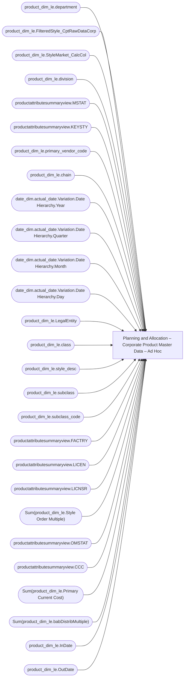

# Planning and Allocation – Corporate Product Master Data – Ad Hoc

**Workspace:** Enterprise Analytics Dev  
**Report ID:** a9652799-3e2e-420c-80e7-551b0f7aec6b  
**Dataset ID:** 05daff4b-5e80-4cd4-94ba-90a3110d5e14  
**Web URL:** https://app.powerbi.com/groups/109bd275-5f44-4366-b343-9b41b5cfb040/reports/a9652799-3e2e-420c-80e7-551b0f7aec6b  
**Semantic Model:** [Merchandise Transactional Model](../../SemanticModels/Enterprise Analytics Dev/Merchandise Transactional Model.md)  

## Architecture Diagram

## Field Dependencies

| Referenced Field |
|---|
| product_dim_le.department |
| product_dim_le.FilteredStyle_CptRawDataCorp |
| product_dim_le.StyleMarket_CalcCol |
| product_dim_le.division |
| productattributesummaryview.MSTAT |
| productattributesummaryview.KEYSTY |
| product_dim_le.primary_vendor_code |
| product_dim_le.chain |
| date_dim.actual_date.Variation.Date Hierarchy.Year |
| date_dim.actual_date.Variation.Date Hierarchy.Quarter |
| date_dim.actual_date.Variation.Date Hierarchy.Month |
| date_dim.actual_date.Variation.Date Hierarchy.Day |
| product_dim_le.LegalEntity |
| product_dim_le.class |
| product_dim_le.style_desc |
| product_dim_le.subclass |
| product_dim_le.subclass_code |
| productattributesummaryview.FACTRY |
| productattributesummaryview.LICEN |
| productattributesummaryview.LICNSR |
| Sum(product_dim_le.Style Order Multiple) |
| productattributesummaryview.OMSTAT |
| productattributesummaryview.CCC |
| Sum(product_dim_le.Primary Current Cost) |
| Sum(product_dim_le.babDistribMultiple) |
| product_dim_le.InDate |
| product_dim_le.OutDate |

## Pages

| Page | Visuals |
|---|---|
| Corporate Product Master Data | 25 |

## Visuals

### Corporate Product Master Data

| Visual | Type | Fields |
|---|---|---|
| 0990f82a5dbf1a44dadb | slicer | product_dim_le.department |
| 0b4140222c5f6ce0edbe | unknown |  |
| 0bcd43cda8b8c9272764 | textbox |  |
| 122ea31d98d5e46b728a | bookmarkNavigator |  |
| 2c050ec017a6225d6f41 | slicer | product_dim_le.FilteredStyle_CptRawDataCorp |
| 44b856414f1a82fa1972 | unknown |  |
| 44d9cde35423587e7fca | slicer | product_dim_le.StyleMarket_CalcCol |
| 4a1a31eca19909a0aa08 | slicer | product_dim_le.division |
| 6f0031da695b744bd74a | textbox |  |
| 826e14c9840c3793285e | unknown |  |
| 8521e1935e2ddb44a772 | actionButton |  |
| 8d580b230200a1dd08d5 | slicer | productattributesummaryview.MSTAT |
| 91ab9d0a2ae72b60dce4 | slicer | productattributesummaryview.KEYSTY |
| 97f4637b9433dd67029c | textFilter25A4896A83E0487089E2B90C9AE57C8A | product_dim_le.primary_vendor_code |
| 97f4659a5a12bc988c51 | image |  |
| 9ea736d49b75db93980e | textbox |  |
| c5bb2e2d468b021899e9 | slicer | product_dim_le.chain |
| cc9c621b0f8156219228 | slicer | date_dim.actual_date.Variation.Date Hierarchy.Year, date_dim.actual_date.Variation.Date Hierarchy.Quarter, date_dim.actual_date.Variation.Date Hierarchy.Month, date_dim.actual_date.Variation.Date Hierarchy.Day |
| d986b5ee6dd8555a4031 | slicer | product_dim_le.LegalEntity |
| e8e740717323d0200f7a | slicer | product_dim_le.class |
| ebf4a2dc4872072b777f | unknown |  |
| f920f4a3989b72fd51af | textbox |  |
| f23d5b55029a0991e0da | tableEx | product_dim_le.style_desc, product_dim_le.chain, product_dim_le.division, product_dim_le.department, product_dim_le.class, product_dim_le.subclass, product_dim_le.subclass_code, product_dim_le.primary_vendor_code, productattributesummaryview.FACTRY, productattributesummaryview.LICEN, productattributesummaryview.LICNSR, Sum(product_dim_le.Style Order Multiple), productattributesummaryview.KEYSTY, productattributesummaryview.MSTAT, productattributesummaryview.OMSTAT, productattributesummaryview.CCC, Sum(product_dim_le.Primary Current Cost), Sum(product_dim_le.babDistribMultiple), product_dim_le.StyleMarket_CalcCol, product_dim_le.LegalEntity, product_dim_le.FilteredStyle_CptRawDataCorp, product_dim_le.InDate, product_dim_le.OutDate |
| ed47904020c7960d19c7 | slicer | product_dim_le.subclass_code |
| ec739d70b14b7c06805a | actionButton |  |
