# Planning and Allocation – Franchisee On Order and Receipt Tracking – Ad Hoc

**Workspace:** Enterprise Analytics Dev  
**Report ID:** 6188a2d2-ce85-4d4d-a967-283e61d242f5  
**Dataset ID:** 05daff4b-5e80-4cd4-94ba-90a3110d5e14  
**Web URL:** https://app.powerbi.com/groups/109bd275-5f44-4366-b343-9b41b5cfb040/reports/6188a2d2-ce85-4d4d-a967-283e61d242f5  
**Semantic Model:** [Merchandise Transactional Model](../../SemanticModels/Enterprise Analytics Dev/Merchandise Transactional Model.md)  

## Architecture Diagram

```mermaid
flowchart LR
    REPORT["Planning and Allocation – Franchisee On Order and Receipt Tracking – Ad Hoc"]
    PurchasingTransView_Department(["PurchasingTransView.Department"]) --> REPORT
    PurchasingTransView_Style(["PurchasingTransView.Style"]) --> REPORT
    date_dim_actual_date_Variation_Date_Hierarchy_Year(["date_dim.actual_date.Variation.Date Hierarchy.Year"]) --> REPORT
    date_dim_actual_date_Variation_Date_Hierarchy_Quarter(["date_dim.actual_date.Variation.Date Hierarchy.Quarter"]) --> REPORT
    date_dim_actual_date_Variation_Date_Hierarchy_Month(["date_dim.actual_date.Variation.Date Hierarchy.Month"]) --> REPORT
    date_dim_actual_date_Variation_Date_Hierarchy_Day(["date_dim.actual_date.Variation.Date Hierarchy.Day"]) --> REPORT
    PurchasingTransView_Consumer_Group(["PurchasingTransView.Consumer Group"]) --> REPORT
    PurchasingTransView_SubClass(["PurchasingTransView.SubClass"]) --> REPORT
    PurchasingTransView_EAN_13(["PurchasingTransView.EAN-13"]) --> REPORT
    PurchasingTransView_PO_number(["PurchasingTransView.PO number"]) --> REPORT
    PurchasingTransView_Expected_Receipt_date(["PurchasingTransView.Expected Receipt date"]) --> REPORT
    PurchasingTransView_KEYSTY(["PurchasingTransView.KEYSTY"]) --> REPORT
    date_dim_fiscal_year(["date_dim.fiscal_year"]) --> REPORT
    date_dim_fiscalQtr(["date_dim.fiscalQtr"]) --> REPORT
    date_dim_fiscalPer(["date_dim.fiscalPer"]) --> REPORT
    date_dim_fiscalWk(["date_dim.fiscalWk"]) --> REPORT
    PurchasingTransView_Class(["PurchasingTransView.Class"]) --> REPORT
    d365LocationMapping_View_inventlocationid(["d365LocationMapping_View.inventlocationid"]) --> REPORT
    PurchasingTransView_Location_name(["PurchasingTransView.Location name"]) --> REPORT
    PurchasingTransView_Short_Desciption(["PurchasingTransView.Short Desciption"]) --> REPORT
    PurchasingTransView_Vendor_Purch_Name(["PurchasingTransView.Vendor Purch Name"]) --> REPORT
    PurchasingTransView_Dept_Label(["PurchasingTransView.Dept Label"]) --> REPORT
    PurchasingTransView_Class_Label(["PurchasingTransView.Class Label"]) --> REPORT
    PurchasingTransView_Ship_date(["PurchasingTransView.Ship date"]) --> REPORT
    PurchasingTransView_Cancel_date(["PurchasingTransView.Cancel date"]) --> REPORT
    PurchasingTransView_babvendorcode(["PurchasingTransView.babvendorcode"]) --> REPORT
    PurchasingTransView_babfobport(["PurchasingTransView.babfobport"]) --> REPORT
    PurchasingTransView_babfactorycode(["PurchasingTransView.babfactorycode"]) --> REPORT
    PurchasingTransView_createddatetime(["PurchasingTransView.createddatetime"]) --> REPORT
    PurchasingTransView_PO_description(["PurchasingTransView.PO description"]) --> REPORT
    PurchasingTransView_PO_attribute_set_code(["PurchasingTransView.PO attribute set code"]) --> REPORT
    PurchasingTransView_PO_Attribute_set_label(["PurchasingTransView.PO Attribute set label"]) --> REPORT
    PurchasingTransView__Max_Value__On_Order_Units(["PurchasingTransView.(Max Value) On Order Units"]) --> REPORT
    PurchasingTransView__Max_Value__Balance_On_Order_Units(["PurchasingTransView.(Max Value) Balance On Order Units"]) --> REPORT
    select2(["select2"]) --> REPORT
    PurchasingTransView_Aptos_PO_Reference_Number(["PurchasingTransView.Aptos PO Reference Number"]) --> REPORT
```

## Field Dependencies

| Referenced Field |
|---|
| PurchasingTransView.Department |
| PurchasingTransView.Style |
| date_dim.actual_date.Variation.Date Hierarchy.Year |
| date_dim.actual_date.Variation.Date Hierarchy.Quarter |
| date_dim.actual_date.Variation.Date Hierarchy.Month |
| date_dim.actual_date.Variation.Date Hierarchy.Day |
| PurchasingTransView.Consumer Group |
| PurchasingTransView.SubClass |
| PurchasingTransView.EAN-13 |
| PurchasingTransView.PO number |
| PurchasingTransView.Expected Receipt date |
| PurchasingTransView.KEYSTY |
| date_dim.fiscal_year |
| date_dim.fiscalQtr |
| date_dim.fiscalPer |
| date_dim.fiscalWk |
| PurchasingTransView.Class |
| d365LocationMapping_View.inventlocationid |
| PurchasingTransView.Location name |
| PurchasingTransView.Short Desciption |
| PurchasingTransView.Vendor Purch Name |
| PurchasingTransView.Dept Label |
| PurchasingTransView.Class Label |
| PurchasingTransView.Ship date |
| PurchasingTransView.Cancel date |
| PurchasingTransView.babvendorcode |
| PurchasingTransView.babfobport |
| PurchasingTransView.babfactorycode |
| PurchasingTransView.createddatetime |
| PurchasingTransView.PO description |
| PurchasingTransView.PO attribute set code |
| PurchasingTransView.PO Attribute set label |
| PurchasingTransView.(Max Value) On Order Units |
| PurchasingTransView.(Max Value) Balance On Order Units |
| select2 |
| PurchasingTransView.Aptos PO Reference Number |

## Pages

| Page | Visuals |
|---|---|
| Franchisee On Order and Receipt Tracking | 25 |

## Visuals

### Franchisee On Order and Receipt Tracking

| Visual | Type | Fields |
|---|---|---|
| 0990f82a5dbf1a44dadb | slicer | PurchasingTransView.Department |
| 0b4140222c5f6ce0edbe | unknown |  |
| 0bcd43cda8b8c9272764 | textbox |  |
| 122ea31d98d5e46b728a | bookmarkNavigator |  |
| 2c050ec017a6225d6f41 | slicer | PurchasingTransView.Style |
| 44b856414f1a82fa1972 | unknown |  |
| 4df0d921ab0b5d077f2c | slicer | date_dim.actual_date.Variation.Date Hierarchy.Year, date_dim.actual_date.Variation.Date Hierarchy.Quarter, date_dim.actual_date.Variation.Date Hierarchy.Month, date_dim.actual_date.Variation.Date Hierarchy.Day |
| 507e747337ebfc51e069 | slicer | PurchasingTransView.Consumer Group |
| 6f0031da695b744bd74a | textbox |  |
| 7869095a179dc31dae86 | slicer | PurchasingTransView.SubClass |
| 826e14c9840c3793285e | unknown |  |
| 8953262b5fe1d4a155ec | slicer | PurchasingTransView.EAN-13 |
| 97f4637b9433dd67029c | textFilter25A4896A83E0487089E2B90C9AE57C8A | PurchasingTransView.PO number |
| 97f4659a5a12bc988c51 | image |  |
| 9a7956cae86f44783ec2 | slicer | PurchasingTransView.Expected Receipt date |
| 9ea736d49b75db93980e | textbox |  |
| a4fa2262b36bc2a9b224 | slicer | PurchasingTransView.KEYSTY |
| cc9c621b0f8156219228 | slicer | date_dim.fiscal_year, date_dim.fiscalQtr, date_dim.fiscalPer, date_dim.fiscalWk, PurchasingTransView.Expected Receipt date |
| cca8d761cff72ee6b8d5 | bookmarkNavigator |  |
| d47bcb9e10c7eaffbc6e | slicer | PurchasingTransView.Class |
| d986b5ee6dd8555a4031 | slicer | d365LocationMapping_View.inventlocationid |
| ebf4a2dc4872072b777f | unknown |  |
| ec739d70b14b7c06805a | actionButton |  |
| f23d5b55029a0991e0da | tableEx | PurchasingTransView.Location name, PurchasingTransView.Style, PurchasingTransView.Short Desciption, PurchasingTransView.PO number, PurchasingTransView.Vendor Purch Name, PurchasingTransView.Dept Label, PurchasingTransView.Class Label, PurchasingTransView.Ship date, PurchasingTransView.Cancel date, PurchasingTransView.babvendorcode, PurchasingTransView.babfobport, PurchasingTransView.babfactorycode, PurchasingTransView.createddatetime, PurchasingTransView.PO description, PurchasingTransView.PO attribute set code, PurchasingTransView.PO Attribute set label, PurchasingTransView.Expected Receipt date, PurchasingTransView.KEYSTY, d365LocationMapping_View.inventlocationid, PurchasingTransView.EAN-13, PurchasingTransView.(Max Value) On Order Units, PurchasingTransView.(Max Value) Balance On Order Units, select2, PurchasingTransView.Aptos PO Reference Number |
| f920f4a3989b72fd51af | textbox |  |
