# Planning and Allocation – Inventory Review – Ad Hoc

**Workspace:** Enterprise Analytics Dev  
**Report ID:** 59a98cb2-a22c-4fe4-aa0d-66dab23a0ea0  
**Dataset ID:** 05daff4b-5e80-4cd4-94ba-90a3110d5e14  
**Web URL:** https://app.powerbi.com/groups/109bd275-5f44-4366-b343-9b41b5cfb040/reports/59a98cb2-a22c-4fe4-aa0d-66dab23a0ea0  
**Semantic Model:** [Merchandise Transactional Model](../../SemanticModels/Enterprise Analytics Dev/Merchandise Transactional Model.md)  

## Architecture Diagram

```mermaid
flowchart LR
    REPORT["Planning and Allocation – Inventory Review – Ad Hoc"]
    product_dim_department_code(["product_dim.department_code"]) --> REPORT
    InventTransView_Trans_Type_Description(["InventTransView.Trans Type Description"]) --> REPORT
    product_dim_LicensedCollection(["product_dim.LicensedCollection"]) --> REPORT
    InventTransView_Inventory_Status_Issue(["InventTransView.Inventory Status Issue"]) --> REPORT
    InventTransView_Inventory_Document_Number(["InventTransView.Inventory Document Number"]) --> REPORT
    product_dim_KeyStory(["product_dim.KeyStory"]) --> REPORT
    date_dim_actual_date_Variation_Date_Hierarchy_Year(["date_dim.actual_date.Variation.Date Hierarchy.Year"]) --> REPORT
    date_dim_actual_date_Variation_Date_Hierarchy_Quarter(["date_dim.actual_date.Variation.Date Hierarchy.Quarter"]) --> REPORT
    date_dim_actual_date_Variation_Date_Hierarchy_Month(["date_dim.actual_date.Variation.Date Hierarchy.Month"]) --> REPORT
    date_dim_actual_date_Variation_Date_Hierarchy_Day(["date_dim.actual_date.Variation.Date Hierarchy.Day"]) --> REPORT
    InventTransView_Aptos_PO_Number(["InventTransView.Aptos PO Number"]) --> REPORT
    product_dim_subclass_code(["product_dim.subclass_code"]) --> REPORT
    d365LocationMapping_View_inventlocationid(["d365LocationMapping_View.inventlocationid"]) --> REPORT
    date_dim_actual_date(["date_dim.actual_date"]) --> REPORT
    date_dim_fiscal_year(["date_dim.fiscal_year"]) --> REPORT
    date_dim_fiscalQtr(["date_dim.fiscalQtr"]) --> REPORT
    date_dim_fiscalWk(["date_dim.fiscalWk"]) --> REPORT
    date_dim_fiscalPer(["date_dim.fiscalPer"]) --> REPORT
    InventTransView_Inventory_Status_Receipt(["InventTransView.Inventory Status Receipt"]) --> REPORT
    InventTransView_Style_Short_Desc(["InventTransView.Style Short Desc"]) --> REPORT
    InventTransView_Location_Name(["InventTransView.Location Name"]) --> REPORT
    Sum_InventTransView_Inventory_Trans_Units_(["Sum(InventTransView.Inventory Trans Units)"]) --> REPORT
    Sum_InventTransView_Transaction_Cost_(["Sum(InventTransView.Transaction Cost)"]) --> REPORT
    Sum_InventTransView_Transaction_Cost_Avg_(["Sum(InventTransView.Transaction Cost Avg)"]) --> REPORT
    InventTransView_Date_Physical(["InventTransView.Date Physical"]) --> REPORT
    InventTransView_Style_Code(["InventTransView.Style Code"]) --> REPORT
    product_dim_class_code(["product_dim.class_code"]) --> REPORT
```

## Field Dependencies

| Referenced Field |
|---|
| product_dim.department_code |
| InventTransView.Trans Type Description |
| product_dim.LicensedCollection |
| InventTransView.Inventory Status Issue |
| InventTransView.Inventory Document Number |
| product_dim.KeyStory |
| date_dim.actual_date.Variation.Date Hierarchy.Year |
| date_dim.actual_date.Variation.Date Hierarchy.Quarter |
| date_dim.actual_date.Variation.Date Hierarchy.Month |
| date_dim.actual_date.Variation.Date Hierarchy.Day |
| InventTransView.Aptos PO Number |
| product_dim.subclass_code |
| d365LocationMapping_View.inventlocationid |
| date_dim.actual_date |
| date_dim.fiscal_year |
| date_dim.fiscalQtr |
| date_dim.fiscalWk |
| date_dim.fiscalPer |
| InventTransView.Inventory Status Receipt |
| InventTransView.Style Short Desc |
| InventTransView.Location Name |
| Sum(InventTransView.Inventory Trans Units) |
| Sum(InventTransView.Transaction Cost) |
| Sum(InventTransView.Transaction Cost Avg) |
| InventTransView.Date Physical |
| InventTransView.Style Code |
| product_dim.class_code |

## Pages

| Page | Visuals |
|---|---|
| Inventory Review | 30 |

## Visuals

### Inventory Review

| Visual | Type | Fields |
|---|---|---|
| 0990f82a5dbf1a44dadb | slicer | product_dim.department_code |
| 0b2093608127704ad689 | actionButton |  |
| 0b4140222c5f6ce0edbe | unknown |  |
| 0bcd43cda8b8c9272764 | textbox |  |
| 122ea31d98d5e46b728a | bookmarkNavigator |  |
| 1f986c18beb0c0a4ad50 | slicer | InventTransView.Trans Type Description |
| 22da671c0667f2a982ae | slicer | product_dim.LicensedCollection |
| 28032e9b5b705d0c59c6 | slicer | InventTransView.Inventory Status Issue |
| 2c050ec017a6225d6f41 | slicer | InventTransView.Inventory Document Number |
| 3edf860c41bfa20e56ed | slicer | product_dim.KeyStory |
| 44b856414f1a82fa1972 | unknown |  |
| 4df0d921ab0b5d077f2c | slicer | date_dim.actual_date.Variation.Date Hierarchy.Year, date_dim.actual_date.Variation.Date Hierarchy.Quarter, date_dim.actual_date.Variation.Date Hierarchy.Month, date_dim.actual_date.Variation.Date Hierarchy.Day |
| 623da512367bb4525504 | slicer | InventTransView.Aptos PO Number |
| 6f0031da695b744bd74a | textbox |  |
| 7869095a179dc31dae86 | slicer | product_dim.subclass_code |
| 826e14c9840c3793285e | unknown |  |
| 97f4637b9433dd67029c | textFilter25A4896A83E0487089E2B90C9AE57C8A | d365LocationMapping_View.inventlocationid |
| 97f4659a5a12bc988c51 | image |  |
| 9a7956cae86f44783ec2 | slicer | date_dim.actual_date |
| 9ea736d49b75db93980e | textbox |  |
| cc9c621b0f8156219228 | slicer | date_dim.fiscal_year, date_dim.fiscalQtr, date_dim.fiscalWk, date_dim.actual_date, date_dim.fiscalPer |
| cca8d761cff72ee6b8d5 | bookmarkNavigator |  |
| d986b5ee6dd8555a4031 | slicer | d365LocationMapping_View.inventlocationid |
| da0f20bf617b868e0734 | slicer | InventTransView.Inventory Status Receipt |
| e0290b3bdcd982dcae6f | tableEx | InventTransView.Style Short Desc, InventTransView.Location Name, InventTransView.Inventory Document Number, InventTransView.Aptos PO Number, InventTransView.Trans Type Description, InventTransView.Inventory Status Issue, InventTransView.Inventory Status Receipt, Sum(InventTransView.Inventory Trans Units), Sum(InventTransView.Transaction Cost), Sum(InventTransView.Transaction Cost Avg), InventTransView.Date Physical, d365LocationMapping_View.inventlocationid, InventTransView.Style Code |
| e8e740717323d0200f7a | slicer | product_dim.class_code |
| ebf4a2dc4872072b777f | unknown |  |
| ec739d70b14b7c06805a | actionButton |  |
| eff664d032b5b70706dc | slicer | InventTransView.Style Code |
| f920f4a3989b72fd51af | textbox |  |
