# Planning and Allocation – On Order Cost Analysis – Quarterly (wrong rename)

**Workspace:** Enterprise Analytics Dev  
**Report ID:** 3074a4b0-4b2f-4c84-84ce-6eca320b3678  
**Dataset ID:** fba3b349-79e8-41c0-9703-c90e9ddeef23  
**Web URL:** https://app.powerbi.com/groups/109bd275-5f44-4366-b343-9b41b5cfb040/reports/3074a4b0-4b2f-4c84-84ce-6eca320b3678  
**Semantic Model:** [Merchandise Aggregate Semantic Model](../../SemanticModels/Enterprise Analytics Dev/Merchandise Aggregate Semantic Model.md)  

## Architecture Diagram

```mermaid
flowchart LR
    REPORT["Planning and Allocation – On Order Cost Analysis – Quarterly (wrong rename)"]
    product_dim_le_concept_code(["product_dim_le.concept_code"]) --> REPORT
    product_dim_le_concept(["product_dim_le.concept"]) --> REPORT
    product_dim_le_department_code(["product_dim_le.department_code"]) --> REPORT
    product_dim_le_Department_Label(["product_dim_le.Department Label"]) --> REPORT
    product_dim_le_style_code(["product_dim_le.style_code"]) --> REPORT
    product_dim_le_style_desc(["product_dim_le.style_desc"]) --> REPORT
    Sum_product_dim_le_costprice_(["Sum(product_dim_le.costprice)"]) --> REPORT
    WeeklyOnOrderView_On_Order_Cost__Quarter_01_(["WeeklyOnOrderView.On Order Cost (Quarter 01)"]) --> REPORT
    WeeklyOnOrderView_On_Order_Units__Quarter_01_(["WeeklyOnOrderView.On Order Units (Quarter 01)"]) --> REPORT
    WeeklyOnOrderView_On_Order_Retail_TE__Quarter_01_(["WeeklyOnOrderView.On Order Retail TE (Quarter 01)"]) --> REPORT
    select(["select"]) --> REPORT
    WeeklyOnOrderView_On_Order_Cost__Quarter_02_(["WeeklyOnOrderView.On Order Cost (Quarter 02)"]) --> REPORT
    WeeklyOnOrderView_On_Order_Units__Quarter_02_(["WeeklyOnOrderView.On Order Units (Quarter 02)"]) --> REPORT
    WeeklyOnOrderView_On_Order_Retail_TE__Quarter_02_(["WeeklyOnOrderView.On Order Retail TE (Quarter 02)"]) --> REPORT
    select1(["select1"]) --> REPORT
    WeeklyOnOrderView_On_Order_Cost__Quarter_03_(["WeeklyOnOrderView.On Order Cost (Quarter 03)"]) --> REPORT
    WeeklyOnOrderView_On_Order_Units__Quarter_03_(["WeeklyOnOrderView.On Order Units (Quarter 03)"]) --> REPORT
    WeeklyOnOrderView_On_Order_Retail_TE__Quarter_03_(["WeeklyOnOrderView.On Order Retail TE (Quarter 03)"]) --> REPORT
    select2(["select2"]) --> REPORT
    WeeklyOnOrderView_On_Order_Cost__Quarter_04_(["WeeklyOnOrderView.On Order Cost (Quarter 04)"]) --> REPORT
    WeeklyOnOrderView_On_Order_Units__Quarter_04_(["WeeklyOnOrderView.On Order Units (Quarter 04)"]) --> REPORT
    WeeklyOnOrderView_On_Order_Retail_TE__Quarter_04_(["WeeklyOnOrderView.On Order Retail TE (Quarter 04)"]) --> REPORT
    select3(["select3"]) --> REPORT
    d365LocationMapping_View_LocationCode(["d365LocationMapping_View.LocationCode"]) --> REPORT
    date_dim_fiscal_year(["date_dim.fiscal_year"]) --> REPORT
    date_dim_actual_date(["date_dim.actual_date"]) --> REPORT
    date_dim_fiscalQtr(["date_dim.fiscalQtr"]) --> REPORT
    date_dim_fiscalPer(["date_dim.fiscalPer"]) --> REPORT
    date_dim_fiscalWk(["date_dim.fiscalWk"]) --> REPORT
    product_dim_le_subclass(["product_dim_le.subclass"]) --> REPORT
    date_dim_actual_date_Variation_Date_Hierarchy_Year1(["date_dim.actual_date.Variation.Date Hierarchy.Year1"]) --> REPORT
    date_dim_actual_date_Variation_Date_Hierarchy_Quarter(["date_dim.actual_date.Variation.Date Hierarchy.Quarter"]) --> REPORT
    date_dim_actual_date_Variation_Date_Hierarchy_Month(["date_dim.actual_date.Variation.Date Hierarchy.Month"]) --> REPORT
    date_dim_actual_date_Variation_Date_Hierarchy_Day(["date_dim.actual_date.Variation.Date Hierarchy.Day"]) --> REPORT
    product_dim_le_department(["product_dim_le.department"]) --> REPORT
```

## Field Dependencies

| Referenced Field |
|---|
| product_dim_le.concept_code |
| product_dim_le.concept |
| product_dim_le.department_code |
| product_dim_le.Department Label |
| product_dim_le.style_code |
| product_dim_le.style_desc |
| Sum(product_dim_le.costprice) |
| WeeklyOnOrderView.On Order Cost (Quarter 01) |
| WeeklyOnOrderView.On Order Units (Quarter 01) |
| WeeklyOnOrderView.On Order Retail TE (Quarter 01) |
| select |
| WeeklyOnOrderView.On Order Cost (Quarter 02) |
| WeeklyOnOrderView.On Order Units (Quarter 02) |
| WeeklyOnOrderView.On Order Retail TE (Quarter 02) |
| select1 |
| WeeklyOnOrderView.On Order Cost (Quarter 03) |
| WeeklyOnOrderView.On Order Units (Quarter 03) |
| WeeklyOnOrderView.On Order Retail TE (Quarter 03) |
| select2 |
| WeeklyOnOrderView.On Order Cost (Quarter 04) |
| WeeklyOnOrderView.On Order Units (Quarter 04) |
| WeeklyOnOrderView.On Order Retail TE (Quarter 04) |
| select3 |
| d365LocationMapping_View.LocationCode |
| date_dim.fiscal_year |
| date_dim.actual_date |
| date_dim.fiscalQtr |
| date_dim.fiscalPer |
| date_dim.fiscalWk |
| product_dim_le.subclass |
| date_dim.actual_date.Variation.Date Hierarchy.Year1 |
| date_dim.actual_date.Variation.Date Hierarchy.Quarter |
| date_dim.actual_date.Variation.Date Hierarchy.Month |
| date_dim.actual_date.Variation.Date Hierarchy.Day |
| product_dim_le.department |

## Pages

| Page | Visuals |
|---|---|
| On Order Cost Analysis | 22 |

## Visuals

### On Order Cost Analysis

| Visual | Type | Fields |
|---|---|---|
| f920f4a3989b72fd51af | textbox |  |
| ec739d70b14b7c06805a | actionButton |  |
| ebf4a2dc4872072b777f | unknown |  |
| e8e740717323d0200f7a | slicer | product_dim_le.concept_code |
| e627e59f6c2ea97bdf4a | tableEx | product_dim_le.concept_code, product_dim_le.concept, product_dim_le.department_code, product_dim_le.Department Label, product_dim_le.style_code, product_dim_le.style_desc, Sum(product_dim_le.costprice), WeeklyOnOrderView.On Order Cost (Quarter 01), WeeklyOnOrderView.On Order Units (Quarter 01), WeeklyOnOrderView.On Order Retail TE (Quarter 01), select, WeeklyOnOrderView.On Order Cost (Quarter 02), WeeklyOnOrderView.On Order Units (Quarter 02), WeeklyOnOrderView.On Order Retail TE (Quarter 02), select1, WeeklyOnOrderView.On Order Cost (Quarter 03), WeeklyOnOrderView.On Order Units (Quarter 03), WeeklyOnOrderView.On Order Retail TE (Quarter 03), select2, WeeklyOnOrderView.On Order Cost (Quarter 04), WeeklyOnOrderView.On Order Units (Quarter 04), WeeklyOnOrderView.On Order Retail TE (Quarter 04), select3 |
| d986b5ee6dd8555a4031 | slicer | d365LocationMapping_View.LocationCode |
| cca8d761cff72ee6b8d5 | bookmarkNavigator |  |
| cc9c621b0f8156219228 | slicer | date_dim.fiscal_year, date_dim.actual_date, date_dim.fiscalQtr, date_dim.fiscalPer, date_dim.fiscalWk |
| 9ea736d49b75db93980e | textbox |  |
| 9a7956cae86f44783ec2 | slicer | date_dim.actual_date |
| 97f4659a5a12bc988c51 | image |  |
| 97f4637b9433dd67029c | textFilter25A4896A83E0487089E2B90C9AE57C8A | product_dim_le.style_code |
| 826e14c9840c3793285e | unknown |  |
| 7869095a179dc31dae86 | slicer | product_dim_le.subclass |
| 6f0031da695b744bd74a | textbox |  |
| 4df0d921ab0b5d077f2c | slicer | date_dim.actual_date.Variation.Date Hierarchy.Year1, date_dim.actual_date.Variation.Date Hierarchy.Quarter, date_dim.actual_date.Variation.Date Hierarchy.Month, date_dim.actual_date.Variation.Date Hierarchy.Day |
| 44b856414f1a82fa1972 | unknown |  |
| 2c050ec017a6225d6f41 | slicer | product_dim_le.style_code |
| 122ea31d98d5e46b728a | bookmarkNavigator |  |
| 0bcd43cda8b8c9272764 | textbox |  |
| 0b4140222c5f6ce0edbe | unknown |  |
| 0990f82a5dbf1a44dadb | slicer | product_dim_le.department |
