# Planning and Allocation – On Order and Receipts – Ad Hoc

**Workspace:** Enterprise Analytics Dev  
**Report ID:** 1a12b00c-b245-40e2-92f3-f4b01584c8fe  
**Dataset ID:** 05daff4b-5e80-4cd4-94ba-90a3110d5e14  
**Web URL:** https://app.powerbi.com/groups/109bd275-5f44-4366-b343-9b41b5cfb040/reports/1a12b00c-b245-40e2-92f3-f4b01584c8fe  
**Semantic Model:** [Merchandise Transactional Model](../../SemanticModels/Enterprise Analytics Dev/Merchandise Transactional Model.md)  

## Architecture Diagram

```mermaid
flowchart LR
    REPORT["Planning and Allocation – On Order and Receipts – Ad Hoc"]
    PurchasingTransView_Dept_Label(["PurchasingTransView.Dept Label"]) --> REPORT
    date_dim_fiscal_year(["date_dim.fiscal_year"]) --> REPORT
    date_dim_fiscalQtr(["date_dim.fiscalQtr"]) --> REPORT
    date_dim_fiscalPer(["date_dim.fiscalPer"]) --> REPORT
    date_dim_fiscalWk(["date_dim.fiscalWk"]) --> REPORT
    date_dim_actual_date(["date_dim.actual_date"]) --> REPORT
    PurchasingTransView_LOC(["PurchasingTransView.LOC"]) --> REPORT
    PurchasingTransView_PO_number(["PurchasingTransView.PO number"]) --> REPORT
    PurchasingTransView_SubClass_label(["PurchasingTransView.SubClass label"]) --> REPORT
    PurchasingTransView_Aptos_PO_Reference_Number(["PurchasingTransView.Aptos PO Reference Number"]) --> REPORT
    date_dim_actual_date_Variation_Date_Hierarchy_Year(["date_dim.actual_date.Variation.Date Hierarchy.Year"]) --> REPORT
    date_dim_actual_date_Variation_Date_Hierarchy_Quarter(["date_dim.actual_date.Variation.Date Hierarchy.Quarter"]) --> REPORT
    date_dim_actual_date_Variation_Date_Hierarchy_Month(["date_dim.actual_date.Variation.Date Hierarchy.Month"]) --> REPORT
    date_dim_actual_date_Variation_Date_Hierarchy_Day(["date_dim.actual_date.Variation.Date Hierarchy.Day"]) --> REPORT
    PurchasingTransView_Style(["PurchasingTransView.Style"]) --> REPORT
    product_dim_le_consumer_group(["product_dim_le.consumer_group"]) --> REPORT
    PurchasingTransView_Class_Label(["PurchasingTransView.Class Label"]) --> REPORT
    PurchasingTransView_Location_name(["PurchasingTransView.Location name"]) --> REPORT
    PurchasingTransView_Vendor(["PurchasingTransView.Vendor"]) --> REPORT
    PurchasingTransView_Short_Desciption(["PurchasingTransView.Short Desciption"]) --> REPORT
    PurchasingTransView_Expected_Receipt_date(["PurchasingTransView.Expected Receipt date"]) --> REPORT
    Sum_PurchasingTransView_units_received_(["Sum(PurchasingTransView.units received)"]) --> REPORT
    Sum_PurchasingTransView_retail_received_(["Sum(PurchasingTransView.retail received)"]) --> REPORT
    PurchasingTransView_Vendor_Purch_Name(["PurchasingTransView.Vendor Purch Name"]) --> REPORT
    PurchasingTransView__Max_Value__On_Order_Units(["PurchasingTransView.(Max Value) On Order Units"]) --> REPORT
    PurchasingTransView__Max_Value__Balance_On_Order_Units(["PurchasingTransView.(Max Value) Balance On Order Units"]) --> REPORT
    PurchasingTransView__Max_Value__On_Order_Retail__(["PurchasingTransView.(Max Value) On Order Retail $"]) --> REPORT
    CountNonNull_PurchasingTransView_PurchLine_RecId_(["CountNonNull(PurchasingTransView.PurchLine RecId)"]) --> REPORT
    product_dim_le_style_code(["product_dim_le.style_code"]) --> REPORT
    d365LocationMapping_View_inventlocationid(["d365LocationMapping_View.inventlocationid"]) --> REPORT
    select1(["select1"]) --> REPORT
    PurchasingTransView_dataareaid(["PurchasingTransView.dataareaid"]) --> REPORT
```

## Field Dependencies

| Referenced Field |
|---|
| PurchasingTransView.Dept Label |
| date_dim.fiscal_year |
| date_dim.fiscalQtr |
| date_dim.fiscalPer |
| date_dim.fiscalWk |
| date_dim.actual_date |
| PurchasingTransView.LOC |
| PurchasingTransView.PO number |
| PurchasingTransView.SubClass label |
| PurchasingTransView.Aptos PO Reference Number |
| date_dim.actual_date.Variation.Date Hierarchy.Year |
| date_dim.actual_date.Variation.Date Hierarchy.Quarter |
| date_dim.actual_date.Variation.Date Hierarchy.Month |
| date_dim.actual_date.Variation.Date Hierarchy.Day |
| PurchasingTransView.Style |
| product_dim_le.consumer_group |
| PurchasingTransView.Class Label |
| PurchasingTransView.Location name |
| PurchasingTransView.Vendor |
| PurchasingTransView.Short Desciption |
| PurchasingTransView.Expected Receipt date |
| Sum(PurchasingTransView.units received) |
| Sum(PurchasingTransView.retail received) |
| PurchasingTransView.Vendor Purch Name |
| PurchasingTransView.(Max Value) On Order Units |
| PurchasingTransView.(Max Value) Balance On Order Units |
| PurchasingTransView.(Max Value) On Order Retail $ |
| CountNonNull(PurchasingTransView.PurchLine RecId) |
| product_dim_le.style_code |
| d365LocationMapping_View.inventlocationid |
| select1 |
| PurchasingTransView.dataareaid |

## Pages

| Page | Visuals |
|---|---|
| On Order and Receipts | 26 |

## Visuals

### On Order and Receipts

| Visual | Type | Fields |
|---|---|---|
| 0990f82a5dbf1a44dadb | slicer | PurchasingTransView.Dept Label |
| cc9c621b0f8156219228 | slicer | date_dim.fiscal_year, date_dim.fiscalQtr, date_dim.fiscalPer, date_dim.fiscalWk, date_dim.actual_date |
| c99d20341b66050b0070 | slicer | PurchasingTransView.LOC |
| 9ea736d49b75db93980e | textbox |  |
| 9a7956cae86f44783ec2 | slicer | date_dim.actual_date |
| 97f4659a5a12bc988c51 | image |  |
| 97f4637b9433dd67029c | textFilter25A4896A83E0487089E2B90C9AE57C8A | PurchasingTransView.PO number |
| 826e14c9840c3793285e | unknown |  |
| 7869095a179dc31dae86 | slicer | PurchasingTransView.SubClass label |
| 6f0031da695b744bd74a | textbox |  |
| 66fb38ad4e11d307de06 | textFilter25A4896A83E0487089E2B90C9AE57C8A | PurchasingTransView.Aptos PO Reference Number |
| 4df0d921ab0b5d077f2c | slicer | date_dim.actual_date.Variation.Date Hierarchy.Year, date_dim.actual_date.Variation.Date Hierarchy.Quarter, date_dim.actual_date.Variation.Date Hierarchy.Month, date_dim.actual_date.Variation.Date Hierarchy.Day |
| 44b856414f1a82fa1972 | unknown |  |
| 2c050ec017a6225d6f41 | slicer | PurchasingTransView.Style |
| 22da671c0667f2a982ae | slicer | product_dim_le.consumer_group |
| 122ea31d98d5e46b728a | bookmarkNavigator |  |
| 0bcd43cda8b8c9272764 | textbox |  |
| 0b4140222c5f6ce0edbe | unknown |  |
| f920f4a3989b72fd51af | textbox |  |
| ec739d70b14b7c06805a | actionButton |  |
| ebf4a2dc4872072b777f | unknown |  |
| e8e740717323d0200f7a | slicer | PurchasingTransView.Class Label |
| e0290b3bdcd982dcae6f | tableEx | PurchasingTransView.Location name, PurchasingTransView.PO number, PurchasingTransView.Vendor, PurchasingTransView.Short Desciption, PurchasingTransView.Expected Receipt date, Sum(PurchasingTransView.units received), Sum(PurchasingTransView.retail received), PurchasingTransView.Vendor Purch Name, PurchasingTransView.Dept Label, PurchasingTransView.Class Label, PurchasingTransView.SubClass label, product_dim_le.consumer_group, PurchasingTransView.Aptos PO Reference Number, PurchasingTransView.(Max Value) On Order Units, PurchasingTransView.(Max Value) Balance On Order Units, PurchasingTransView.(Max Value) On Order Retail $, CountNonNull(PurchasingTransView.PurchLine RecId), product_dim_le.style_code, d365LocationMapping_View.inventlocationid, select1 |
| d986b5ee6dd8555a4031 | slicer | PurchasingTransView.dataareaid |
| d7b2aeb31b974c7743ae | slicer | PurchasingTransView.Vendor Purch Name |
| cca8d761cff72ee6b8d5 | bookmarkNavigator |  |
