# Planning and Allocation – Purchase Order Receipt Detail – Ad Hoc

**Workspace:** Enterprise Analytics Dev  
**Report ID:** 39456bda-ee35-45f1-bd5b-cdf5595df172  
**Dataset ID:** 05daff4b-5e80-4cd4-94ba-90a3110d5e14  
**Web URL:** https://app.powerbi.com/groups/109bd275-5f44-4366-b343-9b41b5cfb040/reports/39456bda-ee35-45f1-bd5b-cdf5595df172  
**Semantic Model:** [Merchandise Transactional Model](../../SemanticModels/Enterprise Analytics Dev/Merchandise Transactional Model.md)  

## Architecture Diagram

```mermaid
flowchart LR
    REPORT["Planning and Allocation – Purchase Order Receipt Detail – Ad Hoc"]
    PurchasingTransView_MDSE_Supply(["PurchasingTransView.MDSE\Supply"]) --> REPORT
    product_dim_le_LicensedCollection(["product_dim_le.LicensedCollection"]) --> REPORT
    PurchasingTransView_Style(["PurchasingTransView.Style"]) --> REPORT
    product_dim_le_style_code(["product_dim_le.style_code"]) --> REPORT
    productattributesummaryview_KEYSTY(["productattributesummaryview.KEYSTY"]) --> REPORT
    date_dim_actual_date_Variation_Date_Hierarchy_Year(["date_dim.actual_date.Variation.Date Hierarchy.Year"]) --> REPORT
    date_dim_actual_date_Variation_Date_Hierarchy_Quarter(["date_dim.actual_date.Variation.Date Hierarchy.Quarter"]) --> REPORT
    date_dim_actual_date_Variation_Date_Hierarchy_Month(["date_dim.actual_date.Variation.Date Hierarchy.Month"]) --> REPORT
    date_dim_actual_date_Variation_Date_Hierarchy_Day(["date_dim.actual_date.Variation.Date Hierarchy.Day"]) --> REPORT
    PurchasingTransView_Expected_Receipt_date(["PurchasingTransView.Expected Receipt date"]) --> REPORT
    PurchasingTransView_DepartmentAndLabel(["PurchasingTransView.DepartmentAndLabel"]) --> REPORT
    PurchasingTransView_LOC(["PurchasingTransView.LOC"]) --> REPORT
    PurchasingTransView_SubClass_label(["PurchasingTransView.SubClass label"]) --> REPORT
    PurchasingTransView_Receipt_Date(["PurchasingTransView.Receipt Date"]) --> REPORT
    PurchasingTransView_Consumer_Group(["PurchasingTransView.Consumer Group"]) --> REPORT
    date_dim_fiscal_year(["date_dim.fiscal_year"]) --> REPORT
    date_dim_fiscalQtr(["date_dim.fiscalQtr"]) --> REPORT
    date_dim_fiscalWk(["date_dim.fiscalWk"]) --> REPORT
    date_dim_fiscalPer(["date_dim.fiscalPer"]) --> REPORT
    PurchasingTransView_Class_Label(["PurchasingTransView.Class Label"]) --> REPORT
    PurchasingTransView_dataareaid(["PurchasingTransView.dataareaid"]) --> REPORT
    PurchasingTransView_PO_number(["PurchasingTransView.PO number"]) --> REPORT
    PurchasingTransView_Short_Desciption(["PurchasingTransView.Short Desciption"]) --> REPORT
    Sum_PurchasingTransView_units_received_(["Sum(PurchasingTransView.units received)"]) --> REPORT
    d365LocationMapping_View_inventlocationid(["d365LocationMapping_View.inventlocationid"]) --> REPORT
    PurchasingTransView_Vendor_Purch_Name(["PurchasingTransView.Vendor Purch Name"]) --> REPORT
    PurchasingTransView_Vendor(["PurchasingTransView.Vendor"]) --> REPORT
    PurchasingTransView_Location_name(["PurchasingTransView.Location name"]) --> REPORT
    PurchasingTransView_Aptos_PO_Reference_Number(["PurchasingTransView.Aptos PO Reference Number"]) --> REPORT
    PurchasingTransView_Dept_Label(["PurchasingTransView.Dept Label"]) --> REPORT
    CountNonNull_PurchasingTransView_PurchLine_RecId_(["CountNonNull(PurchasingTransView.PurchLine RecId)"]) --> REPORT
    Sum_PurchasingTransView_first_cost_(["Sum(PurchasingTransView.first cost)"]) --> REPORT
    PurchasingTransView__Max_Value__On_Order_Units(["PurchasingTransView.(Max Value) On Order Units"]) --> REPORT
    PurchasingTransView__Max_Value__LineChargeAmount(["PurchasingTransView.(Max Value) LineChargeAmount"]) --> REPORT
    select(["select"]) --> REPORT
    PurchasingTransView__Max_Value__On_Order_Total_Cost(["PurchasingTransView.(Max Value) On Order Total Cost"]) --> REPORT
    select2(["select2"]) --> REPORT
```

## Field Dependencies

| Referenced Field |
|---|
| PurchasingTransView.MDSE\Supply |
| product_dim_le.LicensedCollection |
| PurchasingTransView.Style |
| product_dim_le.style_code |
| productattributesummaryview.KEYSTY |
| date_dim.actual_date.Variation.Date Hierarchy.Year |
| date_dim.actual_date.Variation.Date Hierarchy.Quarter |
| date_dim.actual_date.Variation.Date Hierarchy.Month |
| date_dim.actual_date.Variation.Date Hierarchy.Day |
| PurchasingTransView.Expected Receipt date |
| PurchasingTransView.DepartmentAndLabel |
| PurchasingTransView.LOC |
| PurchasingTransView.SubClass label |
| PurchasingTransView.Receipt Date |
| PurchasingTransView.Consumer Group |
| date_dim.fiscal_year |
| date_dim.fiscalQtr |
| date_dim.fiscalWk |
| date_dim.fiscalPer |
| PurchasingTransView.Class Label |
| PurchasingTransView.dataareaid |
| PurchasingTransView.PO number |
| PurchasingTransView.Short Desciption |
| Sum(PurchasingTransView.units received) |
| d365LocationMapping_View.inventlocationid |
| PurchasingTransView.Vendor Purch Name |
| PurchasingTransView.Vendor |
| PurchasingTransView.Location name |
| PurchasingTransView.Aptos PO Reference Number |
| PurchasingTransView.Dept Label |
| CountNonNull(PurchasingTransView.PurchLine RecId) |
| Sum(PurchasingTransView.first cost) |
| PurchasingTransView.(Max Value) On Order Units |
| PurchasingTransView.(Max Value) LineChargeAmount |
| select |
| PurchasingTransView.(Max Value) On Order Total Cost |
| select2 |

## Pages

| Page | Visuals |
|---|---|
| Purchase Order Receipt Detail | 29 |

## Visuals

### Purchase Order Receipt Detail

| Visual | Type | Fields |
|---|---|---|
| 0990f82a5dbf1a44dadb | slicer | PurchasingTransView.MDSE\Supply |
| 0b4140222c5f6ce0edbe | unknown |  |
| 0bcd43cda8b8c9272764 | textbox |  |
| 122ea31d98d5e46b728a | bookmarkNavigator |  |
| 22da671c0667f2a982ae | slicer | product_dim_le.LicensedCollection |
| 2c050ec017a6225d6f41 | slicer | PurchasingTransView.Style |
| 2fe53e4e73dbaecc0854 | textFilter25A4896A83E0487089E2B90C9AE57C8A | product_dim_le.style_code |
| 3edf860c41bfa20e56ed | slicer | productattributesummaryview.KEYSTY |
| 44b856414f1a82fa1972 | unknown |  |
| 4df0d921ab0b5d077f2c | slicer | date_dim.actual_date.Variation.Date Hierarchy.Year, date_dim.actual_date.Variation.Date Hierarchy.Quarter, date_dim.actual_date.Variation.Date Hierarchy.Month, date_dim.actual_date.Variation.Date Hierarchy.Day |
| 5f441f90966fe9220db1 | slicer | PurchasingTransView.Expected Receipt date |
| 6f0031da695b744bd74a | textbox |  |
| 6fe0f08a4d89ac92f684 | slicer | PurchasingTransView.DepartmentAndLabel |
| 826e14c9840c3793285e | unknown |  |
| 8421d03e986b88739757 | slicer | PurchasingTransView.LOC |
| 8e9a9249437f704147e1 | slicer | PurchasingTransView.SubClass label |
| 97f4659a5a12bc988c51 | image |  |
| 9a7956cae86f44783ec2 | slicer | PurchasingTransView.Receipt Date |
| 9ea736d49b75db93980e | textbox |  |
| a9302a2c16d76253f480 | slicer | PurchasingTransView.Consumer Group |
| cc9c621b0f8156219228 | slicer | date_dim.fiscal_year, date_dim.fiscalQtr, date_dim.fiscalWk, date_dim.fiscalPer |
| cca8d761cff72ee6b8d5 | bookmarkNavigator |  |
| ced2807b3e2f3b3354d2 | slicer | PurchasingTransView.Class Label |
| d986b5ee6dd8555a4031 | slicer | PurchasingTransView.dataareaid |
| e0290b3bdcd982dcae6f | tableEx | PurchasingTransView.PO number, PurchasingTransView.Short Desciption, Sum(PurchasingTransView.units received), product_dim_le.style_code, d365LocationMapping_View.inventlocationid, PurchasingTransView.Vendor Purch Name, PurchasingTransView.Vendor, PurchasingTransView.Location name, PurchasingTransView.Aptos PO Reference Number, PurchasingTransView.Consumer Group, PurchasingTransView.Dept Label, PurchasingTransView.Class Label, PurchasingTransView.SubClass label, CountNonNull(PurchasingTransView.PurchLine RecId), PurchasingTransView.Receipt Date, Sum(PurchasingTransView.first cost), PurchasingTransView.MDSE\Supply, PurchasingTransView.(Max Value) On Order Units, PurchasingTransView.(Max Value) LineChargeAmount, select, PurchasingTransView.(Max Value) On Order Total Cost, select2, PurchasingTransView.dataareaid, PurchasingTransView.Expected Receipt date |
| e8e740717323d0200f7a | slicer | PurchasingTransView.PO number |
| ebf4a2dc4872072b777f | unknown |  |
| ec739d70b14b7c06805a | actionButton |  |
| f920f4a3989b72fd51af | textbox |  |
