# Planning and Allocation – Q2 Sales Year Over Year Comparison – Quarterly

**Workspace:** Enterprise Analytics Dev  
**Report ID:** fa495581-e2cc-4921-9c67-96e8c0e4613c  
**Dataset ID:** fba3b349-79e8-41c0-9703-c90e9ddeef23  
**Web URL:** https://app.powerbi.com/groups/109bd275-5f44-4366-b343-9b41b5cfb040/reports/fa495581-e2cc-4921-9c67-96e8c0e4613c  
**Semantic Model:** [Merchandise Aggregate Semantic Model](../../SemanticModels/Enterprise Analytics Dev/Merchandise Aggregate Semantic Model.md)  

## Architecture Diagram

```mermaid
flowchart LR
    REPORT["Planning and Allocation – Q2 Sales Year Over Year Comparison – Quarterly"]
    product_dim_le_department_code(["product_dim_le.department_code"]) --> REPORT
    product_dim_le_merch_status(["product_dim_le.merch_status"]) --> REPORT
    product_dim_le_LicensedCollection(["product_dim_le.LicensedCollection"]) --> REPORT
    product_dim_le_style_code(["product_dim_le.style_code"]) --> REPORT
    productattributesummaryview_KEYSTY(["productattributesummaryview.KEYSTY"]) --> REPORT
    date_dim_actual_date_Variation_Date_Hierarchy_Year(["date_dim.actual_date.Variation.Date Hierarchy.Year"]) --> REPORT
    date_dim_actual_date_Variation_Date_Hierarchy_Quarter(["date_dim.actual_date.Variation.Date Hierarchy.Quarter"]) --> REPORT
    date_dim_actual_date_Variation_Date_Hierarchy_Month(["date_dim.actual_date.Variation.Date Hierarchy.Month"]) --> REPORT
    date_dim_actual_date_Variation_Date_Hierarchy_Day(["date_dim.actual_date.Variation.Date Hierarchy.Day"]) --> REPORT
    product_dim_le_KeyStory(["product_dim_le.KeyStory"]) --> REPORT
    PurchasingTransView_ASN_(["PurchasingTransView.ASN#"]) --> REPORT
    date_dim_actual_date(["date_dim.actual_date"]) --> REPORT
    date_dim_fiscal_year(["date_dim.fiscal_year"]) --> REPORT
    date_dim_fiscalQtr(["date_dim.fiscalQtr"]) --> REPORT
    date_dim_fiscalPer(["date_dim.fiscalPer"]) --> REPORT
    date_dim_fiscalWk(["date_dim.fiscalWk"]) --> REPORT
    product_dim_le_Class_Label(["product_dim_le.Class Label"]) --> REPORT
    PurchasingTransView_LOC(["PurchasingTransView.LOC"]) --> REPORT
    product_dim_le_Department_Label(["product_dim_le.Department Label"]) --> REPORT
    product_dim_le_Sub_Class_Label(["product_dim_le.Sub-Class Label"]) --> REPORT
    product_dim_le_style_desc(["product_dim_le.style_desc"]) --> REPORT
    WeeklySalesView_Net_Sales_Retail_TE___From_Week_07_to_09_Ly_(["WeeklySalesView.Net Sales Retail TE ( From Week 07 to 09 Ly)"]) --> REPORT
    WeeklySalesView_Met_Sales_Units___From_Week_07_to_09_Ly_(["WeeklySalesView.Met Sales Units ( From Week 07 to 09 Ly)"]) --> REPORT
    WeeklySalesView_Net_Sales_Cost___From_Week_07_to_09_Ly_(["WeeklySalesView.Net Sales Cost ( From Week 07 to 09 Ly)"]) --> REPORT
    WeeklySalesView_Net_Sales_Retail_TE___From_Week_07_to_09__(["WeeklySalesView.Net Sales Retail TE ( From Week 07 to 09 )"]) --> REPORT
    WeeklySalesView_Net_Sales_Units___From_Week_07_to_09__(["WeeklySalesView.Net Sales Units ( From Week 07 to 09 )"]) --> REPORT
    WeeklySalesView_Net_Sales_Cost__Week_07_(["WeeklySalesView.Net Sales Cost (Week 07)"]) --> REPORT
    WeeklySalesView_Net_Sales_Cost__Week_08_(["WeeklySalesView.Net Sales Cost (Week 08)"]) --> REPORT
    WeeklySalesView_Net_Sales_Cost__Week_09_(["WeeklySalesView.Net Sales Cost (Week 09)"]) --> REPORT
    weeklyOnHandView_EOP_OH_Units_Total___Period_09__(["weeklyOnHandView.EOP OH Units:Total ( Period 09 )"]) --> REPORT
    weeklyOnHandView_EOP_OH_Retail_Total_TE___Period_09__(["weeklyOnHandView.EOP OH Retail:Total TE ( Period 09 )"]) --> REPORT
```

## Field Dependencies

| Referenced Field |
|---|
| product_dim_le.department_code |
| product_dim_le.merch_status |
| product_dim_le.LicensedCollection |
| product_dim_le.style_code |
| productattributesummaryview.KEYSTY |
| date_dim.actual_date.Variation.Date Hierarchy.Year |
| date_dim.actual_date.Variation.Date Hierarchy.Quarter |
| date_dim.actual_date.Variation.Date Hierarchy.Month |
| date_dim.actual_date.Variation.Date Hierarchy.Day |
| product_dim_le.KeyStory |
| PurchasingTransView.ASN# |
| date_dim.actual_date |
| date_dim.fiscal_year |
| date_dim.fiscalQtr |
| date_dim.fiscalPer |
| date_dim.fiscalWk |
| product_dim_le.Class Label |
| PurchasingTransView.LOC |
| product_dim_le.Department Label |
| product_dim_le.Sub-Class Label |
| product_dim_le.style_desc |
| WeeklySalesView.Net Sales Retail TE ( From Week 07 to 09 Ly) |
| WeeklySalesView.Met Sales Units ( From Week 07 to 09 Ly) |
| WeeklySalesView.Net Sales Cost ( From Week 07 to 09 Ly) |
| WeeklySalesView.Net Sales Retail TE ( From Week 07 to 09 ) |
| WeeklySalesView.Net Sales Units ( From Week 07 to 09 ) |
| WeeklySalesView.Net Sales Cost (Week 07) |
| WeeklySalesView.Net Sales Cost (Week 08) |
| WeeklySalesView.Net Sales Cost (Week 09) |
| weeklyOnHandView.EOP OH Units:Total ( Period 09 ) |
| weeklyOnHandView.EOP OH Retail:Total TE ( Period 09 ) |

## Pages

| Page | Visuals |
|---|---|
| Q2 Sales Year Over Year Comparison | 27 |

## Visuals

### Q2 Sales Year Over Year Comparison

| Visual | Type | Fields |
|---|---|---|
| 0990f82a5dbf1a44dadb | slicer | product_dim_le.department_code |
| 09f03c7c03f90f7edc6d | slicer | product_dim_le.merch_status |
| 0b4140222c5f6ce0edbe | unknown |  |
| 0bcd43cda8b8c9272764 | textbox |  |
| 122ea31d98d5e46b728a | bookmarkNavigator |  |
| 22da671c0667f2a982ae | slicer | product_dim_le.LicensedCollection |
| 2c050ec017a6225d6f41 | slicer | product_dim_le.style_code |
| 2fe53e4e73dbaecc0854 | textFilter25A4896A83E0487089E2B90C9AE57C8A | product_dim_le.style_code |
| 3edf860c41bfa20e56ed | slicer | productattributesummaryview.KEYSTY |
| 44b856414f1a82fa1972 | unknown |  |
| 4df0d921ab0b5d077f2c | slicer | date_dim.actual_date.Variation.Date Hierarchy.Year, date_dim.actual_date.Variation.Date Hierarchy.Quarter, date_dim.actual_date.Variation.Date Hierarchy.Month, date_dim.actual_date.Variation.Date Hierarchy.Day |
| 6f0031da695b744bd74a | textbox |  |
| 7869095a179dc31dae86 | slicer | product_dim_le.KeyStory |
| 826e14c9840c3793285e | unknown |  |
| 8c625018213a68a7c8ed | slicer | PurchasingTransView.ASN# |
| 97f4659a5a12bc988c51 | image |  |
| 9a7956cae86f44783ec2 | slicer | date_dim.actual_date |
| 9ea736d49b75db93980e | textbox |  |
| cc9c621b0f8156219228 | slicer | date_dim.fiscal_year, date_dim.actual_date, date_dim.fiscalQtr, date_dim.fiscalPer, date_dim.fiscalWk |
| cca534870a339e0a3de8 | slicer | product_dim_le.Class Label |
| cca8d761cff72ee6b8d5 | bookmarkNavigator |  |
| d986b5ee6dd8555a4031 | textSlicer | PurchasingTransView.LOC |
| e0290b3bdcd982dcae6f | tableEx | product_dim_le.department_code, product_dim_le.Department Label, product_dim_le.Class Label, product_dim_le.Sub-Class Label, product_dim_le.KeyStory, product_dim_le.merch_status, product_dim_le.style_code, product_dim_le.style_desc, WeeklySalesView.Net Sales Retail TE ( From Week 07 to 09 Ly), WeeklySalesView.Met Sales Units ( From Week 07 to 09 Ly), WeeklySalesView.Net Sales Cost ( From Week 07 to 09 Ly), WeeklySalesView.Net Sales Retail TE ( From Week 07 to 09 ), WeeklySalesView.Net Sales Units ( From Week 07 to 09 ), WeeklySalesView.Net Sales Cost (Week 07), WeeklySalesView.Net Sales Cost (Week 08), WeeklySalesView.Net Sales Cost (Week 09), weeklyOnHandView.EOP OH Units:Total ( Period 09 ), weeklyOnHandView.EOP OH Retail:Total TE ( Period 09 ) |
| e8e740717323d0200f7a | slicer | product_dim_le.Sub-Class Label |
| ebf4a2dc4872072b777f | unknown |  |
| ec739d70b14b7c06805a | actionButton |  |
| f920f4a3989b72fd51af | textbox |  |
