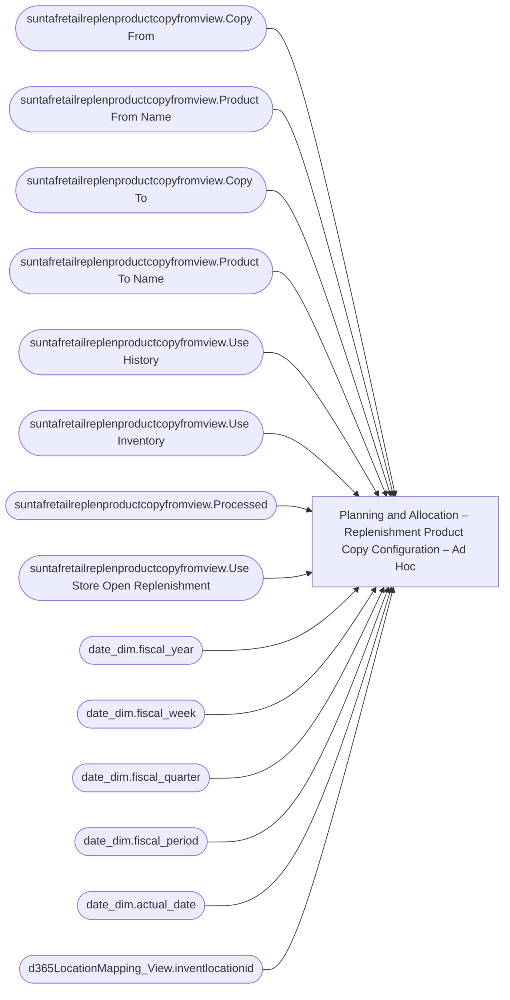

# Planning and Allocation – Replenishment Product Copy Configuration – Ad Hoc

**Workspace:** Enterprise Analytics Dev  
**Report ID:** 7f913065-0d1d-45a2-a62e-592199198a41  
**Dataset ID:** 05daff4b-5e80-4cd4-94ba-90a3110d5e14  
**Web URL:** https://app.powerbi.com/groups/109bd275-5f44-4366-b343-9b41b5cfb040/reports/7f913065-0d1d-45a2-a62e-592199198a41  
**Semantic Model:** [Merchandise Transactional Model](../../SemanticModels/Enterprise Analytics Dev/Merchandise Transactional Model.md)  

## Architecture Diagram

## Field Dependencies

| Referenced Field |
|---|
| suntafretailreplenproductcopyfromview.Copy From |
| suntafretailreplenproductcopyfromview.Product From Name |
| suntafretailreplenproductcopyfromview.Copy To |
| suntafretailreplenproductcopyfromview.Product To Name |
| suntafretailreplenproductcopyfromview.Use History |
| suntafretailreplenproductcopyfromview.Use Inventory |
| suntafretailreplenproductcopyfromview.Processed |
| suntafretailreplenproductcopyfromview.Use Store Open Replenishment |
| date_dim.fiscal_year |
| date_dim.fiscal_week |
| date_dim.fiscal_quarter |
| date_dim.fiscal_period |
| date_dim.actual_date |
| d365LocationMapping_View.inventlocationid |

## Pages

| Page | Visuals |
|---|---|
| Replenishment Product Copy Configuration | 17 |

## Visuals

### Replenishment Product Copy Configuration

| Visual | Type | Fields |
|---|---|---|
| 0b4140222c5f6ce0edbe | unknown |  |
| 0bcd43cda8b8c9272764 | textbox |  |
| 122ea31d98d5e46b728a | bookmarkNavigator |  |
| 2c050ec017a6225d6f41 | slicer | suntafretailreplenproductcopyfromview.Copy From |
| 44b856414f1a82fa1972 | unknown |  |
| 45a73095a294cc7e5ad2 | tableEx | suntafretailreplenproductcopyfromview.Copy From, suntafretailreplenproductcopyfromview.Product From Name, suntafretailreplenproductcopyfromview.Copy To, suntafretailreplenproductcopyfromview.Product To Name, suntafretailreplenproductcopyfromview.Use History, suntafretailreplenproductcopyfromview.Use Inventory, suntafretailreplenproductcopyfromview.Processed, suntafretailreplenproductcopyfromview.Use Store Open Replenishment |
| 4df0d921ab0b5d077f2c | slicer | date_dim.fiscal_year, date_dim.fiscal_week, date_dim.fiscal_quarter, date_dim.fiscal_period |
| 826e14c9840c3793285e | unknown |  |
| 97f4659a5a12bc988c51 | image |  |
| 9a7956cae86f44783ec2 | slicer | date_dim.actual_date |
| 9ea736d49b75db93980e | textbox |  |
| cc9c621b0f8156219228 | slicer | date_dim.fiscal_year, date_dim.fiscal_week, date_dim.fiscal_quarter, date_dim.fiscal_period |
| cca8d761cff72ee6b8d5 | bookmarkNavigator |  |
| d986b5ee6dd8555a4031 | textSlicer | d365LocationMapping_View.inventlocationid |
| ebf4a2dc4872072b777f | unknown |  |
| ec739d70b14b7c06805a | actionButton |  |
| f920f4a3989b72fd51af | textbox |  |
