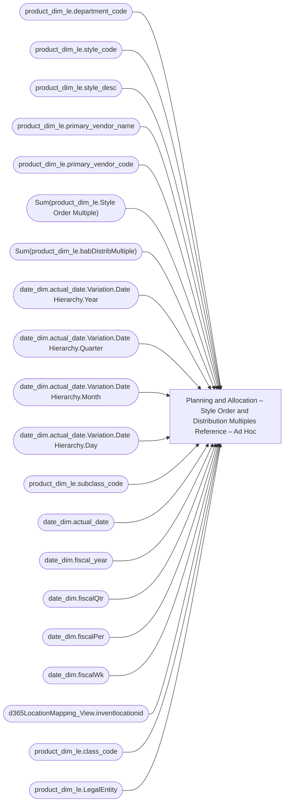

# Planning and Allocation – Style Order and Distribution Multiples Reference – Ad Hoc

**Workspace:** Enterprise Analytics Dev  
**Report ID:** 10c9d4f3-cdd4-4372-9a47-3d158289e838  
**Dataset ID:** 05daff4b-5e80-4cd4-94ba-90a3110d5e14  
**Web URL:** https://app.powerbi.com/groups/109bd275-5f44-4366-b343-9b41b5cfb040/reports/10c9d4f3-cdd4-4372-9a47-3d158289e838  
**Semantic Model:** [Merchandise Transactional Model](../../SemanticModels/Enterprise Analytics Dev/Merchandise Transactional Model.md)  

## Architecture Diagram

## Field Dependencies

| Referenced Field |
|---|
| product_dim_le.department_code |
| product_dim_le.style_code |
| product_dim_le.style_desc |
| product_dim_le.primary_vendor_name |
| product_dim_le.primary_vendor_code |
| Sum(product_dim_le.Style Order Multiple) |
| Sum(product_dim_le.babDistribMultiple) |
| date_dim.actual_date.Variation.Date Hierarchy.Year |
| date_dim.actual_date.Variation.Date Hierarchy.Quarter |
| date_dim.actual_date.Variation.Date Hierarchy.Month |
| date_dim.actual_date.Variation.Date Hierarchy.Day |
| product_dim_le.subclass_code |
| date_dim.actual_date |
| date_dim.fiscal_year |
| date_dim.fiscalQtr |
| date_dim.fiscalPer |
| date_dim.fiscalWk |
| d365LocationMapping_View.inventlocationid |
| product_dim_le.class_code |
| product_dim_le.LegalEntity |

## Pages

| Page | Visuals |
|---|---|
| Style Order and Distribution Multiples Reference | 23 |
| With Legal Entity | 23 |

## Visuals

### Style Order and Distribution Multiples Reference

| Visual | Type | Fields |
|---|---|---|
| 0990f82a5dbf1a44dadb | slicer | product_dim_le.department_code |
| 0b4140222c5f6ce0edbe | unknown |  |
| 0bcd43cda8b8c9272764 | textbox |  |
| 122ea31d98d5e46b728a | bookmarkNavigator |  |
| 2c050ec017a6225d6f41 | slicer | product_dim_le.style_code |
| 44b856414f1a82fa1972 | unknown |  |
| 45a73095a294cc7e5ad2 | tableEx | product_dim_le.style_code, product_dim_le.style_desc, product_dim_le.primary_vendor_name, product_dim_le.primary_vendor_code, Sum(product_dim_le.Style Order Multiple), Sum(product_dim_le.babDistribMultiple) |
| 4df0d921ab0b5d077f2c | slicer | date_dim.actual_date.Variation.Date Hierarchy.Year, date_dim.actual_date.Variation.Date Hierarchy.Quarter, date_dim.actual_date.Variation.Date Hierarchy.Month, date_dim.actual_date.Variation.Date Hierarchy.Day |
| 6f0031da695b744bd74a | textbox |  |
| 6f5dc07d92cdcbb671a6 | slicer | product_dim_le.primary_vendor_code |
| 7869095a179dc31dae86 | slicer | product_dim_le.subclass_code |
| 826e14c9840c3793285e | unknown |  |
| 97f4637b9433dd67029c | textFilter25A4896A83E0487089E2B90C9AE57C8A | product_dim_le.style_code |
| 97f4659a5a12bc988c51 | image |  |
| 9a7956cae86f44783ec2 | slicer | date_dim.actual_date |
| 9ea736d49b75db93980e | textbox |  |
| cc9c621b0f8156219228 | slicer | date_dim.fiscal_year, date_dim.actual_date, date_dim.fiscalQtr, date_dim.fiscalPer, date_dim.fiscalWk |
| cca8d761cff72ee6b8d5 | bookmarkNavigator |  |
| d986b5ee6dd8555a4031 | slicer | d365LocationMapping_View.inventlocationid |
| e8e740717323d0200f7a | slicer | product_dim_le.class_code |
| ebf4a2dc4872072b777f | unknown |  |
| ec739d70b14b7c06805a | actionButton |  |
| f920f4a3989b72fd51af | textbox |  |

### With Legal Entity

| Visual | Type | Fields |
|---|---|---|
| 04287330cc816ab347d4 | textbox |  |
| 1fd8acf5dabea2413457 | textbox |  |
| 2484cea310ad04ddec06 | textFilter25A4896A83E0487089E2B90C9AE57C8A | product_dim_le.style_code |
| 2879e5ac249ea1139e1a | unknown |  |
| 3878953f25269b2c2b49 | textbox |  |
| 3c7c78d471cac1718408 | slicer | d365LocationMapping_View.inventlocationid |
| 3d024dbf11e5676dd51e | slicer | date_dim.fiscal_year, date_dim.actual_date, date_dim.fiscalQtr, date_dim.fiscalPer, date_dim.fiscalWk |
| 9d04e34832e35bbadbd0 | slicer | product_dim_le.subclass_code |
| aa237a825610918ed60d | bookmarkNavigator |  |
| bb0322f3d7bc71606db0 | slicer | product_dim_le.primary_vendor_code |
| cb59b579789159660cce | slicer | product_dim_le.department_code |
| d9bf3e0410e1be9aaa3e | slicer | product_dim_le.style_code |
| e3f9c15c66a60a170570 | unknown |  |
| fa703d5ea4ac1a4d6de9 | unknown |  |
| 998fe5e09238a6d325c6 | tableEx | product_dim_le.style_code, product_dim_le.style_desc, product_dim_le.primary_vendor_name, product_dim_le.primary_vendor_code, Sum(product_dim_le.Style Order Multiple), Sum(product_dim_le.babDistribMultiple), product_dim_le.LegalEntity |
| 98bc2437a020aad6360c | image |  |
| 73ad2ac25c915ab501dc | slicer | product_dim_le.class_code |
| 6f5196ef182e5debc551 | slicer | date_dim.actual_date |
| 6cc5099e75564e0ac422 | unknown |  |
| 6a7c38f0568e87bb4833 | slicer | date_dim.actual_date.Variation.Date Hierarchy.Year, date_dim.actual_date.Variation.Date Hierarchy.Quarter, date_dim.actual_date.Variation.Date Hierarchy.Month, date_dim.actual_date.Variation.Date Hierarchy.Day |
| 6290b018036dbbe7a42c | actionButton |  |
| 5ebf384658c173ca802d | textbox |  |
| 4cffe97e57a2c640ec80 | bookmarkNavigator |  |
