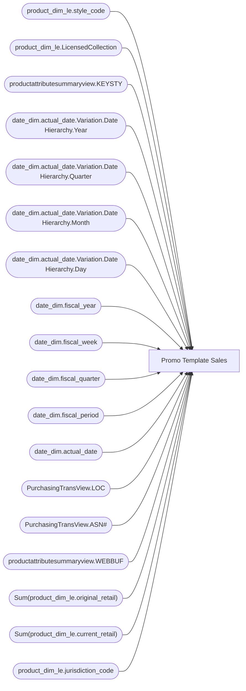

# Promo Template Sales

**Workspace:** Enterprise Analytics Dev  
**Report ID:** 9f41b54a-63df-41b2-92b2-ddafce788963  
**Dataset ID:** fba3b349-79e8-41c0-9703-c90e9ddeef23  
**Web URL:** https://app.powerbi.com/groups/109bd275-5f44-4366-b343-9b41b5cfb040/reports/9f41b54a-63df-41b2-92b2-ddafce788963  
**Semantic Model:** [Merchandise Aggregate Semantic Model](../../SemanticModels/Enterprise Analytics Dev/Merchandise Aggregate Semantic Model.md)  

## Architecture Diagram

## Field Dependencies

| Referenced Field |
|---|
| product_dim_le.style_code |
| product_dim_le.LicensedCollection |
| productattributesummaryview.KEYSTY |
| date_dim.actual_date.Variation.Date Hierarchy.Year |
| date_dim.actual_date.Variation.Date Hierarchy.Quarter |
| date_dim.actual_date.Variation.Date Hierarchy.Month |
| date_dim.actual_date.Variation.Date Hierarchy.Day |
| date_dim.fiscal_year |
| date_dim.fiscal_week |
| date_dim.fiscal_quarter |
| date_dim.fiscal_period |
| date_dim.actual_date |
| PurchasingTransView.LOC |
| PurchasingTransView.ASN# |
| productattributesummaryview.WEBBUF |
| Sum(product_dim_le.original_retail) |
| Sum(product_dim_le.current_retail) |
| product_dim_le.jurisdiction_code |

## Pages

| Page | Visuals |
|---|---|
| PromoTemplateSalesData | 22 |

## Visuals

### PromoTemplateSalesData

| Visual | Type | Fields |
|---|---|---|
| 6f0031da695b744bd74a | textbox |  |
| 2c050ec017a6225d6f41 | slicer | product_dim_le.style_code |
| 22da671c0667f2a982ae | slicer | product_dim_le.LicensedCollection |
| 3edf860c41bfa20e56ed | slicer | productattributesummaryview.KEYSTY |
| 826e14c9840c3793285e | unknown |  |
| cca8d761cff72ee6b8d5 | bookmarkNavigator |  |
| 4df0d921ab0b5d077f2c | slicer | date_dim.actual_date.Variation.Date Hierarchy.Year, date_dim.actual_date.Variation.Date Hierarchy.Quarter, date_dim.actual_date.Variation.Date Hierarchy.Month, date_dim.actual_date.Variation.Date Hierarchy.Day |
| cc9c621b0f8156219228 | slicer | date_dim.fiscal_year, date_dim.fiscal_week, date_dim.fiscal_quarter, date_dim.fiscal_period, date_dim.actual_date |
| 9a7956cae86f44783ec2 | slicer | date_dim.actual_date |
| ebf4a2dc4872072b777f | unknown |  |
| 122ea31d98d5e46b728a | bookmarkNavigator |  |
| d986b5ee6dd8555a4031 | textSlicer | PurchasingTransView.LOC |
| 44b856414f1a82fa1972 | unknown |  |
| ec739d70b14b7c06805a | actionButton |  |
| 9ea736d49b75db93980e | textbox |  |
| 97f4659a5a12bc988c51 | image |  |
| 0bcd43cda8b8c9272764 | textbox |  |
| f920f4a3989b72fd51af | textbox |  |
| 0b4140222c5f6ce0edbe | unknown |  |
| 2fe53e4e73dbaecc0854 | textFilter25A4896A83E0487089E2B90C9AE57C8A | product_dim_le.style_code |
| 8c625018213a68a7c8ed | slicer | PurchasingTransView.ASN# |
| e0290b3bdcd982dcae6f | tableEx | productattributesummaryview.WEBBUF, Sum(product_dim_le.original_retail), Sum(product_dim_le.current_retail), product_dim_le.style_code, product_dim_le.jurisdiction_code |
