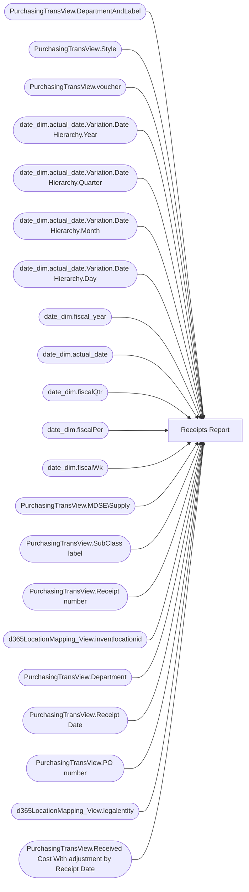

# Receipts Report

**Workspace:** Enterprise Analytics Dev  
**Report ID:** 444f5230-ded6-4360-917a-9b269faa77de  
**Dataset ID:** 05daff4b-5e80-4cd4-94ba-90a3110d5e14  
**Web URL:** https://app.powerbi.com/groups/109bd275-5f44-4366-b343-9b41b5cfb040/reports/444f5230-ded6-4360-917a-9b269faa77de  
**Semantic Model:** [Merchandise Transactional Model](../../SemanticModels/Enterprise Analytics Dev/Merchandise Transactional Model.md)  

## Architecture Diagram

## Field Dependencies

| Referenced Field |
|---|
| PurchasingTransView.DepartmentAndLabel |
| PurchasingTransView.Style |
| PurchasingTransView.voucher |
| date_dim.actual_date.Variation.Date Hierarchy.Year |
| date_dim.actual_date.Variation.Date Hierarchy.Quarter |
| date_dim.actual_date.Variation.Date Hierarchy.Month |
| date_dim.actual_date.Variation.Date Hierarchy.Day |
| date_dim.fiscal_year |
| date_dim.actual_date |
| date_dim.fiscalQtr |
| date_dim.fiscalPer |
| date_dim.fiscalWk |
| PurchasingTransView.MDSE\Supply |
| PurchasingTransView.SubClass label |
| PurchasingTransView.Receipt number |
| d365LocationMapping_View.inventlocationid |
| PurchasingTransView.Department |
| PurchasingTransView.Receipt Date |
| PurchasingTransView.PO number |
| d365LocationMapping_View.legalentity |
| PurchasingTransView.Received Cost With adjustment by Receipt Date |

## Pages

| Page | Visuals |
|---|---|
| DJR Receipts IB ID | 23 |

## Visuals

### DJR Receipts IB ID

| Visual | Type | Fields |
|---|---|---|
| 0990f82a5dbf1a44dadb | slicer | PurchasingTransView.DepartmentAndLabel |
| 0b4140222c5f6ce0edbe | unknown |  |
| 0bcd43cda8b8c9272764 | textbox |  |
| 122ea31d98d5e46b728a | bookmarkNavigator |  |
| 2c050ec017a6225d6f41 | slicer | PurchasingTransView.Style |
| 2cebf3e291a476a69203 | textFilter25A4896A83E0487089E2B90C9AE57C8A | PurchasingTransView.voucher |
| 44b856414f1a82fa1972 | unknown |  |
| 4df0d921ab0b5d077f2c | slicer | date_dim.actual_date.Variation.Date Hierarchy.Year, date_dim.actual_date.Variation.Date Hierarchy.Quarter, date_dim.actual_date.Variation.Date Hierarchy.Month, date_dim.actual_date.Variation.Date Hierarchy.Day |
| 5183d69228ab2695a6bb | slicer | date_dim.fiscal_year, date_dim.actual_date, date_dim.fiscalQtr, date_dim.fiscalPer, date_dim.fiscalWk |
| 60de7b1e8a569181a740 | slicer | PurchasingTransView.MDSE\Supply |
| 6f0031da695b744bd74a | textbox |  |
| 7869095a179dc31dae86 | slicer | PurchasingTransView.SubClass label |
| 826e14c9840c3793285e | unknown |  |
| 97f4637b9433dd67029c | textFilter25A4896A83E0487089E2B90C9AE57C8A | PurchasingTransView.Receipt number |
| 97f4659a5a12bc988c51 | image |  |
| 9a7956cae86f44783ec2 | slicer | date_dim.actual_date |
| 9ea736d49b75db93980e | textbox |  |
| cca8d761cff72ee6b8d5 | bookmarkNavigator |  |
| d986b5ee6dd8555a4031 | slicer | d365LocationMapping_View.inventlocationid |
| ebf4a2dc4872072b777f | unknown |  |
| ec739d70b14b7c06805a | actionButton |  |
| f23d5b55029a0991e0da | tableEx | PurchasingTransView.Receipt number, PurchasingTransView.Department, PurchasingTransView.Receipt Date, PurchasingTransView.MDSE\Supply, PurchasingTransView.voucher, d365LocationMapping_View.inventlocationid, PurchasingTransView.PO number, d365LocationMapping_View.legalentity, PurchasingTransView.Received Cost With adjustment by Receipt Date |
| f920f4a3989b72fd51af | textbox |  |
