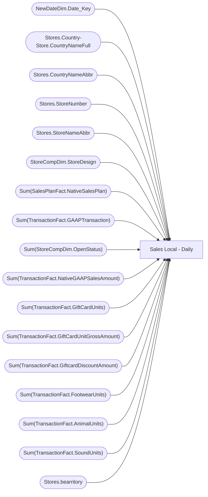

# Sales Local - Daily

**Workspace:** Enterprise Analytics Dev  
**Report ID:** 09e5aa66-2794-42c4-b9b3-69234e141aa1  
**Dataset ID:** 0d354f73-5a32-4d1d-9be1-e2681297b656  
**Web URL:** https://app.powerbi.com/groups/109bd275-5f44-4366-b343-9b41b5cfb040/reports/09e5aa66-2794-42c4-b9b3-69234e141aa1  
**Semantic Model:** [SM_AZAS_V2](../../SemanticModels/Enterprise Analytics Dev/SM_AZAS_V2.md)  

## Architecture Diagram

## Field Dependencies

| Referenced Field |
|---|
| NewDateDim.Date_Key |
| Stores.Country-Store.CountryNameFull |
| Stores.CountryNameAbbr |
| Stores.StoreNumber |
| Stores.StoreNameAbbr |
| StoreCompDim.StoreDesign |
| Sum(SalesPlanFact.NativeSalesPlan) |
| Sum(TransactionFact.GAAPTransaction) |
| Sum(StoreCompDim.OpenStatus) |
| Sum(TransactionFact.NativeGAAPSalesAmount) |
| Sum(TransactionFact.GiftCardUnits) |
| Sum(TransactionFact.GiftCardUnitGrossAmount) |
| Sum(TransactionFact.GiftcardDiscountAmount) |
| Sum(TransactionFact.FootwearUnits) |
| Sum(TransactionFact.AnimalUnits) |
| Sum(TransactionFact.SoundUnits) |
| Stores.bearritory |

## Pages

| Page | Visuals |
|---|---|
| Date Drop down type | 3 |
| Date Between Range | 3 |

## Visuals

### Date Drop down type

| Visual | Type | Fields |
|---|---|---|
| d227e2b999b09c9515aa | slicer | NewDateDim.Date_Key |
| 83ae04755c60e5450997 | slicer | Stores.Country-Store.CountryNameFull |
| 32d2246f0b22b3c378b4 | tableEx | NewDateDim.Date_Key, Stores.CountryNameAbbr, Stores.StoreNumber, Stores.StoreNameAbbr, StoreCompDim.StoreDesign, Sum(SalesPlanFact.NativeSalesPlan), Sum(TransactionFact.GAAPTransaction), Sum(StoreCompDim.OpenStatus), Sum(TransactionFact.NativeGAAPSalesAmount), Sum(TransactionFact.GiftCardUnits), Sum(TransactionFact.GiftCardUnitGrossAmount), Sum(TransactionFact.GiftcardDiscountAmount), Sum(TransactionFact.FootwearUnits), Sum(TransactionFact.AnimalUnits), Sum(TransactionFact.SoundUnits), Stores.bearritory |

### Date Between Range

| Visual | Type | Fields |
|---|---|---|
| 97873f064fa080e20362 | slicer | NewDateDim.Date_Key |
| 39b4709f5ae464b4b3b5 | tableEx | NewDateDim.Date_Key, Stores.CountryNameAbbr, Stores.StoreNumber, Stores.StoreNameAbbr, StoreCompDim.StoreDesign, Sum(SalesPlanFact.NativeSalesPlan), Sum(TransactionFact.GAAPTransaction), Sum(StoreCompDim.OpenStatus), Sum(TransactionFact.NativeGAAPSalesAmount), Sum(TransactionFact.GiftCardUnits), Sum(TransactionFact.GiftCardUnitGrossAmount), Sum(TransactionFact.GiftcardDiscountAmount), Sum(TransactionFact.FootwearUnits), Sum(TransactionFact.AnimalUnits), Sum(TransactionFact.SoundUnits), Stores.bearritory |
| d5a7db2f6369ec0b6d44 | slicer | Stores.CountryNameAbbr |
