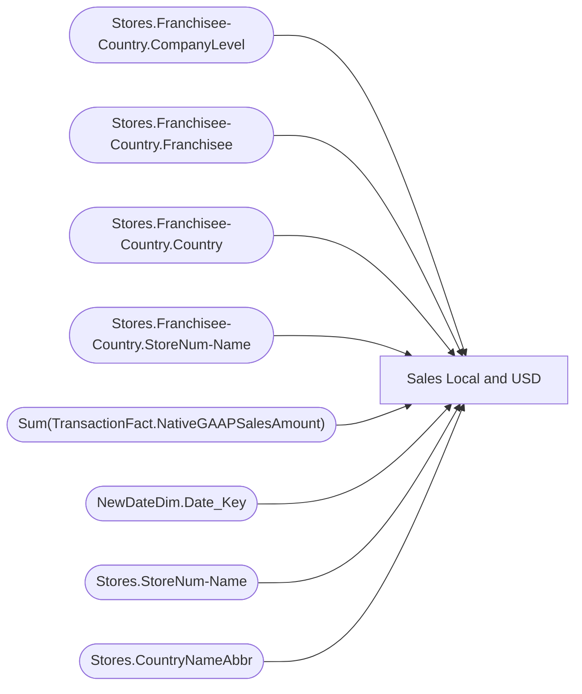

# Sales Local and USD

**Workspace:** Enterprise Analytics Dev  
**Report ID:** 8ecd2abc-def9-4dbd-8c0e-f91ad60d5e59  
**Dataset ID:** 0d354f73-5a32-4d1d-9be1-e2681297b656  
**Web URL:** https://app.powerbi.com/groups/109bd275-5f44-4366-b343-9b41b5cfb040/reports/8ecd2abc-def9-4dbd-8c0e-f91ad60d5e59  
**Semantic Model:** [SM_AZAS_V2](../../SemanticModels/Enterprise Analytics Dev/SM_AZAS_V2.md)  

## Architecture Diagram

## Field Dependencies

| Referenced Field |
|---|
| Stores.Franchisee-Country.CompanyLevel |
| Stores.Franchisee-Country.Franchisee |
| Stores.Franchisee-Country.Country |
| Stores.Franchisee-Country.StoreNum-Name |
| Sum(TransactionFact.NativeGAAPSalesAmount) |
| NewDateDim.Date_Key |
| Stores.StoreNum-Name |
| Stores.CountryNameAbbr |

## Pages

| Page | Visuals |
|---|---|
| Page 1 | 4 |

## Visuals

### Page 1

| Visual | Type | Fields |
|---|---|---|
| 2ce0be140d0a0990c2de | pivotTable | Stores.Franchisee-Country.CompanyLevel, Stores.Franchisee-Country.Franchisee, Stores.Franchisee-Country.Country, Stores.Franchisee-Country.StoreNum-Name, Sum(TransactionFact.NativeGAAPSalesAmount) |
| 284c8755b40abd478118 | slicer | NewDateDim.Date_Key |
| a5330fde6989c3040f44 | clusteredBarChart | Stores.StoreNum-Name |
| 10b7256f565b7a4d6fa0 | slicer | Stores.CountryNameAbbr |
