# Sourcing – On Order Cost Analysis – Quarterly

**Workspace:** Enterprise Analytics Dev  
**Report ID:** 637778f9-89c2-4b92-9fcc-202a799816c1  
**Dataset ID:** 05daff4b-5e80-4cd4-94ba-90a3110d5e14  
**Web URL:** https://app.powerbi.com/groups/109bd275-5f44-4366-b343-9b41b5cfb040/reports/637778f9-89c2-4b92-9fcc-202a799816c1  
**Semantic Model:** [Merchandise Transactional Model](../../SemanticModels/Enterprise Analytics Dev/Merchandise Transactional Model.md)  

## Architecture Diagram

```mermaid
flowchart LR
    REPORT["Sourcing – On Order Cost Analysis – Quarterly"]
    product_dim_le_primary_vendor_code(["product_dim_le.primary_vendor_code"]) --> REPORT
    product_dim_le_style_code(["product_dim_le.style_code"]) --> REPORT
    product_dim_le_department(["product_dim_le.department"]) --> REPORT
    PurchasingTransView_LOC(["PurchasingTransView.LOC"]) --> REPORT
    product_dim_le_department_code(["product_dim_le.department_code"]) --> REPORT
    productattributesummaryview_MSTAT(["productattributesummaryview.MSTAT"]) --> REPORT
    product_dim_le_Department_Label(["product_dim_le.Department Label"]) --> REPORT
    product_dim_le_primary_vendor_name(["product_dim_le.primary_vendor_name"]) --> REPORT
    productattributesummaryview_KEYSTY(["productattributesummaryview.KEYSTY"]) --> REPORT
    ReportingPeriod_Period_Label(["ReportingPeriod.Period Label"]) --> REPORT
    ReceiptCostFreightFactorView_Total_Receipts_Cost_Incl_Factors__Period_(["ReceiptCostFreightFactorView.Total Receipts Cost Incl Factors (Period)"]) --> REPORT
    ReceiptCostFreightFactorView_Total_Receipts_Retail_TE____Period_(["ReceiptCostFreightFactorView.Total Receipts Retail TE $ (Period)"]) --> REPORT
    ReceiptCostFreightFactorView_Margin____Excl_Factors___Period_(["ReceiptCostFreightFactorView.Margin % (Excl Factors) (Period)"]) --> REPORT
    ReceiptCostFreightFactorView_Margin____Incl_Factors___Period_(["ReceiptCostFreightFactorView.Margin % (Incl Factors) (Period)"]) --> REPORT
    ReceiptCostFreightFactorView_Total_Cost_Factors__Period_(["ReceiptCostFreightFactorView.Total Cost Factors (Period)"]) --> REPORT
    ReceiptCostFreightFactorView_Receipts_Cost_Excl_Factors__Period_(["ReceiptCostFreightFactorView.Receipts Cost Excl Factors (Period)"]) --> REPORT
    ReceiptCostFreightFactorView_Total_Receipts_Units__Period_(["ReceiptCostFreightFactorView.Total Receipts Units (Period)"]) --> REPORT
    ReceiptCostFreightFactorView_Avg_Unit_Receipt_Cost__Excl_Factors___Period_(["ReceiptCostFreightFactorView.Avg Unit Receipt Cost (Excl Factors) (Period)"]) --> REPORT
    ReceiptCostFreightFactorView_Cost_Factors____Period_(["ReceiptCostFreightFactorView.Cost Factors % (Period)"]) --> REPORT
    date_dim_fiscal_year(["date_dim.fiscal_year"]) --> REPORT
    date_dim_fiscal_week(["date_dim.fiscal_week"]) --> REPORT
    date_dim_fiscal_quarter(["date_dim.fiscal_quarter"]) --> REPORT
    date_dim_fiscal_period(["date_dim.fiscal_period"]) --> REPORT
    date_dim_actual_date(["date_dim.actual_date"]) --> REPORT
    PurchasingTransView_Receipt_Date(["PurchasingTransView.Receipt Date"]) --> REPORT
    date_dim_actual_date_Variation_Date_Hierarchy_Year(["date_dim.actual_date.Variation.Date Hierarchy.Year"]) --> REPORT
    date_dim_actual_date_Variation_Date_Hierarchy_Quarter(["date_dim.actual_date.Variation.Date Hierarchy.Quarter"]) --> REPORT
    date_dim_actual_date_Variation_Date_Hierarchy_Month(["date_dim.actual_date.Variation.Date Hierarchy.Month"]) --> REPORT
    date_dim_actual_date_Variation_Date_Hierarchy_Day(["date_dim.actual_date.Variation.Date Hierarchy.Day"]) --> REPORT
    product_dim_le_style_desc(["product_dim_le.style_desc"]) --> REPORT
    Sum_PurchasingTransView_X_Cost_(["Sum(PurchasingTransView.X-Cost)"]) --> REPORT
    Sum_PurchasingTransView_Costfactor_(["Sum(PurchasingTransView.Costfactor)"]) --> REPORT
    Sum_PurchasingTransView_units_received_(["Sum(PurchasingTransView.units received)"]) --> REPORT
    Sum_PurchasingTransView_retail_received_(["Sum(PurchasingTransView.retail received)"]) --> REPORT
    ReceiptCostFreightFactorView_Vendor_Name(["ReceiptCostFreightFactorView.Vendor Name"]) --> REPORT
    ReceiptCostFreightFactorView_Vendor_Number(["ReceiptCostFreightFactorView.Vendor Number"]) --> REPORT
    PurchChargeViewPivotTable_Chg___Tariffs__Period_(["PurchChargeViewPivotTable.Chg – Tariffs (Period)"]) --> REPORT
    PurchChargeViewPivotTable_Chg___All_excluding_tariffs__Period_(["PurchChargeViewPivotTable.Chg – All excluding tariffs (Period)"]) --> REPORT
    product_dim_le_primaryvendorid(["product_dim_le.primaryvendorid"]) --> REPORT
    product_dim_le_KeyStory(["product_dim_le.KeyStory"]) --> REPORT
```

## Field Dependencies

| Referenced Field |
|---|
| product_dim_le.primary_vendor_code |
| product_dim_le.style_code |
| product_dim_le.department |
| PurchasingTransView.LOC |
| product_dim_le.department_code |
| productattributesummaryview.MSTAT |
| product_dim_le.Department Label |
| product_dim_le.primary_vendor_name |
| productattributesummaryview.KEYSTY |
| ReportingPeriod.Period Label |
| ReceiptCostFreightFactorView.Total Receipts Cost Incl Factors (Period) |
| ReceiptCostFreightFactorView.Total Receipts Retail TE $ (Period) |
| ReceiptCostFreightFactorView.Margin % (Excl Factors) (Period) |
| ReceiptCostFreightFactorView.Margin % (Incl Factors) (Period) |
| ReceiptCostFreightFactorView.Total Cost Factors (Period) |
| ReceiptCostFreightFactorView.Receipts Cost Excl Factors (Period) |
| ReceiptCostFreightFactorView.Total Receipts Units (Period) |
| ReceiptCostFreightFactorView.Avg Unit Receipt Cost (Excl Factors) (Period) |
| ReceiptCostFreightFactorView.Cost Factors % (Period) |
| date_dim.fiscal_year |
| date_dim.fiscal_week |
| date_dim.fiscal_quarter |
| date_dim.fiscal_period |
| date_dim.actual_date |
| PurchasingTransView.Receipt Date |
| date_dim.actual_date.Variation.Date Hierarchy.Year |
| date_dim.actual_date.Variation.Date Hierarchy.Quarter |
| date_dim.actual_date.Variation.Date Hierarchy.Month |
| date_dim.actual_date.Variation.Date Hierarchy.Day |
| product_dim_le.style_desc |
| Sum(PurchasingTransView.X-Cost) |
| Sum(PurchasingTransView.Costfactor) |
| Sum(PurchasingTransView.units received) |
| Sum(PurchasingTransView.retail received) |
| ReceiptCostFreightFactorView.Vendor Name |
| ReceiptCostFreightFactorView.Vendor Number |
| PurchChargeViewPivotTable.Chg – Tariffs (Period) |
| PurchChargeViewPivotTable.Chg – All excluding tariffs (Period) |
| product_dim_le.primaryvendorid |
| product_dim_le.KeyStory |

## Pages

| Page | Visuals |
|---|---|
| By Department | 17 |
| On Order Cost Analysis | 22 |
| By Vendor | 17 |
| Vend - Cost Factor Breakdown | 17 |
| Dept - Cost Factor Breakdown | 17 |
| By Vendor Code | 17 |
| By Style | 17 |

## Visuals

### By Department

| Visual | Type | Fields |
|---|---|---|
| 00f553300aa52e82d013 | textbox |  |
| 25c6ed3cc0cb4e4b413c | slicer | product_dim_le.primary_vendor_code |
| 3ad5372661467bc43ead | slicer | product_dim_le.style_code |
| f89b1f566d270ee08948 | slicer | product_dim_le.department |
| cbb6a3b6a0ea4e8aa8a0 | slicer | PurchasingTransView.LOC |
| c33f497416e23b0100a0 | textFilter25A4896A83E0487089E2B90C9AE57C8A | product_dim_le.department_code |
| b62fc8cea84ad63d2bda | textbox |  |
| b2a55f103b37d53eae7b | unknown |  |
| a277d9d56809ac792336 | unknown |  |
| a0690a0b6edc86a80054 | slicer | productattributesummaryview.MSTAT |
| 8e6a647ec9eba3b5a512 | textFilter25A4896A83E0487089E2B90C9AE57C8A | product_dim_le.Department Label |
| 82b19b6817a711e2a451 | slicer | product_dim_le.primary_vendor_name |
| 8077a79348db17078173 | unknown |  |
| 77b1c6181e5ad6de147a | slicer | productattributesummaryview.KEYSTY |
| 7336faaed4708ae06578 | image |  |
| 44adf5e34b57b8de33b4 | actionButton |  |
| 4473d3a0804161a80965 | pivotTable | product_dim_le.Department Label, ReportingPeriod.Period Label, ReceiptCostFreightFactorView.Total Receipts Cost Incl Factors (Period), ReceiptCostFreightFactorView.Total Receipts Retail TE $ (Period), ReceiptCostFreightFactorView.Margin % (Excl Factors) (Period), ReceiptCostFreightFactorView.Margin % (Incl Factors) (Period), ReceiptCostFreightFactorView.Total Cost Factors (Period), ReceiptCostFreightFactorView.Receipts Cost Excl Factors (Period), ReceiptCostFreightFactorView.Total Receipts Units (Period), ReceiptCostFreightFactorView.Avg Unit Receipt Cost (Excl Factors) (Period), product_dim_le.style_code, ReceiptCostFreightFactorView.Cost Factors % (Period) |

### On Order Cost Analysis

| Visual | Type | Fields |
|---|---|---|
| ec739d70b14b7c06805a | actionButton |  |
| ebf4a2dc4872072b777f | unknown |  |
| e8e740717323d0200f7a | slicer | productattributesummaryview.KEYSTY |
| d986b5ee6dd8555a4031 | slicer | PurchasingTransView.LOC |
| cca8d761cff72ee6b8d5 | bookmarkNavigator |  |
| cc9c621b0f8156219228 | slicer | date_dim.fiscal_year, date_dim.fiscal_week, date_dim.fiscal_quarter, date_dim.fiscal_period, date_dim.actual_date |
| 9ea736d49b75db93980e | textbox |  |
| 9a7956cae86f44783ec2 | slicer | PurchasingTransView.Receipt Date |
| 97f4659a5a12bc988c51 | image |  |
| 97f4637b9433dd67029c | textFilter25A4896A83E0487089E2B90C9AE57C8A | product_dim_le.style_code |
| 826e14c9840c3793285e | unknown |  |
| 7869095a179dc31dae86 | slicer | productattributesummaryview.MSTAT |
| 6f0031da695b744bd74a | textbox |  |
| 6114a94f7e8a70770e48 | slicer | product_dim_le.primary_vendor_name |
| 4df0d921ab0b5d077f2c | slicer | date_dim.actual_date.Variation.Date Hierarchy.Year, date_dim.actual_date.Variation.Date Hierarchy.Quarter, date_dim.actual_date.Variation.Date Hierarchy.Month, date_dim.actual_date.Variation.Date Hierarchy.Day |
| 45a73095a294cc7e5ad2 | tableEx | product_dim_le.style_code, product_dim_le.style_desc, productattributesummaryview.KEYSTY, productattributesummaryview.MSTAT, Sum(PurchasingTransView.X-Cost), Sum(PurchasingTransView.Costfactor), Sum(PurchasingTransView.units received), Sum(PurchasingTransView.retail received), product_dim_le.primary_vendor_code, product_dim_le.primary_vendor_name, product_dim_le.Department Label |
| 44b856414f1a82fa1972 | unknown |  |
| 40733b926e8f9de09c38 | slicer | product_dim_le.primary_vendor_code |
| 2c050ec017a6225d6f41 | slicer | product_dim_le.style_code |
| 122ea31d98d5e46b728a | bookmarkNavigator |  |
| 0b4140222c5f6ce0edbe | unknown |  |
| 0990f82a5dbf1a44dadb | slicer | product_dim_le.department |

### By Vendor

| Visual | Type | Fields |
|---|---|---|
| f74746dec40ce3453508 | slicer | PurchasingTransView.LOC |
| e6fef35d9d1582295e51 | image |  |
| d8ade4c7010e751188b3 | slicer | productattributesummaryview.MSTAT |
| d4a9d7281ab1d68c6a7e | slicer | product_dim_le.primary_vendor_name |
| cb1e717b1102b99367d1 | unknown |  |
| caf76e4dec12ec03aae9 | unknown |  |
| c55f2780b9125b895b3e | slicer | product_dim_le.style_code |
| b51fdb2b3a828c6e2183 | slicer | product_dim_le.primary_vendor_code |
| 9d8cef2cc72ac4bebd8e | slicer | productattributesummaryview.KEYSTY |
| 9419434d388cd002aec3 | textbox |  |
| 882f3eb60e0640c02d37 | textFilter25A4896A83E0487089E2B90C9AE57C8A | ReceiptCostFreightFactorView.Vendor Name |
| 70df6886624c915d0163 | pivotTable | ReportingPeriod.Period Label, ReceiptCostFreightFactorView.Total Receipts Cost Incl Factors (Period), ReceiptCostFreightFactorView.Total Cost Factors (Period), ReceiptCostFreightFactorView.Receipts Cost Excl Factors (Period), ReceiptCostFreightFactorView.Total Receipts Retail TE $ (Period), ReceiptCostFreightFactorView.Avg Unit Receipt Cost (Excl Factors) (Period), ReceiptCostFreightFactorView.Total Receipts Units (Period), ReceiptCostFreightFactorView.Margin % (Incl Factors) (Period), ReceiptCostFreightFactorView.Margin % (Excl Factors) (Period), ReceiptCostFreightFactorView.Vendor Name, ReceiptCostFreightFactorView.Vendor Number, product_dim_le.style_code |
| 50e8e5627bbdb9a880a1 | slicer | product_dim_le.department |
| 481e245bd719b70cadb2 | actionButton |  |
| 3227120ca02007d40db3 | unknown |  |
| 26909355dda023090499 | textbox |  |
| 1f929038cee6bec05504 | textFilter25A4896A83E0487089E2B90C9AE57C8A | ReceiptCostFreightFactorView.Vendor Number |

### Vend - Cost Factor Breakdown

| Visual | Type | Fields |
|---|---|---|
| fda31430b29f60e2984c | image |  |
| daada3cd45fbbf59ff00 | slicer | product_dim_le.style_code |
| bdcad762d277b0c255ce | unknown |  |
| b810977e24c8cb613126 | actionButton |  |
| abf5a4e752f5404f22d5 | slicer | product_dim_le.department |
| 933f2c1bbedb881669a4 | textFilter25A4896A83E0487089E2B90C9AE57C8A | product_dim_le.style_desc |
| 85814afd9e2c8b233ee6 | textbox |  |
| 8520853b2f17e51fe927 | slicer | productattributesummaryview.KEYSTY |
| 719fecfa4dfe5f4827c1 | textFilter25A4896A83E0487089E2B90C9AE57C8A | product_dim_le.style_code |
| 7181fc47598cf13263c1 | textbox |  |
| 69addc55ebf8ec22fae5 | pivotTable | ReportingPeriod.Period Label, product_dim_le.style_code, product_dim_le.style_desc, PurchChargeViewPivotTable.Chg – Tariffs (Period), ReceiptCostFreightFactorView.Total Receipts Cost Incl Factors (Period), PurchChargeViewPivotTable.Chg – All excluding tariffs (Period), product_dim_le.primary_vendor_name, product_dim_le.primaryvendorid, ReceiptCostFreightFactorView.Receipts Cost Excl Factors (Period) |
| 5342e23ae8505f99917e | slicer | product_dim_le.primary_vendor_name |
| 3b002e3c276a48d1a056 | slicer | product_dim_le.primary_vendor_code |
| 30b3fb59b929a635f93b | unknown |  |
| 307c875e4d652b06729b | slicer | productattributesummaryview.MSTAT |
| 2b446f74aae4d5e59f9e | slicer | PurchasingTransView.LOC |
| 21afd06bcc0dfdec602b | unknown |  |

### Dept - Cost Factor Breakdown

| Visual | Type | Fields |
|---|---|---|
| e5ce23430727d5bd5250 | slicer | productattributesummaryview.KEYSTY |
| e3dbb9ca2a04614cd9b5 | textFilter25A4896A83E0487089E2B90C9AE57C8A | product_dim_le.style_code |
| ca047216bee48a7a330d | slicer | productattributesummaryview.MSTAT |
| c8f856e2abd108002e02 | slicer | product_dim_le.department |
| af5e24bf14302b13c3d4 | slicer | product_dim_le.primary_vendor_name |
| a4b18f207d770025078b | unknown |  |
| 9f43ff8a2a0480562ab7 | textbox |  |
| 9c3c862d060784ac2cd2 | slicer | product_dim_le.style_code |
| 7831d870476d388d04e7 | actionButton |  |
| 767aba53404d40a60c03 | textbox |  |
| 74f1ee05097194041c70 | textFilter25A4896A83E0487089E2B90C9AE57C8A | product_dim_le.style_desc |
| 6e866f0d2b44d1b5939e | pivotTable | ReportingPeriod.Period Label, product_dim_le.style_code, product_dim_le.style_desc, PurchChargeViewPivotTable.Chg – Tariffs (Period), ReceiptCostFreightFactorView.Total Receipts Cost Incl Factors (Period), PurchChargeViewPivotTable.Chg – All excluding tariffs (Period), product_dim_le.Department Label, ReceiptCostFreightFactorView.Receipts Cost Excl Factors (Period) |
| 64fe8ddce506d5561b96 | unknown |  |
| 49655908ab8970307eb9 | image |  |
| 441c91784032856d2b46 | unknown |  |
| 12508a6c9a7bc4076606 | slicer | product_dim_le.primary_vendor_code |
| 01c79213db4ea00da034 | slicer | PurchasingTransView.LOC |

### By Vendor Code

| Visual | Type | Fields |
|---|---|---|
| f4fb2bc783ec92d8433b | slicer | product_dim_le.primary_vendor_code |
| 9402be286a79e261cf2d | textFilter25A4896A83E0487089E2B90C9AE57C8A | product_dim_le.primary_vendor_code |
| 91a67d1c208b1350ebde | slicer | productattributesummaryview.MSTAT |
| 8f52d0a825edfb7e9f09 | slicer | product_dim_le.primary_vendor_name |
| 8e282834344c968b12da | unknown |  |
| 84ccc6086ef75044a2e4 | actionButton |  |
| 77adb11612bbbadcc9a1 | pivotTable | ReportingPeriod.Period Label, ReceiptCostFreightFactorView.Total Receipts Cost Incl Factors (Period), ReceiptCostFreightFactorView.Total Cost Factors (Period), ReceiptCostFreightFactorView.Receipts Cost Excl Factors (Period), ReceiptCostFreightFactorView.Total Receipts Retail TE $ (Period), ReceiptCostFreightFactorView.Avg Unit Receipt Cost (Excl Factors) (Period), ReceiptCostFreightFactorView.Total Receipts Units (Period), ReceiptCostFreightFactorView.Margin % (Incl Factors) (Period), ReceiptCostFreightFactorView.Margin % (Excl Factors) (Period), product_dim_le.primary_vendor_code, product_dim_le.primary_vendor_name, product_dim_le.style_code |
| 74f232187a280378efb1 | unknown |  |
| 6ea5efd1f8d8f4680d08 | slicer | PurchasingTransView.LOC |
| 5a8f29372f331fdbdca7 | textbox |  |
| 509dd22a8262edb93cc8 | textbox |  |
| 4e6b8877806fb9c12ec8 | slicer | product_dim_le.style_code |
| 403214c3e9c195ccc2df | image |  |
| 36801ac83fca70fd2e02 | slicer | product_dim_le.department |
| 28db141ad0e2e0014d52 | textFilter25A4896A83E0487089E2B90C9AE57C8A | product_dim_le.primary_vendor_name |
| 06d999ce105f1620a552 | unknown |  |
| 01d9ea155a530ad5e62e | slicer | productattributesummaryview.KEYSTY |

### By Style

| Visual | Type | Fields |
|---|---|---|
| 7f3c40f7834e959120a7 | unknown |  |
| 73dfa31ed1b61e099a5d | textbox |  |
| 6ea192106c9313c0ea93 | slicer | product_dim_le.style_code |
| 6ac87f9d80450bad508b | textFilter25A4896A83E0487089E2B90C9AE57C8A | product_dim_le.style_code |
| 66ed886916ecb410c68e | image |  |
| 47ed890e3952ec8a146b | textFilter25A4896A83E0487089E2B90C9AE57C8A | product_dim_le.style_desc |
| 35277a9840367ee03102 | slicer | productattributesummaryview.KEYSTY |
| 1e37436fdc8300054702 | pivotTable | ReportingPeriod.Period Label, product_dim_le.style_code, product_dim_le.style_desc, ReceiptCostFreightFactorView.Total Receipts Cost Incl Factors (Period), ReceiptCostFreightFactorView.Total Cost Factors (Period), ReceiptCostFreightFactorView.Receipts Cost Excl Factors (Period), ReceiptCostFreightFactorView.Total Receipts Retail TE $ (Period), ReceiptCostFreightFactorView.Total Receipts Units (Period), ReceiptCostFreightFactorView.Margin % (Incl Factors) (Period), ReceiptCostFreightFactorView.Margin % (Excl Factors) (Period), product_dim_le.KeyStory, productattributesummaryview.MSTAT, ReceiptCostFreightFactorView.Avg Unit Receipt Cost (Excl Factors) (Period) |
| 0e22b25507467c4d394a | actionButton |  |
| e7164d9039bed94698c9 | slicer | product_dim_le.primary_vendor_name |
| e581b878a040b7810341 | slicer | product_dim_le.primary_vendor_code |
| e2db81b01a2e6c060be0 | slicer | product_dim_le.department |
| dea7dd5670bda8033d19 | unknown |  |
| d548000eae9b847c13b6 | textbox |  |
| b84e6439ec79400e0b40 | unknown |  |
| 8d26c364b3505912c927 | slicer | PurchasingTransView.LOC |
| 81bde7cfb62632450684 | slicer | productattributesummaryview.MSTAT |
