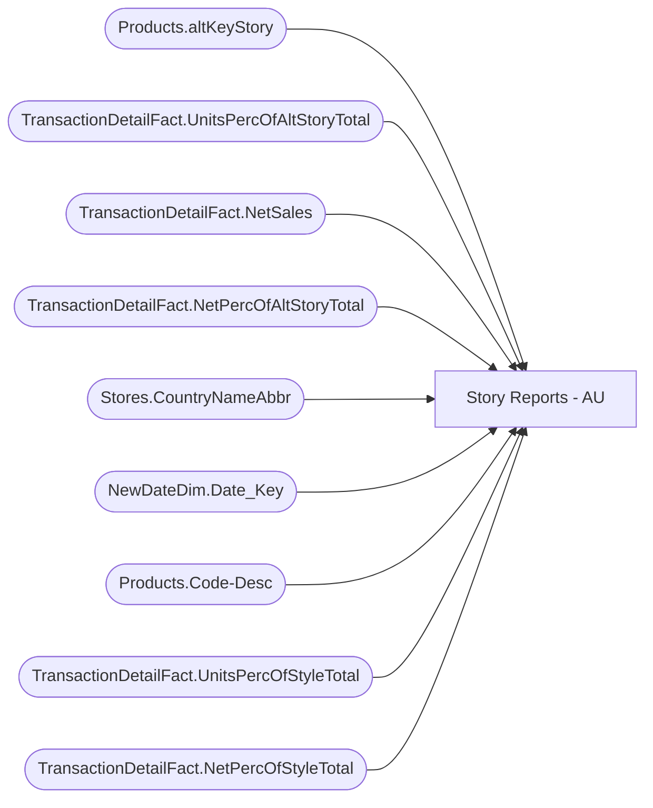

# Story Reports - AU

**Workspace:** Enterprise Analytics Dev  
**Report ID:** a669fd78-8b50-4f0a-8cf5-91ce2dc0ba6b  
**Dataset ID:** 0d354f73-5a32-4d1d-9be1-e2681297b656  
**Web URL:** https://app.powerbi.com/groups/109bd275-5f44-4366-b343-9b41b5cfb040/reports/a669fd78-8b50-4f0a-8cf5-91ce2dc0ba6b  
**Semantic Model:** [SM_AZAS_V2](../../SemanticModels/Enterprise Analytics Dev/SM_AZAS_V2.md)  

## Architecture Diagram

## Field Dependencies

| Referenced Field |
|---|
| Products.altKeyStory |
| TransactionDetailFact.UnitsPercOfAltStoryTotal |
| TransactionDetailFact.NetSales |
| TransactionDetailFact.NetPercOfAltStoryTotal |
| Stores.CountryNameAbbr |
| NewDateDim.Date_Key |
| Products.Code-Desc |
| TransactionDetailFact.UnitsPercOfStyleTotal |
| TransactionDetailFact.NetPercOfStyleTotal |

## Pages

| Page | Visuals |
|---|---|
| Units and Sales | 4 |
| Units | 4 |
| Sale | 4 |

## Visuals

### Units and Sales

| Visual | Type | Fields |
|---|---|---|
| 2ccea4f6d68ce12e4c55 | clusteredColumnChart | Products.altKeyStory, TransactionDetailFact.UnitsPercOfAltStoryTotal |
| c81dfe2eb4940beb0501 | clusteredColumnChart | Products.altKeyStory, TransactionDetailFact.NetSales, TransactionDetailFact.NetPercOfAltStoryTotal |
| 98a23450370094752c20 | slicer | Stores.CountryNameAbbr |
| ffcd9a59048a26263321 | slicer | NewDateDim.Date_Key |

### Units

| Visual | Type | Fields |
|---|---|---|
| 01a0812604858a0301dd | slicer | Stores.CountryNameAbbr |
| 62f3f3c0eb5090400207 | clusteredColumnChart | Products.altKeyStory, TransactionDetailFact.UnitsPercOfAltStoryTotal |
| 1ebbcad7ddd530d49028 | clusteredColumnChart | Products.Code-Desc, TransactionDetailFact.UnitsPercOfStyleTotal |
| c0c1f127ad2a496dd192 | slicer | NewDateDim.Date_Key |

### Sale

| Visual | Type | Fields |
|---|---|---|
| 1d90340e68e6b4657ba3 | slicer | Stores.CountryNameAbbr |
| 9d6c8b245b1246db541e | clusteredColumnChart | Products.Code-Desc, TransactionDetailFact.NetSales, TransactionDetailFact.NetPercOfStyleTotal |
| a6fd4817e11005a0c34b | clusteredColumnChart | Products.altKeyStory, TransactionDetailFact.NetSales, TransactionDetailFact.NetPercOfAltStoryTotal |
| d8794a49a97b47d710fa | slicer | NewDateDim.Date_Key |
