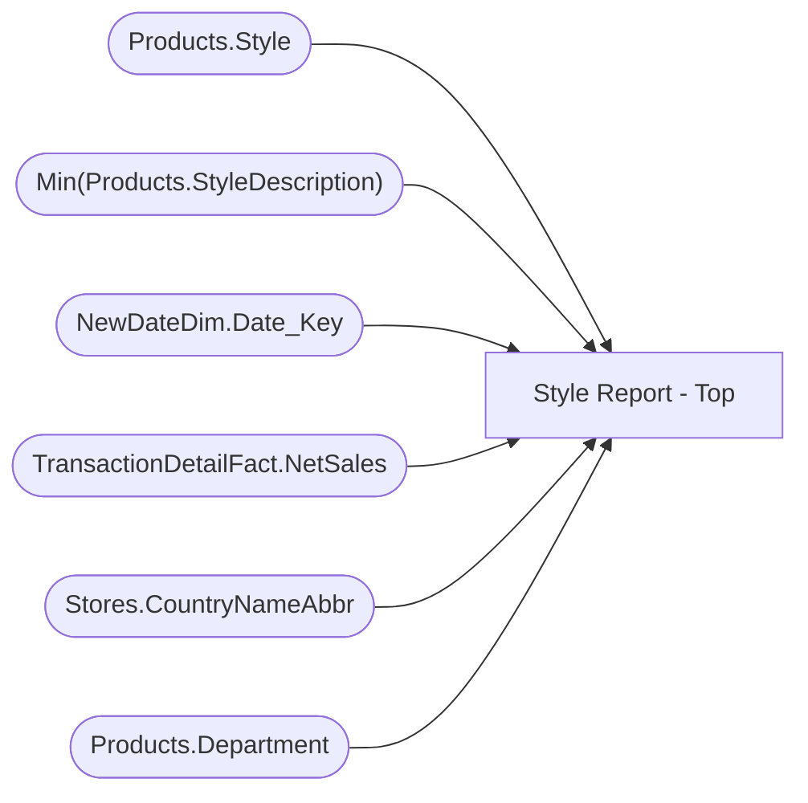

# Style Report - Top

**Workspace:** Enterprise Analytics Dev  
**Report ID:** 08f0de54-ccc4-42d6-af0e-2aec1bfba0ef  
**Dataset ID:** 0d354f73-5a32-4d1d-9be1-e2681297b656  
**Web URL:** https://app.powerbi.com/groups/109bd275-5f44-4366-b343-9b41b5cfb040/reports/08f0de54-ccc4-42d6-af0e-2aec1bfba0ef  
**Semantic Model:** [SM_AZAS_V2](../../SemanticModels/Enterprise Analytics Dev/SM_AZAS_V2.md)  

## Architecture Diagram

## Field Dependencies

| Referenced Field |
|---|
| Products.Style |
| Min(Products.StyleDescription) |
| NewDateDim.Date_Key |
| TransactionDetailFact.NetSales |
| Stores.CountryNameAbbr |
| Products.Department |

## Pages

| Page | Visuals |
|---|---|
| Page 1 | 5 |

## Visuals

### Page 1

| Visual | Type | Fields |
|---|---|---|
| ba4fb5ef5b5d9cb1d483 | pieChart | Products.Style, Min(Products.StyleDescription) |
| 2772691d04616d219231 | slicer | NewDateDim.Date_Key |
| 5acc569014e9b70040ae | pieChart | Products.Style, Min(Products.StyleDescription), TransactionDetailFact.NetSales |
| b2f9b0b38fe0b8572c6f | slicer | Stores.CountryNameAbbr |
| 446260c942d53719e407 | slicer | Products.Department |
