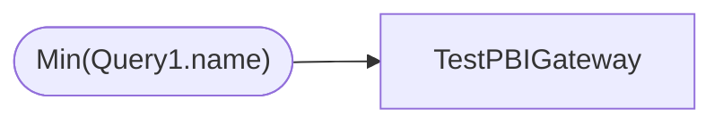

# TestPBIGateway

**Workspace:** Enterprise Analytics Dev  
**Report ID:** 19565e63-e3b4-4070-9596-0c80830292a4  
**Dataset ID:** 4c149c31-89dc-4ff9-9bd9-8e536186b383  
**Web URL:** https://app.powerbi.com/groups/109bd275-5f44-4366-b343-9b41b5cfb040/reports/19565e63-e3b4-4070-9596-0c80830292a4  
**Semantic Model:** [TestPBIGateway](../../SemanticModels/Enterprise Analytics Dev/TestPBIGateway.md)  

## Architecture Diagram

## Field Dependencies

| Referenced Field |
|---|
| Min(Query1.name) |

## Pages

| Page | Visuals |
|---|---|
| Page 1 | 1 |

## Visuals

### Page 1

| Visual | Type | Fields |
|---|---|---|
| 7a8821dc53221ca70acb | card | Min(Query1.name) |
