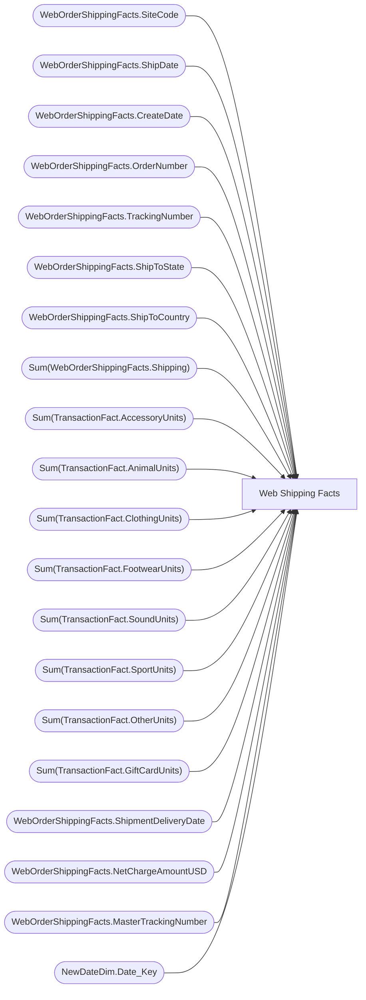

# Web Shipping Facts

**Workspace:** Enterprise Analytics Dev  
**Report ID:** dafb1def-d1f4-4b92-a203-27edf04498ad  
**Dataset ID:** 0d354f73-5a32-4d1d-9be1-e2681297b656  
**Web URL:** https://app.powerbi.com/groups/109bd275-5f44-4366-b343-9b41b5cfb040/reports/dafb1def-d1f4-4b92-a203-27edf04498ad  
**Semantic Model:** [SM_AZAS_V2](../../SemanticModels/Enterprise Analytics Dev/SM_AZAS_V2.md)  

## Architecture Diagram

## Field Dependencies

| Referenced Field |
|---|
| WebOrderShippingFacts.SiteCode |
| WebOrderShippingFacts.ShipDate |
| WebOrderShippingFacts.CreateDate |
| WebOrderShippingFacts.OrderNumber |
| WebOrderShippingFacts.TrackingNumber |
| WebOrderShippingFacts.ShipToState |
| WebOrderShippingFacts.ShipToCountry |
| Sum(WebOrderShippingFacts.Shipping) |
| Sum(TransactionFact.AccessoryUnits) |
| Sum(TransactionFact.AnimalUnits) |
| Sum(TransactionFact.ClothingUnits) |
| Sum(TransactionFact.FootwearUnits) |
| Sum(TransactionFact.SoundUnits) |
| Sum(TransactionFact.SportUnits) |
| Sum(TransactionFact.OtherUnits) |
| Sum(TransactionFact.GiftCardUnits) |
| WebOrderShippingFacts.ShipmentDeliveryDate |
| WebOrderShippingFacts.NetChargeAmountUSD |
| WebOrderShippingFacts.MasterTrackingNumber |
| NewDateDim.Date_Key |

## Pages

| Page | Visuals |
|---|---|
| Web Shipping Facts | 4 |
| Web Orders Shipped to Vermont | 2 |

## Visuals

### Web Shipping Facts

| Visual | Type | Fields |
|---|---|---|
| cb6b2e56c60286cd4ede | slicer | WebOrderShippingFacts.SiteCode |
| fc2b4b1ddc8e80411e98 | slicer | WebOrderShippingFacts.ShipDate |
| 5e4117c06d3349c640ec | slicer | WebOrderShippingFacts.CreateDate |
| 7dc9368ee07ca40844a0 | tableEx | WebOrderShippingFacts.CreateDate, WebOrderShippingFacts.ShipDate, WebOrderShippingFacts.SiteCode, WebOrderShippingFacts.OrderNumber, WebOrderShippingFacts.TrackingNumber, WebOrderShippingFacts.ShipToState, WebOrderShippingFacts.ShipToCountry, Sum(WebOrderShippingFacts.Shipping), Sum(TransactionFact.AccessoryUnits), Sum(TransactionFact.AnimalUnits), Sum(TransactionFact.ClothingUnits), Sum(TransactionFact.FootwearUnits), Sum(TransactionFact.SoundUnits), Sum(TransactionFact.SportUnits), Sum(TransactionFact.OtherUnits), Sum(TransactionFact.GiftCardUnits), WebOrderShippingFacts.ShipmentDeliveryDate, WebOrderShippingFacts.NetChargeAmountUSD, WebOrderShippingFacts.MasterTrackingNumber |

### Web Orders Shipped to Vermont

| Visual | Type | Fields |
|---|---|---|
| 883a64c763700e07e538 | slicer | NewDateDim.Date_Key |
| 933fc4e805468e5c0a4b | tableEx | WebOrderShippingFacts.CreateDate, WebOrderShippingFacts.ShipDate, WebOrderShippingFacts.SiteCode, WebOrderShippingFacts.OrderNumber, WebOrderShippingFacts.TrackingNumber, WebOrderShippingFacts.ShipToState, WebOrderShippingFacts.ShipToCountry, Sum(WebOrderShippingFacts.Shipping), Sum(TransactionFact.AccessoryUnits), Sum(TransactionFact.AnimalUnits), Sum(TransactionFact.ClothingUnits), Sum(TransactionFact.FootwearUnits), Sum(TransactionFact.SoundUnits), Sum(TransactionFact.SportUnits), Sum(TransactionFact.OtherUnits), Sum(TransactionFact.GiftCardUnits), WebOrderShippingFacts.ShipmentDeliveryDate, WebOrderShippingFacts.NetChargeAmountUSD, WebOrderShippingFacts.MasterTrackingNumber |
