# template new9-3

**Workspace:** Enterprise Analytics Dev  
**Report ID:** 64d88eea-ff96-4bf6-ae8d-475565fe8dc8  
**Dataset ID:** fba3b349-79e8-41c0-9703-c90e9ddeef23  
**Web URL:** https://app.powerbi.com/groups/109bd275-5f44-4366-b343-9b41b5cfb040/reports/64d88eea-ff96-4bf6-ae8d-475565fe8dc8  
**Semantic Model:** [Merchandise Aggregate Semantic Model](../../SemanticModels/Enterprise Analytics Dev/Merchandise Aggregate Semantic Model.md)  

## Architecture Diagram

```mermaid
flowchart LR
    REPORT["template new9-3"]
    d365LocationMapping_View_inventlocationid(["d365LocationMapping_View.inventlocationid"]) --> REPORT
    product_dim_le_style_code(["product_dim_le.style_code"]) --> REPORT
    date_dim_actual_date(["date_dim.actual_date"]) --> REPORT
    date_dim_actual_date_Variation_Date_Hierarchy_Year1(["date_dim.actual_date.Variation.Date Hierarchy.Year1"]) --> REPORT
    date_dim_actual_date_Variation_Date_Hierarchy_Year(["date_dim.actual_date.Variation.Date Hierarchy.Year"]) --> REPORT
    product_dim_le_department_code(["product_dim_le.department_code"]) --> REPORT
    product_dim_le_department(["product_dim_le.department"]) --> REPORT
    product_dim_le_style_desc(["product_dim_le.style_desc"]) --> REPORT
    productattributesummaryview_MSTAT(["productattributesummaryview.MSTAT"]) --> REPORT
    productattributesummaryview_KEYSTY(["productattributesummaryview.KEYSTY"]) --> REPORT
    WeeklySalesView_Net_Sales_Units__8_Week_s__ago_(["WeeklySalesView.Net Sales Units (8 Week(s) ago)"]) --> REPORT
    WeeklySalesView_Net_Sales_Units__7_Week_s__ago_(["WeeklySalesView.Net Sales Units (7 Week(s) ago)"]) --> REPORT
    WeeklySalesView_Net_Sales_Units__6_Week_s__ago_(["WeeklySalesView.Net Sales Units (6 Week(s) ago)"]) --> REPORT
    WeeklySalesView_Net_Sales_Units__5_Week_s__ago_(["WeeklySalesView.Net Sales Units (5 Week(s) ago)"]) --> REPORT
    WeeklySalesView_Net_Sales_Units__4_Week_s__ago_(["WeeklySalesView.Net Sales Units (4 Week(s) ago)"]) --> REPORT
    WeeklySalesView_Net_Sales_Units__3_Week_s__ago_(["WeeklySalesView.Net Sales Units (3 Week(s) ago)"]) --> REPORT
    WeeklySalesView_Net_Sales_Units__2_Week_s__ago_(["WeeklySalesView.Net Sales Units (2 Week(s) ago)"]) --> REPORT
    WeeklySalesView_Net_Sales_Units__1_Week_s__ago_(["WeeklySalesView.Net Sales Units (1 Week(s) ago)"]) --> REPORT
    WeeklySalesView_Net_Sales_Units__This_week_(["WeeklySalesView.Net Sales Units (This week)"]) --> REPORT
    WeeklySalesView_Net_Sales_Retail_TE__8_Week_s__ago_(["WeeklySalesView.Net Sales Retail TE (8 Week(s) ago)"]) --> REPORT
    WeeklySalesView_Net_Sales_Retail_TE__7_Week_s__ago_(["WeeklySalesView.Net Sales Retail TE (7 Week(s) ago)"]) --> REPORT
    WeeklySalesView_Net_Sales_Retail_TE__6_Week_s__ago_(["WeeklySalesView.Net Sales Retail TE (6 Week(s) ago)"]) --> REPORT
    WeeklySalesView_Net_Sales_Retail_TE__5_Week_s__ago_(["WeeklySalesView.Net Sales Retail TE (5 Week(s) ago)"]) --> REPORT
    WeeklySalesView_Net_Sales_Retail_TE__4_Week_s__ago_(["WeeklySalesView.Net Sales Retail TE (4 Week(s) ago)"]) --> REPORT
    WeeklySalesView_Net_Sales_Retail_TE__3_Week_s__ago_(["WeeklySalesView.Net Sales Retail TE (3 Week(s) ago)"]) --> REPORT
    WeeklySalesView_Net_Sales_Retail_TE__2_Week_s__ago_(["WeeklySalesView.Net Sales Retail TE (2 Week(s) ago)"]) --> REPORT
    WeeklySalesView_Net_Sales_Retail_TE__1_Week_s__ago_(["WeeklySalesView.Net Sales Retail TE (1 Week(s) ago)"]) --> REPORT
    WeeklySalesView_Net_Sales_Retail_TE__This_week_(["WeeklySalesView.Net Sales Retail TE (This week)"]) --> REPORT
    WeeklySalesView_Net_Sales_Units__01_(["WeeklySalesView.Net Sales Units (01)"]) --> REPORT
    WeeklySalesView_Net_Sales_Units__02_(["WeeklySalesView.Net Sales Units (02)"]) --> REPORT
    WeeklySalesView_Net_Sales_Units__03_(["WeeklySalesView.Net Sales Units (03)"]) --> REPORT
    WeeklySalesView_Net_Sales_Units__04_(["WeeklySalesView.Net Sales Units (04)"]) --> REPORT
    WeeklySalesView_Net_Sales_Units__05_(["WeeklySalesView.Net Sales Units (05)"]) --> REPORT
    WeeklySalesView_Net_Sales_Units__06_(["WeeklySalesView.Net Sales Units (06)"]) --> REPORT
    WeeklySalesView_Net_Sales_Units__07_(["WeeklySalesView.Net Sales Units (07)"]) --> REPORT
    WeeklySalesView_Net_Sales_Units__08_(["WeeklySalesView.Net Sales Units (08)"]) --> REPORT
    WeeklySalesView_Net_Sales_Units__09_(["WeeklySalesView.Net Sales Units (09)"]) --> REPORT
    WeeklySalesView_Net_Sales_Units__10_(["WeeklySalesView.Net Sales Units (10)"]) --> REPORT
    WeeklySalesView_Net_Sales_Units__11_(["WeeklySalesView.Net Sales Units (11)"]) --> REPORT
    WeeklySalesView_Net_Sales_Units__12_(["WeeklySalesView.Net Sales Units (12)"]) --> REPORT
    WeeklySalesView_Net_Sales_Units__13_(["WeeklySalesView.Net Sales Units (13)"]) --> REPORT
    WeeklySalesView_Net_Sales_Units__14_(["WeeklySalesView.Net Sales Units (14)"]) --> REPORT
    WeeklySalesView_Net_Sales_Units__15_(["WeeklySalesView.Net Sales Units (15)"]) --> REPORT
    WeeklySalesView_Net_Sales_Units__16_(["WeeklySalesView.Net Sales Units (16)"]) --> REPORT
    WeeklySalesView_Net_Sales_Units__17_(["WeeklySalesView.Net Sales Units (17)"]) --> REPORT
    WeeklySalesView_Net_Sales_Units__18_(["WeeklySalesView.Net Sales Units (18)"]) --> REPORT
    WeeklySalesView_Net_Sales_Units__19_(["WeeklySalesView.Net Sales Units (19)"]) --> REPORT
    WeeklySalesView_Net_Sales_Units__20_(["WeeklySalesView.Net Sales Units (20)"]) --> REPORT
    WeeklySalesView_Net_Sales_Units__21_(["WeeklySalesView.Net Sales Units (21)"]) --> REPORT
    WeeklySalesView_Net_Sales_Units__22_(["WeeklySalesView.Net Sales Units (22)"]) --> REPORT
    WeeklySalesView_Net_Sales_Units__23_(["WeeklySalesView.Net Sales Units (23)"]) --> REPORT
    WeeklySalesView_Net_Sales_Units__24_(["WeeklySalesView.Net Sales Units (24)"]) --> REPORT
    WeeklySalesView_Net_Sales_Units__25_(["WeeklySalesView.Net Sales Units (25)"]) --> REPORT
    WeeklySalesView_Net_Sales_Units__26_(["WeeklySalesView.Net Sales Units (26)"]) --> REPORT
    WeeklySalesView_Net_Sales_Units__27_(["WeeklySalesView.Net Sales Units (27)"]) --> REPORT
    WeeklySalesView_Net_Sales_Units__28_(["WeeklySalesView.Net Sales Units (28)"]) --> REPORT
    WeeklySalesView_Net_Sales_Units__29_(["WeeklySalesView.Net Sales Units (29)"]) --> REPORT
    WeeklySalesView_Net_Sales_Units__30_(["WeeklySalesView.Net Sales Units (30)"]) --> REPORT
    WeeklySalesView_Net_Sales_Units__31_(["WeeklySalesView.Net Sales Units (31)"]) --> REPORT
    WeeklySalesView_Net_Sales_Units__32_(["WeeklySalesView.Net Sales Units (32)"]) --> REPORT
    WeeklySalesView_Net_Sales_Units__33_(["WeeklySalesView.Net Sales Units (33)"]) --> REPORT
    WeeklySalesView_Net_Sales_Units__34_(["WeeklySalesView.Net Sales Units (34)"]) --> REPORT
    WeeklySalesView_Net_Sales_Units__35_(["WeeklySalesView.Net Sales Units (35)"]) --> REPORT
    WeeklySalesView_Net_Sales_Units__36_(["WeeklySalesView.Net Sales Units (36)"]) --> REPORT
    WeeklySalesView_Net_Sales_Units__37_(["WeeklySalesView.Net Sales Units (37)"]) --> REPORT
    WeeklySalesView_Net_Sales_Units__38_(["WeeklySalesView.Net Sales Units (38)"]) --> REPORT
    WeeklySalesView_Net_Sales_Units__39_(["WeeklySalesView.Net Sales Units (39)"]) --> REPORT
    WeeklySalesView_Net_Sales_Units__40_(["WeeklySalesView.Net Sales Units (40)"]) --> REPORT
    WeeklySalesView_Net_Sales_Units__41_(["WeeklySalesView.Net Sales Units (41)"]) --> REPORT
    WeeklySalesView_Net_Sales_Units__42_(["WeeklySalesView.Net Sales Units (42)"]) --> REPORT
    WeeklySalesView_Net_Sales_Units__43_(["WeeklySalesView.Net Sales Units (43)"]) --> REPORT
    WeeklySalesView_Net_Sales_Units__44_(["WeeklySalesView.Net Sales Units (44)"]) --> REPORT
    WeeklySalesView_Net_Sales_Units__45_(["WeeklySalesView.Net Sales Units (45)"]) --> REPORT
    WeeklySalesView_Net_Sales_Units__46_(["WeeklySalesView.Net Sales Units (46)"]) --> REPORT
    WeeklySalesView_Net_Sales_Units__47_(["WeeklySalesView.Net Sales Units (47)"]) --> REPORT
    WeeklySalesView_Net_Sales_Units__48_(["WeeklySalesView.Net Sales Units (48)"]) --> REPORT
    WeeklySalesView_Net_Sales_Units__49_(["WeeklySalesView.Net Sales Units (49)"]) --> REPORT
    WeeklySalesView_Net_Sales_Units__50_(["WeeklySalesView.Net Sales Units (50)"]) --> REPORT
    WeeklySalesView_Net_Sales_Units__51_(["WeeklySalesView.Net Sales Units (51)"]) --> REPORT
    WeeklySalesView_Net_Sales_Units__52_(["WeeklySalesView.Net Sales Units (52)"]) --> REPORT
    WeeklySalesView_Net_Sales_Units__53_(["WeeklySalesView.Net Sales Units (53)"]) --> REPORT
    WeeklySalesView_Net_Sales_Retail_TE__01_(["WeeklySalesView.Net Sales Retail TE (01)"]) --> REPORT
    WeeklySalesView_Net_Sales_Retail_TE__02_(["WeeklySalesView.Net Sales Retail TE (02)"]) --> REPORT
    WeeklySalesView_Net_Sales_Retail_TE__03_(["WeeklySalesView.Net Sales Retail TE (03)"]) --> REPORT
    WeeklySalesView_Net_Sales_Retail_TE__04_(["WeeklySalesView.Net Sales Retail TE (04)"]) --> REPORT
    WeeklySalesView_Net_Sales_Retail_TE__05_(["WeeklySalesView.Net Sales Retail TE (05)"]) --> REPORT
    WeeklySalesView_Net_Sales_Retail_TE__06_(["WeeklySalesView.Net Sales Retail TE (06)"]) --> REPORT
    WeeklySalesView_Net_Sales_Retail_TE__07_(["WeeklySalesView.Net Sales Retail TE (07)"]) --> REPORT
    WeeklySalesView_Net_Sales_Retail_TE__08_(["WeeklySalesView.Net Sales Retail TE (08)"]) --> REPORT
    WeeklySalesView_Net_Sales_Retail_TE__09_(["WeeklySalesView.Net Sales Retail TE (09)"]) --> REPORT
    WeeklySalesView_Net_Sales_Retail_TE__10_(["WeeklySalesView.Net Sales Retail TE (10)"]) --> REPORT
    WeeklySalesView_Net_Sales_Retail_TE__11_(["WeeklySalesView.Net Sales Retail TE (11)"]) --> REPORT
    WeeklySalesView_Net_Sales_Retail_TE__12_(["WeeklySalesView.Net Sales Retail TE (12)"]) --> REPORT
    WeeklySalesView_Net_Sales_Retail_TE__13_(["WeeklySalesView.Net Sales Retail TE (13)"]) --> REPORT
    WeeklySalesView_Net_Sales_Retail_TE__14_(["WeeklySalesView.Net Sales Retail TE (14)"]) --> REPORT
    WeeklySalesView_Net_Sales_Retail_TE__15_(["WeeklySalesView.Net Sales Retail TE (15)"]) --> REPORT
    WeeklySalesView_Net_Sales_Retail_TE__16_(["WeeklySalesView.Net Sales Retail TE (16)"]) --> REPORT
    WeeklySalesView_Net_Sales_Retail_TE__17_(["WeeklySalesView.Net Sales Retail TE (17)"]) --> REPORT
    WeeklySalesView_Net_Sales_Retail_TE__18_(["WeeklySalesView.Net Sales Retail TE (18)"]) --> REPORT
    WeeklySalesView_Net_Sales_Retail_TE__19_(["WeeklySalesView.Net Sales Retail TE (19)"]) --> REPORT
    WeeklySalesView_Net_Sales_Retail_TE__20_(["WeeklySalesView.Net Sales Retail TE (20)"]) --> REPORT
    WeeklySalesView_Net_Sales_Retail_TE__21_(["WeeklySalesView.Net Sales Retail TE (21)"]) --> REPORT
    WeeklySalesView_Net_Sales_Retail_TE__22_(["WeeklySalesView.Net Sales Retail TE (22)"]) --> REPORT
    WeeklySalesView_Net_Sales_Retail_TE__23_(["WeeklySalesView.Net Sales Retail TE (23)"]) --> REPORT
    WeeklySalesView_Net_Sales_Retail_TE__24_(["WeeklySalesView.Net Sales Retail TE (24)"]) --> REPORT
    WeeklySalesView_Net_Sales_Retail_TE__25_(["WeeklySalesView.Net Sales Retail TE (25)"]) --> REPORT
    WeeklySalesView_Net_Sales_Retail_TE__26_(["WeeklySalesView.Net Sales Retail TE (26)"]) --> REPORT
    WeeklySalesView_Net_Sales_Retail_TE__27_(["WeeklySalesView.Net Sales Retail TE (27)"]) --> REPORT
    WeeklySalesView_Net_Sales_Retail_TE__28_(["WeeklySalesView.Net Sales Retail TE (28)"]) --> REPORT
    WeeklySalesView_Net_Sales_Retail_TE__29_(["WeeklySalesView.Net Sales Retail TE (29)"]) --> REPORT
    WeeklySalesView_Net_Sales_Retail_TE__30_(["WeeklySalesView.Net Sales Retail TE (30)"]) --> REPORT
    WeeklySalesView_Net_Sales_Retail_TE__31_(["WeeklySalesView.Net Sales Retail TE (31)"]) --> REPORT
    WeeklySalesView_Net_Sales_Retail_TE__32_(["WeeklySalesView.Net Sales Retail TE (32)"]) --> REPORT
    WeeklySalesView_Net_Sales_Retail_TE__33_(["WeeklySalesView.Net Sales Retail TE (33)"]) --> REPORT
    WeeklySalesView_Net_Sales_Retail_TE__34_(["WeeklySalesView.Net Sales Retail TE (34)"]) --> REPORT
    WeeklySalesView_Net_Sales_Retail_TE__35_(["WeeklySalesView.Net Sales Retail TE (35)"]) --> REPORT
    WeeklySalesView_Net_Sales_Retail_TE__36_(["WeeklySalesView.Net Sales Retail TE (36)"]) --> REPORT
    WeeklySalesView_Net_Sales_Retail_TE__37_(["WeeklySalesView.Net Sales Retail TE (37)"]) --> REPORT
    WeeklySalesView_Net_Sales_Retail_TE__38_(["WeeklySalesView.Net Sales Retail TE (38)"]) --> REPORT
    WeeklySalesView_Net_Sales_Retail_TE__39_(["WeeklySalesView.Net Sales Retail TE (39)"]) --> REPORT
    WeeklySalesView_Net_Sales_Retail_TE__40_(["WeeklySalesView.Net Sales Retail TE (40)"]) --> REPORT
    WeeklySalesView_Net_Sales_Retail_TE__41_(["WeeklySalesView.Net Sales Retail TE (41)"]) --> REPORT
    WeeklySalesView_Net_Sales_Retail_TE__42_(["WeeklySalesView.Net Sales Retail TE (42)"]) --> REPORT
    WeeklySalesView_Net_Sales_Retail_TE__43_(["WeeklySalesView.Net Sales Retail TE (43)"]) --> REPORT
    WeeklySalesView_Net_Sales_Retail_TE__44_(["WeeklySalesView.Net Sales Retail TE (44)"]) --> REPORT
    WeeklySalesView_Net_Sales_Retail_TE__45_(["WeeklySalesView.Net Sales Retail TE (45)"]) --> REPORT
    WeeklySalesView_Net_Sales_Retail_TE__46_(["WeeklySalesView.Net Sales Retail TE (46)"]) --> REPORT
    WeeklySalesView_Net_Sales_Retail_TE__47_(["WeeklySalesView.Net Sales Retail TE (47)"]) --> REPORT
    WeeklySalesView_Net_Sales_Retail_TE__48_(["WeeklySalesView.Net Sales Retail TE (48)"]) --> REPORT
    WeeklySalesView_Net_Sales_Retail_TE__49_(["WeeklySalesView.Net Sales Retail TE (49)"]) --> REPORT
    WeeklySalesView_Net_Sales_Retail_TE__50_(["WeeklySalesView.Net Sales Retail TE (50)"]) --> REPORT
    WeeklySalesView_Net_Sales_Retail_TE__51_(["WeeklySalesView.Net Sales Retail TE (51)"]) --> REPORT
    WeeklySalesView_Net_Sales_Retail_TE__52_(["WeeklySalesView.Net Sales Retail TE (52)"]) --> REPORT
    WeeklySalesView_Net_Sales_Retail_TE__53_(["WeeklySalesView.Net Sales Retail TE (53)"]) --> REPORT
    WeeklySalesView_Net_Sales_Retail_TE__1_53_(["WeeklySalesView.Net Sales Retail TE (1-53)"]) --> REPORT
    Sum_weeklyOnHandView_on_hand_units_(["Sum(weeklyOnHandView.on_hand_units)"]) --> REPORT
    Sum_WeeklyOnOrderView_on_order_units_(["Sum(WeeklyOnOrderView.on_order_units)"]) --> REPORT
    WeeklySalesView_style_code(["WeeklySalesView.style_code"]) --> REPORT
```

## Field Dependencies

| Referenced Field |
|---|
| d365LocationMapping_View.inventlocationid |
| product_dim_le.style_code |
| date_dim.actual_date |
| date_dim.actual_date.Variation.Date Hierarchy.Year1 |
| date_dim.actual_date.Variation.Date Hierarchy.Year |
| product_dim_le.department_code |
| product_dim_le.department |
| product_dim_le.style_desc |
| productattributesummaryview.MSTAT |
| productattributesummaryview.KEYSTY |
| WeeklySalesView.Net Sales Units (8 Week(s) ago) |
| WeeklySalesView.Net Sales Units (7 Week(s) ago) |
| WeeklySalesView.Net Sales Units (6 Week(s) ago) |
| WeeklySalesView.Net Sales Units (5 Week(s) ago) |
| WeeklySalesView.Net Sales Units (4 Week(s) ago) |
| WeeklySalesView.Net Sales Units (3 Week(s) ago) |
| WeeklySalesView.Net Sales Units (2 Week(s) ago) |
| WeeklySalesView.Net Sales Units (1 Week(s) ago) |
| WeeklySalesView.Net Sales Units (This week) |
| WeeklySalesView.Net Sales Retail TE (8 Week(s) ago) |
| WeeklySalesView.Net Sales Retail TE (7 Week(s) ago) |
| WeeklySalesView.Net Sales Retail TE (6 Week(s) ago) |
| WeeklySalesView.Net Sales Retail TE (5 Week(s) ago) |
| WeeklySalesView.Net Sales Retail TE (4 Week(s) ago) |
| WeeklySalesView.Net Sales Retail TE (3 Week(s) ago) |
| WeeklySalesView.Net Sales Retail TE (2 Week(s) ago) |
| WeeklySalesView.Net Sales Retail TE (1 Week(s) ago) |
| WeeklySalesView.Net Sales Retail TE (This week) |
| WeeklySalesView.Net Sales Units (01) |
| WeeklySalesView.Net Sales Units (02) |
| WeeklySalesView.Net Sales Units (03) |
| WeeklySalesView.Net Sales Units (04) |
| WeeklySalesView.Net Sales Units (05) |
| WeeklySalesView.Net Sales Units (06) |
| WeeklySalesView.Net Sales Units (07) |
| WeeklySalesView.Net Sales Units (08) |
| WeeklySalesView.Net Sales Units (09) |
| WeeklySalesView.Net Sales Units (10) |
| WeeklySalesView.Net Sales Units (11) |
| WeeklySalesView.Net Sales Units (12) |
| WeeklySalesView.Net Sales Units (13) |
| WeeklySalesView.Net Sales Units (14) |
| WeeklySalesView.Net Sales Units (15) |
| WeeklySalesView.Net Sales Units (16) |
| WeeklySalesView.Net Sales Units (17) |
| WeeklySalesView.Net Sales Units (18) |
| WeeklySalesView.Net Sales Units (19) |
| WeeklySalesView.Net Sales Units (20) |
| WeeklySalesView.Net Sales Units (21) |
| WeeklySalesView.Net Sales Units (22) |
| WeeklySalesView.Net Sales Units (23) |
| WeeklySalesView.Net Sales Units (24) |
| WeeklySalesView.Net Sales Units (25) |
| WeeklySalesView.Net Sales Units (26) |
| WeeklySalesView.Net Sales Units (27) |
| WeeklySalesView.Net Sales Units (28) |
| WeeklySalesView.Net Sales Units (29) |
| WeeklySalesView.Net Sales Units (30) |
| WeeklySalesView.Net Sales Units (31) |
| WeeklySalesView.Net Sales Units (32) |
| WeeklySalesView.Net Sales Units (33) |
| WeeklySalesView.Net Sales Units (34) |
| WeeklySalesView.Net Sales Units (35) |
| WeeklySalesView.Net Sales Units (36) |
| WeeklySalesView.Net Sales Units (37) |
| WeeklySalesView.Net Sales Units (38) |
| WeeklySalesView.Net Sales Units (39) |
| WeeklySalesView.Net Sales Units (40) |
| WeeklySalesView.Net Sales Units (41) |
| WeeklySalesView.Net Sales Units (42) |
| WeeklySalesView.Net Sales Units (43) |
| WeeklySalesView.Net Sales Units (44) |
| WeeklySalesView.Net Sales Units (45) |
| WeeklySalesView.Net Sales Units (46) |
| WeeklySalesView.Net Sales Units (47) |
| WeeklySalesView.Net Sales Units (48) |
| WeeklySalesView.Net Sales Units (49) |
| WeeklySalesView.Net Sales Units (50) |
| WeeklySalesView.Net Sales Units (51) |
| WeeklySalesView.Net Sales Units (52) |
| WeeklySalesView.Net Sales Units (53) |
| WeeklySalesView.Net Sales Retail TE (01) |
| WeeklySalesView.Net Sales Retail TE (02) |
| WeeklySalesView.Net Sales Retail TE (03) |
| WeeklySalesView.Net Sales Retail TE (04) |
| WeeklySalesView.Net Sales Retail TE (05) |
| WeeklySalesView.Net Sales Retail TE (06) |
| WeeklySalesView.Net Sales Retail TE (07) |
| WeeklySalesView.Net Sales Retail TE (08) |
| WeeklySalesView.Net Sales Retail TE (09) |
| WeeklySalesView.Net Sales Retail TE (10) |
| WeeklySalesView.Net Sales Retail TE (11) |
| WeeklySalesView.Net Sales Retail TE (12) |
| WeeklySalesView.Net Sales Retail TE (13) |
| WeeklySalesView.Net Sales Retail TE (14) |
| WeeklySalesView.Net Sales Retail TE (15) |
| WeeklySalesView.Net Sales Retail TE (16) |
| WeeklySalesView.Net Sales Retail TE (17) |
| WeeklySalesView.Net Sales Retail TE (18) |
| WeeklySalesView.Net Sales Retail TE (19) |
| WeeklySalesView.Net Sales Retail TE (20) |
| WeeklySalesView.Net Sales Retail TE (21) |
| WeeklySalesView.Net Sales Retail TE (22) |
| WeeklySalesView.Net Sales Retail TE (23) |
| WeeklySalesView.Net Sales Retail TE (24) |
| WeeklySalesView.Net Sales Retail TE (25) |
| WeeklySalesView.Net Sales Retail TE (26) |
| WeeklySalesView.Net Sales Retail TE (27) |
| WeeklySalesView.Net Sales Retail TE (28) |
| WeeklySalesView.Net Sales Retail TE (29) |
| WeeklySalesView.Net Sales Retail TE (30) |
| WeeklySalesView.Net Sales Retail TE (31) |
| WeeklySalesView.Net Sales Retail TE (32) |
| WeeklySalesView.Net Sales Retail TE (33) |
| WeeklySalesView.Net Sales Retail TE (34) |
| WeeklySalesView.Net Sales Retail TE (35) |
| WeeklySalesView.Net Sales Retail TE (36) |
| WeeklySalesView.Net Sales Retail TE (37) |
| WeeklySalesView.Net Sales Retail TE (38) |
| WeeklySalesView.Net Sales Retail TE (39) |
| WeeklySalesView.Net Sales Retail TE (40) |
| WeeklySalesView.Net Sales Retail TE (41) |
| WeeklySalesView.Net Sales Retail TE (42) |
| WeeklySalesView.Net Sales Retail TE (43) |
| WeeklySalesView.Net Sales Retail TE (44) |
| WeeklySalesView.Net Sales Retail TE (45) |
| WeeklySalesView.Net Sales Retail TE (46) |
| WeeklySalesView.Net Sales Retail TE (47) |
| WeeklySalesView.Net Sales Retail TE (48) |
| WeeklySalesView.Net Sales Retail TE (49) |
| WeeklySalesView.Net Sales Retail TE (50) |
| WeeklySalesView.Net Sales Retail TE (51) |
| WeeklySalesView.Net Sales Retail TE (52) |
| WeeklySalesView.Net Sales Retail TE (53) |
| WeeklySalesView.Net Sales Retail TE (1-53) |
| Sum(weeklyOnHandView.on_hand_units) |
| Sum(WeeklyOnOrderView.on_order_units) |
| WeeklySalesView.style_code |

## Pages

| Page | Visuals |
|---|---|
| Key Story - Current Year | 21 |
| Key Story - LY | 21 |

## Visuals

### Key Story - Current Year

| Visual | Type | Fields |
|---|---|---|
| 1af1168d3ad076560a7a | unknown |  |
| 71b4d7bf2bed5bd69689 | textbox |  |
| 223ef3f44390477cb511 | textbox |  |
| 7c3f9190890068c06d56 | image |  |
| 67dc31eb8bcc8ba13b68 | textbox |  |
| 832eb7cadc69ce1e993e | actionButton |  |
| 7888c786d0bca1993a98 | unknown |  |
| eb1568801305b37d8b30 | textSlicer | d365LocationMapping_View.inventlocationid |
| 04f37e017196c1102139 | bookmarkNavigator |  |
| 425a06c44202662eecab | textFilter25A4896A83E0487089E2B90C9AE57C8A | product_dim_le.style_code |
| 32ccae6d50bab71729e0 | unknown |  |
| cc1832b9e1686d4cd86a | slicer | date_dim.actual_date |
| 466949d9b1bac925d273 | slicer | date_dim.actual_date.Variation.Date Hierarchy.Year1 |
| 49eacaeb50eb091bd832 | slicer | date_dim.actual_date.Variation.Date Hierarchy.Year |
| 121d10ac07e9d07e9a98 | bookmarkNavigator |  |
| 47bb083b0186bc2ba2e6 | unknown |  |
| 7925f0e8796a4089a7e6 | textSlicer | product_dim_le.style_code |
| c96d269d56162ad0d170 | slicer | product_dim_le.department_code |
| 2f740b555aebbb25b671 | textbox |  |
| e207c6e58aa9bcbcd88b | actionButton |  |
| d4fbeebb2111230d49df | tableEx | product_dim_le.style_code, product_dim_le.department, product_dim_le.style_desc, productattributesummaryview.MSTAT, productattributesummaryview.KEYSTY, WeeklySalesView.Net Sales Units (8 Week(s) ago), WeeklySalesView.Net Sales Units (7 Week(s) ago), WeeklySalesView.Net Sales Units (6 Week(s) ago), WeeklySalesView.Net Sales Units (5 Week(s) ago), WeeklySalesView.Net Sales Units (4 Week(s) ago), WeeklySalesView.Net Sales Units (3 Week(s) ago), WeeklySalesView.Net Sales Units (2 Week(s) ago), WeeklySalesView.Net Sales Units (1 Week(s) ago), WeeklySalesView.Net Sales Units (This week), WeeklySalesView.Net Sales Retail TE (8 Week(s) ago), WeeklySalesView.Net Sales Retail TE (7 Week(s) ago), WeeklySalesView.Net Sales Retail TE (6 Week(s) ago), WeeklySalesView.Net Sales Retail TE (5 Week(s) ago), WeeklySalesView.Net Sales Retail TE (4 Week(s) ago), WeeklySalesView.Net Sales Retail TE (3 Week(s) ago), WeeklySalesView.Net Sales Retail TE (2 Week(s) ago), WeeklySalesView.Net Sales Retail TE (1 Week(s) ago), WeeklySalesView.Net Sales Retail TE (This week), WeeklySalesView.Net Sales Units (01), WeeklySalesView.Net Sales Units (02), WeeklySalesView.Net Sales Units (03), WeeklySalesView.Net Sales Units (04), WeeklySalesView.Net Sales Units (05), WeeklySalesView.Net Sales Units (06), WeeklySalesView.Net Sales Units (07), WeeklySalesView.Net Sales Units (08), WeeklySalesView.Net Sales Units (09), WeeklySalesView.Net Sales Units (10), WeeklySalesView.Net Sales Units (11), WeeklySalesView.Net Sales Units (12), WeeklySalesView.Net Sales Units (13), WeeklySalesView.Net Sales Units (14), WeeklySalesView.Net Sales Units (15), WeeklySalesView.Net Sales Units (16), WeeklySalesView.Net Sales Units (17), WeeklySalesView.Net Sales Units (18), WeeklySalesView.Net Sales Units (19), WeeklySalesView.Net Sales Units (20), WeeklySalesView.Net Sales Units (21), WeeklySalesView.Net Sales Units (22), WeeklySalesView.Net Sales Units (23), WeeklySalesView.Net Sales Units (24), WeeklySalesView.Net Sales Units (25), WeeklySalesView.Net Sales Units (26), WeeklySalesView.Net Sales Units (27), WeeklySalesView.Net Sales Units (28), WeeklySalesView.Net Sales Units (29), WeeklySalesView.Net Sales Units (30), WeeklySalesView.Net Sales Units (31), WeeklySalesView.Net Sales Units (32), WeeklySalesView.Net Sales Units (33), WeeklySalesView.Net Sales Units (34), WeeklySalesView.Net Sales Units (35), WeeklySalesView.Net Sales Units (36), WeeklySalesView.Net Sales Units (37), WeeklySalesView.Net Sales Units (38), WeeklySalesView.Net Sales Units (39), WeeklySalesView.Net Sales Units (40), WeeklySalesView.Net Sales Units (41), WeeklySalesView.Net Sales Units (42), WeeklySalesView.Net Sales Units (43), WeeklySalesView.Net Sales Units (44), WeeklySalesView.Net Sales Units (45), WeeklySalesView.Net Sales Units (46), WeeklySalesView.Net Sales Units (47), WeeklySalesView.Net Sales Units (48), WeeklySalesView.Net Sales Units (49), WeeklySalesView.Net Sales Units (50), WeeklySalesView.Net Sales Units (51), WeeklySalesView.Net Sales Units (52), WeeklySalesView.Net Sales Units (53), WeeklySalesView.Net Sales Retail TE (01), WeeklySalesView.Net Sales Retail TE (02), WeeklySalesView.Net Sales Retail TE (03), WeeklySalesView.Net Sales Retail TE (04), WeeklySalesView.Net Sales Retail TE (05), WeeklySalesView.Net Sales Retail TE (06), WeeklySalesView.Net Sales Retail TE (07), WeeklySalesView.Net Sales Retail TE (08), WeeklySalesView.Net Sales Retail TE (09), WeeklySalesView.Net Sales Retail TE (10), WeeklySalesView.Net Sales Retail TE (11), WeeklySalesView.Net Sales Retail TE (12), WeeklySalesView.Net Sales Retail TE (13), WeeklySalesView.Net Sales Retail TE (14), WeeklySalesView.Net Sales Retail TE (15), WeeklySalesView.Net Sales Retail TE (16), WeeklySalesView.Net Sales Retail TE (17), WeeklySalesView.Net Sales Retail TE (18), WeeklySalesView.Net Sales Retail TE (19), WeeklySalesView.Net Sales Retail TE (20), WeeklySalesView.Net Sales Retail TE (21), WeeklySalesView.Net Sales Retail TE (22), WeeklySalesView.Net Sales Retail TE (23), WeeklySalesView.Net Sales Retail TE (24), WeeklySalesView.Net Sales Retail TE (25), WeeklySalesView.Net Sales Retail TE (26), WeeklySalesView.Net Sales Retail TE (27), WeeklySalesView.Net Sales Retail TE (28), WeeklySalesView.Net Sales Retail TE (29), WeeklySalesView.Net Sales Retail TE (30), WeeklySalesView.Net Sales Retail TE (31), WeeklySalesView.Net Sales Retail TE (32), WeeklySalesView.Net Sales Retail TE (33), WeeklySalesView.Net Sales Retail TE (34), WeeklySalesView.Net Sales Retail TE (35), WeeklySalesView.Net Sales Retail TE (36), WeeklySalesView.Net Sales Retail TE (37), WeeklySalesView.Net Sales Retail TE (38), WeeklySalesView.Net Sales Retail TE (39), WeeklySalesView.Net Sales Retail TE (40), WeeklySalesView.Net Sales Retail TE (41), WeeklySalesView.Net Sales Retail TE (42), WeeklySalesView.Net Sales Retail TE (43), WeeklySalesView.Net Sales Retail TE (44), WeeklySalesView.Net Sales Retail TE (45), WeeklySalesView.Net Sales Retail TE (46), WeeklySalesView.Net Sales Retail TE (47), WeeklySalesView.Net Sales Retail TE (48), WeeklySalesView.Net Sales Retail TE (49), WeeklySalesView.Net Sales Retail TE (50), WeeklySalesView.Net Sales Retail TE (51), WeeklySalesView.Net Sales Retail TE (52), WeeklySalesView.Net Sales Retail TE (53), WeeklySalesView.Net Sales Retail TE (1-53), Sum(weeklyOnHandView.on_hand_units), Sum(WeeklyOnOrderView.on_order_units) |

### Key Story - LY

| Visual | Type | Fields |
|---|---|---|
| 0b4140222c5f6ce0edbe | unknown |  |
| f920f4a3989b72fd51af | textbox |  |
| 0bcd43cda8b8c9272764 | textbox |  |
| 97f4659a5a12bc988c51 | image |  |
| 9ea736d49b75db93980e | textbox |  |
| ec739d70b14b7c06805a | actionButton |  |
| 44b856414f1a82fa1972 | unknown |  |
| d986b5ee6dd8555a4031 | textSlicer | d365LocationMapping_View.inventlocationid |
| 122ea31d98d5e46b728a | bookmarkNavigator |  |
| 97f4637b9433dd67029c | textFilter25A4896A83E0487089E2B90C9AE57C8A | productattributesummaryview.KEYSTY |
| ebf4a2dc4872072b777f | unknown |  |
| 9a7956cae86f44783ec2 | slicer | date_dim.actual_date |
| cc9c621b0f8156219228 | slicer | date_dim.actual_date.Variation.Date Hierarchy.Year1 |
| 4df0d921ab0b5d077f2c | slicer | date_dim.actual_date.Variation.Date Hierarchy.Year1 |
| cca8d761cff72ee6b8d5 | bookmarkNavigator |  |
| 826e14c9840c3793285e | unknown |  |
| 2c050ec017a6225d6f41 | textSlicer | product_dim_le.style_code |
| 0990f82a5dbf1a44dadb | slicer | product_dim_le.department_code |
| 6f0031da695b744bd74a | textbox |  |
| 0b2093608127704ad689 | actionButton |  |
| 03a1dfdf4e12226208d9 | tableEx | productattributesummaryview.KEYSTY, WeeklySalesView.style_code, WeeklySalesView.Net Sales Retail TE (01), WeeklySalesView.Net Sales Retail TE (02), WeeklySalesView.Net Sales Retail TE (03), WeeklySalesView.Net Sales Retail TE (04), WeeklySalesView.Net Sales Retail TE (05), WeeklySalesView.Net Sales Retail TE (06), WeeklySalesView.Net Sales Retail TE (07), WeeklySalesView.Net Sales Retail TE (08), WeeklySalesView.Net Sales Retail TE (09), WeeklySalesView.Net Sales Retail TE (10), WeeklySalesView.Net Sales Retail TE (11), WeeklySalesView.Net Sales Retail TE (12), WeeklySalesView.Net Sales Retail TE (13), WeeklySalesView.Net Sales Retail TE (14), WeeklySalesView.Net Sales Retail TE (15), WeeklySalesView.Net Sales Retail TE (16), WeeklySalesView.Net Sales Retail TE (17), WeeklySalesView.Net Sales Retail TE (18), WeeklySalesView.Net Sales Retail TE (19), WeeklySalesView.Net Sales Retail TE (20), WeeklySalesView.Net Sales Retail TE (21), WeeklySalesView.Net Sales Retail TE (22), WeeklySalesView.Net Sales Retail TE (23), WeeklySalesView.Net Sales Retail TE (24), WeeklySalesView.Net Sales Retail TE (25), WeeklySalesView.Net Sales Retail TE (26), WeeklySalesView.Net Sales Retail TE (27), WeeklySalesView.Net Sales Retail TE (28), WeeklySalesView.Net Sales Retail TE (29), WeeklySalesView.Net Sales Retail TE (30), WeeklySalesView.Net Sales Retail TE (31), WeeklySalesView.Net Sales Retail TE (32), WeeklySalesView.Net Sales Retail TE (33), WeeklySalesView.Net Sales Retail TE (34), WeeklySalesView.Net Sales Retail TE (35), WeeklySalesView.Net Sales Retail TE (36), WeeklySalesView.Net Sales Retail TE (37), WeeklySalesView.Net Sales Retail TE (38), WeeklySalesView.Net Sales Retail TE (39), WeeklySalesView.Net Sales Retail TE (40), WeeklySalesView.Net Sales Retail TE (41), WeeklySalesView.Net Sales Retail TE (42), WeeklySalesView.Net Sales Retail TE (43), WeeklySalesView.Net Sales Retail TE (44), WeeklySalesView.Net Sales Retail TE (45), WeeklySalesView.Net Sales Retail TE (46), WeeklySalesView.Net Sales Retail TE (47), WeeklySalesView.Net Sales Retail TE (48), WeeklySalesView.Net Sales Retail TE (49), WeeklySalesView.Net Sales Retail TE (50), WeeklySalesView.Net Sales Retail TE (51), WeeklySalesView.Net Sales Retail TE (52), WeeklySalesView.Net Sales Retail TE (53) |
