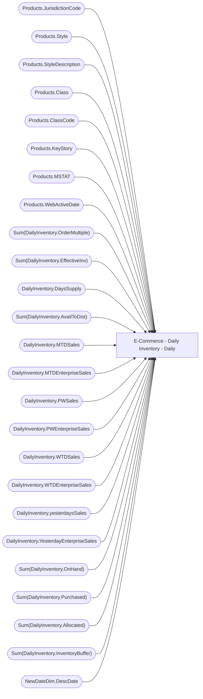

# E-Commerce - Daily Inventory - Daily

**Workspace:** Enterprise Analytics Prod  
**Report ID:** 290f024b-33e2-4769-9508-eefd33a2f702  
**Dataset ID:** 45a1a956-440b-4517-9958-da0b9e2f26a6  
**Web URL:** https://app.powerbi.com/groups/ccdd9d66-24e9-48c6-a8d0-b71a2f03dff1/reports/290f024b-33e2-4769-9508-eefd33a2f702  

## Architecture Diagram

## Field Dependencies

| Referenced Field |
|---|
| Products.JurisdictionCode |
| Products.Style |
| Products.StyleDescription |
| Products.Class |
| Products.ClassCode |
| Products.KeyStory |
| Products.MSTAT |
| Products.WebActiveDate |
| Sum(DailyInventory.OrderMultiple) |
| Sum(DailyInventory.EffectiveInv) |
| DailyInventory.DaysSupply |
| Sum(DailyInventory.AvailToDist) |
| DailyInventory.MTDSales |
| DailyInventory.MTDEnterpriseSales |
| DailyInventory.PWSales |
| DailyInventory.PWEnterpriseSales |
| DailyInventory.WTDSales |
| DailyInventory.WTDEnterpriseSales |
| DailyInventory.yesterdaysSales |
| DailyInventory.YesterdayEnterpriseSales |
| Sum(DailyInventory.OnHand) |
| Sum(DailyInventory.Purchased) |
| Sum(DailyInventory.Allocated) |
| Sum(DailyInventory.InventoryBuffer) |
| NewDateDim.DescDate |

## Pages

| Page | Visuals |
|---|---|
| Page 1 | 4 |

## Visuals

### Page 1

| Visual | Type | Fields |
|---|---|---|
| 6bc62b3124ea3cd4b9da | textbox |  |
| cffc7216258c282c7cbc | basicShape |  |
| 976997f5b1dcca9c8b1b | tableEx | Products.JurisdictionCode, Products.Style, Products.StyleDescription, Products.Class, Products.ClassCode, Products.KeyStory, Products.MSTAT, Products.WebActiveDate, Sum(DailyInventory.OrderMultiple), Sum(DailyInventory.EffectiveInv), DailyInventory.DaysSupply, Sum(DailyInventory.AvailToDist), DailyInventory.MTDSales, DailyInventory.MTDEnterpriseSales, DailyInventory.PWSales, DailyInventory.PWEnterpriseSales, DailyInventory.WTDSales, DailyInventory.WTDEnterpriseSales, DailyInventory.yesterdaysSales, DailyInventory.YesterdayEnterpriseSales, Sum(DailyInventory.OnHand), Sum(DailyInventory.Purchased), Sum(DailyInventory.Allocated), Sum(DailyInventory.InventoryBuffer) |
| 1f4faf530da3f7e76d5a | slicer | NewDateDim.DescDate |
