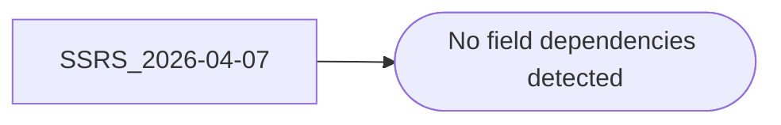

# SSRS_2026-04-07

**Workspace:** Enterprise Analytics Prod  
**Report ID:** a3c5a41d-ada0-4775-b94f-9c7fc4eda0d0  
**Dataset ID:** 8137637b-eaf4-410a-b537-75d99a80d90b  
**Web URL:** https://app.powerbi.com/groups/ccdd9d66-24e9-48c6-a8d0-b71a2f03dff1/reports/a3c5a41d-ada0-4775-b94f-9c7fc4eda0d0  
**Semantic Model:** [Model_PapaMart_Hybrid_SSRS2](../../SemanticModels/Enterprise Analytics Prod/Model_PapaMart_Hybrid_SSRS2.md)  

## Architecture Diagram

## Field Dependencies

_No field dependencies detected._

## Pages

| Page | Visuals |
|---|---|
| Page 1 | 0 |

## Visuals

### Page 1

_No visuals detected._
