# Blackline Deposit Report

**Workspace:** Enterprise Analytics QA  
**Report ID:** 180e8e62-dbfd-4f6b-a296-7ea053d1e8fb  
**Dataset ID:** 4a998365-013a-45f6-8e8d-7d5b7881b943  
**Web URL:** https://app.powerbi.com/groups/00856575-de9c-435b-ad8d-2ac43b338e3d/reports/180e8e62-dbfd-4f6b-a296-7ea053d1e8fb  
**Semantic Model:** [Sales Audit Data Model v7](../../SemanticModels/Enterprise Analytics QA/Sales Audit Data Model v7.md)  

## Architecture Diagram

```mermaid
flowchart LR
    REPORT["Blackline Deposit Report"]
    Locations__Store_MDM__Active(["Locations (Store MDM).Active"]) --> REPORT
    Locations__Store_MDM__Country(["Locations (Store MDM).Country"]) --> REPORT
    Locations__Store_MDM__Location_Line(["Locations (Store MDM).Location Line"]) --> REPORT
    Locations__Store_MDM__Country_name(["Locations (Store MDM).Country name"]) --> REPORT
    Locations__Store_MDM__State_Province_name(["Locations (Store MDM).State/Province name"]) --> REPORT
    Locations__Store_MDM__City(["Locations (Store MDM).City"]) --> REPORT
    Calendar_Actual_Date(["Calendar.Actual Date"]) --> REPORT
    Calendar_Fiscal_Year__Header_(["Calendar.Fiscal Year (Header)"]) --> REPORT
    Calendar_Fiscal_Quarter__Header_(["Calendar.Fiscal Quarter (Header)"]) --> REPORT
    Calendar_Fiscal_Month__Header_(["Calendar.Fiscal Month (Header)"]) --> REPORT
    Calendar_Fiscal_Week__Header_(["Calendar.Fiscal Week (Header)"]) --> REPORT
    Calendar_Calendar_Year__Header_(["Calendar.Calendar Year (Header)"]) --> REPORT
    Calendar_Calendar_Quarter__Header_(["Calendar.Calendar Quarter (Header)"]) --> REPORT
    Calendar_Calendar_Month__Header_(["Calendar.Calendar Month (Header)"]) --> REPORT
    Calendar_Calendar_Week__Header_(["Calendar.Calendar Week (Header)"]) --> REPORT
    Products__PLM__Department(["Products (PLM).Department"]) --> REPORT
    Products__PLM__Subclass(["Products (PLM).Subclass"]) --> REPORT
    Products__PLM__Class(["Products (PLM).Class"]) --> REPORT
    Products__PLM__Key_Story(["Products (PLM).Key Story"]) --> REPORT
    Products__PLM__Licensed_Collection(["Products (PLM).Licensed Collection"]) --> REPORT
    Products__PLM__Item_Line(["Products (PLM).Item Line"]) --> REPORT
    Retail_Lines__JumpMind__Item_Type(["Retail Lines (JumpMind).Item Type"]) --> REPORT
    Retail_Lines__JumpMind__Line_Item_Type(["Retail Lines (JumpMind).Line Item Type"]) --> REPORT
    Transactions__JumpMind__Associate_Work_Group(["Transactions (JumpMind).Associate Work Group"]) --> REPORT
    Transactions__JumpMind__Business_Unit_Id(["Transactions (JumpMind).Business Unit Id"]) --> REPORT
    Measure_Table_Cash__Deposit_(["Measure Table.Cash (Deposit)"]) --> REPORT
    Measure_Table_Check__Deposit_(["Measure Table.Check (Deposit)"]) --> REPORT
    Measure_Table_Cash_Deposit_Expected(["Measure Table.Cash Deposit Expected"]) --> REPORT
    Measure_Table_Total_Register__Over__Short(["Measure Table.Total Register (Over)/Short"]) --> REPORT
    Measure_Table_Bank__Deposit_(["Measure Table.Bank (Deposit)"]) --> REPORT
    Measure_Table_FBR__Over__Short(["Measure Table.FBR (Over)/Short"]) --> REPORT
    Measure_Table_Float_Variance__Null_(["Measure Table.Float Variance (Null)"]) --> REPORT
    Measure_Table_Foreign_Currency__Null_(["Measure Table.Foreign Currency (Null)"]) --> REPORT
    Measure_Table_Exchange_Amount__Null_(["Measure Table.Exchange Amount (Null)"]) --> REPORT
    Measure_Table_Foreign_Total__Null_(["Measure Table.Foreign Total (Null)"]) --> REPORT
    Measure_Table_GL_Amount_Expected(["Measure Table.GL Amount Expected"]) --> REPORT
    Measure_Table_Travelers_Checks__Null_(["Measure Table.Travelers Checks (Null)"]) --> REPORT
    Measure_Table_Mall_Gift_Cards__Null_(["Measure Table.Mall Gift Cards (Null)"]) --> REPORT
    Measure_Table_Total_Register_Counts__Null_(["Measure Table.Total Register Counts (Null)"]) --> REPORT
```

## Field Dependencies

| Referenced Field |
|---|
| Locations (Store MDM).Active |
| Locations (Store MDM).Country |
| Locations (Store MDM).Location Line |
| Locations (Store MDM).Country name |
| Locations (Store MDM).State/Province name |
| Locations (Store MDM).City |
| Calendar.Actual Date |
| Calendar.Fiscal Year (Header) |
| Calendar.Fiscal Quarter (Header) |
| Calendar.Fiscal Month (Header) |
| Calendar.Fiscal Week (Header) |
| Calendar.Calendar Year (Header) |
| Calendar.Calendar Quarter (Header) |
| Calendar.Calendar Month (Header) |
| Calendar.Calendar Week (Header) |
| Products (PLM).Department |
| Products (PLM).Subclass |
| Products (PLM).Class |
| Products (PLM).Key Story |
| Products (PLM).Licensed Collection |
| Products (PLM).Item Line |
| Retail Lines (JumpMind).Item Type |
| Retail Lines (JumpMind).Line Item Type |
| Transactions (JumpMind).Associate Work Group |
| Transactions (JumpMind).Business Unit Id |
| Measure Table.Cash (Deposit) |
| Measure Table.Check (Deposit) |
| Measure Table.Cash Deposit Expected |
| Measure Table.Total Register (Over)/Short |
| Measure Table.Bank (Deposit) |
| Measure Table.FBR (Over)/Short |
| Measure Table.Float Variance (Null) |
| Measure Table.Foreign Currency (Null) |
| Measure Table.Exchange Amount (Null) |
| Measure Table.Foreign Total (Null) |
| Measure Table.GL Amount Expected |
| Measure Table.Travelers Checks (Null) |
| Measure Table.Mall Gift Cards (Null) |
| Measure Table.Total Register Counts (Null) |

## Pages

| Page | Visuals |
|---|---|
| SmartLook Report | 33 |

## Visuals

### SmartLook Report

| Visual | Type | Fields |
|---|---|---|
| 0b4140222c5f6ce0edbe | unknown |  |
| f920f4a3989b72fd51af | textbox |  |
| 0bcd43cda8b8c9272764 | textbox |  |
| 97f4659a5a12bc988c51 | image |  |
| 9ea736d49b75db93980e | textbox |  |
| ec739d70b14b7c06805a | actionButton |  |
| 44b856414f1a82fa1972 | unknown |  |
| cd771722998da0d815e8 | slicer | Locations (Store MDM).Active |
| 563e21e900833896b544 | slicer | Locations (Store MDM).Country |
| f492ce29c681642c039d | slicer | Locations (Store MDM).Location Line |
| b5ffd4d7c9991e903df4 | slicer | Locations (Store MDM).Country name, Locations (Store MDM).State/Province name, Locations (Store MDM).City |
| 122ea31d98d5e46b728a | bookmarkNavigator |  |
| ebf4a2dc4872072b777f | unknown |  |
| 9a7956cae86f44783ec2 | slicer | Calendar.Actual Date |
| cc9c621b0f8156219228 | slicer | Calendar.Fiscal Year (Header), Calendar.Fiscal Quarter (Header), Calendar.Fiscal Month (Header), Calendar.Fiscal Week (Header), Calendar.Actual Date |
| 4df0d921ab0b5d077f2c | slicer | Calendar.Calendar Year (Header), Calendar.Calendar Quarter (Header), Calendar.Calendar Month (Header), Calendar.Calendar Week (Header) |
| cca8d761cff72ee6b8d5 | bookmarkNavigator |  |
| 826e14c9840c3793285e | unknown |  |
| e8e740717323d0200f7a | slicer | Products (PLM).Department |
| 7869095a179dc31dae86 | slicer | Products (PLM).Subclass, Products (PLM).Class |
| 3edf860c41bfa20e56ed | slicer | Products (PLM).Key Story |
| 22da671c0667f2a982ae | slicer | Products (PLM).Licensed Collection |
| ebefc5b86b1ea14d3bca | slicer | Products (PLM).Item Line |
| c5bb2e2d468b021899e9 | slicer | Retail Lines (JumpMind).Item Type |
| 0990f82a5dbf1a44dadb | slicer | Retail Lines (JumpMind).Line Item Type |
| d60b44ab0994153302b3 | unknown |  |
| 6638838506cceec393e7 | slicer | Transactions (JumpMind).Associate Work Group |
| df86f06e967c91d2414a | slicer | Transactions (JumpMind).Associate Work Group |
| 1247fc727a61c0856ee0 | slicer | Transactions (JumpMind).Associate Work Group |
| 9a867bcecd3d326e700a | slicer | Transactions (JumpMind).Associate Work Group |
| 172c32e50b240ce9090b | slicer | Transactions (JumpMind).Associate Work Group |
| 3907067465cb97118580 | textbox |  |
| 98431a1a3135c7bd025c | tableEx | Calendar.Actual Date, Transactions (JumpMind).Business Unit Id, Measure Table.Cash (Deposit), Measure Table.Check (Deposit), Measure Table.Cash Deposit Expected, Measure Table.Total Register (Over)/Short, Measure Table.Bank (Deposit), Measure Table.FBR (Over)/Short, Measure Table.Float Variance (Null), Measure Table.Foreign Currency (Null), Measure Table.Exchange Amount (Null), Measure Table.Foreign Total (Null), Measure Table.GL Amount Expected, Measure Table.Travelers Checks (Null), Measure Table.Mall Gift Cards (Null), Measure Table.Total Register Counts (Null) |
