# Store Float Counts Report

**Workspace:** Enterprise Analytics QA  
**Report ID:** d0af62df-35ec-47ef-a94f-42cf1c7d592e  
**Dataset ID:** 4a998365-013a-45f6-8e8d-7d5b7881b943  
**Web URL:** https://app.powerbi.com/groups/00856575-de9c-435b-ad8d-2ac43b338e3d/reports/d0af62df-35ec-47ef-a94f-42cf1c7d592e  
**Semantic Model:** [Sales Audit Data Model v7](../../SemanticModels/Enterprise Analytics QA/Sales Audit Data Model v7.md)  

## Architecture Diagram

```mermaid
flowchart LR
    REPORT["Store Float Counts Report"]
    Calendar_Actual_Date(["Calendar.Actual Date"]) --> REPORT
    Transactions__JumpMind__Associate_Work_Group(["Transactions (JumpMind).Associate Work Group"]) --> REPORT
    Retail_Lines__JumpMind__Line_Item_Type(["Retail Lines (JumpMind).Line Item Type"]) --> REPORT
    Retail_Lines__JumpMind__Item_Type(["Retail Lines (JumpMind).Item Type"]) --> REPORT
    Products__PLM__Item_Line(["Products (PLM).Item Line"]) --> REPORT
    Products__PLM__Licensed_Collection(["Products (PLM).Licensed Collection"]) --> REPORT
    Products__PLM__Key_Story(["Products (PLM).Key Story"]) --> REPORT
    Products__PLM__Subclass(["Products (PLM).Subclass"]) --> REPORT
    Products__PLM__Class(["Products (PLM).Class"]) --> REPORT
    Products__PLM__Department(["Products (PLM).Department"]) --> REPORT
    Calendar_Calendar_Year__Header_(["Calendar.Calendar Year (Header)"]) --> REPORT
    Calendar_Calendar_Quarter__Header_(["Calendar.Calendar Quarter (Header)"]) --> REPORT
    Calendar_Calendar_Month__Header_(["Calendar.Calendar Month (Header)"]) --> REPORT
    Calendar_Calendar_Week__Header_(["Calendar.Calendar Week (Header)"]) --> REPORT
    Calendar_Fiscal_Year__Header_(["Calendar.Fiscal Year (Header)"]) --> REPORT
    Calendar_Fiscal_Quarter__Header_(["Calendar.Fiscal Quarter (Header)"]) --> REPORT
    Calendar_Fiscal_Month__Header_(["Calendar.Fiscal Month (Header)"]) --> REPORT
    Calendar_Fiscal_Week__Header_(["Calendar.Fiscal Week (Header)"]) --> REPORT
    Locations__Store_MDM__Country_name(["Locations (Store MDM).Country name"]) --> REPORT
    Locations__Store_MDM__State_Province_name(["Locations (Store MDM).State/Province name"]) --> REPORT
    Locations__Store_MDM__City(["Locations (Store MDM).City"]) --> REPORT
    Locations__Store_MDM__Location_Line(["Locations (Store MDM).Location Line"]) --> REPORT
    Locations__Store_MDM__Country(["Locations (Store MDM).Country"]) --> REPORT
    Locations__Store_MDM__Active(["Locations (Store MDM).Active"]) --> REPORT
    Transactions__JumpMind__Business_Unit_Id(["Transactions (JumpMind).Business Unit Id"]) --> REPORT
    Tender_Settlement_Lines__JumpMind__Safe_Amount(["Tender Settlement Lines (JumpMind).Safe Amount"]) --> REPORT
    Tender_Settlement_Lines__JumpMind__Till_Amount(["Tender Settlement Lines (JumpMind).Till Amount"]) --> REPORT
    Tender_Settlement_Lines__JumpMind__Store_Funds_Amount(["Tender Settlement Lines (JumpMind).Store Funds Amount"]) --> REPORT
    Transactions__JumpMind__Transaction_Date(["Transactions (JumpMind).Transaction Date"]) --> REPORT
    Tender_Settlement_Lines__JumpMind__ISO_Currency_Code(["Tender Settlement Lines (JumpMind).ISO Currency Code"]) --> REPORT
    Locations__Store_MDM__Legal_Entity__D365_(["Locations (Store MDM).Legal Entity (D365)"]) --> REPORT
```

## Field Dependencies

| Referenced Field |
|---|
| Calendar.Actual Date |
| Transactions (JumpMind).Associate Work Group |
| Retail Lines (JumpMind).Line Item Type |
| Retail Lines (JumpMind).Item Type |
| Products (PLM).Item Line |
| Products (PLM).Licensed Collection |
| Products (PLM).Key Story |
| Products (PLM).Subclass |
| Products (PLM).Class |
| Products (PLM).Department |
| Calendar.Calendar Year (Header) |
| Calendar.Calendar Quarter (Header) |
| Calendar.Calendar Month (Header) |
| Calendar.Calendar Week (Header) |
| Calendar.Fiscal Year (Header) |
| Calendar.Fiscal Quarter (Header) |
| Calendar.Fiscal Month (Header) |
| Calendar.Fiscal Week (Header) |
| Locations (Store MDM).Country name |
| Locations (Store MDM).State/Province name |
| Locations (Store MDM).City |
| Locations (Store MDM).Location Line |
| Locations (Store MDM).Country |
| Locations (Store MDM).Active |
| Transactions (JumpMind).Business Unit Id |
| Tender Settlement Lines (JumpMind).Safe Amount |
| Tender Settlement Lines (JumpMind).Till Amount |
| Tender Settlement Lines (JumpMind).Store Funds Amount |
| Transactions (JumpMind).Transaction Date |
| Tender Settlement Lines (JumpMind).ISO Currency Code |
| Locations (Store MDM).Legal Entity (D365) |

## Pages

| Page | Visuals |
|---|---|
| SmartLook Report | 33 |

## Visuals

### SmartLook Report

| Visual | Type | Fields |
|---|---|---|
| 122ea31d98d5e46b728a | bookmarkNavigator |  |
| ebf4a2dc4872072b777f | unknown |  |
| 9a7956cae86f44783ec2 | slicer | Calendar.Actual Date |
| 6638838506cceec393e7 | slicer | Transactions (JumpMind).Associate Work Group |
| df86f06e967c91d2414a | slicer | Transactions (JumpMind).Associate Work Group |
| 1247fc727a61c0856ee0 | slicer | Transactions (JumpMind).Associate Work Group |
| 9a867bcecd3d326e700a | slicer | Transactions (JumpMind).Associate Work Group |
| 172c32e50b240ce9090b | slicer | Transactions (JumpMind).Associate Work Group |
| 3907067465cb97118580 | textbox |  |
| d60b44ab0994153302b3 | unknown |  |
| 0990f82a5dbf1a44dadb | slicer | Retail Lines (JumpMind).Line Item Type |
| c5bb2e2d468b021899e9 | slicer | Retail Lines (JumpMind).Item Type |
| ebefc5b86b1ea14d3bca | slicer | Products (PLM).Item Line |
| 22da671c0667f2a982ae | slicer | Products (PLM).Licensed Collection |
| 3edf860c41bfa20e56ed | slicer | Products (PLM).Key Story |
| 7869095a179dc31dae86 | slicer | Products (PLM).Subclass, Products (PLM).Class |
| e8e740717323d0200f7a | slicer | Products (PLM).Department |
| 826e14c9840c3793285e | unknown |  |
| cca8d761cff72ee6b8d5 | bookmarkNavigator |  |
| 4df0d921ab0b5d077f2c | slicer | Calendar.Calendar Year (Header), Calendar.Calendar Quarter (Header), Calendar.Calendar Month (Header), Calendar.Calendar Week (Header) |
| cc9c621b0f8156219228 | slicer | Calendar.Fiscal Year (Header), Calendar.Fiscal Quarter (Header), Calendar.Fiscal Month (Header), Calendar.Fiscal Week (Header), Calendar.Actual Date |
| b5ffd4d7c9991e903df4 | slicer | Locations (Store MDM).Country name, Locations (Store MDM).State/Province name, Locations (Store MDM).City |
| f492ce29c681642c039d | slicer | Locations (Store MDM).Location Line |
| 563e21e900833896b544 | slicer | Locations (Store MDM).Country |
| cd771722998da0d815e8 | slicer | Locations (Store MDM).Active |
| 44b856414f1a82fa1972 | unknown |  |
| ec739d70b14b7c06805a | actionButton |  |
| 9ea736d49b75db93980e | textbox |  |
| 97f4659a5a12bc988c51 | image |  |
| 0bcd43cda8b8c9272764 | textbox |  |
| f920f4a3989b72fd51af | textbox |  |
| 53b7b59f3302662d8e35 | tableEx | Transactions (JumpMind).Business Unit Id, Tender Settlement Lines (JumpMind).Safe Amount, Tender Settlement Lines (JumpMind).Till Amount, Tender Settlement Lines (JumpMind).Store Funds Amount, Transactions (JumpMind).Transaction Date, Tender Settlement Lines (JumpMind).ISO Currency Code, Locations (Store MDM).Legal Entity (D365) |
| 0b4140222c5f6ce0edbe | unknown |  |
