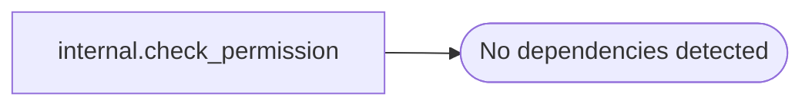

# internal.check_permission

**Database:** SSISDB  
**Server:** STL-SSIS-P-01  
**Function Type:** Scalar Function  
**Returns:** bit(1)  

## Architecture Diagram



## Parameters

| Parameter | Data Type | Max Length | Is Output |
|---|---|---|---|
| @object_type | smallint | 2 | NO |
| @object_id | bigint | 8 | NO |
| @permission_type | smallint | 2 | NO |

## Table Dependencies

_No table dependencies detected._

## Function Code

```sql

CREATE FUNCTION [internal].[check_permission]
(
    @object_type SMALLINT,
    @object_id BIGINT,
    @permission_type SMALLINT
)
RETURNS BIT
AS
BEGIN
    DECLARE @Result BIT
    
    IF (IS_MEMBER('ssis_admin') = 1) OR (IS_SRVROLEMEMBER('sysadmin') = 1)
        RETURN 1
    
    IF EXISTS 
    (
        SELECT [permission_type]
        FROM [catalog].[effective_object_permissions]
        WHERE 
            [object_type] = @object_type
        AND [object_id] = @object_id
        AND [permission_type] = @permission_type
    )
        SET @Result = 1
    ELSE
        SET @Result = 0
  
    RETURN @Result
END
```
