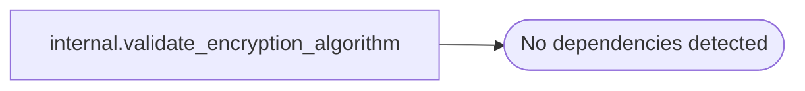

# internal.validate_encryption_algorithm

**Database:** SSISDB  
**Server:** STL-SSIS-P-01  
**Function Type:** Scalar Function  
**Returns:** int(4)  

## Architecture Diagram



## Parameters

| Parameter | Data Type | Max Length | Is Output |
|---|---|---|---|
| @algorithm_name | nvarchar | 510 | NO |

## Table Dependencies

_No table dependencies detected._

## Function Code

```sql


CREATE FUNCTION [internal].[validate_encryption_algorithm](@algorithm_name nvarchar(255))
RETURNS INT
AS
BEGIN
  DECLARE @ret INT 
     
  IF @algorithm_name IN ('TRIPLE_DES_3KEY', 'AES_128', 'AES_192' , 'AES_256')
      SET @ret = 0
  ELSE
      SET @ret = -1
  
  RETURN @ret
END
```
