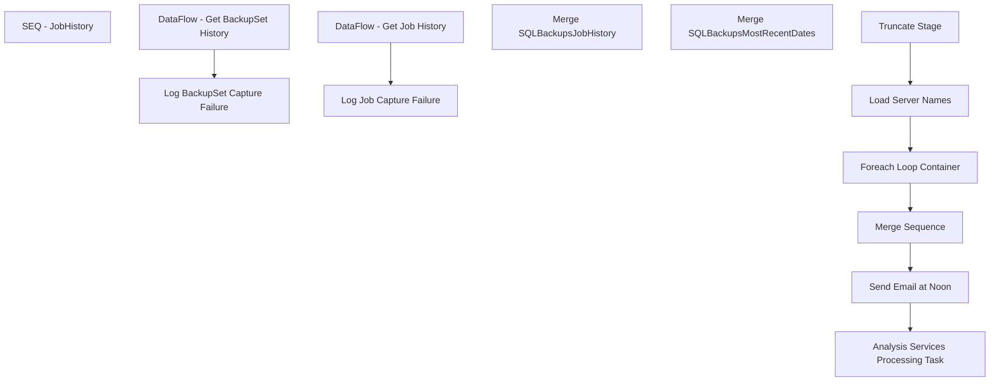

# SSIS Package: SQLBackupsJobHistory

**Project:** SQLBackupsJobHistory  
**Folder:** ADMIN/Projects  
**Server:** STL-SSIS-P-01  

## Connection Managers

| Name | Type | Server | Catalog | Connection (sanitized) |
|---|---|---|---|---|
| Azure | MSOLAP100 | asazure://northcentralus.asazure.windows.net/azasp01 | BABW-DW | Data Source=asazure://northcentralus.asazure.windows.net/azasp01; Initial Catalog=BABW-DW; Provider=MSOLAP.7 |
| IntegrationStaging | OLEDB | STL-SSIS-P-01 | IntegrationStaging | Data Source=STL-SSIS-P-01; Initial Catalog=IntegrationStaging; Provider=SQLNCLI11.1; Integrated Security=SSPI; Auto Translate=False |
| MSDB | OLEDB | stl-sql-p-02 | msdb | Data Source=stl-sql-p-02; Initial Catalog=msdb; Provider=SQLNCLI11.1; Integrated Security=SSPI; Auto Translate=False |
| stl-ssis-p-01 | ADO.NET:SQL | stl-ssis-p-01 |  | Data Source=stl-ssis-p-01; Integrated Security=SSPI; Connect Timeout=30 |

## Control Flow Tasks

| Task | Type |
|---|---|
| SQLBackupsJobHistory | Package |
| SEQ - JobHistory | SEQUENCE |
| Analysis Services Processing Task | DTSProcessingTask |
| Foreach Loop Container | FOREACHLOOP |
| DataFlow - Get BackupSet History | Pipeline |
| DataFlow - Get Job History | Pipeline |
| Log BackupSet Capture Failure | ExecuteSQLTask |
| Log Job Capture Failure | ExecuteSQLTask |
| Load Server Names | ExecuteSQLTask |
| Merge Sequence | SEQUENCE |
| Merge SQLBackupsJobHistory | ExecuteSQLTask |
| Merge SQLBackupsMostRecentDates | ExecuteSQLTask |
| Send Email at Noon | ExecuteSQLTask |
| Truncate Stage | ExecuteSQLTask |

## Control Flow Outline

```text
- SEQ - JobHistory [SEQUENCE]
  - Analysis Services Processing Task [DTSProcessingTask]
  - Foreach Loop Container [FOREACHLOOP]
    - DataFlow - Get BackupSet History [Pipeline]
    - DataFlow - Get Job History [Pipeline]
    - Log BackupSet Capture Failure [ExecuteSQLTask]
    - Log Job Capture Failure [ExecuteSQLTask]
  - Load Server Names [ExecuteSQLTask]
  - Merge Sequence [SEQUENCE]
    - Merge SQLBackupsJobHistory [ExecuteSQLTask]
    - Merge SQLBackupsMostRecentDates [ExecuteSQLTask]
  - Send Email at Noon [ExecuteSQLTask]
  - Truncate Stage [ExecuteSQLTask]
```

## Architecture Diagram



## Variables

| Namespace | Name | Expression-bound |
|---|---|---|
| User | SQL_BackupSetsQuery | Yes |
| User | SQL_JobHistoryQuery | Yes |
| User | ServerName | No |
| User | ServerNames | No |

### Expression-bound variable values

#### User::SQL_BackupSetsQuery

**Expression:**

```sql
"with
ServiceAccounts as
	(
		select
			[SQL Server] as SQLServerServiceAccount,
			[SQL Server Agent] as SQLAgentServerAccount
		from 
			(
				select 
					replace(ServiceName, ' (MSSQLSERVER)', '') as ServiceName,
					service_account as ServiceAccount
				from sys.dm_server_services 
			) as sv
		pivot
			(
				max(ServiceAccount)
				for ServiceName in ([SQL Server], [SQL Server Agent])
			) as pv
	),
DatabaseNames as
	(
		SELECT 
			cast('" + @[User::ServerName] + "' as nvarchar(100)) as ServerName,
			name as DatabaseName,
			case 
				when name in ('master','msdb','model') 
				then 'System' else 'User' end as DatabaseType
		FROM sys.databases
		WHERE name <> 'tempdb'
		--AND source_database_id IS NULL
	),
MaxID as
	(	
		select 
			cast('" + @[User::ServerName] + "' as nvarchar(100)) as ServerName,
			database_name,
			type,
			max(backup_set_id) MaxID
		from backupset
		join DatabaseNames dn 
			on server_name=dn.ServerName 
			and database_name=dn.DatabaseName
		where type in ('D', 'I')
		group by
			server_name,
			database_name,
			type
	),
Backups as
	(
		select 
			cast('" + @[User::ServerName] + "' as nvarchar(100)) as ServerName,
			bs.database_name,
			case bs.type
				when 'D' then 'Full'
				when 'I' then 'Differential'
				when 'L' then 'Log'
				when 'F' then 'File or filegroup'
				when 'G' then 'Differential file'
				when 'P' then 'Partial'
				when 'Q' then 'Differential partial'
			end as BackupSetType,
			bs.backup_start_date,
			bs.backup_finish_date,
			bmf.physical_device_name
		from backupset bs with (nolock)
		join backupmediafamily bmf with (nolock) on bs.media_set_id=bmf.media_set_id
		join MaxID mi on bs.backup_set_id=mi.MaxID
		where bs.type in ('D', 'I')
	),
Summary as 
	(
		select 
			dn.ServerName,
			dn.DatabaseName,
			dn.DatabaseType,
			b.BackupSetType,
			b.backup_start_date as BackupStartDate,
			b.backup_finish_date as BackupStopDate,
			sa.SQLServerServiceAccount,
			sa.SQLAgentServerAccount
		from DatabaseNames dn
		left join Backups b 
			on dn.ServerName=b.ServerName
			and dn.DatabaseName=b.database_name
		cross join ServiceAccounts sa 
		group by 
			dn.ServerName,
			dn.DatabaseName,
			dn.DatabaseType,
			b.BackupSetType,
			b.backup_start_date,
			b.backup_finish_date,
			sa.SQLServerServiceAccount,
			sa.SQLAgentServerAccount
	) 
select 
	ServerName,
	DatabaseName,
	DatabaseType,
	[Full] as FullBackupDate,
	[Differential] as DifferentialBackupDate,
	SQLServerServiceAccount,
	SQLAgentServerAccount
from
	(
		select 
			ServerName,
			DatabaseName,
			DatabaseType,
			BackupSetType,
			BackupStopDate,
			SQLServerServiceAccount,
			SQLAgentServerAccount
		from Summary
	) as sp
Pivot
	(
		max(BackupStopDate)
		for BackupSetType in ([Full],[Differential])
	) as bp
order by DatabaseType desc"
```

**Evaluated value:**

```sql
with
ServiceAccounts as
	(
		select
			[SQL Server] as SQLServerServiceAccount,
			[SQL Server Agent] as SQLAgentServerAccount
		from 
			(
				select 
					replace(ServiceName, ' (MSSQLSERVER)', '') as ServiceName,
					service_account as ServiceAccount
				from sys.dm_server_services 
			) as sv
		pivot
			(
				max(ServiceAccount)
				for ServiceName in ([SQL Server], [SQL Server Agent])
			) as pv
	),
DatabaseNames as
	(
		SELECT 
			cast('stl-sql-p-02' as nvarchar(100)) as ServerName,
			name as DatabaseName,
			case 
				when name in ('master','msdb','model') 
				then 'System' else 'User' end as DatabaseType
		FROM sys.databases
		WHERE name <> 'tempdb'
		--AND source_database_id IS NULL
	),
MaxID as
	(	
		select 
			cast('stl-sql-p-02' as nvarchar(100)) as ServerName,
			database_name,
			type,
			max(backup_set_id) MaxID
		from backupset
		join DatabaseNames dn 
			on server_name=dn.ServerName 
			and database_name=dn.DatabaseName
		where type in ('D', 'I')
		group by
			server_name,
			database_name,
			type
	),
Backups as
	(
		select 
			cast('stl-sql-p-02' as nvarchar(100)) as ServerName,
			bs.database_name,
			case bs.type
				when 'D' then 'Full'
				when 'I' then 'Differential'
				when 'L' then 'Log'
				when 'F' then 'File or filegroup'
				when 'G' then 'Differential file'
				when 'P' then 'Partial'
				when 'Q' then 'Differential partial'
			end as BackupSetType,
			bs.backup_start_date,
			bs.backup_finish_date,
			bmf.physical_device_name
		from backupset bs with (nolock)
		join backupmediafamily bmf with (nolock) on bs.media_set_id=bmf.media_set_id
		join MaxID mi on bs.backup_set_id=mi.MaxID
		where bs.type in ('D', 'I')
	),
Summary as 
	(
		select 
			dn.ServerName,
			dn.DatabaseName,
			dn.DatabaseType,
			b.BackupSetType,
			b.backup_start_date as BackupStartDate,
			b.backup_finish_date as BackupStopDate,
			sa.SQLServerServiceAccount,
			sa.SQLAgentServerAccount
		from DatabaseNames dn
		left join Backups b 
			on dn.ServerName=b.ServerName
			and dn.DatabaseName=b.database_name
		cross join ServiceAccounts sa 
		group by 
			dn.ServerName,
			dn.DatabaseName,
			dn.DatabaseType,
			b.BackupSetType,
			b.backup_start_date,
			b.backup_finish_date,
			sa.SQLServerServiceAccount,
			sa.SQLAgentServerAccount
	) 
select 
	ServerName,
	DatabaseName,
	DatabaseType,
	[Full] as FullBackupDate,
	[Differential] as DifferentialBackupDate,
	SQLServerServiceAccount,
	SQLAgentServerAccount
from
	(
		select 
			ServerName,
			DatabaseName,
			DatabaseType,
			BackupSetType,
			BackupStopDate,
			SQLServerServiceAccount,
			SQLAgentServerAccount
		from Summary
	) as sp
Pivot
	(
		max(BackupStopDate)
		for BackupSetType in ([Full],[Differential])
	) as bp
order by DatabaseType desc
```

#### User::SQL_JobHistoryQuery

**Expression:**

```sql
"WITH
JobsList as
	(
		select 
			cast('" + @[User::ServerName] + "' as nvarchar(100)) as ServerName,
			sj.job_id,
			sj.name as JobName,
			cast(substring(sjs.command, charindex('@Directory',sjs.command)+15, 100) as nvarchar(100)) as BackupLocationStart,
			cast(msdb.dbo.agent_datetime(sch.next_run_date, sch.next_run_time) as datetime) NextRunDate,
			cast(dbo.agent_datetime(js.last_run_date, js.last_run_time) as datetime) LastRunDate,
			case js.last_run_outcome
				when 0 then 'FAILED'
				when 1 then 'SUCCEEDED'
				when 3 then 'CANCELLED'
			end as LastRunStatus,
			
			right((replicate('0',6) + cast(js.last_run_duration as varchar)),6) LastRunDuration
		from sysjobs sj with (nolock) 
		join sysjobsteps sjs with (nolock) on sj.job_id=sjs.job_id
		join sysjobschedules sch on sj.job_id=sch.job_id
		join sysschedules ss on sch.schedule_id=ss.schedule_id and ss.enabled=1 
		join sysjobservers js with (nolock) on sj.job_id=js.job_id
		where 1=1
		and sj.enabled=1
		and sj.name like '%Backup%'
		and sjs.command not like '%email%'
		and sjs.command like '%\\%'
		and sj.name<>'SQLBackupsJobHistory'--job which is running this script
	)
select 
	ServerName,
	job_id,
	JobName,
	cast(substring(BackupLocationStart, 1,charindex('''',BackupLocationStart)-1) as nvarchar(50)) as BackupLocation,
	NextRunDate,
	LastRunDate,
	LastRunStatus,
	
	cast(left(LastRunDuration,2) + ':' + substring(LastRunDuration,3,2) + ':' + right(LastRunDuration,2) as varchar(8)) LastRunDuration
from JobsList jl 


"
```

**Evaluated value:**

```sql
WITH
JobsList as
	(
		select 
			cast('stl-sql-p-02' as nvarchar(100)) as ServerName,
			sj.job_id,
			sj.name as JobName,
			cast(substring(sjs.command, charindex('@Directory',sjs.command)+15, 100) as nvarchar(100)) as BackupLocationStart,
			cast(msdb.dbo.agent_datetime(sch.next_run_date, sch.next_run_time) as datetime) NextRunDate,
			cast(dbo.agent_datetime(js.last_run_date, js.last_run_time) as datetime) LastRunDate,
			case js.last_run_outcome
				when 0 then 'FAILED'
				when 1 then 'SUCCEEDED'
				when 3 then 'CANCELLED'
			end as LastRunStatus,
			
			right((replicate('0',6) + cast(js.last_run_duration as varchar)),6) LastRunDuration
		from sysjobs sj with (nolock) 
		join sysjobsteps sjs with (nolock) on sj.job_id=sjs.job_id
		join sysjobschedules sch on sj.job_id=sch.job_id
		join sysschedules ss on sch.schedule_id=ss.schedule_id and ss.enabled=1 
		join sysjobservers js with (nolock) on sj.job_id=js.job_id
		where 1=1
		and sj.enabled=1
		and sj.name like '%Backup%'
		and sjs.command not like '%email%'
		and sjs.command like '%\%'
		and sj.name<>'SQLBackupsJobHistory'--job which is running this script
	)
select 
	ServerName,
	job_id,
	JobName,
	cast(substring(BackupLocationStart, 1,charindex('''',BackupLocationStart)-1) as nvarchar(50)) as BackupLocation,
	NextRunDate,
	LastRunDate,
	LastRunStatus,
	
	cast(left(LastRunDuration,2) + ':' + substring(LastRunDuration,3,2) + ':' + right(LastRunDuration,2) as varchar(8)) LastRunDuration
from JobsList jl 


```

## Execute SQL Tasks

### Log BackupSet Capture Failure

**Path:** `Package\SEQ - JobHistory\Foreach Loop Container\Log BackupSet Capture Failure`  
**Connection:** IntegrationStaging (STL-SSIS-P-01/IntegrationStaging)  

> ⚠️ `SqlStatementSource` is overridden at runtime by a property expression (shown below); the static SQL may not be what executes.

**Static SqlStatementSource:**

```sql
insert SQLBackupsMostRecentDatesStage (ServerName) 
values ('stl-sql-p-02')
```

**Property expression (runtime override):**

```sql
"insert SQLBackupsMostRecentDatesStage (ServerName) 
values ('" +  @[User::ServerName] + "')"
```

### Log Job Capture Failure

**Path:** `Package\SEQ - JobHistory\Foreach Loop Container\Log Job Capture Failure`  
**Connection:** IntegrationStaging (STL-SSIS-P-01/IntegrationStaging)  

> ⚠️ `SqlStatementSource` is overridden at runtime by a property expression (shown below); the static SQL may not be what executes.

**Static SqlStatementSource:**

```sql
insert SQLBackupsJobHistoryStage (ServerName)
values ('stl-sql-p-02')
```

**Property expression (runtime override):**

```sql
"insert SQLBackupsJobHistoryStage (ServerName)
values ('" +  @[User::ServerName] + "')"
```

### Load Server Names

**Path:** `Package\SEQ - JobHistory\Load Server Names`  
**Connection:** IntegrationStaging (STL-SSIS-P-01/IntegrationStaging)  

```sql
--select 'bearcluster01.sql.buildabear.com' as ServerName UNION
select 'stl-sql-p-02' as ServerName UNION 
select 'stl-sql-p-03' as ServerName UNION 
select 'papamart' as ServerName UNION
select 'stl-ssis-p-01' as ServerName UNION
select 'kermode' as ServerName UNION
select 'stl-sql-p-04\sql2008r2' as ServerName UNION
select 'stl-sql-p-04' as ServerName UNION
select 'kodiak' as ServerName UNION
select 'BEDROCKDB01' as ServerName UNION--CASE SENSITIVE
select 'bedrockdb02' as ServerName UNION
select 'stl-crmdb-p-01' as ServerName UNION
select 'stl-plmdb-p-01' as ServerName UNION
select 'stl-sql-p-01' as ServerName UNION -- THIS IS SAME AS PLMDB01
select 'txtdb01' as ServerName UNION
select 'chesdb01' as ServerName UNION
select 'LAWSONDB01V' as ServerName UNION --CASE SENSITIVE
select 'srdb01' as ServerName UNION
select 'spdb10' as ServerName UNION
select 'posdbs' as ServerName UNION
select 'coredb01' as ServerName UNION
select 'coredb02' as ServerName UNION 
--select 'pipeapp01' as ServerName UNION -- not backing up
select 'esdmdb01' as ServerName UNION 
--select 'posdbs'as ServerName UNION --not backing up
select 'stl-avaldb-p-01' as ServerName 


```

### Merge SQLBackupsJobHistory

**Path:** `Package\SEQ - JobHistory\Merge Sequence\Merge SQLBackupsJobHistory`  
**Connection:** IntegrationStaging (STL-SSIS-P-01/IntegrationStaging)  

```sql
exec spMergeSQLBackupsJobHistory
```

### Merge SQLBackupsMostRecentDates

**Path:** `Package\SEQ - JobHistory\Merge Sequence\Merge SQLBackupsMostRecentDates`  
**Connection:** IntegrationStaging (STL-SSIS-P-01/IntegrationStaging)  

```sql
exec spMergeSQLBackupsMostRecentDates
```

### Send Email at Noon

**Path:** `Package\SEQ - JobHistory\Send Email at Noon`  
**Connection:** IntegrationStaging (STL-SSIS-P-01/IntegrationStaging)  

```sql
if (select datepart(hh, getdate())) = 12

begin

	declare @text nvarchar(max)
	set @text = '
	<font face =arial size = 4> ' +
		'<b>Database Backup Status</b><br>' +
		'<font face =arial size = 2>The information below represents the known SQL databases in our enterprise which have scheduled backups, and the most recent status. <br> Failures will be investigated and brought to justice.</font>' + 
		'<br><br>' +
		'<table border="1" <font face =arial size = 2>' +
		'<tr>
			<th>ServerName</th>
			<th>JobName</th>
			<th>BackupLocation</th>
			<th>LastRunDate</th>
			<th>LastRunStatus</th>
			<th>LastRunDuration</th>
			<th>NextRunDate</th>
		</tr>' +
		CAST ( ( SELECT td = isnull(ServerName,''), '',
						td = isnull(JobName,''), '',
						td = isnull(BackupLocation,''), '',
						td = isnull(convert(varchar, LastRunDate,22),''), '',
						td = isnull(LastRunStatus,''), '',
						td = isnull(LastRunDuration, ''), '',
						td = isnull(convert(varchar, NextRunDate,22),''), ''
					from SQLBackupsJobHistory
					order by ServerName, JobName
					FOR XML PATH('tr'), TYPE 
		) AS NVARCHAR(MAX) ) +
				'</font></table></font></p></p>
				<br>
				<br>
				<br>
			<font face =arial size = 1><i>The information in this message may be privileged, “confidential” and protected from disclosure and/or intended only for the addressee(s) named above.  If the reader of this message is not the intended recipient, or an employee or agent responsible for delivering this message to the intended recipient, you are hereby notified that any dissemination, distribution or copying of the communication is strictly prohibited.  If you have received this communication in error, please notify us immediately by replying to the message and deleting it from your computer.  Thank you beary much.</i></font>'
					
	exec msdb.dbo.sp_send_dbmail
	@profile_name = 'biadmin',
	@recipients = 'biadmin@buildabear.com',
	@subject = 'Database Backup Status',
	@body = @text,
	@body_format = 'HTML'

end
```

### Truncate Stage

**Path:** `Package\SEQ - JobHistory\Truncate Stage`  
**Connection:** IntegrationStaging (STL-SSIS-P-01/IntegrationStaging)  

```sql
TRUNCATE TABLE SQLBackupsJobHistoryStage
TRUNCATE TABLE SQLBackupsMostRecentDatesStage
```

## Data Flow: Sources

| Component | Source Object | Type | Data Flow Task | Connection | SQL Kind |
|---|---|---|---|---|---|
| BackUp Sets |  | OLEDBSource | DataFlow - Get BackupSet History | MSDB |  |
| SQL Agent Job Query |  | OLEDBSource | DataFlow - Get Job History | MSDB |  |

## Data Flow: Destinations

| Component | Target Table | Type | Data Flow Task | Connection | SQL Kind |
|---|---|---|---|---|---|
| SQLBackupsMostRecentDatesStage |  | OLEDBDestination | DataFlow - Get BackupSet History | IntegrationStaging |  |
| SQLBackupsJobHistoryStage |  | OLEDBDestination | DataFlow - Get Job History | IntegrationStaging |  |
