# SSIS Package: SQLServerAccountCleanup

**Project:** SQLServerAccountCleanup  
**Folder:** ADMIN/Projects  
**Server:** STL-SSIS-P-01  

## Connection Managers

| Name | Type | Server | Catalog | Connection (sanitized) |
|---|---|---|---|---|
| Cache Connection Manager | CACHE |  |  |  |
| Cache Connection Manager After Drops | CACHE |  |  |  |
| DW | OLEDB | PAPAMART | dw | Data Source=PAPAMART; Initial Catalog=dw; Provider=SQLNCLI11.1; Integrated Security=SSPI; Auto Translate=False |
| DWStaging | OLEDB | PAPAMART | DWStaging | Data Source=PAPAMART; Initial Catalog=DWStaging; Provider=SQLNCLI11.1; Integrated Security=SSPI; Auto Translate=False |
| IntegrationStaging | OLEDB | STL-SSIS-P-01 | IntegrationStaging | Data Source=STL-SSIS-P-01; Initial Catalog=IntegrationStaging; Provider=SQLNCLI11.1; Integrated Security=SSPI; Auto Translate=False |
| InvalidSQLUsersReport | FLATFILE |  |  |  |
| MASTER | OLEDB | kermodetest | master | Data Source=kermodetest; Initial Catalog=master; Provider=SQLNCLI11.1; Integrated Security=SSPI; Auto Translate=False |
| MASTERCleanse | OLEDB | kermodetest | master | Data Source=kermodetest; Initial Catalog=master; Provider=SQLNCLI11.1; Integrated Security=SSPI; Auto Translate=False |
| SMTP | SMTP |  |  |  |

## Control Flow Tasks

| Task | Type |
|---|---|
| SQLServerAccountCleanup | Package |
| Seq Container - Automate Clean Up of Accounts | SEQUENCE |
| Archive Purged Account Information | Pipeline |
| Execute SQL Task - Capture Error Rows | ExecuteSQLTask |
| Foreach Loop Container | FOREACHLOOP |
| Drop Login Fail Log | ExecuteSQLTask |
| Drop User Fail Log | ExecuteSQLTask |
| Exec Drop Login Command | ExecuteSQLTask |
| Exec Drop User Command | ExecuteSQLTask |
| Get SQL Drop Login Command | ExecuteSQLTask |
| Get SQL Drop User Command | ExecuteSQLTask |
| Load Target Server Names to be Cleansed | ExecuteSQLTask |
| Send HTML Formatted email | ExecuteSQLTask |
| Seq Container - Capture Deleted and Disabled AD Accounts | SEQUENCE |
| Data Flow Task - Load to Reporting Table | Pipeline |
| Truncate Table Reporting SQLServerUserAccountCleanup | ExecuteSQLTask |
| Seq Container - Capture Deleted and Disabled AD Accounts  After Attempted Cleanup | SEQUENCE |
| Data Flow Task - Load to Reporting Table | Pipeline |
| Truncate Table Reporting SQLServerUserAccountCleanup | ExecuteSQLTask |
| Seq Container - Capture Users on target servers | SEQUENCE |
| Foreach Loop Container | FOREACHLOOP |
| Data Flow Task - Load To SQLServerUsersAccounts | Pipeline |
| Execute SQL Task - Load Logins on Each Server | ExecuteSQLTask |
| Execute SQL Task - Load Users On Each DB | ExecuteSQLTask |
| Load Target Server Names | ExecuteSQLTask |
| Truncate Table SQLServerUsersAccounts | ExecuteSQLTask |
| Seq Container - Capture Users on Target Servers - After Attempted Cleanup | SEQUENCE |
| Foreach Loop Container | FOREACHLOOP |
| Data Flow Task - Load To SQLServerUsersAccounts | Pipeline |
| Execute SQL Task - Load Logins on Each Server | ExecuteSQLTask |
| Execute SQL Task - Load Users On Each DB | ExecuteSQLTask |
| Load Target Server Names | ExecuteSQLTask |
| Truncate Table SQLServerUsersAccounts | ExecuteSQLTask |
| Seq Container - Create Attachment and Email | SEQUENCE |
| Generate Report | Pipeline |
| Send Mail Task | SendMailTask |
| Send Mail Task - With Report | SendMailTask |
| SQL Task - Get Count of Cleanup Records | ExecuteSQLTask |
| Seq Container - Testing Only - Add Bogus Users | SEQUENCE |
| Add Drop Commands | Pipeline |
| Delete Duplicates | ExecuteSQLTask |
| Insert Users | ExecuteSQLTask |
| Testing Try Catch and Logging | SEQUENCE |
| Foreach Loop Container | FOREACHLOOP |
| Execute SQL Task - Drop user you know doesnt exist | ExecuteSQLTask |
| Execute SQL Task - Fail Log | ExecuteSQLTask |
| Load Target Server Names to be Cleansed | ExecuteSQLTask |
| Send Mail Task | SendMailTask |

## Control Flow Outline

```text
- Send Mail Task [SendMailTask]
- Seq Container - Automate Clean Up of Accounts [SEQUENCE]
  - Archive Purged Account Information [Pipeline]
  - Execute SQL Task - Capture Error Rows [ExecuteSQLTask]
  - Foreach Loop Container [FOREACHLOOP]
    - Drop Login Fail Log [ExecuteSQLTask]
    - Drop User Fail Log [ExecuteSQLTask]
    - Exec Drop Login Command [ExecuteSQLTask]
    - Exec Drop User Command [ExecuteSQLTask]
    - Get SQL Drop Login Command [ExecuteSQLTask]
    - Get SQL Drop User Command [ExecuteSQLTask]
  - Load Target Server Names to be Cleansed [ExecuteSQLTask]
  - Send HTML Formatted email [ExecuteSQLTask]
- Seq Container - Capture Deleted and Disabled AD Accounts [SEQUENCE]
- Seq Container - Capture Deleted and Disabled AD Accounts  After Attempted Cleanup [SEQUENCE]
  - Data Flow Task - Load to Reporting Table [Pipeline]
  - Truncate Table Reporting SQLServerUserAccountCleanup [ExecuteSQLTask]
  - Data Flow Task - Load to Reporting Table [Pipeline]
  - Truncate Table Reporting SQLServerUserAccountCleanup [ExecuteSQLTask]
- Seq Container - Capture Users on Target Servers - After Attempted Cleanup [SEQUENCE]
  - Foreach Loop Container [FOREACHLOOP]
    - Data Flow Task - Load To SQLServerUsersAccounts [Pipeline]
    - Execute SQL Task - Load Logins on Each Server [ExecuteSQLTask]
    - Execute SQL Task - Load Users On Each DB [ExecuteSQLTask]
  - Load Target Server Names [ExecuteSQLTask]
  - Truncate Table SQLServerUsersAccounts [ExecuteSQLTask]
- Seq Container - Capture Users on target servers [SEQUENCE]
  - Foreach Loop Container [FOREACHLOOP]
    - Data Flow Task - Load To SQLServerUsersAccounts [Pipeline]
    - Execute SQL Task - Load Logins on Each Server [ExecuteSQLTask]
    - Execute SQL Task - Load Users On Each DB [ExecuteSQLTask]
  - Load Target Server Names [ExecuteSQLTask]
  - Truncate Table SQLServerUsersAccounts [ExecuteSQLTask]
- Seq Container - Create Attachment and Email [SEQUENCE]
  - Generate Report [Pipeline]
  - SQL Task - Get Count of Cleanup Records [ExecuteSQLTask]
  - Send Mail Task [SendMailTask]
  - Send Mail Task - With Report [SendMailTask]
- Seq Container - Testing Only - Add Bogus Users [SEQUENCE]
  - Add Drop Commands [Pipeline]
  - Delete Duplicates [ExecuteSQLTask]
  - Insert Users [ExecuteSQLTask]
- Testing Try Catch and Logging [SEQUENCE]
  - Foreach Loop Container [FOREACHLOOP]
    - Execute SQL Task - Drop user you know doesnt exist [ExecuteSQLTask]
    - Execute SQL Task - Fail Log [ExecuteSQLTask]
  - Load Target Server Names to be Cleansed [ExecuteSQLTask]
```

## Architecture Diagram

```mermaid
flowchart TD
    n_Package_Seq_Container___Automate_Clean_Up_of_Accounts["Seq Container - Automate Clean Up of Accounts"]
    n_Package_Seq_Container___Automate_Clean_Up_of_Accounts_Archive_Purged_Account_Information["Archive Purged Account Information"]
    n_Package_Seq_Container___Automate_Clean_Up_of_Accounts_Execute_SQL_Task___Capture_Error_Rows["Execute SQL Task - Capture Error Rows"]
    n_Package_Seq_Container___Automate_Clean_Up_of_Accounts_Foreach_Loop_Container["Foreach Loop Container"]
    n_Package_Seq_Container___Automate_Clean_Up_of_Accounts_Foreach_Loop_Container_Drop_Login_Fail_Log["Drop Login Fail Log"]
    n_Package_Seq_Container___Automate_Clean_Up_of_Accounts_Foreach_Loop_Container_Drop_User_Fail_Log["Drop User Fail Log"]
    n_Package_Seq_Container___Automate_Clean_Up_of_Accounts_Foreach_Loop_Container_Exec_Drop_Login_Command["Exec Drop Login Command"]
    n_Package_Seq_Container___Automate_Clean_Up_of_Accounts_Foreach_Loop_Container_Exec_Drop_User_Command["Exec Drop User Command"]
    n_Package_Seq_Container___Automate_Clean_Up_of_Accounts_Foreach_Loop_Container_Get_SQL_Drop_Login_Command["Get SQL Drop Login Command"]
    n_Package_Seq_Container___Automate_Clean_Up_of_Accounts_Foreach_Loop_Container_Get_SQL_Drop_User_Command["Get SQL Drop User Command"]
    n_Package_Seq_Container___Automate_Clean_Up_of_Accounts_Load_Target_Server_Names_to_be_Cleansed["Load Target Server Names to be Cleansed"]
    n_Package_Seq_Container___Automate_Clean_Up_of_Accounts_Send_HTML_Formatted_email["Send HTML Formatted email"]
    n_Package_Seq_Container___Capture_Deleted_and_Disabled_AD_Accounts["Seq Container - Capture Deleted and Disabled AD Accounts"]
    n_Package_Seq_Container___Capture_Deleted_and_Disabled_AD_Accounts_Data_Flow_Task___Load_to_Reporting_Table["Data Flow Task - Load to Reporting Table"]
    n_Package_Seq_Container___Capture_Deleted_and_Disabled_AD_Accounts_Truncate_Table_Reporting_SQLServerUserAccountCleanup["Truncate Table Reporting SQLServerUserAccountCleanup"]
    n_Package_Seq_Container___Capture_Deleted_and_Disabled_AD_Accounts__After_Attempted_Cleanup["Seq Container - Capture Deleted and Disabled AD Accounts  After Attempted Cleanup"]
    n_Package_Seq_Container___Capture_Deleted_and_Disabled_AD_Accounts__After_Attempted_Cleanup_Data_Flow_Task___Load_to_Reporting_Table["Data Flow Task - Load to Reporting Table"]
    n_Package_Seq_Container___Capture_Deleted_and_Disabled_AD_Accounts__After_Attempted_Cleanup_Truncate_Table_Reporting_SQLServerUserAccountCleanup["Truncate Table Reporting SQLServerUserAccountCleanup"]
    n_Package_Seq_Container___Capture_Users_on_target_servers["Seq Container - Capture Users on target servers"]
    n_Package_Seq_Container___Capture_Users_on_target_servers_Foreach_Loop_Container["Foreach Loop Container"]
    n_Package_Seq_Container___Capture_Users_on_target_servers_Foreach_Loop_Container_Data_Flow_Task___Load_To_SQLServerUsersAccounts["Data Flow Task - Load To SQLServerUsersAccounts"]
    n_Package_Seq_Container___Capture_Users_on_target_servers_Foreach_Loop_Container_Execute_SQL_Task___Load_Logins_on_Each_Server["Execute SQL Task - Load Logins on Each Server"]
    n_Package_Seq_Container___Capture_Users_on_target_servers_Foreach_Loop_Container_Execute_SQL_Task___Load_Users_On_Each_DB["Execute SQL Task - Load Users On Each DB"]
    n_Package_Seq_Container___Capture_Users_on_target_servers_Load_Target_Server_Names["Load Target Server Names"]
    n_Package_Seq_Container___Capture_Users_on_target_servers_Truncate_Table_SQLServerUsersAccounts["Truncate Table SQLServerUsersAccounts"]
    n_Package_Seq_Container___Capture_Users_on_Target_Servers___After_Attempted_Cleanup["Seq Container - Capture Users on Target Servers - After Attempted Cleanup"]
    n_Package_Seq_Container___Capture_Users_on_Target_Servers___After_Attempted_Cleanup_Foreach_Loop_Container["Foreach Loop Container"]
    n_Package_Seq_Container___Capture_Users_on_Target_Servers___After_Attempted_Cleanup_Foreach_Loop_Container_Data_Flow_Task___Load_To_SQLServerUsersAccounts["Data Flow Task - Load To SQLServerUsersAccounts"]
    n_Package_Seq_Container___Capture_Users_on_Target_Servers___After_Attempted_Cleanup_Foreach_Loop_Container_Execute_SQL_Task___Load_Logins_on_Each_Server["Execute SQL Task - Load Logins on Each Server"]
    n_Package_Seq_Container___Capture_Users_on_Target_Servers___After_Attempted_Cleanup_Foreach_Loop_Container_Execute_SQL_Task___Load_Users_On_Each_DB["Execute SQL Task - Load Users On Each DB"]
    n_Package_Seq_Container___Capture_Users_on_Target_Servers___After_Attempted_Cleanup_Load_Target_Server_Names["Load Target Server Names"]
    n_Package_Seq_Container___Capture_Users_on_Target_Servers___After_Attempted_Cleanup_Truncate_Table_SQLServerUsersAccounts["Truncate Table SQLServerUsersAccounts"]
    n_Package_Seq_Container___Create_Attachment_and_Email["Seq Container - Create Attachment and Email"]
    n_Package_Seq_Container___Create_Attachment_and_Email_Generate_Report["Generate Report"]
    n_Package_Seq_Container___Create_Attachment_and_Email_Send_Mail_Task["Send Mail Task"]
    n_Package_Seq_Container___Create_Attachment_and_Email_Send_Mail_Task___With_Report["Send Mail Task - With Report"]
    n_Package_Seq_Container___Create_Attachment_and_Email_SQL_Task___Get_Count_of_Cleanup_Records["SQL Task - Get Count of Cleanup Records"]
    n_Package_Seq_Container___Testing_Only___Add_Bogus_Users["Seq Container - Testing Only - Add Bogus Users"]
    n_Package_Seq_Container___Testing_Only___Add_Bogus_Users_Add_Drop_Commands["Add Drop Commands"]
    n_Package_Seq_Container___Testing_Only___Add_Bogus_Users_Delete_Duplicates["Delete Duplicates"]
    n_Package_Seq_Container___Testing_Only___Add_Bogus_Users_Insert_Users["Insert Users"]
    n_Package_Testing_Try_Catch_and_Logging["Testing Try Catch and Logging"]
    n_Package_Testing_Try_Catch_and_Logging_Foreach_Loop_Container["Foreach Loop Container"]
    n_Package_Testing_Try_Catch_and_Logging_Foreach_Loop_Container_Execute_SQL_Task___Drop_user_you_know_doesnt_exist["Execute SQL Task - Drop user you know doesnt exist"]
    n_Package_Testing_Try_Catch_and_Logging_Foreach_Loop_Container_Execute_SQL_Task___Fail_Log["Execute SQL Task - Fail Log"]
    n_Package_Testing_Try_Catch_and_Logging_Load_Target_Server_Names_to_be_Cleansed["Load Target Server Names to be Cleansed"]
    n_Package_EventHandlers_OnError__Send_Mail_Task["Send Mail Task"]
    n_Package_Seq_Container___Automate_Clean_Up_of_Accounts_Foreach_Loop_Container_Get_SQL_Drop_Login_Command --> n_Package_Seq_Container___Automate_Clean_Up_of_Accounts_Foreach_Loop_Container_Exec_Drop_Login_Command
    n_Package_Seq_Container___Automate_Clean_Up_of_Accounts_Foreach_Loop_Container_Get_SQL_Drop_User_Command --> n_Package_Seq_Container___Automate_Clean_Up_of_Accounts_Foreach_Loop_Container_Exec_Drop_User_Command
    n_Package_Seq_Container___Automate_Clean_Up_of_Accounts_Foreach_Loop_Container_Exec_Drop_User_Command --> n_Package_Seq_Container___Automate_Clean_Up_of_Accounts_Foreach_Loop_Container_Drop_User_Fail_Log
    n_Package_Seq_Container___Automate_Clean_Up_of_Accounts_Foreach_Loop_Container_Exec_Drop_Login_Command --> n_Package_Seq_Container___Automate_Clean_Up_of_Accounts_Foreach_Loop_Container_Drop_Login_Fail_Log
    n_Package_Seq_Container___Automate_Clean_Up_of_Accounts_Load_Target_Server_Names_to_be_Cleansed --> n_Package_Seq_Container___Automate_Clean_Up_of_Accounts_Foreach_Loop_Container
    n_Package_Seq_Container___Automate_Clean_Up_of_Accounts_Foreach_Loop_Container --> n_Package_Seq_Container___Automate_Clean_Up_of_Accounts_Archive_Purged_Account_Information
    n_Package_Seq_Container___Automate_Clean_Up_of_Accounts_Execute_SQL_Task___Capture_Error_Rows --> n_Package_Seq_Container___Automate_Clean_Up_of_Accounts_Send_HTML_Formatted_email
    n_Package_Seq_Container___Automate_Clean_Up_of_Accounts_Archive_Purged_Account_Information --> n_Package_Seq_Container___Automate_Clean_Up_of_Accounts_Execute_SQL_Task___Capture_Error_Rows
    n_Package_Seq_Container___Capture_Deleted_and_Disabled_AD_Accounts_Truncate_Table_Reporting_SQLServerUserAccountCleanup --> n_Package_Seq_Container___Capture_Deleted_and_Disabled_AD_Accounts_Data_Flow_Task___Load_to_Reporting_Table
    n_Package_Seq_Container___Capture_Deleted_and_Disabled_AD_Accounts__After_Attempted_Cleanup_Truncate_Table_Reporting_SQLServerUserAccountCleanup --> n_Package_Seq_Container___Capture_Deleted_and_Disabled_AD_Accounts__After_Attempted_Cleanup_Data_Flow_Task___Load_to_Reporting_Table
    n_Package_Seq_Container___Capture_Users_on_target_servers_Foreach_Loop_Container_Execute_SQL_Task___Load_Users_On_Each_DB --> n_Package_Seq_Container___Capture_Users_on_target_servers_Foreach_Loop_Container_Execute_SQL_Task___Load_Logins_on_Each_Server
    n_Package_Seq_Container___Capture_Users_on_target_servers_Foreach_Loop_Container_Execute_SQL_Task___Load_Logins_on_Each_Server --> n_Package_Seq_Container___Capture_Users_on_target_servers_Foreach_Loop_Container_Data_Flow_Task___Load_To_SQLServerUsersAccounts
    n_Package_Seq_Container___Capture_Users_on_target_servers_Truncate_Table_SQLServerUsersAccounts --> n_Package_Seq_Container___Capture_Users_on_target_servers_Load_Target_Server_Names
    n_Package_Seq_Container___Capture_Users_on_target_servers_Load_Target_Server_Names --> n_Package_Seq_Container___Capture_Users_on_target_servers_Foreach_Loop_Container
    n_Package_Seq_Container___Capture_Users_on_Target_Servers___After_Attempted_Cleanup_Foreach_Loop_Container_Execute_SQL_Task___Load_Users_On_Each_DB --> n_Package_Seq_Container___Capture_Users_on_Target_Servers___After_Attempted_Cleanup_Foreach_Loop_Container_Execute_SQL_Task___Load_Logins_on_Each_Server
    n_Package_Seq_Container___Capture_Users_on_Target_Servers___After_Attempted_Cleanup_Foreach_Loop_Container_Execute_SQL_Task___Load_Logins_on_Each_Server --> n_Package_Seq_Container___Capture_Users_on_Target_Servers___After_Attempted_Cleanup_Foreach_Loop_Container_Data_Flow_Task___Load_To_SQLServerUsersAccounts
    n_Package_Seq_Container___Capture_Users_on_Target_Servers___After_Attempted_Cleanup_Truncate_Table_SQLServerUsersAccounts --> n_Package_Seq_Container___Capture_Users_on_Target_Servers___After_Attempted_Cleanup_Load_Target_Server_Names
    n_Package_Seq_Container___Capture_Users_on_Target_Servers___After_Attempted_Cleanup_Load_Target_Server_Names --> n_Package_Seq_Container___Capture_Users_on_Target_Servers___After_Attempted_Cleanup_Foreach_Loop_Container
    n_Package_Seq_Container___Create_Attachment_and_Email_Generate_Report --> n_Package_Seq_Container___Create_Attachment_and_Email_Send_Mail_Task___With_Report
    n_Package_Seq_Container___Create_Attachment_and_Email_SQL_Task___Get_Count_of_Cleanup_Records --> n_Package_Seq_Container___Create_Attachment_and_Email_Generate_Report
    n_Package_Seq_Container___Create_Attachment_and_Email_SQL_Task___Get_Count_of_Cleanup_Records --> n_Package_Seq_Container___Create_Attachment_and_Email_Send_Mail_Task
    n_Package_Seq_Container___Testing_Only___Add_Bogus_Users_Insert_Users --> n_Package_Seq_Container___Testing_Only___Add_Bogus_Users_Add_Drop_Commands
    n_Package_Seq_Container___Testing_Only___Add_Bogus_Users_Add_Drop_Commands --> n_Package_Seq_Container___Testing_Only___Add_Bogus_Users_Delete_Duplicates
    n_Package_Testing_Try_Catch_and_Logging_Foreach_Loop_Container_Execute_SQL_Task___Drop_user_you_know_doesnt_exist --> n_Package_Testing_Try_Catch_and_Logging_Foreach_Loop_Container_Execute_SQL_Task___Fail_Log
    n_Package_Testing_Try_Catch_and_Logging_Load_Target_Server_Names_to_be_Cleansed --> n_Package_Testing_Try_Catch_and_Logging_Foreach_Loop_Container
    n_Package_Seq_Container___Capture_Users_on_target_servers --> n_Package_Seq_Container___Capture_Deleted_and_Disabled_AD_Accounts
    n_Package_Seq_Container___Capture_Deleted_and_Disabled_AD_Accounts --> n_Package_Seq_Container___Automate_Clean_Up_of_Accounts
    n_Package_Seq_Container___Automate_Clean_Up_of_Accounts --> n_Package_Seq_Container___Capture_Users_on_Target_Servers___After_Attempted_Cleanup
    n_Package_Seq_Container___Capture_Users_on_Target_Servers___After_Attempted_Cleanup --> n_Package_Seq_Container___Capture_Deleted_and_Disabled_AD_Accounts__After_Attempted_Cleanup
    n_Package_Seq_Container___Capture_Deleted_and_Disabled_AD_Accounts__After_Attempted_Cleanup --> n_Package_Seq_Container___Create_Attachment_and_Email
```



## Variables

| Namespace | Name | Expression-bound |
|---|---|---|
| System | Propagate | No |
| User | CleanupRecordCount | No |
| User | DateTimeStamp | Yes |
| User | DropLoginCommandSQLv2 | Yes |
| User | DropLoginCommandString | No |
| User | DropLoginFailureInsertCommand | Yes |
| User | DropLoginFailureResultErrorMessage | No |
| User | DropUserCommandSQLv2 | Yes |
| User | DropUserCommandString | No |
| User | DropUserFailureInsertCommand | Yes |
| User | DropUserFailureResultErrorMessage | No |
| User | EmailRecipient | No |
| User | ServerName | No |
| User | ServerNameCleanse | No |
| User | ServerNames | No |
| User | ServerNamesCleanse | No |
| User | TestCommand | Yes |
| User | TestInsertCommand | Yes |
| User | TodaysErrorRowCount | No |

### Expression-bound variable values

#### User::DateTimeStamp

**Expression:**

```sql
(DT_WSTR,4)DATEPART("yyyy",GetDate()) 
+ (DT_WSTR,4)DATEPART("mm",GetDate()) 
+ (DT_WSTR,4)DATEPART("dd",GetDate()) 
+ (DT_WSTR,4)DATEPART("hh",GetDate()) 
+ (DT_WSTR,4)DATEPART("mi",GetDate()) 
+ (DT_WSTR,4)DATEPART("ss",GetDate()) 
+ (DT_WSTR,4)DATEPART("ms",GetDate())
```

**Evaluated value:**

```sql
202211314585977
```

#### User::DropLoginCommandSQLv2

**Expression:**

```sql
"declare @DropLoginCommand as nvarchar(4000);
with DistinctDropLogins as (
select distinct DropLoginCommand, 
ServerName, 
Reason
from Reporting.[SQLServerUserAccountCleanup]
)
select @DropLoginCommand = COALESCE(@DropLoginCommand + ';' + DropLoginCommand, DropLoginCommand) 
from DistinctDropLogins
where Reason = 'DeletedAccount'
and DropLoginCommand is not null 
and ServerName ="+
"'"+
@[User::ServerNameCleanse]+
"'"+
"Group By DropLoginCommand"+
" select "+
"'"+
"Begin Try " +
"'"+
"+"+
"@DropLoginCommand"+
"+"+
"'"+
"  Print ''DropLoginSuccess'' End try Begin Catch SELECT ERROR_MESSAGE() AS [Error Message] End Catch"+
"'"
```

**Evaluated value:**

```sql
declare @DropLoginCommand as nvarchar(4000);
with DistinctDropLogins as (
select distinct DropLoginCommand, 
ServerName, 
Reason
from Reporting.[SQLServerUserAccountCleanup]
)
select @DropLoginCommand = COALESCE(@DropLoginCommand + ';' + DropLoginCommand, DropLoginCommand) 
from DistinctDropLogins
where Reason = 'DeletedAccount'
and DropLoginCommand is not null 
and ServerName ='kermodetest'Group By DropLoginCommand select 'Begin Try '+@DropLoginCommand+'  Print ''DropLoginSuccess'' End try Begin Catch SELECT ERROR_MESSAGE() AS [Error Message] End Catch'
```

#### User::DropLoginFailureInsertCommand

**Expression:**

```sql
"insert into [Reporting].[SQLServerUserAccountCleanupFailures] Values("+
"'"+
@[User::ServerNameCleanse]+
"'"+
","+
"'"+
REPLACE (@[User::DropLoginCommandString],"Print 'DropLoginSuccess'","")+
"'"+
","+
"'"+
REPLACE( @[User::DropUserFailureResultErrorMessage], "'", "-")+
"'"+
","+
"getdate()"+
")"
```

**Evaluated value:**

```sql
insert into [Reporting].[SQLServerUserAccountCleanupFailures] Values('kermodetest','DUMMY - EXEC DROP USER','',getdate())
```

#### User::DropUserCommandSQLv2

**Expression:**

```sql
"
declare @DropUserCommand as nvarchar(4000);
select @DropUserCommand = COALESCE(@DropUserCommand + ';' + DropUserCommand, DropUserCommand)  
from Reporting.[SQLServerUserAccountCleanup] (nolock) 
where Reason = 'DeletedAccount'
and DropUserCommand is not null
and ServerName ="+
"'"+
@[User::ServerNameCleanse]+
"'"+
"Group By DropUserCommand"+
" select "+
"'"+
"Begin Try " +
"'"+
"+"+
"@DropUserCommand"+
"+"+
"'"+
" Print ''DropUserSuccess'' End try Begin Catch SELECT ERROR_MESSAGE() AS [Error Message] End Catch"+
"'"
```

**Evaluated value:**

```sql

declare @DropUserCommand as nvarchar(4000);
select @DropUserCommand = COALESCE(@DropUserCommand + ';' + DropUserCommand, DropUserCommand)  
from Reporting.[SQLServerUserAccountCleanup] (nolock) 
where Reason = 'DeletedAccount'
and DropUserCommand is not null
and ServerName ='kermodetest'Group By DropUserCommand select 'Begin Try '+@DropUserCommand+' Print ''DropUserSuccess'' End try Begin Catch SELECT ERROR_MESSAGE() AS [Error Message] End Catch'
```

#### User::DropUserFailureInsertCommand

**Expression:**

```sql
"insert into [Reporting].[SQLServerUserAccountCleanupFailures] Values("+
"'"+
@[User::ServerNameCleanse]+
"'"+
","+
"'"+
REPLACE (@[User::DropUserCommandString],"Print 'DropUserSuccess'","")+
"'"+
","+
"'"+
REPLACE( @[User::DropUserFailureResultErrorMessage], "'", "-")+
"'"+
","+
"getdate()"+
")"
```

**Evaluated value:**

```sql
insert into [Reporting].[SQLServerUserAccountCleanupFailures] Values('kermodetest','DUMMY - EXEC DROP USER','',getdate())
```

#### User::TestCommand

**Expression:**

```sql
"
Begin Try 
USE MASTER;DROP LOGIN [BAB\\KATHIS];USE MASTER;DROP LOGIN [BAB\\TimB]
End try 

Begin Catch
   SELECT ERROR_MESSAGE() AS [Error Message]
End Catch 
"
```

**Evaluated value:**

```sql

Begin Try 
USE MASTER;DROP LOGIN [BAB\KATHIS];USE MASTER;DROP LOGIN [BAB\TimB]
End try 

Begin Catch
   SELECT ERROR_MESSAGE() AS [Error Message]
End Catch 

```

#### User::TestInsertCommand

**Expression:**

```sql
"insert into [Reporting].[SQLServerUserAccountCleanupFailures] Values("+
"'"+
@[User::ServerNameCleanse]+
"'"+
","+
"'"+
@[User::TestCommand]+
"'"+
","+
"'"+
REPLACE( @[User::DropLoginFailureResultErrorMessage], "'", "-")+
"'"+
","+
"getdate()"+
")"
```

**Evaluated value:**

```sql
insert into [Reporting].[SQLServerUserAccountCleanupFailures] Values('kermodetest','
Begin Try 
USE MASTER;DROP LOGIN [BAB\KATHIS];USE MASTER;DROP LOGIN [BAB\TimB]
End try 

Begin Catch
   SELECT ERROR_MESSAGE() AS [Error Message]
End Catch 
','',getdate())
```

## Execute SQL Tasks

### Execute SQL Task - Capture Error Rows

**Path:** `Package\Seq Container - Automate Clean Up of Accounts\Execute SQL Task - Capture Error Rows`  
**Connection:** IntegrationStaging (STL-SSIS-P-01/IntegrationStaging)  

```sql
select count (*) as TodaysErrorRowCount
from Reporting.SQLServerUserAccountCleanupFailures
where  cast (InsertDate as date) = cast (getdate () as date) 
```

### Drop Login Fail Log

**Path:** `Package\Seq Container - Automate Clean Up of Accounts\Foreach Loop Container\Drop Login Fail Log`  
**Connection:** IntegrationStaging (STL-SSIS-P-01/IntegrationStaging)  

```sql
User::DropLoginFailureInsertCommand
```

### Drop User Fail Log

**Path:** `Package\Seq Container - Automate Clean Up of Accounts\Foreach Loop Container\Drop User Fail Log`  
**Connection:** IntegrationStaging (STL-SSIS-P-01/IntegrationStaging)  

```sql
User::DropUserFailureInsertCommand
```

### Exec Drop Login Command

**Path:** `Package\Seq Container - Automate Clean Up of Accounts\Foreach Loop Container\Exec Drop Login Command`  
**Connection:** MASTERCleanse (kermodetest/master)  

```sql
User::DropLoginCommandString
```

### Exec Drop User Command

**Path:** `Package\Seq Container - Automate Clean Up of Accounts\Foreach Loop Container\Exec Drop User Command`  
**Connection:** MASTERCleanse (kermodetest/master)  

```sql
User::DropUserCommandString
```

### Get SQL Drop Login Command

**Path:** `Package\Seq Container - Automate Clean Up of Accounts\Foreach Loop Container\Get SQL Drop Login Command`  
**Connection:** IntegrationStaging (STL-SSIS-P-01/IntegrationStaging)  

```sql
User::DropLoginCommandSQLv2
```

### Get SQL Drop User Command

**Path:** `Package\Seq Container - Automate Clean Up of Accounts\Foreach Loop Container\Get SQL Drop User Command`  
**Connection:** IntegrationStaging (STL-SSIS-P-01/IntegrationStaging)  

```sql
User::DropUserCommandSQLv2
```

### Load Target Server Names to be Cleansed

**Path:** `Package\Seq Container - Automate Clean Up of Accounts\Load Target Server Names to be Cleansed`  
**Connection:** IntegrationStaging (STL-SSIS-P-01/IntegrationStaging)  

```sql
select distinct ServerName 
from Reporting.[SQLServerUserAccountCleanup] (nolock) 
where Reason = 'DeletedAccount'
--and ServerName  in ('papamart') -- For Testing\Troubleshooting Purposes
order by 1

```

### Send HTML Formatted email

**Path:** `Package\Seq Container - Automate Clean Up of Accounts\Send HTML Formatted email`  
**Connection:** IntegrationStaging (STL-SSIS-P-01/IntegrationStaging)  

> ⚠️ `SqlStatementSource` is overridden at runtime by a property expression (shown below); the static SQL may not be what executes.

**Static SqlStatementSource:**

```sql
exec [Reporting].[spEmailErrosWhenDroppingInvalidSQLServerLogins]'BIAdmin@buildabear.com'
```

**Property expression (runtime override):**

```sql
"exec [Reporting].[spEmailErrosWhenDroppingInvalidSQLServerLogins]"+
"'"+
@[User::EmailRecipient] +
"'"
```

### Truncate Table Reporting SQLServerUserAccountCleanup

**Path:** `Package\Seq Container - Capture Deleted and Disabled AD Accounts  After Attempted Cleanup\Truncate Table Reporting SQLServerUserAccountCleanup`  
**Connection:** IntegrationStaging (STL-SSIS-P-01/IntegrationStaging)  

```sql
truncate table Reporting.[SQLServerUserAccountCleanup]
```

### Truncate Table Reporting SQLServerUserAccountCleanup

**Path:** `Package\Seq Container - Capture Deleted and Disabled AD Accounts\Truncate Table Reporting SQLServerUserAccountCleanup`  
**Connection:** IntegrationStaging (STL-SSIS-P-01/IntegrationStaging)  

```sql
truncate table Reporting.[SQLServerUserAccountCleanup]
```

### Execute SQL Task - Load Logins on Each Server

**Path:** `Package\Seq Container - Capture Users on Target Servers - After Attempted Cleanup\Foreach Loop Container\Execute SQL Task - Load Logins on Each Server`  
**Connection:** MASTER (kermodetest/master)  

```sql
 -- Capture Login Accounts 
 use master; 
 set nocount on 

 INSERT INTO master..DatabaseUsers
 
 select 'master' as dbname, 
 name as  UserName ,  
 null as Role,  
 null as SecurableObjectName, 
 null as SecurablePermissionName, 
 null as SecurableStatus ,  
 null as SchemaName ,  
 null as SchemaOwner 
 from sys.syslogins
where left(name,4) in ('BAB\')
```

### Execute SQL Task - Load Users On Each DB

**Path:** `Package\Seq Container - Capture Users on Target Servers - After Attempted Cleanup\Foreach Loop Container\Execute SQL Task - Load Users On Each DB`  
**Connection:** MASTER (kermodetest/master)  

```sql
use master; 
IF (Object_ID('master..DatabaseUsers') IS NOT NULL) DROP TABLE DatabaseUsers
CREATE TABLE DatabaseUsers (
dbname nvarchar (128) null ,  
UserName nvarchar (128) null ,  
Role nvarchar (128) null ,  
SecurableObjectName nvarchar (128) null ,  
SecurablePermissionName nvarchar (128) null ,  
SecurableStatus nvarchar (128) null ,  
SchemaName nvarchar (128) null ,  
SchemaOwner nvarchar (128) null 
) 

EXEC master.dbo.sp_MSforeachdb '
 Use [?];
 INSERT INTO master..DatabaseUsers
 select db_name() dbname, 
us.name as UserName, 
ssu.name as Role,
o.name as SecurableObjectName, 
dp.permission_name as SecurablePermissionName, 
dp.state_desc as SecurableStatus, 
s.name as SchemaName, 
case when s.name is null then null 
else 
us.name end as SchemaOwner
from sys.sysusers us 
left join sys.database_permissions dp on dp.grantee_principal_id=us.uid
left join sys.sysobjects o ON dp.major_id = o.id
left join sys.schemas s on s.schema_id=us.uid
left join sys.database_role_members drm on drm.member_principal_id=us.uid --and 
left join sys.sysusers ssu on drm.role_principal_id=ssu.uid and ssu.issqlrole = 1
where left(us.name,3) = ''BAB''
;
'
```

### Load Target Server Names

**Path:** `Package\Seq Container - Capture Users on Target Servers - After Attempted Cleanup\Load Target Server Names`  
**Connection:** IntegrationStaging (STL-SSIS-P-01/IntegrationStaging)  

```sql
select 'bearcluster01.sql.buildabear.com' as ServerName UNION
select 'stl-sql-p-02' as ServerName UNION 
select 'stl-sql-p-03' as ServerName UNION 
select 'papamart' as ServerName UNION
select 'stl-ssis-p-01' as ServerName UNION
select 'kermode' as ServerName UNION
select 'stl-sql-p-04\sql2008r2' as ServerName UNION
select 'stl-sql-p-04' as ServerName UNION
select 'kodiak' as ServerName UNION
select 'BEDROCKDB01' as ServerName UNION--CASE SENSITIVE
select 'bedrockdb02' as ServerName UNION
select 'stl-crmdb-p-01' as ServerName UNION
select 'stl-plmdb-p-01' as ServerName UNION
select 'stl-sql-p-01' as ServerName UNION -- THIS IS SAME AS PLMDB01
select 'txtdb01' as ServerName UNION
--select 'chesdb01' as ServerName UNION -- This was shut down on Aug 3 2021
select 'LAWSONDB01V' as ServerName UNION --CASE SENSITIVE
--select 'srdb01' as ServerName UNION -- Couldn't connect to this one, dont know what it is 
select 'spdb10' as ServerName UNION
select 'posdbs' as ServerName UNION -- FYI  Routine connectivty issues with this server
select 'coredb01' as ServerName UNION
select 'coredb02' as ServerName UNION
select 'BEARWEBDB\SQL2008' as ServerName UNION
select 'clb-sql-p-01' as ServerName UNION
select 'labordb01' as ServerName UNION 
select 'STL-AVALDB-P-01' as ServerName UNION 
select 'esdmdb01' as ServerName UNION 
select 'pipeapp01' as ServerName 
--UNION select 'kermodetest' as ServerName -- Only adding for testing disabled users, will be remarked out at deployment
--UNION select 'bedrocktestdb02' as ServerName -- Only adding for testing disabled users, will be remarked out at deployment
order by 1
```

### Truncate Table SQLServerUsersAccounts

**Path:** `Package\Seq Container - Capture Users on Target Servers - After Attempted Cleanup\Truncate Table SQLServerUsersAccounts`  
**Connection:** IntegrationStaging (STL-SSIS-P-01/IntegrationStaging)  

```sql
truncate table [SQLServerUsersAccounts]
```

### Execute SQL Task - Load Logins on Each Server

**Path:** `Package\Seq Container - Capture Users on target servers\Foreach Loop Container\Execute SQL Task - Load Logins on Each Server`  
**Connection:** MASTER (kermodetest/master)  

```sql
 -- Capture Login Accounts 
 use master; 
 set nocount on 

 INSERT INTO master..DatabaseUsers
 
 select 'master' as dbname, 
 name as  UserName ,  
 null as Role,  
 null as SecurableObjectName, 
 null as SecurablePermissionName, 
 null as SecurableStatus ,  
 null as SchemaName ,  
 null as SchemaOwner 
 from sys.syslogins
where left(name,4) in ('BAB\')
```

### Execute SQL Task - Load Users On Each DB

**Path:** `Package\Seq Container - Capture Users on target servers\Foreach Loop Container\Execute SQL Task - Load Users On Each DB`  
**Connection:** MASTER (kermodetest/master)  

```sql
use master; 
IF (Object_ID('master..DatabaseUsers') IS NOT NULL) DROP TABLE DatabaseUsers
CREATE TABLE DatabaseUsers (
dbname nvarchar (128) null ,  
UserName nvarchar (128) null ,  
Role nvarchar (128) null ,  
SecurableObjectName nvarchar (128) null ,  
SecurablePermissionName nvarchar (128) null ,  
SecurableStatus nvarchar (128) null ,  
SchemaName nvarchar (128) null ,  
SchemaOwner nvarchar (128) null 
) 

EXEC master.dbo.sp_MSforeachdb '
 Use [?];
 INSERT INTO master..DatabaseUsers
 select db_name() dbname, 
us.name as UserName, 
ssu.name as Role,
o.name as SecurableObjectName, 
dp.permission_name as SecurablePermissionName, 
dp.state_desc as SecurableStatus, 
s.name as SchemaName, 
case when s.name is null then null 
else 
us.name end as SchemaOwner
from sys.sysusers us 
left join sys.database_permissions dp on dp.grantee_principal_id=us.uid
left join sys.sysobjects o ON dp.major_id = o.id
left join sys.schemas s on s.schema_id=us.uid
left join sys.database_role_members drm on drm.member_principal_id=us.uid --and 
left join sys.sysusers ssu on drm.role_principal_id=ssu.uid and ssu.issqlrole = 1
where left(us.name,3) = ''BAB''
;
'
```

### Load Target Server Names

**Path:** `Package\Seq Container - Capture Users on target servers\Load Target Server Names`  
**Connection:** IntegrationStaging (STL-SSIS-P-01/IntegrationStaging)  

```sql
select 'bearcluster01.sql.buildabear.com' as ServerName UNION
select 'stl-sql-p-02' as ServerName UNION 
select 'stl-sql-p-03' as ServerName UNION 
select 'papamart' as ServerName UNION
select 'stl-ssis-p-01' as ServerName UNION
select 'kermode' as ServerName UNION
select 'stl-sql-p-04\sql2008r2' as ServerName UNION
select 'stl-sql-p-04' as ServerName UNION
select 'kodiak' as ServerName UNION
select 'BEDROCKDB01' as ServerName UNION--CASE SENSITIVE
select 'bedrockdb02' as ServerName UNION
select 'stl-crmdb-p-01' as ServerName UNION
select 'stl-plmdb-p-01' as ServerName UNION
select 'stl-sql-p-01' as ServerName UNION -- THIS IS SAME AS PLMDB01
select 'txtdb01' as ServerName UNION
--select 'chesdb01' as ServerName UNION -- This was shut down on Aug 3 2021
select 'LAWSONDB01V' as ServerName UNION --CASE SENSITIVE
--select 'srdb01' as ServerName UNION -- Couldn't connect to this one, dont know what it is 
select 'spdb10' as ServerName UNION
select 'posdbs' as ServerName UNION -- FYI  Routine connectivty issues with this server
select 'coredb01' as ServerName UNION
select 'coredb02' as ServerName UNION
select 'BEARWEBDB\SQL2008' as ServerName UNION
select 'clb-sql-p-01' as ServerName UNION
select 'labordb01' as ServerName UNION 
select 'STL-AVALDB-P-01' as ServerName UNION 
select 'esdmdb01' as ServerName UNION 
select 'pipeapp01' as ServerName 
--UNION select 'kermodetest' as ServerName -- Only adding for testing disabled users, will be remarked out at deployment
--UNION select 'bedrocktestdb02' as ServerName -- Only adding for testing disabled users, will be remarked out at deployment
order by 1
```

### Truncate Table SQLServerUsersAccounts

**Path:** `Package\Seq Container - Capture Users on target servers\Truncate Table SQLServerUsersAccounts`  
**Connection:** IntegrationStaging (STL-SSIS-P-01/IntegrationStaging)  

```sql
truncate table [SQLServerUsersAccounts]
```

### SQL Task - Get Count of Cleanup Records

**Path:** `Package\Seq Container - Create Attachment and Email\SQL Task - Get Count of Cleanup Records`  
**Connection:** IntegrationStaging (STL-SSIS-P-01/IntegrationStaging)  

```sql
select count (*) as CleanupRecordCount
from reporting.SQLServerUserAccountCleanup
```

### Delete Duplicates

**Path:** `Package\Seq Container - Testing Only - Add Bogus Users\Delete Duplicates`  
**Connection:** IntegrationStaging (STL-SSIS-P-01/IntegrationStaging)  

```sql
delete from reporting.SQLServerUserAccountCleanup
where DatabaseUserName in ('BAB\DocHoliday$','BAB\PatrickMahomes','BAB\KurtLoder','BAB\QuentinTarantino$','BAB\JoeRogan','BAB\Zuby')
and DropUserCommand is null 
```

### Insert Users

**Path:** `Package\Seq Container - Testing Only - Add Bogus Users\Insert Users`  
**Connection:** IntegrationStaging (STL-SSIS-P-01/IntegrationStaging)  

```sql
insert into [Reporting].[SQLServerUserAccountCleanup]
values ('kermodetest', 'DBAUtility', 'BAB\PatrickMahomes', null, null, null, null, null, null, null, null, 'DeletedAccount',null, null )

insert into [Reporting].[SQLServerUserAccountCleanup]
values ('kermodetest', 'ExactTarget', 'BAB\KurtLoder', null, null, null, null, null, null, null, null, 'DeletedAccount',null, null )

insert into [Reporting].[SQLServerUserAccountCleanup]
values ('kermodetest', 'master', 'BAB\QuentinTarantino$', null, null, null, null, null, null, null, null, 'DeletedAccount',null, null )


insert into [Reporting].[SQLServerUserAccountCleanup]
values ('bedrocktestdb02', 'ma_01', 'BAB\JoeRogan', null, null, null, null, null, null, null, null, 'DeletedAccount',null, null )

insert into [Reporting].[SQLServerUserAccountCleanup]
values ('bedrocktestdb02', 'me_01', 'BAB\Zuby', null, null, null, null, null, null, null, null, 'DeletedAccount',null, null )

insert into [Reporting].[SQLServerUserAccountCleanup]
values ('bedrocktestdb02', 'master', 'BAB\DocHoliday$', null, null, null, null, null, null, null, null, 'DeletedAccount',null, null )

 


```

### Execute SQL Task - Drop user you know doesnt exist

**Path:** `Package\Testing Try Catch and Logging\Foreach Loop Container\Execute SQL Task - Drop user you know doesnt exist`  
**Connection:** MASTER (kermodetest/master)  

```sql
User::TestCommand
```

### Execute SQL Task - Fail Log

**Path:** `Package\Testing Try Catch and Logging\Foreach Loop Container\Execute SQL Task - Fail Log`  
**Connection:** IntegrationStaging (STL-SSIS-P-01/IntegrationStaging)  

```sql
User::TestInsertCommand
```

### Load Target Server Names to be Cleansed

**Path:** `Package\Testing Try Catch and Logging\Load Target Server Names to be Cleansed`  
**Connection:** IntegrationStaging (STL-SSIS-P-01/IntegrationStaging)  

```sql
select distinct ServerName 
from Reporting.[SQLServerUserAccountCleanup] (nolock) 
where Reason = 'DeletedAccount'
and ServerName = 'bedrocktestdb02'
order by 1

```

## Data Flow: Sources

| Component | Source Object | Type | Data Flow Task | Connection | SQL Kind |
|---|---|---|---|---|---|
| Reporting-SQLServerUserAccountCleanup |  | OLEDBSource | Archive Purged Account Information | IntegrationStaging | SqlCommand |
| Active Directory Groups |  | OLEDBSource | Data Flow Task - Load to Reporting Table | DWStaging | SqlCommand |
| Active Directory Users |  | OLEDBSource | Data Flow Task - Load to Reporting Table | DW | SqlCommand |
| SQLServerUsersAccounts |  | OLEDBSource | Data Flow Task - Load to Reporting Table | IntegrationStaging | SqlCommand |
| Active Directory Groups |  | OLEDBSource | Data Flow Task - Load to Reporting Table | DWStaging | SqlCommand |
| Active Directory Users |  | OLEDBSource | Data Flow Task - Load to Reporting Table | DW | SqlCommand |
| SQLServerUsersAccounts |  | OLEDBSource | Data Flow Task - Load to Reporting Table | IntegrationStaging | SqlCommand |
| OLE DB Source |  | OLEDBSource | Data Flow Task - Load To SQLServerUsersAccounts | MASTER |  |
| OLE DB Source |  | OLEDBSource | Data Flow Task - Load To SQLServerUsersAccounts | MASTER |  |
| SQLServerUserAccountCleanup |  | OLEDBSource | Generate Report | IntegrationStaging | SqlCommand |
| OLE DB Source |  | OLEDBSource | Add Drop Commands | IntegrationStaging | SqlCommand |

#### Reporting-SQLServerUserAccountCleanup — SqlCommand

```sql
select ServerName, 
DatabaseName, 
DatabaseUserName, 
SecurableObjectName, 
SecurablePermissionName, 
SecurableStatus, 
SchemaName, 
SchemaOwner, 
ADUser, 
EmployeeADGroup, 
SecurityGroupName, 
Reason, 
DropUserCommand, 
DropLoginCommand, 
getdate() as InsertDate
from reporting.SQLServerUserAccountCleanup
where Reason = 'DeletedAccount'
```

#### Active Directory Groups — SqlCommand

```sql
select 'BAB\'+Upper([Name]) as ADGroupNameJoinField
from papamart.[DWStaging].dbo.[ADattributesGroup]
where IsSecurityGroup = 'True'
order by 1
```

#### Active Directory Users — SqlCommand

```sql
select 'BAB\'+ upper(SamAccountName) as [ADUser], 
EmployeeADGroup
from papamart.dw.dbo.ADattributesMerged
where  isnumeric(SamAccountName) = 0
order by 1
```

#### SQLServerUsersAccounts — SqlCommand

```sql
select ServerName, 
DatabaseName, 
DatabaseUserName,
upper(DatabaseUserName) as DatabaseUserNameJoinField, 
SecurableObjectName ,  
SecurablePermissionName ,  
SecurableStatus , 
SchemaName , 
SchemaOwner 
from [SQLServerUsersAccounts] S 
--where isnull(Role,'') <> 'db_owner'
Where left(s.DatabaseUserName,4) = 'bab\' 
and right(s.DatabaseUserName,1) <> '$' 
order by 1 , 3
```

#### SQLServerUserAccountCleanup — SqlCommand

```sql
select ServerName, DatabaseName, DatabaseUserName, ADUser, EmployeeADGroup, SecurityGroupName, Reason 
from Reporting.SQLServerUserAccountCleanup (nolock) 
group by ServerName, DatabaseName, DatabaseUserName, ADUser, EmployeeADGroup, SecurityGroupName, Reason
```

#### OLE DB Source — SqlCommand

```sql
select*
from reporting.SQLServerUserAccountCleanup
where DatabaseUserName in ('BAB\DocHoliday$','BAB\PatrickMahomes','BAB\KurtLoder','BAB\QuentinTarantino$','BAB\JoeRogan','BAB\Zuby')
order by 1
```

## Data Flow: Destinations

| Component | Target Table | Type | Data Flow Task | Connection | SQL Kind |
|---|---|---|---|---|---|
| Reporting-SQLServerUserAccountCleanupArchive |  | OLEDBDestination | Archive Purged Account Information | IntegrationStaging |  |
| Reporting - SQLServerUserAccountCleanup |  | OLEDBDestination | Data Flow Task - Load to Reporting Table | IntegrationStaging |  |
| Reporting - SQLServerUserAccountCleanup |  | OLEDBDestination | Data Flow Task - Load to Reporting Table | IntegrationStaging |  |
| OLE DB Destination |  | OLEDBDestination | Data Flow Task - Load To SQLServerUsersAccounts | IntegrationStaging |  |
| OLE DB Destination |  | OLEDBDestination | Data Flow Task - Load To SQLServerUsersAccounts | IntegrationStaging |  |
| Flat File Destination |  | FlatFileDestination | Generate Report | InvalidSQLUsersReport |  |
| OLE DB Destination |  | OLEDBDestination | Add Drop Commands | IntegrationStaging |  |
