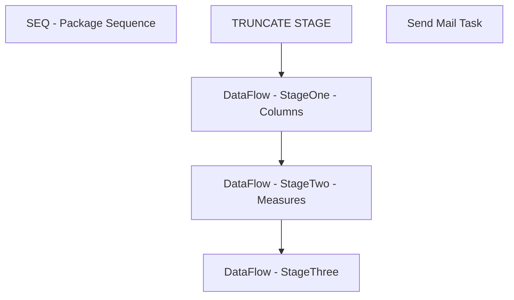

# SSIS Package: AzureDataDictionary

**Project:** AzureDataDictionary  
**Folder:** Azure  
**Server:** STL-SSIS-P-01  

## Connection Managers

| Name | Type | Server | Catalog | Connection (sanitized) |
|---|---|---|---|---|
| AzureQuery | ADO.NET:System.Data.OleDb.OleDbConnection, System.Data, Version=4.0.0.0, Culture=neutral, PublicKeyToken=b77a5c561934e089 | asazure://northcentralus.asazure.windows.net/azasp01 | BABW-DW | Data Source=asazure://northcentralus.asazure.windows.net/azasp01; Initial Catalog=BABW-DW; Provider=MSOLAP.8 |
| DWStaging | OLEDB | papamart | DWStaging | Data Source=papamart; Initial Catalog=DWStaging; Provider=SQLNCLI11.1; Integrated Security=SSPI; Auto Translate=False |
| SMTP | SMTP |  |  |  |

## Control Flow Tasks

| Task | Type |
|---|---|
| AzureDataDictionary | Package |
| SEQ - Package Sequence | SEQUENCE |
| DataFlow - StageOne - Columns | Pipeline |
| DataFlow - StageThree | Pipeline |
| DataFlow - StageTwo - Measures | Pipeline |
| TRUNCATE STAGE | ExecuteSQLTask |
| Send Mail Task | SendMailTask |

## Control Flow Outline

```text
- Send Mail Task [SendMailTask]
- SEQ - Package Sequence [SEQUENCE]
  - DataFlow - StageOne - Columns [Pipeline]
  - DataFlow - StageThree [Pipeline]
  - DataFlow - StageTwo - Measures [Pipeline]
  - TRUNCATE STAGE [ExecuteSQLTask]
```

## Architecture Diagram



## Variables

| Namespace | Name | Expression-bound |
|---|---|---|
| System | Propagate | No |
| User | DateTimeStamp | Yes |
| User | EndDate | Yes |
| User | EndDateAsDATE | Yes |
| User | GetDate | Yes |
| User | GetDateAsDATE | Yes |
| User | StartDate | Yes |
| User | StartDateAsDATE | Yes |

### Expression-bound variable values

#### User::DateTimeStamp

**Expression:**

```sql
(DT_WSTR,4)DATEPART("yyyy",GetDate()) 
+ (DT_WSTR,4)DATEPART("mm",GetDate()) 
+ (DT_WSTR,4)DATEPART("dd",GetDate()) 
+ (DT_WSTR,4)DATEPART("hh",GetDate()) 
+ (DT_WSTR,4)DATEPART("mi",GetDate()) 
+ (DT_WSTR,4)DATEPART("ss",GetDate()) 
+ (DT_WSTR,4)DATEPART("ms",GetDate())
```

**Evaluated value:**

```sql
2021101495329237
```

#### User::EndDate

**Expression:**

```sql
dateadd("dd", @[$Package::DaysToInclude], @[User::StartDate])
```

**Evaluated value:**

```sql
10/14/2021
```

#### User::EndDateAsDATE

**Expression:**

```sql
(DT_WSTR, 4) datepart("year", @[User::EndDate])  + "-" +
right("0"+ (DT_WSTR, 2) datepart("mm", @[User::EndDate]),2)  + "-" +
right("0" +(DT_WSTR, 2) datepart("dd",  @[User::EndDate]),2)
```

**Evaluated value:**

```sql
2021-10-14
```

#### User::GetDate

**Expression:**

```sql
(DT_DATE)DATEDIFF("Day", (DT_DATE) 0, GETDATE())
```

**Evaluated value:**

```sql
10/14/2021
```

#### User::GetDateAsDATE

**Expression:**

```sql
(DT_WSTR, 4) datepart("year", @[User::GetDate])  + "-" +
right("0"+ (DT_WSTR, 2) datepart("mm", @[User::GetDate]),2)  + "-" +
right("0" +(DT_WSTR, 2) datepart("dd",  @[User::GetDate]),2)
```

**Evaluated value:**

```sql
2021-10-14
```

#### User::StartDate

**Expression:**

```sql
dateadd("dd", -@[$Package::DaysToGoBack] , @[User::GetDate] )
```

**Evaluated value:**

```sql
10/13/2021
```

#### User::StartDateAsDATE

**Expression:**

```sql
(DT_WSTR, 4) datepart("year", @[User::StartDate])  + "-" +
right("0"+ (DT_WSTR, 2) datepart("mm", @[User::StartDate]),2)  + "-" +
right("0" +(DT_WSTR, 2) datepart("dd",  @[User::StartDate]),2)
```

**Evaluated value:**

```sql
2021-10-13
```

## Execute SQL Tasks

### TRUNCATE STAGE

**Path:** `Package\SEQ - Package Sequence\TRUNCATE STAGE`  
**Connection:** DWStaging (papamart/DWStaging)  

```sql
TRUNCATE TABLE AzureDataDictionaryStageOne
TRUNCATE TABLE AzureDataDictionaryStageTwo
TRUNCATE TABLE AzureDataDictionaryStageThree

```

## Data Flow: Sources

| Component | Source Object | Type | Data Flow Task | Connection | SQL Kind |
|---|---|---|---|---|---|
| AzureTableMetaInDW |  | OLEDBSource | DataFlow - StageOne - Columns | DWStaging | SqlCommand |
| AzureDataDictionaryStageTwo |  | OLEDBSource | DataFlow - StageThree | DWStaging | SqlCommand |
| ViewDefinition |  | OLEDBSource | DataFlow - StageThree | DWStaging | SqlCommand |
| AzureDataDictionaryStageOne |  | OLEDBSource | DataFlow - StageTwo - Measures | DWStaging | SqlCommand |

#### AzureTableMetaInDW — SqlCommand

```sql
with 
Base as 
	(
		select 
			TableName,
			substring(QueryDefinition,(charindex('Item="', QueryDefinition)),1000) Base
		from azuretablemeta
		group by 
			TableName,
			substring(QueryDefinition,(charindex('Item="', QueryDefinition)),1000)
	),
Base2 as
	(
		select 
			TableName,
			substring(Base,charindex('"',Base)+1, 1000) Base
		from Base
		group by 
			TableName,
			substring(Base,charindex('"',Base)+1, 1000) 
	)
select
	TableName,
	cast(replace(substring(Base,1,charindex('"]',Base)),'"','') as varchar(100)) as SourceView	
from Base2 
group by 
	TableName,
	replace(substring(Base,1,charindex('"]',Base)),'"','')
```

#### AzureDataDictionaryStageTwo — SqlCommand

```sql
select 
	--replace(replace(substring(Table_ID, charindex('(', Table_ID), 100),'(',''),')','') as TableID,
	Dimension_Name as TableName,
	cast(Dimension_Name as nvarchar(100)) as DisplayFolder,
	'Column' as ColumnOrMeasure,
	Attribute_Name as ColumnName,
	Concat(Dimension_Name, '.', Attribute_Name) as Expression,
	SourceView
from AzureDataDictionaryStageOne
where table_id not like ('R$%')
and table_id not like ('H$%')
and Attribute_Name not like 'RowNumber-%'
UNION
select 
	TableName,
	cast(concat(TableName,'\',DisplayFolder) as nvarchar(100)) as DisplayFolder,
	'Measure' as ColumnOrMeasure,
	Name as MeasureName,	
	Expression,
	SourceView
from AzureDataDictionaryStageTwo
```

#### ViewDefinition — SqlCommand

```sql
with 
AzureViews as
	(
		select
			o.name ViewName,
			m.definition ViewDefinition
		from dw.sys.objects o
		join dw.sys.schemas s on s.schema_id = o.schema_id
		join dw.sys.sql_modules m on o.object_id = m.object_id
		where o.type_desc='view'
		and s.name <>'domo'
		--and o.name='vwNameMeTransactionFact'
		group by o.name,m.definition
	)
select 
	--cast(replace(replace(substring(s1.Table_ID, charindex('(', s1.Table_ID), 100),'(',''),')','') as int) as TableID,
	--s1.Dimension_Name as TableName,
	s1.SourceView,
	av.ViewDefinition
from AzureDataDictionaryStageOne s1
left join AzureViews av on s1.SourceView=av.ViewName
where s1.table_id not like ('R$%')
and s1.table_id not like ('H$%')
and s1.Attribute_Name not like 'RowNumber-%'
group by 
	replace(replace(substring(s1.Table_ID, charindex('(', s1.Table_ID), 100),'(',''),')',''),
	s1.Dimension_Name,
	s1.SourceView,
	av.ViewDefinition
```

#### AzureDataDictionaryStageOne — SqlCommand

```sql
select 
	cast(replace(replace(substring(Table_ID, charindex('(', Table_ID), 100),'(',''),')','') as int) as TableID,
	Dimension_Name as TableName,
SourceView
from AzureDataDictionaryStageOne
where table_id not like ('R$%')
and table_id not like ('H$%')
and Attribute_Name not like 'RowNumber-%'
group by 
	replace(replace(substring(Table_ID, charindex('(', Table_ID), 100),'(',''),')',''),
	Dimension_Name,
SourceView
```

## Data Flow: Destinations

| Component | Target Table | Type | Data Flow Task | Connection | SQL Kind |
|---|---|---|---|---|---|
| AzureDataDictionaryStageOne |  | OLEDBDestination | DataFlow - StageOne - Columns | DWStaging |  |
| AzureDataDictionaryStageThree |  | OLEDBDestination | DataFlow - StageThree | DWStaging |  |
| AzureDataDictionaryStageTwo |  | OLEDBDestination | DataFlow - StageTwo - Measures | DWStaging |  |
