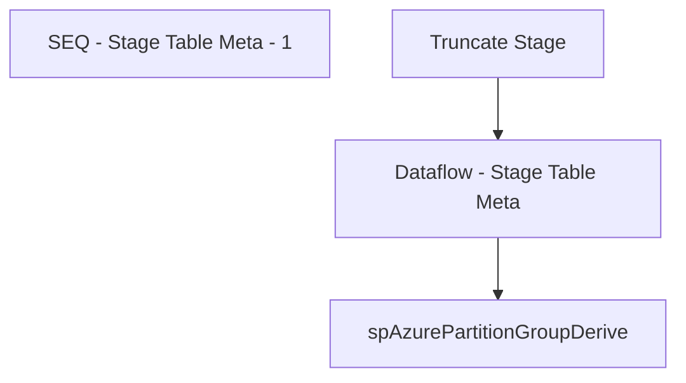

# SSIS Package: AzurePartitionsMetaDownload

**Project:** AzurePartitionsMetaDownload  
**Folder:** Azure  
**Server:** STL-SSIS-P-01  

## Connection Managers

| Name | Type | Server | Catalog | Connection (sanitized) |
|---|---|---|---|---|
| AzureQuery | ADO.NET:System.Data.OleDb.OleDbConnection, System.Data, Version=4.0.0.0, Culture=neutral, PublicKeyToken=b77a5c561934e089 | asazure://northcentralus.asazure.windows.net/azasp01 | BABW-DW | Data Source=asazure://northcentralus.asazure.windows.net/azasp01; Initial Catalog=BABW-DW; Provider=MSOLAP.8 |
| DWStaging | OLEDB | papamart | DWStaging | Data Source=papamart; Initial Catalog=DWStaging; Provider=SQLNCLI11.1; Integrated Security=SSPI; Auto Translate=False |

## Control Flow Tasks

| Task | Type |
|---|---|
| AzurePartitionsMetaDownload | Package |
| SEQ - Stage Table Meta - 1 | SEQUENCE |
| Dataflow - Stage Table Meta | Pipeline |
| spAzurePartitionGroupDerive | ExecuteSQLTask |
| Truncate Stage | ExecuteSQLTask |

## Control Flow Outline

```text
- SEQ - Stage Table Meta - 1 [SEQUENCE]
  - Dataflow - Stage Table Meta [Pipeline]
  - Truncate Stage [ExecuteSQLTask]
  - spAzurePartitionGroupDerive [ExecuteSQLTask]
```

## Architecture Diagram



## Variables

| Namespace | Name | Expression-bound |
|---|---|---|
| User | AzureCreatePartitionsStopDate | No |
| User | CreatePartitionFilterColumn | No |
| User | CreatePartitionVariables | No |
| User | CreatePartitionsAzureViewName | No |
| User | CreatePartitionsPartitionName | No |
| User | CreatePartitionsStartDate | No |
| User | CreatePartitionsTableName | No |
| User | CreatePartitionsViewName | No |
| User | DeletePartitionsTableName | No |
| User | DeletePartitionsVariables | No |

## Execute SQL Tasks

### Truncate Stage

**Path:** `Package\SEQ - Stage Table Meta - 1\Truncate Stage`  
**Connection:** DWStaging (papamart/DWStaging)  

```sql
TRUNCATE TABLE AzureTableMeta
```

### spAzurePartitionGroupDerive

**Path:** `Package\SEQ - Stage Table Meta - 1\spAzurePartitionGroupDerive`  
**Connection:** DWStaging (papamart/DWStaging)  

```sql
exec spAzurePartitionGroupDerive
```

## Data Flow: Sources

_None detected._

## Data Flow: Destinations

| Component | Target Table | Type | Data Flow Task | Connection | SQL Kind |
|---|---|---|---|---|---|
| AzureTableMeta |  | OLEDBDestination | Dataflow - Stage Table Meta | DWStaging |  |
