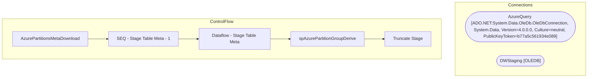

# SSIS Package: AzurePartitionsMetaDownload

**Project:** AzurePartitionsMetaDownload  
**Folder:** Azure  
**Server:** STL-SSIS-P-01  

## Architecture Diagram

## Connection Managers

| Name | Type |
|---|---|
| AzureQuery | ADO.NET:System.Data.OleDb.OleDbConnection, System.Data, Version=4.0.0.0, Culture=neutral, PublicKeyToken=b77a5c561934e089 |
| DWStaging | OLEDB |

## Control Flow Tasks

| Task | Type |
|---|---|
| AzurePartitionsMetaDownload | Microsoft.Package |
| SEQ - Stage Table Meta - 1 | STOCK:SEQUENCE |
| Dataflow - Stage Table Meta | Microsoft.Pipeline |
| spAzurePartitionGroupDerive | Microsoft.ExecuteSQLTask |
| Truncate Stage | Microsoft.ExecuteSQLTask |

## Data Flow: Sources

_None detected._

## Data Flow: Destinations

| Component | Destination |
|---|---|
|  | [dbo].[AzureTableMeta] |

