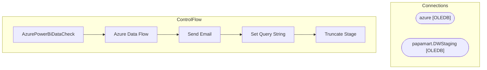

# SSIS Package: AzurePowerBiDataCheck

**Project:** AzurePowerBIDataCheck  
**Folder:** Azure  
**Server:** STL-SSIS-P-01  

## Architecture Diagram

## Connection Managers

| Name | Type |
|---|---|
| azure | OLEDB |
| papamart.DWStaging | OLEDB |

## Control Flow Tasks

| Task | Type |
|---|---|
| AzurePowerBiDataCheck | Microsoft.Package |
| Azure Data Flow | Microsoft.Pipeline |
| Send Email | Microsoft.ExecuteSQLTask |
| Set Query String | Microsoft.ExecuteSQLTask |
| Truncate Stage | Microsoft.ExecuteSQLTask |

## Data Flow: Sources

| Component | SQL Preview |
|---|---|
|  | SELECT NON EMPTY { [Measures].[TotalTransactions] } ON COLUMNS, NON EMPTY { ([NewDateDim].[Date_Key].[Date_Key].ALLMEMBERS * [Stores].[TradingGroup].[TradingGroup].ALLMEMBERS ) } DIMENSION PROPERTIES MEMBER_CAPTION, MEMBER_UNIQUE_NAME ON ROWS FROM ( SELECT ( { [NewDateDim].[Date_Key].&[2019-03-03T00:00:00] } ) ON COLUMNS FROM ( SELECT ( { [Stores].[TradingGroup].&[North America], [Stores].[Trading |

## Data Flow: Destinations

| Component | Destination |
|---|---|
|  | [AzureDataCheck] |

