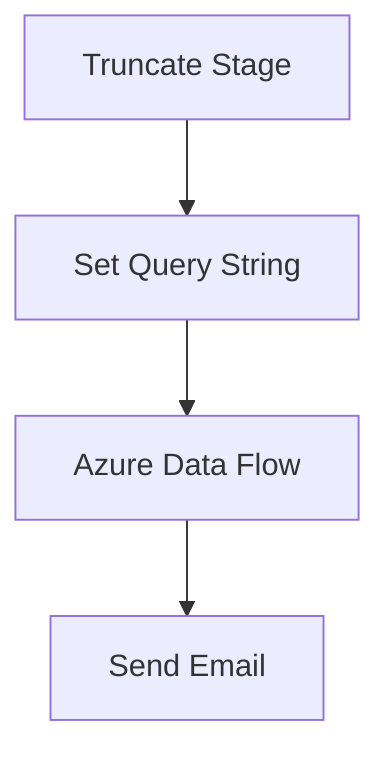

# SSIS Package: AzurePowerBiDataCheck

**Project:** AzurePowerBIDataCheck  
**Folder:** Azure  
**Server:** STL-SSIS-P-01  

## Connection Managers

| Name | Type | Server | Catalog | Connection (sanitized) |
|---|---|---|---|---|
| azure | OLEDB | asazure://northcentralus.asazure.windows.net/azasp01 | babw-dw | Data Source=asazure://northcentralus.asazure.windows.net/azasp01; Initial Catalog=babw-dw; Provider=MSOLAP; Impersonation Level=Impersonate; format=tabular |
| papamart.DWStaging | OLEDB | papamart | DWStaging | Data Source=papamart; Initial Catalog=DWStaging; Provider=SQLNCLI11.1; Integrated Security=SSPI; Auto Translate=False |

## Control Flow Tasks

| Task | Type |
|---|---|
| AzurePowerBiDataCheck | Package |
| Azure Data Flow | Pipeline |
| Send Email | ExecuteSQLTask |
| Set Query String | ExecuteSQLTask |
| Truncate Stage | ExecuteSQLTask |

## Control Flow Outline

```text
- Azure Data Flow [Pipeline]
- Send Email [ExecuteSQLTask]
- Set Query String [ExecuteSQLTask]
- Truncate Stage [ExecuteSQLTask]
```

## Architecture Diagram



## Variables

| Namespace | Name | Expression-bound |
|---|---|---|
| User | AzureQueryString | No |

## Execute SQL Tasks

### Send Email

**Path:** `Package\Send Email`  
**Connection:** papamart.DWStaging (papamart/DWStaging)  

```sql
exec spEmailAzureDataCheck
```

### Set Query String

**Path:** `Package\Set Query String`  
**Connection:** papamart.DWStaging (papamart/DWStaging)  

```sql
declare 
	@DateString varchar(100),
	@QueryString varchar(1000)

select @DateString = concat(cast(getdate()-1 as date), 'T00:00:00')

select @QueryString = 
'SELECT NON EMPTY { [Measures].[TotalTransactions] } ON COLUMNS, NON EMPTY { ([NewDateDim].[Date_Key].[Date_Key].ALLMEMBERS * [Stores].[TradingGroup].[TradingGroup].ALLMEMBERS ) } DIMENSION PROPERTIES MEMBER_CAPTION, MEMBER_UNIQUE_NAME ON ROWS FROM ( SELECT ( { [NewDateDim].[Date_Key].&[' + @DateString + '] } ) ON COLUMNS FROM ( SELECT ( { [Stores].[TradingGroup].&[North America], [Stores].[TradingGroup].&[Europe] } ) ON COLUMNS FROM [Model]))'


select @QueryString as QueryString

```

### Truncate Stage

**Path:** `Package\Truncate Stage`  
**Connection:** papamart.DWStaging (papamart/DWStaging)  

```sql
TRUNCATE TABLE AzureDataCheck
```

## Data Flow: Sources

| Component | Source Object | Type | Data Flow Task | Connection | SQL Kind |
|---|---|---|---|---|---|
| Azure |  | OLEDBSource | Azure Data Flow | azure | SqlCommand |

#### Azure — SqlCommand

```sql
SELECT NON EMPTY { [Measures].[TotalTransactions] } ON COLUMNS, NON EMPTY { ([NewDateDim].[Date_Key].[Date_Key].ALLMEMBERS * [Stores].[TradingGroup].[TradingGroup].ALLMEMBERS ) } DIMENSION PROPERTIES MEMBER_CAPTION, MEMBER_UNIQUE_NAME ON ROWS FROM ( SELECT ( { [NewDateDim].[Date_Key].&[2019-03-03T00:00:00] } ) ON COLUMNS FROM ( SELECT ( { [Stores].[TradingGroup].&[North America], [Stores].[TradingGroup].&[Europe] } ) ON COLUMNS FROM [Model]))
```

## Data Flow: Destinations

| Component | Target Table | Type | Data Flow Task | Connection | SQL Kind |
|---|---|---|---|---|---|
| AzureDataCheck |  | OLEDBDestination | Azure Data Flow | papamart.DWStaging |  |
