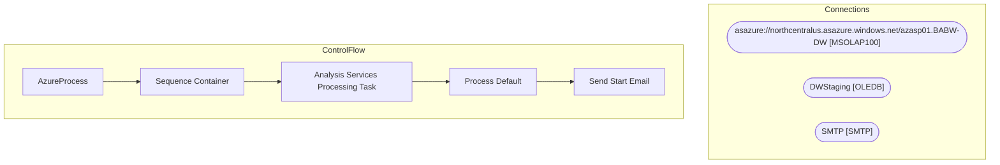

# SSIS Package: AzureProcess

**Project:** AzureProcess  
**Folder:** Azure  
**Server:** STL-SSIS-P-01  

## Architecture Diagram

## Connection Managers

| Name | Type |
|---|---|
| asazure://northcentralus.asazure.windows.net/azasp01.BABW-DW | MSOLAP100 |
| DWStaging | OLEDB |
| SMTP | SMTP |

## Control Flow Tasks

| Task | Type |
|---|---|
| AzureProcess | Microsoft.Package |
| Sequence Container | STOCK:SEQUENCE |
| Analysis Services Processing Task | Microsoft.DTSProcessingTask |
| Process Default | Microsoft.ASExecuteDDLTask |
| Send Start Email | Microsoft.SendMailTask |

## Data Flow: Sources

_None detected._

## Data Flow: Destinations

_None detected._

