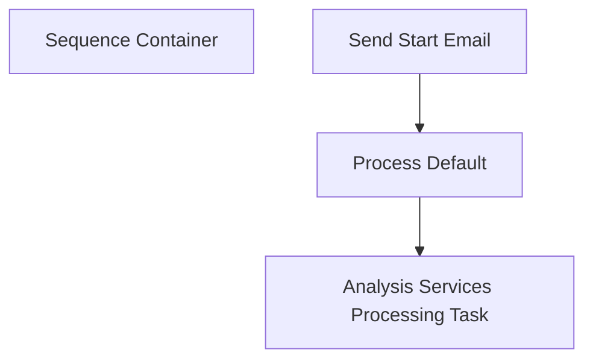

# SSIS Package: AzureProcess

**Project:** AzureProcess  
**Folder:** Azure  
**Server:** STL-SSIS-P-01  

## Connection Managers

| Name | Type | Server | Catalog | Connection (sanitized) |
|---|---|---|---|---|
| DWStaging | OLEDB | papamart | DWStaging | Data Source=papamart; Initial Catalog=DWStaging; Provider=SQLNCLI11.1; Integrated Security=SSPI; Auto Translate=False |
| SMTP | SMTP |  |  |  |
| asazure://northcentralus.asazure.windows.net/azasp01.BABW-DW | MSOLAP100 | asazure://northcentralus.asazure.windows.net/azasp01 | BABW-DW | Data Source=asazure://northcentralus.asazure.windows.net/azasp01; Initial Catalog=BABW-DW; Provider=MSOLAP.7 |

## Control Flow Tasks

| Task | Type |
|---|---|
| AzureProcess | Package |
| Sequence Container | SEQUENCE |
| Analysis Services Processing Task | DTSProcessingTask |
| Process Default | ASExecuteDDLTask |
| Send Start Email | SendMailTask |

## Control Flow Outline

```text
- Sequence Container [SEQUENCE]
  - Analysis Services Processing Task [DTSProcessingTask]
  - Process Default [ASExecuteDDLTask]
  - Send Start Email [SendMailTask]
```

## Architecture Diagram



## Variables

| Namespace | Name | Expression-bound |
|---|---|---|
| User | AzureQueryString | No |

## Execute SQL Tasks

_None detected._

## Data Flow: Sources

_None detected._

## Data Flow: Destinations

_None detected._
