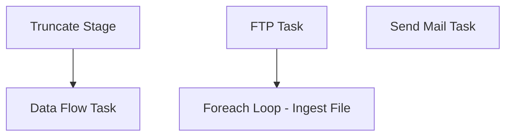

# SSIS Package: DBS_ViewShipmentsIngest

**Project:** DBS_ViewShipmentsIngest  
**Folder:** Azure  
**Server:** STL-SSIS-P-01  

## Connection Managers

| Name | Type | Server | Catalog | Connection (sanitized) |
|---|---|---|---|---|
| FTP Connection Manager | FTP |  |  |  |
| IntegrationStaging | OLEDB | stl-ssis-p-01 | IntegrationStaging | Data Source=stl-ssis-p-01; Initial Catalog=IntegrationStaging; Provider=SQLNCLI11.1; Integrated Security=SSPI; Auto Translate=False |
| SMTP | SMTP |  |  |  |

## Control Flow Tasks

| Task | Type |
|---|---|
| DBS_ViewShipmentsIngest | Package |
| Foreach Loop - Ingest File | FOREACHLOOP |
| Data Flow Task | Pipeline |
| Truncate Stage | ExecuteSQLTask |
| FTP Task | FtpTask |
| Send Mail Task | SendMailTask |

## Control Flow Outline

```text
- Send Mail Task [SendMailTask]
- FTP Task [FtpTask]
- Foreach Loop - Ingest File [FOREACHLOOP]
  - Data Flow Task [Pipeline]
  - Truncate Stage [ExecuteSQLTask]
```

## Architecture Diagram



## Variables

| Namespace | Name | Expression-bound |
|---|---|---|
| System | Propagate | No |
| User | CustomerNote | No |
| User | CustomerNoteFileName | No |
| User | CustomerNoteProcessGroup | No |
| User | CustomerNumber | No |
| User | DBS_ViewShipmentsFileNameForLoop | No |
| User | DateTimeStamp | Yes |
| User | EndDate | Yes |
| User | EndDateAsDATE | Yes |
| User | GetDate | Yes |
| User | GetDateAsDATE | Yes |
| User | StartDate | Yes |
| User | StartDateAsDATE | Yes |
| User | StoreInventoryZipForLoop | No |
| User | ZipExecutionPath | No |
| User | ZipPath | No |
| User | ZipUnzipPath | No |

### Expression-bound variable values

#### User::DateTimeStamp

**Expression:**

```sql
(DT_WSTR,4)DATEPART("yyyy",GetDate()) 
+ (DT_WSTR,4)DATEPART("mm",GetDate()) 
+ (DT_WSTR,4)DATEPART("dd",GetDate()) 
+ (DT_WSTR,4)DATEPART("hh",GetDate()) 
+ (DT_WSTR,4)DATEPART("mi",GetDate()) 
+ (DT_WSTR,4)DATEPART("ss",GetDate()) 
+ (DT_WSTR,4)DATEPART("ms",GetDate())
```

**Evaluated value:**

```sql
20263108401103
```

#### User::EndDate

**Expression:**

```sql
dateadd("dd", @[$Package::DaysToInclude], @[User::StartDate])
```

**Evaluated value:**

```sql
3/10/2026
```

#### User::EndDateAsDATE

**Expression:**

```sql
(DT_WSTR, 4) datepart("year", @[User::EndDate])  + "-" +
right("0"+ (DT_WSTR, 2) datepart("mm", @[User::EndDate]),2)  + "-" +
right("0" +(DT_WSTR, 2) datepart("dd",  @[User::EndDate]),2)
```

**Evaluated value:**

```sql
2026-03-10
```

#### User::GetDate

**Expression:**

```sql
(DT_DATE)DATEDIFF("Day", (DT_DATE) 0, GETDATE())
```

**Evaluated value:**

```sql
3/10/2026
```

#### User::GetDateAsDATE

**Expression:**

```sql
(DT_WSTR, 4) datepart("year", @[User::GetDate])  + "-" +
right("0"+ (DT_WSTR, 2) datepart("mm", @[User::GetDate]),2)  + "-" +
right("0" +(DT_WSTR, 2) datepart("dd",  @[User::GetDate]),2)
```

**Evaluated value:**

```sql
2026-03-10
```

#### User::StartDate

**Expression:**

```sql
dateadd("dd", -@[$Package::DaysToGoBack] , @[User::GetDate] )
```

**Evaluated value:**

```sql
3/9/2026
```

#### User::StartDateAsDATE

**Expression:**

```sql
(DT_WSTR, 4) datepart("year", @[User::StartDate])  + "-" +
right("0"+ (DT_WSTR, 2) datepart("mm", @[User::StartDate]),2)  + "-" +
right("0" +(DT_WSTR, 2) datepart("dd",  @[User::StartDate]),2)
```

**Evaluated value:**

```sql
2026-03-09
```

## Execute SQL Tasks

### Truncate Stage

**Path:** `Package\Foreach Loop - Ingest File\Truncate Stage`  
**Connection:** IntegrationStaging (stl-ssis-p-01/IntegrationStaging)  

```sql
TRUNCATE TABLE DBS_ViewShipmentsStage
```

## Data Flow: Sources

_None detected._

## Data Flow: Destinations

| Component | Target Table | Type | Data Flow Task | Connection | SQL Kind |
|---|---|---|---|---|---|
| DBS_ViewShipmentsStage |  | OLEDBDestination | Data Flow Task | IntegrationStaging |  |
