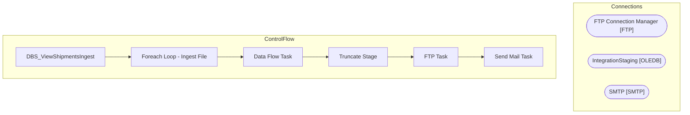

# SSIS Package: DBS_ViewShipmentsIngest

**Project:** DBS_ViewShipmentsIngest  
**Folder:** Azure  
**Server:** STL-SSIS-P-01  

## Architecture Diagram

## Connection Managers

| Name | Type |
|---|---|
| FTP Connection Manager | FTP |
| IntegrationStaging | OLEDB |
| SMTP | SMTP |

## Control Flow Tasks

| Task | Type |
|---|---|
| DBS_ViewShipmentsIngest | Microsoft.Package |
| Foreach Loop - Ingest File | STOCK:FOREACHLOOP |
| Data Flow Task | Microsoft.Pipeline |
| Truncate Stage | Microsoft.ExecuteSQLTask |
| FTP Task | Microsoft.FtpTask |
| Send Mail Task | Microsoft.SendMailTask |

## Data Flow: Sources

_None detected._

## Data Flow: Destinations

| Component | Destination |
|---|---|
|  | [DBS_ViewShipmentsStage] |

