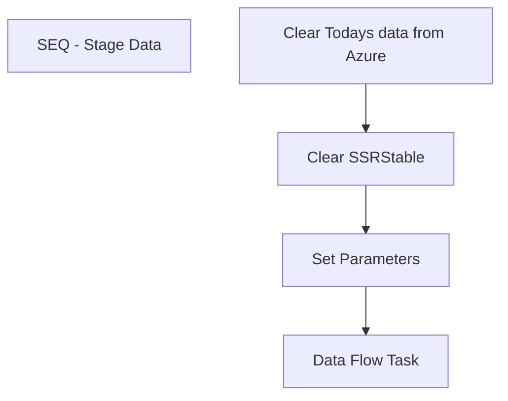

# SSIS Package: DailyInventoryPowerBI

**Project:** DailyInventoryPowerBI  
**Folder:** Azure  
**Server:** STL-SSIS-P-01  

## Connection Managers

| Name | Type | Server | Catalog | Connection (sanitized) |
|---|---|---|---|---|
| Azure | MSOLAP100 | asazure://northcentralus.asazure.windows.net/azasp01 | BABW-DW | Data Source=asazure://northcentralus.asazure.windows.net/azasp01; Initial Catalog=BABW-DW; Provider=MSOLAP.7 |
| DW | OLEDB | papamart | dw | Data Source=papamart; Initial Catalog=dw; Provider=SQLNCLI11.1; Integrated Security=SSPI; Auto Translate=False |
| IntegrationStaging | OLEDB | STL-SSIS-P-01 | IntegrationStaging | Data Source=STL-SSIS-P-01; Initial Catalog=IntegrationStaging; Provider=SQLNCLI11.1; Integrated Security=SSPI; Auto Translate=False |
| MA_01 | OLEDB | bedrockdb02 | ma_01 | Data Source=bedrockdb02; Initial Catalog=ma_01; Provider=SQLNCLI11.1; Integrated Security=SSPI; Auto Translate=False |
| ME_01 | OLEDB | bedrockdb02 | me_01 | Data Source=bedrockdb02; Initial Catalog=me_01; Provider=SQLNCLI11.1; Integrated Security=SSPI; Auto Translate=False |
| WebOrderProcessing | OLEDB | BEARCLUSTER01.SQL.BUILDABEAR.COM | WebOrderProcessing | Data Source=BEARCLUSTER01.SQL.BUILDABEAR.COM; Initial Catalog=WebOrderProcessing; Provider=SQLNCLI11.1; Integrated Security=SSPI; Auto Translate=False |

## Control Flow Tasks

| Task | Type |
|---|---|
| DailyInventoryPowerBI | Package |
| SEQ - Stage Data | SEQUENCE |
| Clear SSRStable | ExecuteSQLTask |
| Clear Todays data from Azure | ExecuteSQLTask |
| Data Flow Task | Pipeline |
| Set Parameters | ExecuteSQLTask |

## Control Flow Outline

```text
- SEQ - Stage Data [SEQUENCE]
  - Clear SSRStable [ExecuteSQLTask]
  - Clear Todays data from Azure [ExecuteSQLTask]
  - Data Flow Task [Pipeline]
  - Set Parameters [ExecuteSQLTask]
```

## Architecture Diagram



## Variables

| Namespace | Name | Expression-bound |
|---|---|---|
| User | MonthBeginDate | No |

## Execute SQL Tasks

### Clear SSRStable

**Path:** `Package\SEQ - Stage Data\Clear SSRStable`  
**Connection:** IntegrationStaging (STL-SSIS-P-01/IntegrationStaging)  

```sql
truncate table DailyInventoryReport

```

### Clear Todays data from Azure

**Path:** `Package\SEQ - Stage Data\Clear Todays data from Azure`  
**Connection:** DW (papamart/dw)  

```sql
delete from azure.DailyInventory where DateKey = Cast(GetDate() as Date)
truncate table azure.WebActiveDate
```

### Set Parameters

**Path:** `Package\SEQ - Stage Data\Set Parameters`  
**Connection:** DW (papamart/dw)  

```sql
select min(actual_date) as StartDate from date_dim
where fiscal_period = (select Fiscal_Period from date_dim where actual_date = Cast( GETDATE() as Date)) and
fiscal_year = (select Fiscal_Year from date_dim where actual_date = Cast( GETDATE() as Date))
```

## Data Flow: Sources

| Component | Source Object | Type | Data Flow Task | Connection | SQL Kind |
|---|---|---|---|---|---|
| Intransit |  | OLEDBSource | Data Flow Task | ME_01 | SqlCommand |
| LastWeeksSales |  | OLEDBSource | Data Flow Task | WebOrderProcessing | SqlCommand |
| MTDSales |  | OLEDBSource | Data Flow Task | WebOrderProcessing | SqlCommand |
| OH AvailableQTY |  | OLEDBSource | Data Flow Task | ME_01 | SqlCommand |
| OLE DB Source |  | OLEDBSource | Data Flow Task | IntegrationStaging | SqlCommand |
| OLE DB Source 1 1 |  | OLEDBSource | Data Flow Task | ME_01 | SqlCommand |
| OLE DB Source 2 |  | OLEDBSource | Data Flow Task | WebOrderProcessing | SqlCommand |
| OLE DB Source 3 |  | OLEDBSource | Data Flow Task | ME_01 | SqlCommand |
| WTDDateSales |  | OLEDBSource | Data Flow Task | WebOrderProcessing | SqlCommand |
| YesterdaySales |  | OLEDBSource | Data Flow Task | WebOrderProcessing | SqlCommand |

#### Intransit — SqlCommand

```sql
SELECT        
	isd.inventory_status_desc, 
	CASE 
		WHEN l.location_code = '0013' 
			THEN 'US' 
		ELSE 'UK' 
	END AS location_code, 
	s.style_code, 
	SUM(m.total_on_hand_units) AS Total_Intransit, 
	s.order_multiple
FROM view_ib_inv_total_metadata AS m 
INNER JOIN inventory_status_data AS isd ON isd.inventory_status_id = m.inventory_status_id 
INNER JOIN sku AS sk ON sk.sku_id = m.sku_id 
INNER JOIN style AS s ON s.style_id = sk.style_id 
INNER JOIN location AS l ON l.location_id = m.location_id
WHERE l.location_code in ('0013', '2013')
and m.inventory_status_id = '2'
GROUP BY 
	isd.inventory_status_desc, 
	l.location_code,
	s.style_code, 
	s.order_multiple
ORDER BY s.style_code, location_code
```

#### LastWeeksSales — SqlCommand

```sql
SELECT        WM.OrderItems.sku, SUM(WM.OrderItems.qty) AS LastWeeksSales, RIGHT(WM.Orders.SourceSite, 2) AS LocationCode,
sum(Case isnull(cast(EnterpriseSellingID as bigint),0) when 0 then 0 else OrderItems.QTY end) as LWEnterpriseSales
FROM            WM.Orders INNER JOIN
                         WM.OrderItems ON WM.Orders.OrderId = WM.OrderItems.OrderId INNER JOIN
                         WM.ItemStatus ON WM.Orders.OrderId = WM.ItemStatus.OrderID AND WM.OrderItems.OrderItemID = WM.ItemStatus.OrderItemID
WHERE        (WM.ItemStatus.Status <> 'IV') AND 
(Cast(WM.Orders.OrderDate as Date) between Cast(GETDATE() - (DATEPART(dw, GETDATE())+6 ) as Date) and
 Cast(GETDATE() - (DATEPART(dw, GETDATE()) ) as Date) ) 
AND (WM.ItemStatus.CurrentStatus = 1)
GROUP BY WM.OrderItems.sku, RIGHT(WM.Orders.SourceSite, 2)
ORDER BY WM.OrderItems.sku, LocationCode
```

#### MTDSales — SqlCommand

```sql
SELECT        WM.OrderItems.sku, SUM(WM.OrderItems.qty) AS MTDSales, RIGHT(WM.Orders.SourceSite, 2) AS LocationCode,
sum(Case isnull(cast(EnterpriseSellingID as bigint),0) when 0 then 0 else OrderItems.QTY end) as MTDEnterpriseSales
FROM            WM.Orders INNER JOIN
                         WM.OrderItems ON WM.Orders.OrderId = WM.OrderItems.OrderId INNER JOIN
                         WM.ItemStatus ON WM.Orders.OrderId = WM.ItemStatus.OrderID AND WM.OrderItems.OrderItemID = WM.ItemStatus.OrderItemID
WHERE        (WM.ItemStatus.Status <> 'IV') AND 
Cast(WM.Orders.OrderDate as Date)between ? AND Cast(GETDATE() as Date) AND 
                         (WM.ItemStatus.CurrentStatus = 1)
GROUP BY WM.OrderItems.sku, RIGHT(WM.Orders.SourceSite, 2)
ORDER BY WM.OrderItems.sku, LocationCode
```

#### OH AvailableQTY — SqlCommand

```sql
With D as(
select  'US' as LocationCode,
s.style_code,
0 as available,
isnull(sum(ia.allocated_units),0) as allocated
from sku sk with (nolock)
join ib_allocation ia with (nolock)
on ia.sku_id = sk.sku_id
join style s with (nolock)
on sk.style_id = s.style_id 
join style_group sg with (nolock)
on s.style_id = sg.style_id
join hierarchy_group hg with (nolock)
on sg.hierarchy_group_id = hg.hierarchy_group_id
join distribution d with (nolock)
on ia.allocation_number = d.distribution_number
join location l with (nolock)
on l.location_id = d.location_id
where l.location_code = '0980'
and isnull(d.po_id,0)=0 and isnull(d.advance_shipping_notice_id,0)=0
and left(hg.hierarchy_group_code,5)  in ('R-B-D','R-B-E','R-B-Z','R-R-R','R-B-U','R-B-C','W-C-J','W-C-K','W-C-M','W-C-N','W-D-J','W-D-K','W-D-M','W-D-N','W-E-J','W-E-K','W-E-M','W-E-N','W-F-J','W-F-K','W-F-M','W-F-N')
group by l.location_code, hg.hierarchy_group_code, s.style_code, s.long_desc

union all 

select 'US' ,
s.style_code,
iit.total_on_hand_units as available,
0 as Allocated
from ib_inventory_total iit with (nolock)
join sku sk with (nolock)
on iit.sku_id = sk.sku_id
join style s with (nolock)
on sk.style_id = s.style_id 
join location l with (nolock)
on iit.location_id = l.location_id
join style_group sg with (nolock)
on s.style_id = sg.style_id
join hierarchy_group hg with (nolock)
on sg.hierarchy_group_id = hg.hierarchy_group_id
where iit.inventory_status_id =1
and l.location_code = '0980'
and left(hg.hierarchy_group_code,5)  in ('R-B-D','R-B-E','R-B-Z','R-R-R','R-B-U','R-B-C','W-C-J','W-C-K','W-C-M','W-C-N','W-D-J','W-D-K','W-D-M','W-D-N','W-E-J','W-E-K','W-E-M','W-E-N','W-F-J','W-F-K','W-F-M','W-F-N')
)

Select LocationCode , style_code,Sum(available)  - sum(allocated) as WareHouseQTY
from d where left(style_code,1) <> '4' 
Group by LocationCode , style_code
order by LocationCode,Style_Code
```

#### OLE DB Source — SqlCommand

```sql
select Style_Code,DisplayName,HierarchyGroupCode,keyStory,mstat,MerchInDate,
UnbufferedQty as Inventory,
UnbufferedQTY - QTY as InventoryBuffer, ProductSellingGeography,ClassName
from WEB.ProductCatalogMasterAttributes M left join web.InventoryFact F
	on m.style_code = f.StyleCode and m.ProductSellingGeography = f.SellingGeography
where ISNULL(locationCode,'0013') in ('0013','2013') and StorefrontEligible = 1
Order by style_Code, ProductSellingGeography
```

#### OLE DB Source 1 1 — SqlCommand

```sql
With D as(
select  'UK' as LocationCode,
s.style_code,
0 as available,
isnull(sum(ia.allocated_units),0) as allocated
from sku sk with (nolock)
join ib_allocation ia with (nolock)
on ia.sku_id = sk.sku_id
join style s with (nolock)
on sk.style_id = s.style_id 
join style_group sg with (nolock)
on s.style_id = sg.style_id
join hierarchy_group hg with (nolock)
on sg.hierarchy_group_id = hg.hierarchy_group_id
join distribution d with (nolock)
on ia.allocation_number = d.distribution_number
join location l with (nolock)
on l.location_id = d.location_id
where l.location_code = '2970'
and isnull(d.po_id,0)=0 and isnull(d.advance_shipping_notice_id,0)=0
and left(hg.hierarchy_group_code,5)  in ('R-B-D','R-B-E','R-B-Z','R-R-R','R-B-U','R-B-C','W-C-J','W-C-K','W-C-M','W-C-N','W-D-J','W-D-K','W-D-M','W-D-N','W-E-J','W-E-K','W-E-M','W-E-N','W-F-J','W-F-K','W-F-M','W-F-N')
group by l.location_code, hg.hierarchy_group_code, s.style_code, s.long_desc

union all 

select 'Uk' ,
s.style_code,
iit.total_on_hand_units as available,
0 as Allocated
from ib_inventory_total iit with (nolock)
join sku sk with (nolock)
on iit.sku_id = sk.sku_id
join style s with (nolock)
on sk.style_id = s.style_id 
join location l with (nolock)
on iit.location_id = l.location_id
join style_group sg with (nolock)
on s.style_id = sg.style_id
join hierarchy_group hg with (nolock)
on sg.hierarchy_group_id = hg.hierarchy_group_id
where iit.inventory_status_id =1
and l.location_code = '2970'
and left(hg.hierarchy_group_code,5)  in ('R-B-D','R-B-E','R-B-Z','R-R-R','R-B-U','R-B-C','W-C-J','W-C-K','W-C-M','W-C-N','W-D-J','W-D-K','W-D-M','W-D-N','W-E-J','W-E-K','W-E-M','W-E-N','W-F-J','W-F-K','W-F-M','W-F-N')
)

Select LocationCode , style_code,Sum(available)  - sum(allocated) as WareHouseQTY
from d where left(style_code,1) = '4'
Group by LocationCode , style_code
```

#### OLE DB Source 2 — SqlCommand

```sql
SELECT        WM.OrderItems.sku, SUM(WM.OrderItems.qty) AS AllocatedSales,
right(sourcesite,2) as LOcationCode
FROM            WM.Orders INNER JOIN
                         WM.OrderItems ON WM.Orders.OrderId = WM.OrderItems.OrderId INNER JOIN
                         WM.ItemStatus ON WM.Orders.OrderId = WM.ItemStatus.OrderID AND WM.OrderItems.OrderItemID = WM.ItemStatus.OrderItemID and currentstatus = 1
WHERE        (WM.ItemStatus.Status in ('IWVP','Waved')) 
GROUP BY WM.OrderItems.sku,right(sourcesite,2)
Order by SKU,right(sourcesite,2)
```

#### OLE DB Source 3 — SqlCommand

```sql
--NEW
select 
	case l.location_code 
		when '0013' 
			then 'US' 
		else 'UK' 
	end as location_code, 
	s.style_code, 
	sum(case when cast(expected_receipt_date as date) <= cast(getdate()+7 as date) then a.allocated_units else 0 end) as Allocated_Units 
from view_ib_allocation a
join sku sk on sk.sku_id=a.sku_id
join style s on s.style_id=sk.style_id
join location l on l.location_id=a.location_id
where l.location_code in ('0013', '2013')
group by l.location_code, s.style_code
having sum(a.allocated_units) <> 0
order by  
	s.style_code, 
	case l.location_code 
		when '0013' 
			then 'US' 
	else 'UK' end

/* --OLD
select case l.location_code when '0013' then 'US' else 'UK' end as location_code, s.style_code, sum(a.allocated_units) as Allocated_Units 
from view_ib_allocation a
join sku sk on sk.sku_id=a.sku_id
join style s on s.style_id=sk.style_id
join location l on l.location_id=a.location_id
where l.location_code in ('0013', '2013')
group by l.location_code, s.style_code
having sum(a.allocated_units) <> 0
order by  s.style_code, case l.location_code when '0013' then 'US' else 'UK' end
*/
```

#### WTDDateSales — SqlCommand

```sql
SELECT        WM.OrderItems.sku, SUM(WM.OrderItems.qty) AS WTDSales, RIGHT(WM.Orders.SourceSite, 2) AS LOcationCode,
sum(Case isnull(cast(EnterpriseSellingID as bigint),0) when 0 then 0 else OrderItems.QTY end) as WTDEnterpriseSales
FROM            WM.Orders INNER JOIN
                         WM.OrderItems ON WM.Orders.OrderId = WM.OrderItems.OrderId INNER JOIN
                         WM.ItemStatus ON WM.Orders.OrderId = WM.ItemStatus.OrderID AND WM.OrderItems.OrderItemID = WM.ItemStatus.OrderItemID
WHERE        (WM.ItemStatus.Status <> 'IV')
 AND (Cast(WM.Orders.OrderDate as Date) Between Cast(GETDATE() - (DATEPART(dw, GETDATE()) - 1) as Date) and 
Cast(GetDate() -1 as Date) )
   AND (WM.ItemStatus.CurrentStatus = 1)
GROUP BY WM.OrderItems.sku, RIGHT(WM.Orders.SourceSite, 2)
ORDER BY WM.OrderItems.sku, LOcationCode
```

#### YesterdaySales — SqlCommand

```sql
SELECT        WM.OrderItems.sku, SUM(WM.OrderItems.qty) AS YesterdaysSales, RIGHT(WM.Orders.SourceSite, 2) AS LocationCode,
sum(Case isnull(cast(EnterpriseSellingID as bigint),0) when 0 then 0 else OrderItems.QTY end) as YesterdaysEnterpriseSales
FROM            WM.Orders INNER JOIN
                         WM.OrderItems ON WM.Orders.OrderId = WM.OrderItems.OrderId INNER JOIN
                         WM.ItemStatus ON WM.Orders.OrderId = WM.ItemStatus.OrderID AND WM.OrderItems.OrderItemID = WM.ItemStatus.OrderItemID
WHERE        (WM.ItemStatus.Status <> 'IV') AND (Cast(WM.Orders.OrderDate as Date) = Cast(GETDATE() - 1 as Date)) AND (WM.ItemStatus.CurrentStatus = 1)
GROUP BY WM.OrderItems.sku, RIGHT(WM.Orders.SourceSite, 2)
ORDER BY WM.OrderItems.sku, LocationCode
```

## Data Flow: Destinations

| Component | Target Table | Type | Data Flow Task | Connection | SQL Kind |
|---|---|---|---|---|---|
| Azure DailyInventory |  | OLEDBDestination | Data Flow Task | DW |  |
| Azure WebActiveDate |  | OLEDBDestination | Data Flow Task | DW |  |
| DailyInventoryReport |  | OLEDBDestination | Data Flow Task | IntegrationStaging |  |
