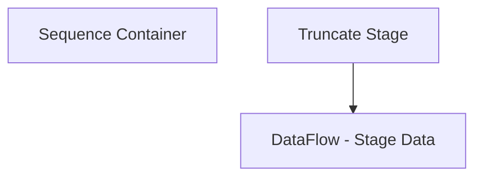

# SSIS Package: DailyInventory_Unshipped

**Project:** DailyInventory_Unshipped  
**Folder:** Azure  
**Server:** STL-SSIS-P-01  

## Connection Managers

| Name | Type | Server | Catalog | Connection (sanitized) |
|---|---|---|---|---|
| DW | OLEDB | papamart | dw | Data Source=papamart; Initial Catalog=dw; Provider=SQLNCLI11.1; Integrated Security=SSPI; Auto Translate=False |
| DWStaging | OLEDB | papamart | DWStaging | Data Source=papamart; Initial Catalog=DWStaging; Provider=SQLNCLI11.1; Integrated Security=SSPI; Auto Translate=False |
| IntegrationStaging | OLEDB | STL-SSIS-P-01 | IntegrationStaging | Data Source=STL-SSIS-P-01; Initial Catalog=IntegrationStaging; Provider=SQLNCLI11.1; Integrated Security=SSPI; Auto Translate=False |
| WebOrderProcessing | OLEDB | bearcluster01.sql.buildabear.com | WebOrderProcessing | Data Source=bearcluster01.sql.buildabear.com; Initial Catalog=WebOrderProcessing; Provider=SQLNCLI11.1; Integrated Security=SSPI; Auto Translate=False |
| azure | MSOLAP100 | asazure://northcentralus.asazure.windows.net/azasp01 | BABW-DW | Data Source=asazure://northcentralus.asazure.windows.net/azasp01; Initial Catalog=BABW-DW; Provider=MSOLAP.7 |
| me_01 | OLEDB | bedrockdb02 | me_01 | Data Source=bedrockdb02; Initial Catalog=me_01; Provider=SQLNCLI11.1; Integrated Security=SSPI; Auto Translate=False |

## Control Flow Tasks

| Task | Type |
|---|---|
| DailyInventory_Unshipped | Package |
| Sequence Container | SEQUENCE |
| DataFlow - Stage Data | Pipeline |
| Truncate Stage | ExecuteSQLTask |

## Control Flow Outline

```text
- Sequence Container [SEQUENCE]
  - DataFlow - Stage Data [Pipeline]
  - Truncate Stage [ExecuteSQLTask]
```

## Architecture Diagram



## Variables

_None detected._

## Execute SQL Tasks

### Truncate Stage

**Path:** `Package\Sequence Container\Truncate Stage`  
**Connection:** DWStaging (papamart/DWStaging)  

```sql
TRUNCATE TABLE tmpUnshippedItemsWithLWunitsSales
```

## Data Flow: Sources

| Component | Source Object | Type | Data Flow Task | Connection | SQL Kind |
|---|---|---|---|---|---|
| UnshippedFromStoreSKUS |  | OLEDBSource | DataFlow - Stage Data | WebOrderProcessing | SqlCommand |

#### UnshippedFromStoreSKUS — SqlCommand

```sql
with 
MaxOrder as
	(
		select 
			o.TransactionID, max(o.OrderNum) OrderNum
		from wm.Orders o with (nolock) 
		join WM.OrderStatus os with (nolock) 
			on o.OrderID=os.OrderID 
			and os.CurrentStatus=1 
			and os.[Status] not in ('Cancelled', 'Complete', 'Shipped')
		where isnull(PickupStore,'') <> ''
		group by o.TransactionID
	)
select 
	right(o.SourceSite,'2') as Country,
	o.PickUpStore, 
	oi.sku ItemNumber, 
	sum(oi.qty) ItemQty
from WM.Orders o with (nolock)
join MaxOrder mo 
	on mo.TransactionID=o.TransactionID
	and mo.OrderNum=o.OrderNum
join WM.OrderStatus os with (nolock) 
	on o.OrderID=os.OrderID 
	and os.CurrentStatus=1 
	and os.[Status] not in ('Cancelled', 'Complete', 'Shipped')
join WM.OrderItems oi with (nolock) on o.OrderID=oi.OrderID
where 1=1
and isnull(o.PickUpStore,'') not in ('', '2013','0013')
and len(oi.sku) = 6
group by 
	right(o.SourceSite,'2'),
	o.PickUpStore, 
	oi.sku
```

## Data Flow: Destinations

| Component | Target Table | Type | Data Flow Task | Connection | SQL Kind |
|---|---|---|---|---|---|
| tmpUnshippedItemsWithLWunitsSales |  | OLEDBDestination | DataFlow - Stage Data | DWStaging |  |
