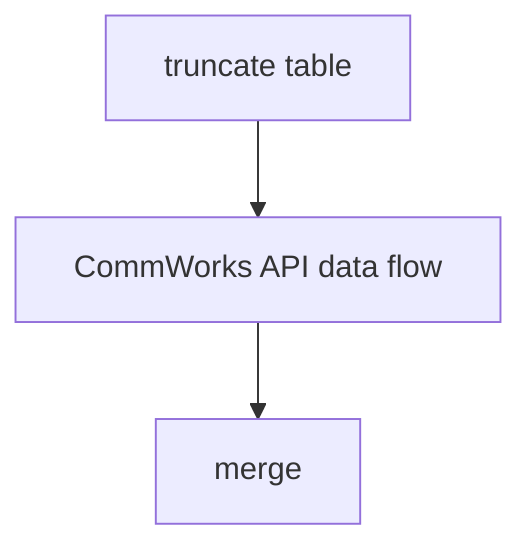

# SSIS Package: IT_CommWorks

**Project:** IT_commworks  
**Folder:** Azure  
**Server:** STL-SSIS-P-01  

## Connection Managers

| Name | Type | Server | Catalog | Connection (sanitized) |
|---|---|---|---|---|
| CommWorks | HTTP (KingswaySoft) |  |  |  |
| DW | OLEDB | papamart | dw | Data Source=papamart; Initial Catalog=dw; Provider=SQLNCLI11.1; Integrated Security=SSPI; Auto Translate=False |
| DWStaging | OLEDB | papamart | DWStaging | Data Source=papamart; Initial Catalog=DWStaging; Provider=SQLNCLI11.1; Integrated Security=SSPI; Auto Translate=False |
| SMTP | SMTP |  |  |  |

## Control Flow Tasks

| Task | Type |
|---|---|
| IT_CommWorks | Package |
| CommWorks API data flow | Pipeline |
| merge | ExecuteSQLTask |
| truncate table | ExecuteSQLTask |

## Control Flow Outline

```text
- CommWorks API data flow [Pipeline]
- merge [ExecuteSQLTask]
- truncate table [ExecuteSQLTask]
```

## Architecture Diagram



## Variables

| Namespace | Name | Expression-bound |
|---|---|---|
| User | DateTimeStamp | Yes |
| User | EndDate | Yes |
| User | EndDateAsDATE | Yes |
| User | GetDate | Yes |
| User | GetDateAsDATE | Yes |
| User | StartDate | Yes |
| User | StartDateAsDATE | Yes |

### Expression-bound variable values

#### User::DateTimeStamp

**Expression:**

```sql
(DT_WSTR,4)DATEPART("yyyy",GetDate()) 
+ (DT_WSTR,4)DATEPART("mm",GetDate()) 
+ (DT_WSTR,4)DATEPART("dd",GetDate()) 
+ (DT_WSTR,4)DATEPART("hh",GetDate()) 
+ (DT_WSTR,4)DATEPART("mi",GetDate()) 
+ (DT_WSTR,4)DATEPART("ss",GetDate()) 
+ (DT_WSTR,4)DATEPART("ms",GetDate())
```

**Evaluated value:**

```sql
2022517131337880
```

#### User::EndDate

**Expression:**

```sql
dateadd("dd", @[$Package::DaysToInclude], @[User::StartDate])
```

**Evaluated value:**

```sql
5/17/2022
```

#### User::EndDateAsDATE

**Expression:**

```sql
(DT_WSTR, 4) datepart("year", @[User::EndDate])  + "-" +
right("0"+ (DT_WSTR, 2) datepart("mm", @[User::EndDate]),2)  + "-" +
right("0" +(DT_WSTR, 2) datepart("dd",  @[User::EndDate]),2)
```

**Evaluated value:**

```sql
2022-05-17
```

#### User::GetDate

**Expression:**

```sql
(DT_DATE)DATEDIFF("Day", (DT_DATE) 0, GETDATE())
```

**Evaluated value:**

```sql
5/17/2022
```

#### User::GetDateAsDATE

**Expression:**

```sql
(DT_WSTR, 4) datepart("year", @[User::GetDate])  + "-" +
right("0"+ (DT_WSTR, 2) datepart("mm", @[User::GetDate]),2)  + "-" +
right("0" +(DT_WSTR, 2) datepart("dd",  @[User::GetDate]),2)
```

**Evaluated value:**

```sql
2022-05-17
```

#### User::StartDate

**Expression:**

```sql
dateadd("dd", -@[$Package::DaysToGoBack] , @[User::GetDate] )
```

**Evaluated value:**

```sql
5/16/2022
```

#### User::StartDateAsDATE

**Expression:**

```sql
(DT_WSTR, 4) datepart("year", @[User::StartDate])  + "-" +
right("0"+ (DT_WSTR, 2) datepart("mm", @[User::StartDate]),2)  + "-" +
right("0" +(DT_WSTR, 2) datepart("dd",  @[User::StartDate]),2)
```

**Evaluated value:**

```sql
2022-05-16
```

## Execute SQL Tasks

### merge

**Path:** `Package\merge`  
**Connection:** DWStaging (papamart/DWStaging)  

```sql
exec dbo.spMergeITcommWorks
```

### truncate table

**Path:** `Package\truncate table`  
**Connection:** DWStaging (papamart/DWStaging)  

```sql
truncate table  [dbo].[IT_commworks_stage]

```

## Data Flow: Sources

_None detected._

## Data Flow: Destinations

| Component | Target Table | Type | Data Flow Task | Connection | SQL Kind |
|---|---|---|---|---|---|
| OLE DB Destination |  | OLEDBDestination | CommWorks API data flow | DWStaging |  |
