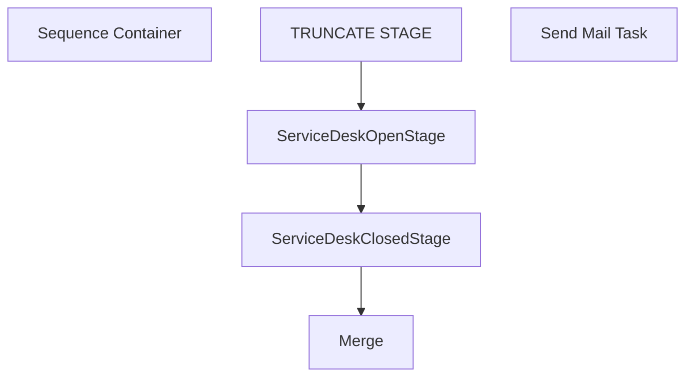

# SSIS Package: ServiceDeskETL

**Project:** ServiceDeskETL  
**Folder:** Azure  
**Server:** STL-SSIS-P-01  

## Connection Managers

| Name | Type | Server | Catalog | Connection (sanitized) |
|---|---|---|---|---|
| DWStaging | OLEDB | papamart | DWStaging | Data Source=papamart; Initial Catalog=DWStaging; Provider=SQLNCLI11.1; Integrated Security=SSPI; Auto Translate=False |
| SMTP | SMTP |  |  |  |
| me_01 | OLEDB | bedrockdb02 | me_01 | Data Source=bedrockdb02; Initial Catalog=me_01; Provider=SQLNCLI11.1; Integrated Security=SSPI; Auto Translate=False |

## Control Flow Tasks

| Task | Type |
|---|---|
| ServiceDeskETL | Package |
| Sequence Container | SEQUENCE |
| Merge | ExecuteSQLTask |
| ServiceDeskClosedStage | Pipeline |
| ServiceDeskOpenStage | Pipeline |
| TRUNCATE STAGE | ExecuteSQLTask |
| Send Mail Task | SendMailTask |

## Control Flow Outline

```text
- Send Mail Task [SendMailTask]
- Sequence Container [SEQUENCE]
  - Merge [ExecuteSQLTask]
  - ServiceDeskClosedStage [Pipeline]
  - ServiceDeskOpenStage [Pipeline]
  - TRUNCATE STAGE [ExecuteSQLTask]
```

## Architecture Diagram



## Variables

| Namespace | Name | Expression-bound |
|---|---|---|
| System | Propagate | No |
| User | DateTimeStamp | Yes |
| User | EndDate | Yes |
| User | EndDateAsDATE | Yes |
| User | GetDate | Yes |
| User | GetDateAsDATE | Yes |
| User | StartDate | Yes |
| User | StartDateAsDATE | Yes |

### Expression-bound variable values

#### User::DateTimeStamp

**Expression:**

```sql
(DT_WSTR,4)DATEPART("yyyy",GetDate()) 
+ (DT_WSTR,4)DATEPART("mm",GetDate()) 
+ (DT_WSTR,4)DATEPART("dd",GetDate()) 
+ (DT_WSTR,4)DATEPART("hh",GetDate()) 
+ (DT_WSTR,4)DATEPART("mi",GetDate()) 
+ (DT_WSTR,4)DATEPART("ss",GetDate()) 
+ (DT_WSTR,4)DATEPART("ms",GetDate())
```

**Evaluated value:**

```sql
20216211456640
```

#### User::EndDate

**Expression:**

```sql
dateadd("dd", @[$Package::DaysToInclude], @[User::StartDate])
```

**Evaluated value:**

```sql
6/21/2021
```

#### User::EndDateAsDATE

**Expression:**

```sql
(DT_WSTR, 4) datepart("year", @[User::EndDate])  + "-" +
right("0"+ (DT_WSTR, 2) datepart("mm", @[User::EndDate]),2)  + "-" +
right("0" +(DT_WSTR, 2) datepart("dd",  @[User::EndDate]),2)
```

**Evaluated value:**

```sql
2021-06-21
```

#### User::GetDate

**Expression:**

```sql
(DT_DATE)DATEDIFF("Day", (DT_DATE) 0, GETDATE())
```

**Evaluated value:**

```sql
6/21/2021
```

#### User::GetDateAsDATE

**Expression:**

```sql
(DT_WSTR, 4) datepart("year", @[User::GetDate])  + "-" +
right("0"+ (DT_WSTR, 2) datepart("mm", @[User::GetDate]),2)  + "-" +
right("0" +(DT_WSTR, 2) datepart("dd",  @[User::GetDate]),2)
```

**Evaluated value:**

```sql
2021-06-21
```

#### User::StartDate

**Expression:**

```sql
dateadd("dd", -@[$Package::DaysToGoBack] , @[User::GetDate] )
```

**Evaluated value:**

```sql
6/20/2021
```

#### User::StartDateAsDATE

**Expression:**

```sql
(DT_WSTR, 4) datepart("year", @[User::StartDate])  + "-" +
right("0"+ (DT_WSTR, 2) datepart("mm", @[User::StartDate]),2)  + "-" +
right("0" +(DT_WSTR, 2) datepart("dd",  @[User::StartDate]),2)
```

**Evaluated value:**

```sql
2021-06-20
```

## Execute SQL Tasks

### Merge

**Path:** `Package\Sequence Container\Merge`  
**Connection:** DWStaging (papamart/DWStaging)  

```sql
--no merge
```

### TRUNCATE STAGE

**Path:** `Package\Sequence Container\TRUNCATE STAGE`  
**Connection:** DWStaging (papamart/DWStaging)  

```sql
TRUNCATE TABLE ServiceDeskOpenStage
TRUNCATE TABLE ServiceDeskClosedStage
```

## Data Flow: Sources

| Component | Source Object | Type | Data Flow Task | Connection | SQL Kind |
|---|---|---|---|---|---|
| service_desk_HEAT_closed |  | OLEDBSource | ServiceDeskClosedStage | me_01 | SqlCommand |
| service_desk_HEAT_open |  | OLEDBSource | ServiceDeskOpenStage | me_01 | SqlCommand |

#### service_desk_HEAT_closed — SqlCommand

```sql
select 
	Incident,	
	Summary,	
	Status,	
	Priority,	
	Customer,	
	case 
		when isnumeric(right(Customer,4))=1 
			then right(concat('0000',cast(cast(right(Customer,4) as int) as varchar)),4)
			else 'BQ' 
	end as CustomerLocation,
	Owner,	
	[Created On],	
	[Source],	
	Team,	
	Area,	
	Category,	
	Subcategory,	
	ResolvedDateTime,	
	Address1Country,	
	[Problem ID],	
	[Avg Days Open],
	OpenWk,	
	ClosedWk,	
	OpenMon,	
	CloseMo,	
	OpenYr,	
	CloseYr
from service_desk_HEAT_closed with (nolock)
```

#### service_desk_HEAT_open — SqlCommand

```sql
select 
	Incident,	
	Summary,	
	Status,	
	Priority,	
	Customer,	
	case 
		when isnumeric(right(Customer,4))=1 
			then right(concat('0000',cast(cast(right(Customer,4) as int) as varchar)),4)
			else 'BQ' 
	end as CustomerLocation,
	Owner,	
	[Created On],	
	[Source],	
	Team,	
	Area,	
	Category,	
	Subcategory,	
	ResolvedDateTime,	
	Description,	
	Country,	
	[Owner Email],	
	Problem,	
	OpenWK,	
	OpenMo,	
	OpenYr
from service_desk_HEAT_open with (nolock)
```

## Data Flow: Destinations

| Component | Target Table | Type | Data Flow Task | Connection | SQL Kind |
|---|---|---|---|---|---|
| ServiceDeskClosedStage |  | OLEDBDestination | ServiceDeskClosedStage | DWStaging |  |
| ServiceDeskOpenStage |  | OLEDBDestination | ServiceDeskOpenStage | DWStaging |  |
