# SSIS Package: WebOrderInboundDemandExtract

**Project:** WebOrderInboundDemandExtract  
**Folder:** Azure  
**Server:** STL-SSIS-P-01  

## Architecture Diagram

```mermaid
flowchart TD
    subgraph Connections
        Azure_conn(["Azure [MSOLAP100]"])
        Cache_OrderStatuses_conn(["Cache OrderStatuses [CACHE]"])
        Cache_OrderStatuses_Hourly_conn(["Cache OrderStatuses Hourly [CACHE]"])
        Cache_WOP_conn(["Cache WOP [CACHE]"])
        Cache_WOP_Hourly_conn(["Cache WOP Hourly [CACHE]"])
        DeckChad_conn(["DeckChad [FLATFILE]"])
        DW_conn(["DW [OLEDB]"])
        DWStaging_conn(["DWStaging [OLEDB]"])
        ExcludedOrders_Cache_conn(["ExcludedOrders Cache [CACHE]"])
        ExcludedOrders_Cache_Hourly_conn(["ExcludedOrders Cache Hourly [CACHE]"])
        IntegrationStaging_conn(["IntegrationStaging [OLEDB]"])
        SMTP_conn(["SMTP [SMTP]"])
        UKPendingWaveCSV_conn(["UKPendingWaveCSV [FLATFILE]"])
        UKWavedCSV_conn(["UKWavedCSV [FLATFILE]"])
        USPendingWaveCSV_conn(["USPendingWaveCSV [FLATFILE]"])
        USWavedCSV_conn(["USWavedCSV [FLATFILE]"])
        WebOrderProcessing_conn(["WebOrderProcessing [OLEDB]"])
    end
    subgraph ControlFlow
        WebOrderInboundDemandExtract_task["WebOrderInboundDemandExtract"]
        Execute_SQL_Task_task["Execute SQL Task"]
        WebOrderInboundDemandExtract_task --> Execute_SQL_Task_task
        SEQ___NEW_Order_and_Order_Item_File_Source_task["SEQ - NEW Order and Order Item File Source"]
        Execute_SQL_Task_task --> SEQ___NEW_Order_and_Order_Item_File_Source_task
        Sequence___PreStage_task["Sequence - PreStage"]
        SEQ___NEW_Order_and_Order_Item_File_Source_task --> Sequence___PreStage_task
        DataFlow___Stage_Completed_task["DataFlow - Stage Completed"]
        Sequence___PreStage_task --> DataFlow___Stage_Completed_task
        DataFlow___Stage_ManualReview_task["DataFlow - Stage ManualReview"]
        DataFlow___Stage_Completed_task --> DataFlow___Stage_ManualReview_task
        DataFlow___Stage_New_task["DataFlow - Stage New"]
        DataFlow___Stage_ManualReview_task --> DataFlow___Stage_New_task
        DataFlow___Stage_Pending_task["DataFlow - Stage Pending"]
        DataFlow___Stage_New_task --> DataFlow___Stage_Pending_task
        Discounts_task["Discounts"]
        DataFlow___Stage_Pending_task --> Discounts_task
        Sequence___PreStage_1_task["Sequence - PreStage 1"]
        Discounts_task --> Sequence___PreStage_1_task
        DataFlow___Stage_Completed_task["DataFlow - Stage Completed"]
        Sequence___PreStage_1_task --> DataFlow___Stage_Completed_task
        DataFlow___Stage_Completed_1_task["DataFlow - Stage Completed 1"]
        DataFlow___Stage_Completed_task --> DataFlow___Stage_Completed_1_task
        DataFlow___Stage_ManualReview_task["DataFlow - Stage ManualReview"]
        DataFlow___Stage_Completed_1_task --> DataFlow___Stage_ManualReview_task
        DataFlow___Stage_New_task["DataFlow - Stage New"]
        DataFlow___Stage_ManualReview_task --> DataFlow___Stage_New_task
        DataFlow___Stage_Pending_task["DataFlow - Stage Pending"]
        DataFlow___Stage_New_task --> DataFlow___Stage_Pending_task
        Discounts_task["Discounts"]
        DataFlow___Stage_Pending_task --> Discounts_task
        Sequence___Run_Cache_DataFlows_task["Sequence - Run Cache DataFlows"]
        Discounts_task --> Sequence___Run_Cache_DataFlows_task
        DataFlow___Cache_Excluded_task["DataFlow - Cache Excluded"]
        Sequence___Run_Cache_DataFlows_task --> DataFlow___Cache_Excluded_task
        DataFlow___Cache_OrderStatus_Dates_task["DataFlow - Cache OrderStatus Dates"]
        DataFlow___Cache_Excluded_task --> DataFlow___Cache_OrderStatus_Dates_task
        DataFlow___Cache_WOP_task["DataFlow - Cache WOP"]
        DataFlow___Cache_OrderStatus_Dates_task --> DataFlow___Cache_WOP_task
        Truncate_Stage_task["Truncate Stage"]
        DataFlow___Cache_WOP_task --> Truncate_Stage_task
        Sequence___Stage_and_Load_task["Sequence - Stage and Load"]
        Truncate_Stage_task --> Sequence___Stage_and_Load_task
        Merge_WebOrderInboundDemandTrackingFactsV2_task["Merge WebOrderInboundDemandTrackingFactsV2"]
        Sequence___Stage_and_Load_task --> Merge_WebOrderInboundDemandTrackingFactsV2_task
        Process_Azure_Table_task["Process Azure Table"]
        Merge_WebOrderInboundDemandTrackingFactsV2_task --> Process_Azure_Table_task
        SEQ___Orginal_WebDemandTracking_File_Source_task["SEQ - Orginal WebDemandTracking File Source"]
        Process_Azure_Table_task --> SEQ___Orginal_WebDemandTracking_File_Source_task
        Sequence___PreStage_task["Sequence - PreStage"]
        SEQ___Orginal_WebDemandTracking_File_Source_task --> Sequence___PreStage_task
        DataFlow___Stage_Completed_task["DataFlow - Stage Completed"]
        Sequence___PreStage_task --> DataFlow___Stage_Completed_task
        DataFlow___Stage_ManualReview_task["DataFlow - Stage ManualReview"]
        DataFlow___Stage_Completed_task --> DataFlow___Stage_ManualReview_task
        DataFlow___Stage_New_task["DataFlow - Stage New"]
        DataFlow___Stage_ManualReview_task --> DataFlow___Stage_New_task
        DataFlow___Stage_Pending_task["DataFlow - Stage Pending"]
        DataFlow___Stage_New_task --> DataFlow___Stage_Pending_task
        Discounts_task["Discounts"]
        DataFlow___Stage_Pending_task --> Discounts_task
        Sequence___Run_Cache_DataFlows_task["Sequence - Run Cache DataFlows"]
        Discounts_task --> Sequence___Run_Cache_DataFlows_task
        Data_Flow_Task_task["Data Flow Task"]
        Sequence___Run_Cache_DataFlows_task --> Data_Flow_Task_task
        DataFlow___Cache_Excluded_task["DataFlow - Cache Excluded"]
        Data_Flow_Task_task --> DataFlow___Cache_Excluded_task
        DataFlow___Cache_OrderStatus_Dates_task["DataFlow - Cache OrderStatus Dates"]
        DataFlow___Cache_Excluded_task --> DataFlow___Cache_OrderStatus_Dates_task
        DataFlow___Cache_WOP_task["DataFlow - Cache WOP"]
        DataFlow___Cache_OrderStatus_Dates_task --> DataFlow___Cache_WOP_task
        Truncate_Stage_task["Truncate Stage"]
        DataFlow___Cache_WOP_task --> Truncate_Stage_task
        Sequence___Stage_and_Load_task["Sequence - Stage and Load"]
        Truncate_Stage_task --> Sequence___Stage_and_Load_task
        DataFlow___Stage_Data_for_Azure_task["DataFlow - Stage Data for Azure"]
        Sequence___Stage_and_Load_task --> DataFlow___Stage_Data_for_Azure_task
        Merge_WebOrderInboundDemandTrackingFacts_task["Merge WebOrderInboundDemandTrackingFacts"]
        DataFlow___Stage_Data_for_Azure_task --> Merge_WebOrderInboundDemandTrackingFacts_task
        Process_Azure_Table_task["Process Azure Table"]
        Merge_WebOrderInboundDemandTrackingFacts_task --> Process_Azure_Table_task
        Send_Mail_Task_task["Send Mail Task"]
        Process_Azure_Table_task --> Send_Mail_Task_task
    end
```

## Connection Managers

| Name | Type |
|---|---|
| Azure | MSOLAP100 |
| Cache OrderStatuses | CACHE |
| Cache OrderStatuses Hourly | CACHE |
| Cache WOP | CACHE |
| Cache WOP Hourly | CACHE |
| DeckChad | FLATFILE |
| DW | OLEDB |
| DWStaging | OLEDB |
| ExcludedOrders Cache | CACHE |
| ExcludedOrders Cache Hourly | CACHE |
| IntegrationStaging | OLEDB |
| SMTP | SMTP |
| UKPendingWaveCSV | FLATFILE |
| UKWavedCSV | FLATFILE |
| USPendingWaveCSV | FLATFILE |
| USWavedCSV | FLATFILE |
| WebOrderProcessing | OLEDB |

## Control Flow Tasks

| Task | Type |
|---|---|
| WebOrderInboundDemandExtract | Microsoft.Package |
| Execute SQL Task | Microsoft.ExecuteSQLTask |
| SEQ - NEW Order and Order Item File Source | STOCK:SEQUENCE |
| Sequence - PreStage | STOCK:SEQUENCE |
| DataFlow - Stage Completed | Microsoft.Pipeline |
| DataFlow - Stage ManualReview | Microsoft.Pipeline |
| DataFlow - Stage New | Microsoft.Pipeline |
| DataFlow - Stage Pending | Microsoft.Pipeline |
| Discounts | Microsoft.Pipeline |
| Sequence - PreStage 1 | STOCK:SEQUENCE |
| DataFlow - Stage Completed | Microsoft.Pipeline |
| DataFlow - Stage Completed 1 | Microsoft.Pipeline |
| DataFlow - Stage ManualReview | Microsoft.Pipeline |
| DataFlow - Stage New | Microsoft.Pipeline |
| DataFlow - Stage Pending | Microsoft.Pipeline |
| Discounts | Microsoft.Pipeline |
| Sequence - Run Cache DataFlows | STOCK:SEQUENCE |
| DataFlow - Cache Excluded | Microsoft.Pipeline |
| DataFlow - Cache OrderStatus Dates | Microsoft.Pipeline |
| DataFlow - Cache WOP | Microsoft.Pipeline |
| Truncate Stage | Microsoft.ExecuteSQLTask |
| Sequence - Stage and Load | STOCK:SEQUENCE |
| Merge WebOrderInboundDemandTrackingFactsV2 | Microsoft.ExecuteSQLTask |
| Process Azure Table | Microsoft.DTSProcessingTask |
| SEQ - Orginal WebDemandTracking File Source | STOCK:SEQUENCE |
| Sequence - PreStage | STOCK:SEQUENCE |
| DataFlow - Stage Completed | Microsoft.Pipeline |
| DataFlow - Stage ManualReview | Microsoft.Pipeline |
| DataFlow - Stage New | Microsoft.Pipeline |
| DataFlow - Stage Pending | Microsoft.Pipeline |
| Discounts | Microsoft.Pipeline |
| Sequence - Run Cache DataFlows | STOCK:SEQUENCE |
| Data Flow Task | Microsoft.Pipeline |
| DataFlow - Cache Excluded | Microsoft.Pipeline |
| DataFlow - Cache OrderStatus Dates | Microsoft.Pipeline |
| DataFlow - Cache WOP | Microsoft.Pipeline |
| Truncate Stage | Microsoft.ExecuteSQLTask |
| Sequence - Stage and Load | STOCK:SEQUENCE |
| DataFlow - Stage Data for Azure | Microsoft.Pipeline |
| Merge WebOrderInboundDemandTrackingFacts | Microsoft.ExecuteSQLTask |
| Process Azure Table | Microsoft.DTSProcessingTask |
| Send Mail Task | Microsoft.SendMailTask |

## Data Flow: Sources

| Component | SQL Preview |
|---|---|
|  | with  MaxOrderFile as 	( 		select  			OrderNumber, 			max(FileName) maxFileName 		from WebDemandOrdersUS with (nolock) 		group by  			OrderNumber 	), Orders as 	( 		select   			o.OrderNumber, 			o.OrderStatus, 			case  				when SiteCode='US'  					then cast(dateadd(hh,+datediff(hh, getutcdate(), getdate()),o.OrderDateUTC) as date)  				else cast(o.OrderDateUTC as date) 			end as OrderDate, 			case |
|  | with  MaxOrderFile as 	( 		select  			OrderNumber, 			max(FileName) maxFileName 		from WebDemandOrdersUK with (nolock) 		group by  			OrderNumber 	), Orders as 	( 		select   			o.OrderNumber, 			o.OrderStatus, 			case  				when SiteCode='US'  					then cast(dateadd(hh,+datediff(hh, getutcdate(), getdate()),o.OrderDateUTC) as date)  				else cast(o.OrderDateUTC as date) 			end as OrderDate, 			case |
|  | select OrderNumber, DeckSku from WebOrderInboundDemandTrackingStageV2 group by OrderNumber,DeckSKU |
|  | SELECT  	pd.Style,  	pd.KeyStory, 	c.ChainAverageOnHandCost, 	c.ChainAverageOnHandCostGBP from azure.ProductChainOnHandCost c with (nolock) join azure.vwProducts pd with (nolock) on c.ProductKey=pd.ProductKey |
|  | with  MaxOrderFile as 	( 		select  			OrderNumber, 			max(FileName) maxFileName 		from WebDemandOrdersUS with (nolock) 		group by  			OrderNumber 	), Orders as 	( 		select   			o.OrderNumber, 			o.OrderStatus, 			case  				when SiteCode='US'  					then cast(dateadd(hh,+datediff(hh, getutcdate(), getdate()),o.OrderDateUTC) as date)  				else cast(o.OrderDateUTC as date) 			end as OrderDate, 			case |
|  | with  MaxOrderFile as 	( 		select  			OrderNumber, 			max(FileName) maxFileName 		from WebDemandOrdersUK with (nolock) 		group by  			OrderNumber 	), Orders as 	( 		select   			o.OrderNumber, 			o.OrderStatus, 			case  				when SiteCode='US'  					then cast(dateadd(hh,+datediff(hh, getutcdate(), getdate()),o.OrderDateUTC) as date)  				else cast(o.OrderDateUTC as date) 			end as OrderDate, 			case |
|  | SELECT  	pd.Style,  	pd.KeyStory, 	c.ChainAverageOnHandCost, 	c.ChainAverageOnHandCostGBP from azure.ProductChainOnHandCost c with (nolock) join azure.vwProducts pd with (nolock) on c.ProductKey=pd.ProductKey |
|  | with  MaxOrderFile as 	( 		select  			OrderNumber, 			max(FileName) maxFileName 		from WebDemandOrdersUS with (nolock) 		group by  			OrderNumber 	), Orders as 	( 		select   			o.OrderNumber, 			o.OrderStatus, 			case  				when SiteCode='US'  					then cast(dateadd(hh,+datediff(hh, getutcdate(), getdate()),o.OrderDateUTC) as date)  				else cast(o.OrderDateUTC as date) 			end as OrderDate, 			case |
|  | with  MaxOrderFile as 	( 		select  			OrderNumber, 			max(FileName) maxFileName 		from WebDemandOrdersUK  with (nolock) 		group by  			OrderNumber 	), Orders as 	( 		select   			o.OrderNumber, 			o.OrderStatus, 			case  				when SiteCode='US'  					then cast(dateadd(hh,+datediff(hh, getutcdate(), getdate()),o.OrderDateUTC) as date)  				else cast(o.OrderDateUTC as date) 			end as OrderDate, 			cas |
|  | select OrderNumber, DeckSku from WebOrderInboundDemandTrackingStageV2 group by OrderNumber,DeckSKU |
|  | SELECT  	pd.Style,  	pd.KeyStory, 	c.ChainAverageOnHandCost, 	c.ChainAverageOnHandCostGBP from azure.ProductChainOnHandCost c with (nolock) join azure.vwProducts pd with (nolock) on c.ProductKey=pd.ProductKey |
|  | with  MaxOrderFile as 	( 		select  			OrderNumber, 			max(FileName) maxFileName 		from WebDemandOrdersUS with (nolock) 		group by  			OrderNumber 	), Orders as 	( 		select   			o.OrderNumber, 			o.OrderStatus, 			case  				when SiteCode='US'  					then cast(dateadd(hh,+datediff(hh, getutcdate(), getdate()),o.OrderDateUTC) as date)  				else cast(o.OrderDateUTC as date) 			end as OrderDate, 			case |
|  | with  MaxOrderFile as 	( 		select  			OrderNumber, 			max(FileName) maxFileName 		from WebDemandOrdersUK  with (nolock) 		group by  			OrderNumber 	), Orders as 	( 		select   			o.OrderNumber, 			o.OrderStatus, 			case  				when SiteCode='US'  					then cast(dateadd(hh,+datediff(hh, getutcdate(), getdate()),o.OrderDateUTC) as date)  				else cast(o.OrderDateUTC as date) 			end as OrderDate, 			cas |
|  | select OrderNumber, DeckSku from WebOrderInboundDemandTrackingStageV2 group by OrderNumber,DeckSKU |
|  | SELECT  	pd.Style,  	pd.KeyStory, 	c.ChainAverageOnHandCost, 	c.ChainAverageOnHandCostGBP from azure.ProductChainOnHandCost c with (nolock) join azure.vwProducts pd with (nolock) on c.ProductKey=pd.ProductKey |
|  | select * from wm.vwDWOrderItemDiscounts where OrderDate>= ? |
|  | with  MaxOrderFile as 	( 		select  			OrderNumber, 			max(FileName) maxFileName 		from WebDemandOrdersUS with (nolock) 		group by  			OrderNumber 	), Orders as 	( 		select   			o.OrderNumber, 			o.OrderStatus, 			case  				when SiteCode='US'  					then cast(dateadd(hh,+datediff(hh, getutcdate(), getdate()),o.OrderDateUTC) as date)  				else cast(o.OrderDateUTC as date) 			end as OrderDate, 			case |
|  | with  MaxOrderFile as 	( 		select  			OrderNumber, 			max(FileName) maxFileName 		from WebDemandOrdersUK with (nolock) 		group by  			OrderNumber 	), Orders as 	( 		select   			o.OrderNumber, 			o.OrderStatus, 			case  				when SiteCode='US'  					then cast(dateadd(hh,+datediff(hh, getutcdate(), getdate()),o.OrderDateUTC) as date)  				else cast(o.OrderDateUTC as date) 			end as OrderDate, 			case |
|  | select OrderNumber, DeckSku from WebOrderInboundDemandTrackingStage group by OrderNumber,DeckSKU |
|  | SELECT  	pd.Style,  	pd.KeyStory, 	c.ChainAverageOnHandCost, 	c.ChainAverageOnHandCostGBP from azure.ProductChainOnHandCost c with (nolock) join azure.vwProducts pd with (nolock) on c.ProductKey=pd.ProductKey |
|  | with  MaxOrderFile as 	( 		select  			OrderNumber, 			max(FileName) maxFileName 		from WebDemandOrdersUS with (nolock) 		group by  			OrderNumber 	), Orders as 	( 		select   			o.OrderNumber, 			o.OrderStatus, 			case  				when SiteCode='US'  					then cast(dateadd(hh,+datediff(hh, getutcdate(), getdate()),o.OrderDateUTC) as date)  				else cast(o.OrderDateUTC as date) 			end as OrderDate, 			case |
|  | with  MaxOrderFile as 	( 		select  			OrderNumber, 			max(FileName) maxFileName 		from WebDemandOrdersUK with (nolock) 		group by  			OrderNumber 	), Orders as 	( 		select   			o.OrderNumber, 			o.OrderStatus, 			case  				when SiteCode='US'  					then cast(dateadd(hh,+datediff(hh, getutcdate(), getdate()),o.OrderDateUTC) as date)  				else cast(o.OrderDateUTC as date) 			end as OrderDate, 			case |
|  | with  MaxOrderFile as 	( 		select  			OrderNumber, 			max(FileName) maxFileName 		from WebDemandOrdersUS with (nolock) 		group by  			OrderNumber 	), Orders as 	( 		select   			o.OrderNumber, 			o.OrderStatus 		from WebDemandOrdersUS o with (nolock) 		join MaxOrderFile mo  			on o.OrderNumber=mo.OrderNumber 			and o.FileName=mo.maxFileName 	), MaxOrderItemsFile as 	( 		select  			moi.OrderNumber,  |
|  | select  	e.OrderNumber as OrderNumber, 	e.DeckSku  from wm.OMSCustomOrderExport e with (nolock) where e.OrderStatus in ('New','Pending','Manual Review') group by  	e.OrderNumber, e.DeckSku |
|  | SELECT  	pd.Style,  	pd.KeyStory, 	c.ChainAverageOnHandCost, 	c.ChainAverageOnHandCostGBP from azure.ProductChainOnHandCost c with (nolock) join azure.vwProducts pd with (nolock) on c.ProductKey=pd.ProductKey |
|  | with  MaxOrderFile as 	( 		select  			OrderNumber, 			max(FileName) maxFileName 		from WebDemandOrdersUS with (nolock) 		group by  			OrderNumber 	), Orders as 	( 		select   			o.OrderNumber, 			o.OrderStatus, 			case  				when SiteCode='US'  					then cast(dateadd(hh,+datediff(hh, getutcdate(), getdate()),o.OrderDateUTC) as date)  				else cast(o.OrderDateUTC as date) 			end as OrderDate, 			case |
|  | with  MaxOrderFile as 	( 		select  			OrderNumber, 			max(FileName) maxFileName 		from WebDemandOrdersUK with (nolock) 		group by  			OrderNumber 	), Orders as 	( 		select   			o.OrderNumber, 			o.OrderStatus, 			case  				when SiteCode='US'  					then cast(dateadd(hh,+datediff(hh, getutcdate(), getdate()),o.OrderDateUTC) as date)  				else cast(o.OrderDateUTC as date) 			end as OrderDate, 			case |
|  | SELECT  	pd.Style,  	pd.KeyStory, 	c.ChainAverageOnHandCost, 	c.ChainAverageOnHandCostGBP from azure.ProductChainOnHandCost c with (nolock) join azure.vwProducts pd with (nolock) on c.ProductKey=pd.ProductKey |
|  | with  MaxOrderFile as 	( 		select  			OrderNumber, 			max(FileName) maxFileName 		from WebDemandOrdersUS with (nolock) 		group by  			OrderNumber 	), Orders as 	( 		select   			o.OrderNumber, 			o.OrderStatus, 			case  				when SiteCode='US'  					then cast(dateadd(hh,+datediff(hh, getutcdate(), getdate()),o.OrderDateUTC) as date)  				else cast(o.OrderDateUTC as date) 			end as OrderDate, 			case |
|  | with  MaxOrderFile as 	( 		select  			OrderNumber, 			max(FileName) maxFileName 		from WebDemandOrdersUK  with (nolock) 		group by  			OrderNumber 	), Orders as 	( 		select   			o.OrderNumber, 			o.OrderStatus, 			case  				when SiteCode='US'  					then cast(dateadd(hh,+datediff(hh, getutcdate(), getdate()),o.OrderDateUTC) as date)  				else cast(o.OrderDateUTC as date) 			end as OrderDate, 			cas |
|  | with  MaxOrderFile as 	( 		select  			OrderNumber, 			max(FileName) maxFileName 		from WebDemandOrdersUS with (nolock) 		group by  			OrderNumber 	), Orders as 	( 		select   			o.OrderNumber, 			o.OrderStatus 		from WebDemandOrdersUS o with (nolock) 		join MaxOrderFile mo  			on o.OrderNumber=mo.OrderNumber 			and o.FileName=mo.maxFileName 	), MaxOrderItemsFile as 	( 		select  			moi.OrderNumber,  |
|  | select  	e.OrderNumber as OrderNumber, e.DeckSku  from wm.OMSCustomOrderExport e with (nolock) where e.OrderStatus in ('Manual Review') group by  	e.OrderNumber, e.DeckSku |
|  | SELECT  	pd.Style,  	pd.KeyStory, 	c.ChainAverageOnHandCost, 	c.ChainAverageOnHandCostGBP from azure.ProductChainOnHandCost c with (nolock) join azure.vwProducts pd with (nolock) on c.ProductKey=pd.ProductKey |
|  | with  MaxOrderFile as 	( 		select  			OrderNumber, 			max(FileName) maxFileName 		from WebDemandOrdersUS with (nolock) 		group by  			OrderNumber 	), Orders as 	( 		select   			o.OrderNumber, 			o.OrderStatus, 			case  				when SiteCode='US'  					then cast(dateadd(hh,+datediff(hh, getutcdate(), getdate()),o.OrderDateUTC) as date)  				else cast(o.OrderDateUTC as date) 			end as OrderDate, 			case |
|  | with  MaxOrderFile as 	( 		select  			OrderNumber, 			max(FileName) maxFileName 		from WebDemandOrdersUK  with (nolock) 		group by  			OrderNumber 	), Orders as 	( 		select   			o.OrderNumber, 			o.OrderStatus, 			case  				when SiteCode='US'  					then cast(dateadd(hh,+datediff(hh, getutcdate(), getdate()),o.OrderDateUTC) as date)  				else cast(o.OrderDateUTC as date) 			end as OrderDate, 			cas |
|  | with  MaxOrderFile as 	( 		select  			OrderNumber, 			max(FileName) maxFileName 		from WebDemandOrdersUS with (nolock) 		group by  			OrderNumber 	), Orders as 	( 		select   			o.OrderNumber, 			o.OrderStatus 		from WebDemandOrdersUS o with (nolock) 		join MaxOrderFile mo  			on o.OrderNumber=mo.OrderNumber 			and o.FileName=mo.maxFileName 	), MaxOrderItemsFile as 	( 		select  			moi.OrderNumber,  |
|  | select  	e.OrderNumber as OrderNumber, e.DeckSku  from wm.OMSCustomOrderExport e with (nolock) where e.OrderStatus in ('New','Manual Review') group by  	e.OrderNumber, e.DeckSku |
|  | SELECT  	pd.Style,  	pd.KeyStory, 	c.ChainAverageOnHandCost, 	c.ChainAverageOnHandCostGBP from azure.ProductChainOnHandCost c with (nolock) join azure.vwProducts pd with (nolock) on c.ProductKey=pd.ProductKey |
|  | select * from wm.vwDWOrderItemDiscounts where OrderDate>= ? |
|  | select  	cast(e.OrderNumber as varchar(10))  as OrderNumber from WebDemandOrdersUS e where 1=1 and e.OrderStatus in ('Confirmed Fraud','Cancelled','Exception', 'Fraud') group by cast(e.OrderNumber as varchar(10)) UNION select  	cast(e.OrderNumber as varchar(10))  as OrderNumber from WebDemandOrdersUK e where 1=1 and e.OrderStatus in ('Confirmed Fraud','Cancelled','Exception', 'Fraud') group by cas |
|  | with  DeckOrderStatusPivot as  	( 		select  			OrderNumber, 			CurrentStatus, 			PendingStatusDate, 			WavedStatusDate, 			ShippedCompletedStatusDate 		from wm.vwOrderStatusPivot  	), PendingWave as 	( 		select  			OrderNumber, 			DeckStatus, 			StatusDateTime 		from DeckNightlyWaveStatus  		where DeckStatus='Pending Wave'  		group by 			OrderNumber, 			DeckStatus, 			StatusDateTime 	), Waved as 	 |
|  | with MaxOrder as  	( 		select  			o.OrderNumber as WOPOrderNumber, 			max(o.OrderNum) as WOPWebOrderNumber 		from wm.Orders o with (nolock) 		where 1=1 		and o.OrderNum like '%[_]%'  		group by  			o.OrderNumber 	) select  	o.OrderNumber, 	case  		when isnull(o.PickupStore,'') not in ('', '0013', '2013') 		then 1 		else 0 	end as isShipFromStore, 	case  		when concat(o.BillToAddress1,o.BillToCity, |
|  | with  maxFile as  	( 		select  			OrderNumber, 			OrderStatus, 			DeckSku, 			ItemSubTotal, 			max(FileName) maxFileName 		from WebDemandTracking 		group by  			OrderNumber, 			OrderStatus, 			DeckSku, 			ItemSubTotal 	) select 	case  		when SiteCode='US'  			then cast(dateadd(hh,+datediff(hh, getutcdate(), getdate()),e.OrderDateUTC) as date)  		else cast(e.OrderDateUTC as date) 	end as OrderDate, |
|  | select  	e.OrderNumber as OrderNumber, e.DeckSku  from webdemandtracking e  where e.OrderStatus in ('New','Pending','Manual Review') group by  	e.OrderNumber, e.DeckSku |
|  | select  	e.OrderNumber as OrderNumber , e.DeckSku from wm.OMSCustomOrderExport e  where e.OrderStatus in ('New','Pending','Manual Review') group by  	e.OrderNumber, e.DeckSku |
|  | SELECT  	pd.Style,  	pd.KeyStory, 	c.ChainAverageOnHandCost, 	c.ChainAverageOnHandCostGBP from azure.ProductChainOnHandCost c with (nolock) join azure.vwProducts pd with (nolock) on c.ProductKey=pd.ProductKey |
|  | with  maxFile as  	( 		select  			OrderNumber, 			OrderStatus, 			DeckSku, 			ItemSubTotal, 			max(FileName) maxFileName 		from WebDemandTracking 		group by  			OrderNumber, 			OrderStatus, 			DeckSku, 			ItemSubTotal 	) select 	case  		when SiteCode='US'  			then cast(dateadd(hh,+datediff(hh, getutcdate(), getdate()),e.OrderDateUTC) as date)  		else cast(e.OrderDateUTC as date) 	end as OrderDate, |
|  | SELECT  	pd.Style,  	pd.KeyStory, 	c.ChainAverageOnHandCost, 	c.ChainAverageOnHandCostGBP from azure.ProductChainOnHandCost c with (nolock) join azure.vwProducts pd with (nolock) on c.ProductKey=pd.ProductKey |
|  | with  maxFile as  	( 		select  			OrderNumber, 			OrderStatus, 			DeckSku, 			ItemSubTotal, 			max(FileName) maxFileName 		from WebDemandTracking 		group by  			OrderNumber, 			OrderStatus, 			DeckSku, 			ItemSubTotal 	) select 	case  		when SiteCode='US'  			then cast(dateadd(hh,+datediff(hh, getutcdate(), getdate()),e.OrderDateUTC) as date)  		else cast(e.OrderDateUTC as date) 	end as OrderDate, |
|  | select  	e.OrderNumber as OrderNumber , e.DeckSku from webdemandtracking e  where e.OrderStatus in ('Manual Review')  group by  	e.OrderNumber, e.DeckSku |
|  | select  	e.OrderNumber as OrderNumber, e.DeckSku  from wm.OMSCustomOrderExport e  where e.OrderStatus in ('Manual Review')  group by  	e.OrderNumber, e.DeckSku |
|  | SELECT  	pd.Style,  	pd.KeyStory, 	c.ChainAverageOnHandCost, 	c.ChainAverageOnHandCostGBP from azure.ProductChainOnHandCost c with (nolock) join azure.vwProducts pd with (nolock) on c.ProductKey=pd.ProductKey |
|  | with  maxFile as  	( 		select  			OrderNumber, 			OrderStatus, 			DeckSku, 			ItemSubTotal, 			max(FileName) maxFileName 		from WebDemandTracking 		group by  			OrderNumber, 			OrderStatus, 			DeckSku, 			ItemSubTotal 	) select 	case  		when SiteCode='US'  			then cast(dateadd(hh,+datediff(hh, getutcdate(), getdate()),e.OrderDateUTC) as date)  		else cast(e.OrderDateUTC as date) 	end as OrderDate, |
|  | select  	e.OrderNumber as OrderNumber, e.DeckSku  from webdemandtracking e  where e.OrderStatus in ('New','Manual Review') group by  	e.OrderNumber, e.DeckSku |
|  | select  	e.OrderNumber as OrderNumber, e.DeckSku  from wm.OMSCustomOrderExport e  where e.OrderStatus in ('New','Manual Review') group by  	e.OrderNumber, e.DeckSku |
|  | SELECT  	pd.Style,  	pd.KeyStory, 	c.ChainAverageOnHandCost, 	c.ChainAverageOnHandCostGBP from azure.ProductChainOnHandCost c with (nolock) join azure.vwProducts pd with (nolock) on c.ProductKey=pd.ProductKey |
|  | select * from wm.vwDWOrderItemDiscounts where OrderDate>= ? |
|  | select OrderNumber,OrderStatus,DeckSku from WebDemandTracking group by OrderNumber,OrderStatus,DeckSku |
|  | select  	CustomOrderExportID,	 	TransactionID,	 	OrderNumber,	 	OrderStatus,	 	OrderDateUTC,	 	OrderNetTotal,	 	OrderCustom1,	 	OrderCustom2,	 	OrderCustom3,	 	OrderCustom4,	 	OrderCustom5,	 	DeckSKU,	 	UPC,	 	ItemPrice,	 	OrderItemCustom1,	 	OrderItemCustom2,	 	OrderItemCustom3,	 	OrderItemCustom4,	 	OrderItemCustom5,	 	OrderItemStatusChangeDateUTC,	 	ItemStatus,	 	OrderItemTypeName,	 	OrderDisco |
|  | select  	cast(e.OrderNumber as varchar(10))  as OrderNumber from WebDemandTracking e where 1=1 --and cast(e.OrderDateUTC as date) >= ? and e.OrderStatus in ('Confirmed Fraud','Cancelled','Exception', 'Fraud') group by  cast(e.OrderNumber as varchar(10)) |
|  | select  	cast(e.OrderNumber as varchar(10))  as OrderNumber from wm.OMSCustomOrderExport e where 1=1 --and cast(e.OrderDateUTC as date) >= ? and e.OrderStatus in  ('Confirmed Fraud','Cancelled','Exception', 'Fraud') group by  cast(e.OrderNumber as varchar(10)) |
|  | with  DeckOrderStatusPivot as  	( 		select  			OrderNumber, 			CurrentStatus, 			PendingStatusDate, 			WavedStatusDate, 			ShippedCompletedStatusDate 		from wm.vwOrderStatusPivot  	), PendingWave as 	( 		select  			OrderNumber, 			DeckStatus, 			StatusDateTime 		from DeckNightlyWaveStatus  		where DeckStatus='Pending Wave'  		group by 			OrderNumber, 			DeckStatus, 			StatusDateTime 	), Waved as 	 |
|  | with MaxOrder as  	( 		select  			o.OrderNumber as WOPOrderNumber, 			max(o.OrderNum) as WOPWebOrderNumber 		from wm.Orders o with (nolock) 		where 1=1 		and o.OrderNum like '%[_]%'  		group by  			o.OrderNumber 	) select  	o.OrderNumber, 	case  		when isnull(o.PickupStore,'') not in ('', '0013', '2013') 		then 1 		else 0 	end as isShipFromStore, 	case  		when concat(o.BillToAddress1,o.BillToCity, |
|  | select v.* from dwstaging.dbo.vwWebOrderInboundDemandTrackingStageForAzure v where not exists ( 					select x.OrderNumber  					from dw.dbo.WebOrderInboundDemandTrackingFacts x  					where x.OrderNumber=v.OrderNumber  					and x.DeckSKU=v.DeckSKU  					and isnull(x.OrderItemGrouping,99999)=isnull(v.OrderItemGrouping,99999) 				) |

## Data Flow: Destinations

| Component | Destination |
|---|---|
|  | [dbo].[WebOrderInboundDemandTrackingStageV2] |
|  | [dbo].[WebOrderInboundDemandTrackingStageV2] |
|  | [dbo].[WebOrderInboundDemandTrackingStageV2] |
|  | [dbo].[WebOrderInboundDemandTrackingStageV2] |
|  | [dbo].[WebOrderDiscountsStage] |
|  | [dbo].[WebOrderInboundDemandTrackingStageV2] |
|  | [dbo].[WebOrderInboundDemandTrackingStageV2] |
|  | [dbo].[WebOrderInboundDemandTrackingStageV2] |
|  | [dbo].[WebOrderInboundDemandTrackingStageV2] |
|  | [dbo].[WebOrderInboundDemandTrackingStageV2] |
|  | [dbo].[WebOrderDiscountsStage] |
|  | [WM].[vwOrderStatusPivot] |
|  | [WebOrderInboundDemandTrackingStage] |
|  | [WebOrderInboundDemandTrackingStage] |
|  | [WebOrderInboundDemandTrackingStage] |
|  | [WebOrderInboundDemandTrackingStage] |
|  | [WebOrderDiscountsStage] |
|  | [dbo].[WebDemandTracking] |
|  | [WM].[vwOrderStatusPivot] |
|  | [dbo].[vwWebOrderInboundDemandTrackingStageForAzure] |
|  | [WebOrderInboundDemandTrackingFacts] |

