# SSIS Package: WebOrderInboundDemandExtract

**Project:** WebOrderInboundDemandExtract  
**Folder:** Azure  
**Server:** STL-SSIS-P-01  

## Connection Managers

| Name | Type | Server | Catalog | Connection (sanitized) |
|---|---|---|---|---|
| Azure | MSOLAP100 | asazure://northcentralus.asazure.windows.net/azasp01 | BABW-DW | Data Source=asazure://northcentralus.asazure.windows.net/azasp01; Initial Catalog=BABW-DW; Provider=MSOLAP.7 |
| Cache OrderStatuses | CACHE |  |  |  |
| Cache OrderStatuses Hourly | CACHE |  |  |  |
| Cache WOP | CACHE |  |  |  |
| Cache WOP Hourly | CACHE |  |  |  |
| DW | OLEDB | papamart | dw | Data Source=papamart; Initial Catalog=dw; Provider=SQLNCLI11.1; Integrated Security=SSPI; Auto Translate=False |
| DWStaging | OLEDB | papamart | DWStaging | Data Source=papamart; Initial Catalog=DWStaging; Provider=SQLNCLI11.1; Integrated Security=SSPI; Auto Translate=False |
| DeckChad | FLATFILE |  |  |  |
| ExcludedOrders Cache | CACHE |  |  |  |
| ExcludedOrders Cache Hourly | CACHE |  |  |  |
| IntegrationStaging | OLEDB | STL-SSIS-P-01 | IntegrationStaging | Data Source=STL-SSIS-P-01; Initial Catalog=IntegrationStaging; Provider=SQLNCLI11.1; Integrated Security=SSPI; Auto Translate=False |
| SMTP | SMTP |  |  |  |
| UKPendingWaveCSV | FLATFILE |  |  |  |
| UKWavedCSV | FLATFILE |  |  |  |
| USPendingWaveCSV | FLATFILE |  |  |  |
| USWavedCSV | FLATFILE |  |  |  |
| WebOrderProcessing | OLEDB | BEARCLUSTER01.SQL.BUILDABEAR.COM | WebOrderProcessing | Data Source=BEARCLUSTER01.SQL.BUILDABEAR.COM; Initial Catalog=WebOrderProcessing; Provider=SQLNCLI11.1; Integrated Security=SSPI; Auto Translate=False |

## Control Flow Tasks

| Task | Type |
|---|---|
| WebOrderInboundDemandExtract | Package |
| Execute SQL Task | ExecuteSQLTask |
| SEQ - NEW Order and Order Item File Source | SEQUENCE |
| Sequence - PreStage | SEQUENCE |
| DataFlow - Stage Completed | Pipeline |
| DataFlow - Stage ManualReview | Pipeline |
| DataFlow - Stage New | Pipeline |
| DataFlow - Stage Pending | Pipeline |
| Discounts | Pipeline |
| Sequence - PreStage 1 | SEQUENCE |
| DataFlow - Stage Completed | Pipeline |
| DataFlow - Stage Completed 1 | Pipeline |
| DataFlow - Stage ManualReview | Pipeline |
| DataFlow - Stage New | Pipeline |
| DataFlow - Stage Pending | Pipeline |
| Discounts | Pipeline |
| Sequence - Run Cache DataFlows | SEQUENCE |
| DataFlow - Cache Excluded | Pipeline |
| DataFlow - Cache OrderStatus Dates | Pipeline |
| DataFlow - Cache WOP | Pipeline |
| Truncate Stage | ExecuteSQLTask |
| Sequence - Stage and Load | SEQUENCE |
| Merge WebOrderInboundDemandTrackingFactsV2 | ExecuteSQLTask |
| Process Azure Table | DTSProcessingTask |
| SEQ - Orginal WebDemandTracking File Source | SEQUENCE |
| Sequence - PreStage | SEQUENCE |
| DataFlow - Stage Completed | Pipeline |
| DataFlow - Stage ManualReview | Pipeline |
| DataFlow - Stage New | Pipeline |
| DataFlow - Stage Pending | Pipeline |
| Discounts | Pipeline |
| Sequence - Run Cache DataFlows | SEQUENCE |
| Data Flow Task | Pipeline |
| DataFlow - Cache Excluded | Pipeline |
| DataFlow - Cache OrderStatus Dates | Pipeline |
| DataFlow - Cache WOP | Pipeline |
| Truncate Stage | ExecuteSQLTask |
| Sequence - Stage and Load | SEQUENCE |
| DataFlow - Stage Data for Azure | Pipeline |
| Merge WebOrderInboundDemandTrackingFacts | ExecuteSQLTask |
| Process Azure Table | DTSProcessingTask |
| Send Mail Task | SendMailTask |

## Control Flow Outline

```text
- Send Mail Task [SendMailTask]
- Execute SQL Task [ExecuteSQLTask]
- SEQ - NEW Order and Order Item File Source [SEQUENCE]
  - Sequence - PreStage [SEQUENCE]
  - Sequence - PreStage 1 [SEQUENCE]
    - DataFlow - Stage Completed [Pipeline]
    - DataFlow - Stage Completed 1 [Pipeline]
    - DataFlow - Stage ManualReview [Pipeline]
    - DataFlow - Stage New [Pipeline]
    - DataFlow - Stage Pending [Pipeline]
    - Discounts [Pipeline]
    - DataFlow - Stage Completed [Pipeline]
    - DataFlow - Stage ManualReview [Pipeline]
    - DataFlow - Stage New [Pipeline]
    - DataFlow - Stage Pending [Pipeline]
    - Discounts [Pipeline]
  - Sequence - Run Cache DataFlows [SEQUENCE]
    - DataFlow - Cache Excluded [Pipeline]
    - DataFlow - Cache OrderStatus Dates [Pipeline]
    - DataFlow - Cache WOP [Pipeline]
    - Truncate Stage [ExecuteSQLTask]
  - Sequence - Stage and Load [SEQUENCE]
    - Merge WebOrderInboundDemandTrackingFactsV2 [ExecuteSQLTask]
    - Process Azure Table [DTSProcessingTask]
- SEQ - Orginal WebDemandTracking File Source [SEQUENCE]
  - Sequence - PreStage [SEQUENCE]
    - DataFlow - Stage Completed [Pipeline]
    - DataFlow - Stage ManualReview [Pipeline]
    - DataFlow - Stage New [Pipeline]
    - DataFlow - Stage Pending [Pipeline]
    - Discounts [Pipeline]
  - Sequence - Run Cache DataFlows [SEQUENCE]
    - Data Flow Task [Pipeline]
    - DataFlow - Cache Excluded [Pipeline]
    - DataFlow - Cache OrderStatus Dates [Pipeline]
    - DataFlow - Cache WOP [Pipeline]
    - Truncate Stage [ExecuteSQLTask]
  - Sequence - Stage and Load [SEQUENCE]
    - DataFlow - Stage Data for Azure [Pipeline]
    - Merge WebOrderInboundDemandTrackingFacts [ExecuteSQLTask]
    - Process Azure Table [DTSProcessingTask]
```

## Architecture Diagram

```mermaid
flowchart TD
    n_Package_Execute_SQL_Task["Execute SQL Task"]
    n_Package_SEQ___NEW_Order_and_Order_Item_File_Source["SEQ - NEW Order and Order Item File Source"]
    n_Package_SEQ___NEW_Order_and_Order_Item_File_Source_Sequence___PreStage["Sequence - PreStage"]
    n_Package_SEQ___NEW_Order_and_Order_Item_File_Source_Sequence___PreStage_DataFlow___Stage_Completed["DataFlow - Stage Completed"]
    n_Package_SEQ___NEW_Order_and_Order_Item_File_Source_Sequence___PreStage_DataFlow___Stage_ManualReview["DataFlow - Stage ManualReview"]
    n_Package_SEQ___NEW_Order_and_Order_Item_File_Source_Sequence___PreStage_DataFlow___Stage_New["DataFlow - Stage New"]
    n_Package_SEQ___NEW_Order_and_Order_Item_File_Source_Sequence___PreStage_DataFlow___Stage_Pending["DataFlow - Stage Pending"]
    n_Package_SEQ___NEW_Order_and_Order_Item_File_Source_Sequence___PreStage_Discounts["Discounts"]
    n_Package_SEQ___NEW_Order_and_Order_Item_File_Source_Sequence___PreStage_1["Sequence - PreStage 1"]
    n_Package_SEQ___NEW_Order_and_Order_Item_File_Source_Sequence___PreStage_1_DataFlow___Stage_Completed["DataFlow - Stage Completed"]
    n_Package_SEQ___NEW_Order_and_Order_Item_File_Source_Sequence___PreStage_1_DataFlow___Stage_Completed_1["DataFlow - Stage Completed 1"]
    n_Package_SEQ___NEW_Order_and_Order_Item_File_Source_Sequence___PreStage_1_DataFlow___Stage_ManualReview["DataFlow - Stage ManualReview"]
    n_Package_SEQ___NEW_Order_and_Order_Item_File_Source_Sequence___PreStage_1_DataFlow___Stage_New["DataFlow - Stage New"]
    n_Package_SEQ___NEW_Order_and_Order_Item_File_Source_Sequence___PreStage_1_DataFlow___Stage_Pending["DataFlow - Stage Pending"]
    n_Package_SEQ___NEW_Order_and_Order_Item_File_Source_Sequence___PreStage_1_Discounts["Discounts"]
    n_Package_SEQ___NEW_Order_and_Order_Item_File_Source_Sequence___Run_Cache_DataFlows["Sequence - Run Cache DataFlows"]
    n_Package_SEQ___NEW_Order_and_Order_Item_File_Source_Sequence___Run_Cache_DataFlows_DataFlow___Cache_Excluded["DataFlow - Cache Excluded"]
    n_Package_SEQ___NEW_Order_and_Order_Item_File_Source_Sequence___Run_Cache_DataFlows_DataFlow___Cache_OrderStatus_Dates["DataFlow - Cache OrderStatus Dates"]
    n_Package_SEQ___NEW_Order_and_Order_Item_File_Source_Sequence___Run_Cache_DataFlows_DataFlow___Cache_WOP["DataFlow - Cache WOP"]
    n_Package_SEQ___NEW_Order_and_Order_Item_File_Source_Sequence___Run_Cache_DataFlows_Truncate_Stage["Truncate Stage"]
    n_Package_SEQ___NEW_Order_and_Order_Item_File_Source_Sequence___Stage_and_Load["Sequence - Stage and Load"]
    n_Package_SEQ___NEW_Order_and_Order_Item_File_Source_Sequence___Stage_and_Load_Merge_WebOrderInboundDemandTrackingFactsV2["Merge WebOrderInboundDemandTrackingFactsV2"]
    n_Package_SEQ___NEW_Order_and_Order_Item_File_Source_Sequence___Stage_and_Load_Process_Azure_Table["Process Azure Table"]
    n_Package_SEQ___Orginal_WebDemandTracking_File_Source["SEQ - Orginal WebDemandTracking File Source"]
    n_Package_SEQ___Orginal_WebDemandTracking_File_Source_Sequence___PreStage["Sequence - PreStage"]
    n_Package_SEQ___Orginal_WebDemandTracking_File_Source_Sequence___PreStage_DataFlow___Stage_Completed["DataFlow - Stage Completed"]
    n_Package_SEQ___Orginal_WebDemandTracking_File_Source_Sequence___PreStage_DataFlow___Stage_ManualReview["DataFlow - Stage ManualReview"]
    n_Package_SEQ___Orginal_WebDemandTracking_File_Source_Sequence___PreStage_DataFlow___Stage_New["DataFlow - Stage New"]
    n_Package_SEQ___Orginal_WebDemandTracking_File_Source_Sequence___PreStage_DataFlow___Stage_Pending["DataFlow - Stage Pending"]
    n_Package_SEQ___Orginal_WebDemandTracking_File_Source_Sequence___PreStage_Discounts["Discounts"]
    n_Package_SEQ___Orginal_WebDemandTracking_File_Source_Sequence___Run_Cache_DataFlows["Sequence - Run Cache DataFlows"]
    n_Package_SEQ___Orginal_WebDemandTracking_File_Source_Sequence___Run_Cache_DataFlows_Data_Flow_Task["Data Flow Task"]
    n_Package_SEQ___Orginal_WebDemandTracking_File_Source_Sequence___Run_Cache_DataFlows_DataFlow___Cache_Excluded["DataFlow - Cache Excluded"]
    n_Package_SEQ___Orginal_WebDemandTracking_File_Source_Sequence___Run_Cache_DataFlows_DataFlow___Cache_OrderStatus_Dates["DataFlow - Cache OrderStatus Dates"]
    n_Package_SEQ___Orginal_WebDemandTracking_File_Source_Sequence___Run_Cache_DataFlows_DataFlow___Cache_WOP["DataFlow - Cache WOP"]
    n_Package_SEQ___Orginal_WebDemandTracking_File_Source_Sequence___Run_Cache_DataFlows_Truncate_Stage["Truncate Stage"]
    n_Package_SEQ___Orginal_WebDemandTracking_File_Source_Sequence___Stage_and_Load["Sequence - Stage and Load"]
    n_Package_SEQ___Orginal_WebDemandTracking_File_Source_Sequence___Stage_and_Load_DataFlow___Stage_Data_for_Azure["DataFlow - Stage Data for Azure"]
    n_Package_SEQ___Orginal_WebDemandTracking_File_Source_Sequence___Stage_and_Load_Merge_WebOrderInboundDemandTrackingFacts["Merge WebOrderInboundDemandTrackingFacts"]
    n_Package_SEQ___Orginal_WebDemandTracking_File_Source_Sequence___Stage_and_Load_Process_Azure_Table["Process Azure Table"]
    n_Package_EventHandlers_OnError__Send_Mail_Task["Send Mail Task"]
    n_Package_SEQ___NEW_Order_and_Order_Item_File_Source_Sequence___PreStage_DataFlow___Stage_New --> n_Package_SEQ___NEW_Order_and_Order_Item_File_Source_Sequence___PreStage_DataFlow___Stage_Pending
    n_Package_SEQ___NEW_Order_and_Order_Item_File_Source_Sequence___PreStage_DataFlow___Stage_Pending --> n_Package_SEQ___NEW_Order_and_Order_Item_File_Source_Sequence___PreStage_DataFlow___Stage_Completed
    n_Package_SEQ___NEW_Order_and_Order_Item_File_Source_Sequence___PreStage_DataFlow___Stage_ManualReview --> n_Package_SEQ___NEW_Order_and_Order_Item_File_Source_Sequence___PreStage_DataFlow___Stage_New
    n_Package_SEQ___NEW_Order_and_Order_Item_File_Source_Sequence___PreStage_Discounts --> n_Package_SEQ___NEW_Order_and_Order_Item_File_Source_Sequence___PreStage_DataFlow___Stage_ManualReview
    n_Package_SEQ___NEW_Order_and_Order_Item_File_Source_Sequence___PreStage_1_DataFlow___Stage_New --> n_Package_SEQ___NEW_Order_and_Order_Item_File_Source_Sequence___PreStage_1_DataFlow___Stage_Pending
    n_Package_SEQ___NEW_Order_and_Order_Item_File_Source_Sequence___PreStage_1_DataFlow___Stage_Pending --> n_Package_SEQ___NEW_Order_and_Order_Item_File_Source_Sequence___PreStage_1_DataFlow___Stage_Completed
    n_Package_SEQ___NEW_Order_and_Order_Item_File_Source_Sequence___PreStage_1_DataFlow___Stage_ManualReview --> n_Package_SEQ___NEW_Order_and_Order_Item_File_Source_Sequence___PreStage_1_DataFlow___Stage_New
    n_Package_SEQ___NEW_Order_and_Order_Item_File_Source_Sequence___PreStage_1_Discounts --> n_Package_SEQ___NEW_Order_and_Order_Item_File_Source_Sequence___PreStage_1_DataFlow___Stage_ManualReview
    n_Package_SEQ___NEW_Order_and_Order_Item_File_Source_Sequence___PreStage_1_DataFlow___Stage_Completed --> n_Package_SEQ___NEW_Order_and_Order_Item_File_Source_Sequence___PreStage_1_DataFlow___Stage_Completed_1
    n_Package_SEQ___NEW_Order_and_Order_Item_File_Source_Sequence___Run_Cache_DataFlows_DataFlow___Cache_WOP --> n_Package_SEQ___NEW_Order_and_Order_Item_File_Source_Sequence___Run_Cache_DataFlows_DataFlow___Cache_OrderStatus_Dates
    n_Package_SEQ___NEW_Order_and_Order_Item_File_Source_Sequence___Run_Cache_DataFlows_Truncate_Stage --> n_Package_SEQ___NEW_Order_and_Order_Item_File_Source_Sequence___Run_Cache_DataFlows_DataFlow___Cache_Excluded
    n_Package_SEQ___NEW_Order_and_Order_Item_File_Source_Sequence___Run_Cache_DataFlows_DataFlow___Cache_Excluded --> n_Package_SEQ___NEW_Order_and_Order_Item_File_Source_Sequence___Run_Cache_DataFlows_DataFlow___Cache_WOP
    n_Package_SEQ___NEW_Order_and_Order_Item_File_Source_Sequence___Stage_and_Load_Merge_WebOrderInboundDemandTrackingFactsV2 --> n_Package_SEQ___NEW_Order_and_Order_Item_File_Source_Sequence___Stage_and_Load_Process_Azure_Table
    n_Package_SEQ___NEW_Order_and_Order_Item_File_Source_Sequence___PreStage --> n_Package_SEQ___NEW_Order_and_Order_Item_File_Source_Sequence___Stage_and_Load
    n_Package_SEQ___NEW_Order_and_Order_Item_File_Source_Sequence___Run_Cache_DataFlows --> n_Package_SEQ___NEW_Order_and_Order_Item_File_Source_Sequence___PreStage
    n_Package_SEQ___Orginal_WebDemandTracking_File_Source_Sequence___PreStage_DataFlow___Stage_New --> n_Package_SEQ___Orginal_WebDemandTracking_File_Source_Sequence___PreStage_DataFlow___Stage_Pending
    n_Package_SEQ___Orginal_WebDemandTracking_File_Source_Sequence___PreStage_DataFlow___Stage_Pending --> n_Package_SEQ___Orginal_WebDemandTracking_File_Source_Sequence___PreStage_DataFlow___Stage_Completed
    n_Package_SEQ___Orginal_WebDemandTracking_File_Source_Sequence___PreStage_DataFlow___Stage_ManualReview --> n_Package_SEQ___Orginal_WebDemandTracking_File_Source_Sequence___PreStage_DataFlow___Stage_New
    n_Package_SEQ___Orginal_WebDemandTracking_File_Source_Sequence___PreStage_Discounts --> n_Package_SEQ___Orginal_WebDemandTracking_File_Source_Sequence___PreStage_DataFlow___Stage_ManualReview
    n_Package_SEQ___Orginal_WebDemandTracking_File_Source_Sequence___Run_Cache_DataFlows_DataFlow___Cache_WOP --> n_Package_SEQ___Orginal_WebDemandTracking_File_Source_Sequence___Run_Cache_DataFlows_DataFlow___Cache_OrderStatus_Dates
    n_Package_SEQ___Orginal_WebDemandTracking_File_Source_Sequence___Run_Cache_DataFlows_Truncate_Stage --> n_Package_SEQ___Orginal_WebDemandTracking_File_Source_Sequence___Run_Cache_DataFlows_DataFlow___Cache_Excluded
    n_Package_SEQ___Orginal_WebDemandTracking_File_Source_Sequence___Run_Cache_DataFlows_Data_Flow_Task --> n_Package_SEQ___Orginal_WebDemandTracking_File_Source_Sequence___Run_Cache_DataFlows_Truncate_Stage
    n_Package_SEQ___Orginal_WebDemandTracking_File_Source_Sequence___Run_Cache_DataFlows_DataFlow___Cache_Excluded --> n_Package_SEQ___Orginal_WebDemandTracking_File_Source_Sequence___Run_Cache_DataFlows_DataFlow___Cache_WOP
    n_Package_SEQ___Orginal_WebDemandTracking_File_Source_Sequence___Stage_and_Load_Merge_WebOrderInboundDemandTrackingFacts --> n_Package_SEQ___Orginal_WebDemandTracking_File_Source_Sequence___Stage_and_Load_DataFlow___Stage_Data_for_Azure
    n_Package_SEQ___Orginal_WebDemandTracking_File_Source_Sequence___Stage_and_Load_DataFlow___Stage_Data_for_Azure --> n_Package_SEQ___Orginal_WebDemandTracking_File_Source_Sequence___Stage_and_Load_Process_Azure_Table
    n_Package_SEQ___Orginal_WebDemandTracking_File_Source_Sequence___PreStage --> n_Package_SEQ___Orginal_WebDemandTracking_File_Source_Sequence___Stage_and_Load
    n_Package_SEQ___Orginal_WebDemandTracking_File_Source_Sequence___Run_Cache_DataFlows --> n_Package_SEQ___Orginal_WebDemandTracking_File_Source_Sequence___PreStage
    n_Package_SEQ___Orginal_WebDemandTracking_File_Source --> n_Package_SEQ___NEW_Order_and_Order_Item_File_Source
    n_Package_Execute_SQL_Task --> n_Package_SEQ___Orginal_WebDemandTracking_File_Source
```



## Variables

| Namespace | Name | Expression-bound |
|---|---|---|
| System | Propagate | No |
| User | DateTimeStamp | Yes |
| User | EndDate | Yes |
| User | EndDateAsDATE | Yes |
| User | GetDate | Yes |
| User | GetDateAsDATE | Yes |
| User | StartDate | Yes |
| User | StartDateAsDATE | Yes |

### Expression-bound variable values

#### User::DateTimeStamp

**Expression:**

```sql
(DT_WSTR,4)DATEPART("yyyy",GetDate()) 
+ (DT_WSTR,4)DATEPART("mm",GetDate()) 
+ (DT_WSTR,4)DATEPART("dd",GetDate()) 
+ (DT_WSTR,4)DATEPART("hh",GetDate()) 
+ (DT_WSTR,4)DATEPART("mi",GetDate()) 
+ (DT_WSTR,4)DATEPART("ss",GetDate()) 
+ (DT_WSTR,4)DATEPART("ms",GetDate())
```

**Evaluated value:**

```sql
202312114203337
```

#### User::EndDate

**Expression:**

```sql
dateadd("dd", @[$Package::DaysToInclude], @[User::StartDate])
```

**Evaluated value:**

```sql
12/1/2023
```

#### User::EndDateAsDATE

**Expression:**

```sql
(DT_WSTR, 4) datepart("year", @[User::EndDate])  + "-" +
right("0"+ (DT_WSTR, 2) datepart("mm", @[User::EndDate]),2)  + "-" +
right("0" +(DT_WSTR, 2) datepart("dd",  @[User::EndDate]),2)
```

**Evaluated value:**

```sql
2023-12-01
```

#### User::GetDate

**Expression:**

```sql
(DT_DATE)DATEDIFF("Day", (DT_DATE) 0, GETDATE())
```

**Evaluated value:**

```sql
12/1/2023
```

#### User::GetDateAsDATE

**Expression:**

```sql
(DT_WSTR, 4) datepart("year", @[User::GetDate])  + "-" +
right("0"+ (DT_WSTR, 2) datepart("mm", @[User::GetDate]),2)  + "-" +
right("0" +(DT_WSTR, 2) datepart("dd",  @[User::GetDate]),2)
```

**Evaluated value:**

```sql
2023-12-01
```

#### User::StartDate

**Expression:**

```sql
dateadd("dd", -@[$Package::DaysToGoBack] , @[User::GetDate] )
```

**Evaluated value:**

```sql
11/16/2023
```

#### User::StartDateAsDATE

**Expression:**

```sql
(DT_WSTR, 4) datepart("year", @[User::StartDate])  + "-" +
right("0"+ (DT_WSTR, 2) datepart("mm", @[User::StartDate]),2)  + "-" +
right("0" +(DT_WSTR, 2) datepart("dd",  @[User::StartDate]),2)
```

**Evaluated value:**

```sql
2023-11-16
```

## Execute SQL Tasks

### Execute SQL Task

**Path:** `Package\Execute SQL Task`  
**Connection:** DW (papamart/dw)  

```sql
select custom4
into #x 
from WebDemandOrderItemsUs
where custom4 like '%[_]%'

delete w
from WebDemandOrderItemsUs w
join #x x on w.Custom4=x.custom4

select custom4
into #xx
from WebDemandOrderItemsUk 
where custom4 like '%[_]%'

delete w
from WebDemandOrderItemsUK w
join #xx x on w.Custom4=x.custom4
```

### Truncate Stage

**Path:** `Package\SEQ - NEW Order and Order Item File Source\Sequence - Run Cache DataFlows\Truncate Stage`  
**Connection:** DW (papamart/dw)  

```sql
TRUNCATE TABLE DWStaging.dbo.WebOrderInboundDemandTrackingStageV2

--TRUNCATE TABLE dwstaging.dbo.WebOrderDiscountsStage

delete x 
from WebOrderInboundDemandTrackingFactsV2 x
where x.OrderDate <= cast(getdate()-70 as date)
```

### Merge WebOrderInboundDemandTrackingFactsV2

**Path:** `Package\SEQ - NEW Order and Order Item File Source\Sequence - Stage and Load\Merge WebOrderInboundDemandTrackingFactsV2`  
**Connection:** DWStaging (papamart/DWStaging)  

```sql
exec spMergeWebOrderInboundDemandTrackingFactsV2
```

### Truncate Stage

**Path:** `Package\SEQ - Orginal WebDemandTracking File Source\Sequence - Run Cache DataFlows\Truncate Stage`  
**Connection:** DW (papamart/dw)  

```sql
TRUNCATE TABLE DWStaging.dbo.WebOrderInboundDemandTrackingStage
--TRUNCATE TABLE WebOrderInboundDemandTrackingFacts
TRUNCATE TABLE dwstaging.dbo.WebOrderDiscountsStage

/*
delete x 
from WebOrderInboundDemandTrackingFacts x
where x.OrderDate <= cast(getdate()-70 as date)
*/
```

### Merge WebOrderInboundDemandTrackingFacts

**Path:** `Package\SEQ - Orginal WebDemandTracking File Source\Sequence - Stage and Load\Merge WebOrderInboundDemandTrackingFacts`  
**Connection:** DWStaging (papamart/DWStaging)  

```sql
exec spMergeWebOrderInboundDemandTrackingFacts
```

## Data Flow: Sources

| Component | Source Object | Type | Data Flow Task | Connection | SQL Kind |
|---|---|---|---|---|---|
| Deck Completed |  | OLEDBSource | DataFlow - Stage Completed | DW | SqlCommand |
| Deck Completed UK |  | OLEDBSource | DataFlow - Stage Completed | DW | SqlCommand |
| Deck Manual Review |  | OLEDBSource | DataFlow - Stage ManualReview | DW | SqlCommand |
| Deck Manual Review UK |  | OLEDBSource | DataFlow - Stage ManualReview | DW | SqlCommand |
| Deck New |  | OLEDBSource | DataFlow - Stage New | DW | SqlCommand |
| Deck New UK |  | OLEDBSource | DataFlow - Stage New | DW | SqlCommand |
| Deck Pending |  | OLEDBSource | DataFlow - Stage Pending | DW | SqlCommand |
| Deck Pending UK |  | OLEDBSource | DataFlow - Stage Pending | DW | SqlCommand |
| vwDWOrderItemDiscounts |  | OLEDBSource | Discounts | WebOrderProcessing | SqlCommand |
| Deck Completed |  | OLEDBSource | DataFlow - Stage Completed | DW | SqlCommand |
| Deck Completed UK |  | OLEDBSource | DataFlow - Stage Completed | DW | SqlCommand |
| Deck Completed |  | OLEDBSource | DataFlow - Stage Completed 1 | DW | SqlCommand |
| Deck Completed UK |  | OLEDBSource | DataFlow - Stage Completed 1 | DW | SqlCommand |
| Deck Manual Review |  | OLEDBSource | DataFlow - Stage ManualReview | DW | SqlCommand |
| Deck Manual Review UK |  | OLEDBSource | DataFlow - Stage ManualReview | DW | SqlCommand |
| Deck New |  | OLEDBSource | DataFlow - Stage New | DW | SqlCommand |
| Deck New UK |  | OLEDBSource | DataFlow - Stage New | DW | SqlCommand |
| Deck Pending |  | OLEDBSource | DataFlow - Stage Pending | DW | SqlCommand |
| Deck Pending UK |  | OLEDBSource | DataFlow - Stage Pending | DW | SqlCommand |
| vwDWOrderItemDiscounts |  | OLEDBSource | Discounts | WebOrderProcessing | SqlCommand |
| ExcludedOrders |  | OLEDBSource | DataFlow - Cache Excluded | DW | SqlCommand |
| Deck Order Status Dates |  | OLEDBSource | DataFlow - Cache OrderStatus Dates | WebOrderProcessing | SqlCommand |
| WebOrderProcessing |  | OLEDBSource | DataFlow - Cache WOP | WebOrderProcessing | SqlCommand |
| Deck Completed |  | OLEDBSource | DataFlow - Stage Completed | DW | SqlCommand |
| Deck Manual Review |  | OLEDBSource | DataFlow - Stage ManualReview | DW | SqlCommand |
| Deck New |  | OLEDBSource | DataFlow - Stage New | DW | SqlCommand |
| Deck Pending |  | OLEDBSource | DataFlow - Stage Pending | DW | SqlCommand |
| vwDWOrderItemDiscounts |  | OLEDBSource | Discounts | WebOrderProcessing | SqlCommand |
| OLE DB Source |  | OLEDBSource | Data Flow Task | WebOrderProcessing | SqlCommand |
| ExcludedOrders |  | OLEDBSource | DataFlow - Cache Excluded | DW | SqlCommand |
| ExcludedOrders Nightly |  | OLEDBSource | DataFlow - Cache Excluded | WebOrderProcessing | SqlCommand |
| Deck Order Status Dates |  | OLEDBSource | DataFlow - Cache OrderStatus Dates | WebOrderProcessing | SqlCommand |
| WebOrderProcessing |  | OLEDBSource | DataFlow - Cache WOP | WebOrderProcessing | SqlCommand |
| vwWebOrderInboundDemandTrackingStageForAzure |  | OLEDBSource | DataFlow - Stage Data for Azure | DWStaging | SqlCommand |

#### Deck Completed — SqlCommand

```sql
with 
MaxOrderFile as
	(
		select 
			OrderNumber,
			max(FileName) maxFileName
		from WebDemandOrdersUS with (nolock)
		group by 
			OrderNumber
	),
Orders as
	(
		select  
			o.OrderNumber,
			o.OrderStatus,
			case 
				when SiteCode='US' 
					then cast(dateadd(hh,+datediff(hh, getutcdate(), getdate()),o.OrderDateUTC) as date) 
				else cast(o.OrderDateUTC as date)
			end as OrderDate,
			case 
				when SiteCode='US' 
					then cast(dateadd(hh,+datediff(hh, getutcdate(), getdate()),o.LastUpdateDateUTC) as date) 
				else cast(o.LastUpdateDateUTC as date)
			end as LastUpdateDate,
			o.SubTotal,
			o.USSalesTotal,
			o.USShippingTotal,
			o.TotalTax,
			o.ShippingTax,
			o.OriginalShipping,
			o.Shipping,
			o.OrderDiscount,
			o.ShippingDiscount,
			o.OrderGrossTotal,
			o.ShippingMethod,
			o.ChannelName as Channel
		from WebDemandOrdersUS o  with (nolock)
		join MaxOrderFile mo 
			on o.OrderNumber=mo.OrderNumber
			and o.FileName=mo.maxFileName
	),
MaxOrderItemsFile as
	(
		select 
			moi.OrderNumber,
			moi.SKU,
			moi.OrderLineNumber,
			max(moi.fileName) maxFileName
		from WebDemandOrderItemsUS moi  with (nolock)
		where exists (select o.OrderNumber from Orders o where o.OrderNumber=moi.OrderNumber)
		group by 
			moi.OrderNumber,
			moi.SKU,
			moi.OrderLineNumber
	) 
select  
	o.OrderDate,
	o.OrderNumber,
	oi.SKU as DeckSku,
	cast(oi.Custom1 as varchar(500)) as ItemDescription,
	oi.Price as GrossProductSales,
	oi.ItemDiscount as ProductDiscounts,
	oi.SubTotal as NetProductSales,
	case 
		when oi.GiftCardType in ('PhysicalGift','eGift') 
		then oi.Price
		else 0
	end as GiftCardValue,-- found that the GiftCardActivatedAmount isn't necessarily accurate??
	case
		when oi.GiftCardType in ('PhysicalGift','eGift')
		then 1
		else 0
	end as isGiftCard,
	case 
		when oi.GiftCardType = 'PhysicalGift' 
		then 1 
		else 0
	end as isPhysicalGiftCard,
	case 
		when oi.GiftCardType = 'eGift'
		and isnull(oi.Message,'x')<>'We''re excited to party with you! Please use this e-gift card as part of your payment when you pay for your party in-store!' 
		and oi.ItemDiscount <=0
		then 1
		else 0
	end as isEGiftCard,
	case 
		when oi.GiftCardType in ('PhysicalGift','eGift') 
			and oi.Message='We''re excited to party with you! Please use this e-gift card as part of your payment when you pay for your party in-store!'
		then 1
		else 0
	end as isPartyEGiftCard,
	case 
		when oi.SKU in ('090502','490502') 
		then 1
		else 0
	end as isUpsellEGiftCard,
	case 
		when oi.Custom1 like '%donation%'
		then 1 
		else 0
	end as isDonation,
	case when oi.SKU in ('080118','480118') 
		then 1
		else 0
	end as isCondo,
	case 
		when oi.SKU in ('027433','427433','027432','427432','028293','428293','028429','428429')
		then 1
		else 0
	end as isGiftBox,
	case 
		when len(oi.Message) > 0 
			and oi.Message<>'We''re excited to party with you! Please use this e-gift card as part of your payment when you pay for your party in-store!'
		then 1
		else 0
	end as hasGiftMessage,
	case 
		when len(oi.SKU) > 6
		then 1
		else 0
	end as isBundleMaster,
	case 
		when oi.Custom2 = 'Stuffed'
		then 1
		else 0 
	end as isStuffed,
	case
		when oi.Custom2 = 'Unstuffed'
		then 1
		else 0
	end as isUnstuffed,
	case
		when oi.Custom3 = 'Dressed'
		then 1
		else 0
	end as isDressed,
	case 
		when oi.Custom3 = 'Undressed'
		then 1
		else 0
	end as isUndressed,
	'1' as isUS,
	'0' as isUK,
	o.Channel,
	cast(oi.Custom4 as varchar(500)) as OrderItemGrouping,
	oi.OrderLineNumber
from Orders o
join WebDemandOrderItemsUS oi  with (nolock) on o.OrderNumber=oi.OrderNumber
join MaxOrderItemsFile moi 
	on oi.OrderNumber=moi.OrderNumber
	and oi.SKU=moi.SKU
	and oi.OrderLineNumber=moi.OrderLineNumber
	and oi.FileName=moi.maxFileName
where o.OrderStatus='Completed'
and o.OrderDate >= ?
```

#### Deck Completed UK — SqlCommand

```sql
with 
MaxOrderFile as
	(
		select 
			OrderNumber,
			max(FileName) maxFileName
		from WebDemandOrdersUK with (nolock)
		group by 
			OrderNumber
	),
Orders as
	(
		select  
			o.OrderNumber,
			o.OrderStatus,
			case 
				when SiteCode='US' 
					then cast(dateadd(hh,+datediff(hh, getutcdate(), getdate()),o.OrderDateUTC) as date) 
				else cast(o.OrderDateUTC as date)
			end as OrderDate,
			case 
				when SiteCode='US' 
					then cast(dateadd(hh,+datediff(hh, getutcdate(), getdate()),o.LastUpdateDateUTC) as date) 
				else cast(o.LastUpdateDateUTC as date)
			end as LastUpdateDate,
			o.SubTotal,
			--o.UKSalesTotal,
			--o.UKShippingTotal,
			o.TotalTax,
			o.ShippingTax,
			o.OriginalShipping,
			o.Shipping,
			o.OrderDiscount,
			o.ShippingDiscount,
			o.OrderGrossTotal,
			o.ShippingMethod,
			o.ChannelName as Channel
		from WebDemandOrdersUK o with (nolock)
		join MaxOrderFile mo 
			on o.OrderNumber=mo.OrderNumber
			and o.FileName=mo.maxFileName
	),
MaxOrderItemsFile as
	(
		select 
			moi.OrderNumber,
			moi.SKU,
			moi.OrderLineNumber,
			max(moi.fileName) maxFileName
		from WebDemandOrderItemsUK moi with (nolock)
		where exists (select o.OrderNumber from Orders o where o.OrderNumber=moi.OrderNumber)
		group by 
			moi.OrderNumber,
			moi.SKU,
			moi.OrderLineNumber
	) 
select  
	o.OrderDate,
	o.OrderNumber,
	oi.SKU as DeckSku,
	cast(oi.Custom1 as varchar(500)) as ItemDescription,
	oi.Price as GrossProductSales,
	oi.ItemDiscount as ProductDiscounts,
	oi.SubTotal as NetProductSales,
	case 
		when oi.GiftCardType in ('PhysicalGift','eGift') 
		then oi.Price
		else 0
	end as GiftCardValue,-- found that the GiftCardActivatedAmount isn't necessarily accurate??
	case
		when oi.GiftCardType in ('PhysicalGift','eGift')
		then 1
		else 0
	end as isGiftCard,
	case 
		when oi.GiftCardType = 'PhysicalGift' 
		then 1 
		else 0
	end as isPhysicalGiftCard,
	case 
		when oi.GiftCardType = 'eGift'
		and isnull(oi.Message,'x')<>'We''re excited to party with you! Please use this e-gift card as part of your payment when you pay for your party in-store!' 
		and oi.ItemDiscount <=0
		then 1
		else 0
	end as isEGiftCard,
	case 
		when oi.GiftCardType in ('PhysicalGift','eGift') 
			and oi.Message='We''re excited to party with you! Please use this e-gift card as part of your payment when you pay for your party in-store!'
		then 1
		else 0
	end as isPartyEGiftCard,
	case 
		when oi.SKU in ('090502','490502') 
		then 1
		else 0
	end as isUpsellEGiftCard,
	case 
		when oi.Custom1 like '%donation%'
		then 1 
		else 0
	end as isDonation,
	case when oi.SKU in ('080118','480118') 
		then 1
		else 0
	end as isCondo,
	case 
		when oi.SKU in ('027433','427433','027432','427432','028293','428293','028429','428429')
		then 1
		else 0
	end as isGiftBox,
	case 
		when len(oi.Message) > 0 
			and oi.Message<>'We''re excited to party with you! Please use this e-gift card as part of your payment when you pay for your party in-store!'
		then 1
		else 0
	end as hasGiftMessage,
	case 
		when len(oi.SKU) > 6
		then 1
		else 0
	end as isBundleMaster,
	case 
		when oi.Custom2 = 'Stuffed'
		then 1
		else 0 
	end as isStuffed,
	case
		when oi.Custom2 = 'Unstuffed'
		then 1
		else 0
	end as isUnstuffed,
	case
		when oi.Custom3 = 'Dressed'
		then 1
		else 0
	end as isDressed,
	case 
		when oi.Custom3 = 'Undressed'
		then 1
		else 0
	end as isUndressed,
	'0' as isUS,
	'1' as isUK,
	o.Channel,
	cast(oi.Custom4 as varchar(500)) as OrderItemGrouping,
	oi.OrderLineNumber
from Orders o
join WebDemandOrderItemsUK oi with (nolock) on o.OrderNumber=oi.OrderNumber
join MaxOrderItemsFile moi 
	on oi.OrderNumber=moi.OrderNumber
	and oi.SKU=moi.SKU
	and oi.OrderLineNumber=moi.OrderLineNumber
	and oi.FileName=moi.maxFileName
where o.OrderStatus='Completed'
and o.OrderDate >= ?
```

#### Deck Manual Review — SqlCommand

```sql
with 
MaxOrderFile as
	(
		select 
			OrderNumber,
			max(FileName) maxFileName
		from WebDemandOrdersUS with (nolock)
		group by 
			OrderNumber
	),
Orders as
	(
		select  
			o.OrderNumber,
			o.OrderStatus,
			case 
				when SiteCode='US' 
					then cast(dateadd(hh,+datediff(hh, getutcdate(), getdate()),o.OrderDateUTC) as date) 
				else cast(o.OrderDateUTC as date)
			end as OrderDate,
			case 
				when SiteCode='US' 
					then cast(dateadd(hh,+datediff(hh, getutcdate(), getdate()),o.LastUpdateDateUTC) as date) 
				else cast(o.LastUpdateDateUTC as date)
			end as LastUpdateDate,
			o.SubTotal,
			o.USSalesTotal,
			o.USShippingTotal,
			o.TotalTax,
			o.ShippingTax,
			o.OriginalShipping,
			o.Shipping,
			o.OrderDiscount,
			o.ShippingDiscount,
			o.OrderGrossTotal,
			o.ShippingMethod,
			o.ChannelName as Channel
		from WebDemandOrdersUS o with (nolock)
		join MaxOrderFile mo 
			on o.OrderNumber=mo.OrderNumber
			and o.FileName=mo.maxFileName
	),
MaxOrderItemsFile as
	(
		select 
			moi.OrderNumber,
			moi.SKU,
			moi.OrderLineNumber,
			max(moi.fileName) maxFileName
		from WebDemandOrderItemsUS moi with (nolock)
		where exists (select o.OrderNumber from Orders o where o.OrderNumber=moi.OrderNumber)
		group by 
			moi.OrderNumber,
			moi.SKU,
			moi.OrderLineNumber
	) 
select  
	o.OrderDate,
	o.OrderNumber,
	oi.SKU as DeckSku,
	cast(oi.Custom1 as varchar(500)) as ItemDescription,
	oi.Price as GrossProductSales,
	oi.ItemDiscount as ProductDiscounts,
	oi.SubTotal as NetProductSales,
	case 
		when oi.GiftCardType in ('PhysicalGift','eGift') 
		then oi.Price
		else 0
	end as GiftCardValue,-- found that the GiftCardActivatedAmount isn't necessarily accurate??
	case
		when oi.GiftCardType in ('PhysicalGift','eGift')
		then 1
		else 0
	end as isGiftCard,
	case 
		when oi.GiftCardType = 'PhysicalGift' 
		then 1 
		else 0
	end as isPhysicalGiftCard,
	case 
		when oi.GiftCardType = 'eGift'
		and isnull(oi.Message,'x')<>'We''re excited to party with you! Please use this e-gift card as part of your payment when you pay for your party in-store!' 
		and oi.ItemDiscount <=0
		then 1
		else 0
	end as isEGiftCard,
	case 
		when oi.GiftCardType in ('PhysicalGift','eGift') 
			and oi.Message='We''re excited to party with you! Please use this e-gift card as part of your payment when you pay for your party in-store!'
		then 1
		else 0
	end as isPartyEGiftCard,
	case 
		when oi.SKU in ('090502','490502') 
		then 1
		else 0
	end as isUpsellEGiftCard,
	case 
		when oi.Custom1 like '%donation%'
		then 1 
		else 0
	end as isDonation,
	case when oi.SKU in ('080118','480118') 
		then 1
		else 0
	end as isCondo,
	case 
		when oi.SKU in ('027433','427433','027432','427432','028293','428293','028429','428429')
		then 1
		else 0
	end as isGiftBox,
	case 
		when len(oi.Message) > 0 
			and oi.Message<>'We''re excited to party with you! Please use this e-gift card as part of your payment when you pay for your party in-store!'
		then 1
		else 0
	end as hasGiftMessage,
	case 
		when len(oi.SKU) > 6
		then 1
		else 0
	end as isBundleMaster,
	case 
		when oi.Custom2 = 'Stuffed'
		then 1
		else 0 
	end as isStuffed,
	case
		when oi.Custom2 = 'Unstuffed'
		then 1
		else 0
	end as isUnstuffed,
	case
		when oi.Custom3 = 'Dressed'
		then 1
		else 0
	end as isDressed,
	case 
		when oi.Custom3 = 'Undressed'
		then 1
		else 0
	end as isUndressed,
	'1' as isUS,
	'0' as isUK,
	o.Channel,
	cast(oi.Custom4 as varchar(500)) as OrderItemGrouping,
	oi.OrderLineNumber
from Orders o 
join WebDemandOrderItemsUS oi with (nolock) on o.OrderNumber=oi.OrderNumber
join MaxOrderItemsFile moi 
	on oi.OrderNumber=moi.OrderNumber
	and oi.SKU=moi.SKU
	and oi.OrderLineNumber=moi.OrderLineNumber
	and oi.FileName=moi.maxFileName
where o.OrderStatus='Manual Review'
and o.OrderDate >= ?
```

#### Deck Manual Review UK — SqlCommand

```sql
with 
MaxOrderFile as
	(
		select 
			OrderNumber,
			max(FileName) maxFileName
		from WebDemandOrdersUK with (nolock)
		group by 
			OrderNumber
	),
Orders as
	(
		select  
			o.OrderNumber,
			o.OrderStatus,
			case 
				when SiteCode='US' 
					then cast(dateadd(hh,+datediff(hh, getutcdate(), getdate()),o.OrderDateUTC) as date) 
				else cast(o.OrderDateUTC as date)
			end as OrderDate,
			case 
				when SiteCode='US' 
					then cast(dateadd(hh,+datediff(hh, getutcdate(), getdate()),o.LastUpdateDateUTC) as date) 
				else cast(o.LastUpdateDateUTC as date)
			end as LastUpdateDate,
			o.SubTotal,
			--o.UKSalesTotal,
			--o.UKShippingTotal,
			o.TotalTax,
			o.ShippingTax,
			o.OriginalShipping,
			o.Shipping,
			o.OrderDiscount,
			o.ShippingDiscount,
			o.OrderGrossTotal,
			o.ShippingMethod,
			o.ChannelName as Channel
		from WebDemandOrdersUK o with (nolock)
		join MaxOrderFile mo 
			on o.OrderNumber=mo.OrderNumber
			and o.FileName=mo.maxFileName
	),
MaxOrderItemsFile as
	(
		select 
			moi.OrderNumber,
			moi.SKU,
			moi.OrderLineNumber,
			max(moi.fileName) maxFileName
		from WebDemandOrderItemsUK moi with (nolock)
		where exists (select o.OrderNumber from Orders o where o.OrderNumber=moi.OrderNumber)
		group by 
			moi.OrderNumber,
			moi.SKU,
			moi.OrderLineNumber
	) 
select  
	o.OrderDate,
	o.OrderNumber,
	oi.SKU as DeckSku,
	cast(oi.Custom1 as varchar(500)) as ItemDescription,
	oi.Price as GrossProductSales,
	oi.ItemDiscount as ProductDiscounts,
	oi.SubTotal as NetProductSales,
	case 
		when oi.GiftCardType in ('PhysicalGift','eGift') 
		then oi.Price
		else 0
	end as GiftCardValue,-- found that the GiftCardActivatedAmount isn't necessarily accurate??
	case
		when oi.GiftCardType in ('PhysicalGift','eGift')
		then 1
		else 0
	end as isGiftCard,
	case 
		when oi.GiftCardType = 'PhysicalGift' 
		then 1 
		else 0
	end as isPhysicalGiftCard,
	case 
		when oi.GiftCardType = 'eGift'
		and isnull(oi.Message,'x')<>'We''re excited to party with you! Please use this e-gift card as part of your payment when you pay for your party in-store!' 
		and oi.ItemDiscount <=0
		then 1
		else 0
	end as isEGiftCard,
	case 
		when oi.GiftCardType in ('PhysicalGift','eGift') 
			and oi.Message='We''re excited to party with you! Please use this e-gift card as part of your payment when you pay for your party in-store!'
		then 1
		else 0
	end as isPartyEGiftCard,
	case 
		when oi.SKU in ('090502','490502') 
		then 1
		else 0
	end as isUpsellEGiftCard,
	case 
		when oi.Custom1 like '%donation%'
		then 1 
		else 0
	end as isDonation,
	case when oi.SKU in ('080118','480118') 
		then 1
		else 0
	end as isCondo,
	case 
		when oi.SKU in ('027433','427433','027432','427432','028293','428293','028429','428429')
		then 1
		else 0
	end as isGiftBox,
	case 
		when len(oi.Message) > 0 
			and oi.Message<>'We''re excited to party with you! Please use this e-gift card as part of your payment when you pay for your party in-store!'
		then 1
		else 0
	end as hasGiftMessage,
	case 
		when len(oi.SKU) > 6
		then 1
		else 0
	end as isBundleMaster,
	case 
		when oi.Custom2 = 'Stuffed'
		then 1
		else 0 
	end as isStuffed,
	case
		when oi.Custom2 = 'Unstuffed'
		then 1
		else 0
	end as isUnstuffed,
	case
		when oi.Custom3 = 'Dressed'
		then 1
		else 0
	end as isDressed,
	case 
		when oi.Custom3 = 'Undressed'
		then 1
		else 0
	end as isUndressed,
	'0' as isUS,
	'1' as isUK,
	o.Channel,
	cast(oi.Custom4 as varchar(500)) as OrderItemGrouping,
	oi.OrderLineNumber
from Orders o
join WebDemandOrderItemsUK oi with (nolock) on o.OrderNumber=oi.OrderNumber
join MaxOrderItemsFile moi 
	on oi.OrderNumber=moi.OrderNumber
	and oi.SKU=moi.SKU
	and oi.OrderLineNumber=moi.OrderLineNumber
	and oi.FileName=moi.maxFileName
where o.OrderStatus='Manual Review'
and o.OrderDate >= ?
```

#### Deck New — SqlCommand

```sql
with 
MaxOrderFile as
	(
		select 
			OrderNumber,
			max(FileName) maxFileName
		from WebDemandOrdersUS with (nolock)
		group by 
			OrderNumber
	),
Orders as
	(
		select  
			o.OrderNumber,
			o.OrderStatus,
			case 
				when SiteCode='US' 
					then cast(dateadd(hh,+datediff(hh, getutcdate(), getdate()),o.OrderDateUTC) as date) 
				else cast(o.OrderDateUTC as date)
			end as OrderDate,
			case 
				when SiteCode='US' 
					then cast(dateadd(hh,+datediff(hh, getutcdate(), getdate()),o.LastUpdateDateUTC) as date) 
				else cast(o.LastUpdateDateUTC as date)
			end as LastUpdateDate,
			o.SubTotal,
			o.USSalesTotal,
			o.USShippingTotal,
			o.TotalTax,
			o.ShippingTax,
			o.OriginalShipping,
			o.Shipping,
			o.OrderDiscount,
			o.ShippingDiscount,
			o.OrderGrossTotal,
			o.ShippingMethod,
			o.ChannelName as Channel
		from WebDemandOrdersUS o with (nolock)
		join MaxOrderFile mo 
			on o.OrderNumber=mo.OrderNumber
			and o.FileName=mo.maxFileName
	),
MaxOrderItemsFile as
	(
		select 
			moi.OrderNumber,
			moi.SKU,
			moi.OrderLineNumber,
			max(moi.fileName) maxFileName
		from WebDemandOrderItemsUS moi with (nolock)
		where exists (select o.OrderNumber from Orders o where o.OrderNumber=moi.OrderNumber)
		group by 
			moi.OrderNumber,
			moi.SKU,
			moi.OrderLineNumber
	) 
select  
	o.OrderDate,
	o.OrderNumber,
	oi.SKU as DeckSku,
	cast(oi.Custom1 as varchar(500)) as ItemDescription,
	oi.Price as GrossProductSales,
	oi.ItemDiscount as ProductDiscounts,
	oi.SubTotal as NetProductSales,
	case 
		when oi.GiftCardType in ('PhysicalGift','eGift') 
		then oi.Price
		else 0
	end as GiftCardValue,-- found that the GiftCardActivatedAmount isn't necessarily accurate??
	case
		when oi.GiftCardType in ('PhysicalGift','eGift')
		then 1
		else 0
	end as isGiftCard,
	case 
		when oi.GiftCardType = 'PhysicalGift' 
		then 1 
		else 0
	end as isPhysicalGiftCard,
	case 
		when oi.GiftCardType = 'eGift'
		and isnull(oi.Message,'x')<>'We''re excited to party with you! Please use this e-gift card as part of your payment when you pay for your party in-store!' 
		and oi.ItemDiscount <=0
		then 1
		else 0
	end as isEGiftCard,
	case 
		when oi.GiftCardType in ('PhysicalGift','eGift') 
			and oi.Message='We''re excited to party with you! Please use this e-gift card as part of your payment when you pay for your party in-store!'
		then 1
		else 0
	end as isPartyEGiftCard,
	case 
		when oi.SKU in ('090502','490502') 
		then 1
		else 0
	end as isUpsellEGiftCard,
	case 
		when oi.Custom1 like '%donation%'
		then 1 
		else 0
	end as isDonation,
	case when oi.SKU in ('080118','480118') 
		then 1
		else 0
	end as isCondo,
	case 
		when oi.SKU in ('027433','427433','027432','427432','028293','428293','028429','428429')
		then 1
		else 0
	end as isGiftBox,
	case 
		when len(oi.Message) > 0 
			and oi.Message<>'We''re excited to party with you! Please use this e-gift card as part of your payment when you pay for your party in-store!'
		then 1
		else 0
	end as hasGiftMessage,
	case 
		when len(oi.SKU) > 6
		then 1
		else 0
	end as isBundleMaster,
	case 
		when oi.Custom2 = 'Stuffed'
		then 1
		else 0 
	end as isStuffed,
	case
		when oi.Custom2 = 'Unstuffed'
		then 1
		else 0
	end as isUnstuffed,
	case
		when oi.Custom3 = 'Dressed'
		then 1
		else 0
	end as isDressed,
	case 
		when oi.Custom3 = 'Undressed'
		then 1
		else 0
	end as isUndressed,
	'1' as isUS,
	'0' as isUK,
	o.Channel,
	cast(oi.Custom4 as varchar(500)) as OrderItemGrouping,
	oi.OrderLineNumber
from Orders o
join WebDemandOrderItemsUS oi with (nolock) on o.OrderNumber=oi.OrderNumber
join MaxOrderItemsFile moi 
	on oi.OrderNumber=moi.OrderNumber
	and oi.SKU=moi.SKU
	and oi.OrderLineNumber=moi.OrderLineNumber
	and oi.FileName=moi.maxFileName
where o.OrderStatus='New'
and o.OrderDate >= ?
```

#### Deck New UK — SqlCommand

```sql
with 
MaxOrderFile as
	(
		select 
			OrderNumber,
			max(FileName) maxFileName
		from WebDemandOrdersUK  with (nolock)
		group by 
			OrderNumber
	),
Orders as
	(
		select  
			o.OrderNumber,
			o.OrderStatus,
			case 
				when SiteCode='US' 
					then cast(dateadd(hh,+datediff(hh, getutcdate(), getdate()),o.OrderDateUTC) as date) 
				else cast(o.OrderDateUTC as date)
			end as OrderDate,
			case 
				when SiteCode='US' 
					then cast(dateadd(hh,+datediff(hh, getutcdate(), getdate()),o.LastUpdateDateUTC) as date) 
				else cast(o.LastUpdateDateUTC as date)
			end as LastUpdateDate,
			o.SubTotal,
			--o.UKSalesTotal,
			--o.UKShippingTotal,
			o.TotalTax,
			o.ShippingTax,
			o.OriginalShipping,
			o.Shipping,
			o.OrderDiscount,
			o.ShippingDiscount,
			o.OrderGrossTotal,
			o.ShippingMethod,
			o.ChannelName as Channel
		from WebDemandOrdersUK o with (nolock)
		join MaxOrderFile mo 
			on o.OrderNumber=mo.OrderNumber
			and o.FileName=mo.maxFileName
	),
MaxOrderItemsFile as
	(
		select 
			moi.OrderNumber,
			moi.SKU,
			moi.OrderLineNumber,
			max(moi.fileName) maxFileName
		from WebDemandOrderItemsUK moi with (nolock)
		where exists (select o.OrderNumber from Orders o where o.OrderNumber=moi.OrderNumber)
		group by 
			moi.OrderNumber,
			moi.SKU,
			moi.OrderLineNumber
	) 
select  
	o.OrderDate,
	o.OrderNumber,
	oi.SKU as DeckSku,
	cast(oi.Custom1 as varchar(500)) as ItemDescription,
	oi.Price as GrossProductSales,
	oi.ItemDiscount as ProductDiscounts,
	oi.SubTotal as NetProductSales,
	case 
		when oi.GiftCardType in ('PhysicalGift','eGift') 
		then oi.Price
		else 0
	end as GiftCardValue,-- found that the GiftCardActivatedAmount isn't necessarily accurate??
	case
		when oi.GiftCardType in ('PhysicalGift','eGift')
		then 1
		else 0
	end as isGiftCard,
	case 
		when oi.GiftCardType = 'PhysicalGift' 
		then 1 
		else 0
	end as isPhysicalGiftCard,
	case 
		when oi.GiftCardType = 'eGift'
		and isnull(oi.Message,'x')<>'We''re excited to party with you! Please use this e-gift card as part of your payment when you pay for your party in-store!' 
		and oi.ItemDiscount <=0
		then 1
		else 0
	end as isEGiftCard,
	case 
		when oi.GiftCardType in ('PhysicalGift','eGift') 
			and oi.Message='We''re excited to party with you! Please use this e-gift card as part of your payment when you pay for your party in-store!'
		then 1
		else 0
	end as isPartyEGiftCard,
	case 
		when oi.SKU in ('090502','490502') 
		then 1
		else 0
	end as isUpsellEGiftCard,
	case 
		when oi.Custom1 like '%donation%'
		then 1 
		else 0
	end as isDonation,
	case when oi.SKU in ('080118','480118') 
		then 1
		else 0
	end as isCondo,
	case 
		when oi.SKU in ('027433','427433','027432','427432','028293','428293','028429','428429')
		then 1
		else 0
	end as isGiftBox,
	case 
		when len(oi.Message) > 0 
			and oi.Message<>'We''re excited to party with you! Please use this e-gift card as part of your payment when you pay for your party in-store!'
		then 1
		else 0
	end as hasGiftMessage,
	case 
		when len(oi.SKU) > 6
		then 1
		else 0
	end as isBundleMaster,
	case 
		when oi.Custom2 = 'Stuffed'
		then 1
		else 0 
	end as isStuffed,
	case
		when oi.Custom2 = 'Unstuffed'
		then 1
		else 0
	end as isUnstuffed,
	case
		when oi.Custom3 = 'Dressed'
		then 1
		else 0
	end as isDressed,
	case 
		when oi.Custom3 = 'Undressed'
		then 1
		else 0
	end as isUndressed,
	'0' as isUS,
	'1' as isUK,
	o.Channel,
	cast(oi.Custom4 as varchar(500)) as OrderItemGrouping,
	oi.OrderLineNumber
from Orders o
join WebDemandOrderItemsUK oi with (nolock) on o.OrderNumber=oi.OrderNumber
join MaxOrderItemsFile moi 
	on oi.OrderNumber=moi.OrderNumber
	and oi.SKU=moi.SKU
	and oi.OrderLineNumber=moi.OrderLineNumber
	and oi.FileName=moi.maxFileName
where o.OrderStatus='New'
and o.OrderDate >= ?
```

#### Deck Pending — SqlCommand

```sql
with 
MaxOrderFile as
	(
		select 
			OrderNumber,
			max(FileName) maxFileName
		from WebDemandOrdersUS with (nolock)
		group by 
			OrderNumber
	),
Orders as
	(
		select  
			o.OrderNumber,
			o.OrderStatus,
			case 
				when SiteCode='US' 
					then cast(dateadd(hh,+datediff(hh, getutcdate(), getdate()),o.OrderDateUTC) as date) 
				else cast(o.OrderDateUTC as date)
			end as OrderDate,
			case 
				when SiteCode='US' 
					then cast(dateadd(hh,+datediff(hh, getutcdate(), getdate()),o.LastUpdateDateUTC) as date) 
				else cast(o.LastUpdateDateUTC as date)
			end as LastUpdateDate,
			o.SubTotal,
			o.USSalesTotal,
			o.USShippingTotal,
			o.TotalTax,
			o.ShippingTax,
			o.OriginalShipping,
			o.Shipping,
			o.OrderDiscount,
			o.ShippingDiscount,
			o.OrderGrossTotal,
			o.ShippingMethod,
			o.ChannelName as Channel
		from WebDemandOrdersUS o with (nolock)
		join MaxOrderFile mo 
			on o.OrderNumber=mo.OrderNumber
			and o.FileName=mo.maxFileName
	),
MaxOrderItemsFile as
	(
		select 
			moi.OrderNumber,
			moi.SKU,
			moi.OrderLineNumber,
			max(moi.fileName) maxFileName
		from WebDemandOrderItemsUS moi with (nolock)
		where exists (select o.OrderNumber from Orders o where o.OrderNumber=moi.OrderNumber)
		group by 
			moi.OrderNumber,
			moi.SKU,
			moi.OrderLineNumber
	) 
select  
	o.OrderDate,
	o.OrderNumber,
	oi.SKU as DeckSku,
	cast(left(oi.Custom1,250) as varchar(250)) as ItemDescription,
	oi.Price as GrossProductSales,
	oi.ItemDiscount as ProductDiscounts,
	oi.SubTotal as NetProductSales,
	case 
		when oi.GiftCardType in ('PhysicalGift','eGift') 
		then oi.Price
		else 0
	end as GiftCardValue,-- found that the GiftCardActivatedAmount isn't necessarily accurate??
	case
		when oi.GiftCardType in ('PhysicalGift','eGift')
		then 1
		else 0
	end as isGiftCard,
	case 
		when oi.GiftCardType = 'PhysicalGift' 
		then 1 
		else 0
	end as isPhysicalGiftCard,
	case 
		when oi.GiftCardType = 'eGift'
		and isnull(oi.Message,'x')<>'We''re excited to party with you! Please use this e-gift card as part of your payment when you pay for your party in-store!' 
		and oi.ItemDiscount <=0
		then 1
		else 0
	end as isEGiftCard,
	case 
		when oi.GiftCardType in ('PhysicalGift','eGift') 
			and oi.Message='We''re excited to party with you! Please use this e-gift card as part of your payment when you pay for your party in-store!'
		then 1
		else 0
	end as isPartyEGiftCard,
	case 
		when oi.SKU in ('090502','490502') 
		then 1
		else 0
	end as isUpsellEGiftCard,
	case 
		when oi.Custom1 like '%donation%'
		then 1 
		else 0
	end as isDonation,
	case when oi.SKU in ('080118','480118') 
		then 1
		else 0
	end as isCondo,
	case 
		when oi.SKU in ('027433','427433','027432','427432','028293','428293','028429','428429')
		then 1
		else 0
	end as isGiftBox,
	case 
		when len(oi.Message) > 0 
			and oi.Message<>'We''re excited to party with you! Please use this e-gift card as part of your payment when you pay for your party in-store!'
		then 1
		else 0
	end as hasGiftMessage,
	case 
		when len(oi.SKU) > 6
		then 1
		else 0
	end as isBundleMaster,
	case 
		when oi.Custom2 = 'Stuffed'
		then 1
		else 0 
	end as isStuffed,
	case
		when oi.Custom2 = 'Unstuffed'
		then 1
		else 0
	end as isUnstuffed,
	case
		when oi.Custom3 = 'Dressed'
		then 1
		else 0
	end as isDressed,
	case 
		when oi.Custom3 = 'Undressed'
		then 1
		else 0
	end as isUndressed,
	'1' as isUS,
	'0' as isUK,
	o.Channel,
	cast(left(replace(oi.Custom4,'_',''),250) as varchar(250)) as OrderItemGrouping,
	oi.OrderLineNumber
from Orders o
join WebDemandOrderItemsUS oi  with (nolock) on o.OrderNumber=oi.OrderNumber
join MaxOrderItemsFile moi 
	on oi.OrderNumber=moi.OrderNumber
	and oi.SKU=moi.SKU
	and oi.OrderLineNumber=moi.OrderLineNumber
	and oi.FileName=moi.maxFileName
where o.OrderStatus='Pending'
and o.OrderDate >= ?
```

#### Deck Pending UK — SqlCommand

```sql
with 
MaxOrderFile as
	(
		select 
			OrderNumber,
			max(FileName) maxFileName
		from WebDemandOrdersUK  with (nolock)
		group by 
			OrderNumber
	),
Orders as
	(
		select  
			o.OrderNumber,
			o.OrderStatus,
			case 
				when SiteCode='US' 
					then cast(dateadd(hh,+datediff(hh, getutcdate(), getdate()),o.OrderDateUTC) as date) 
				else cast(o.OrderDateUTC as date)
			end as OrderDate,
			case 
				when SiteCode='US' 
					then cast(dateadd(hh,+datediff(hh, getutcdate(), getdate()),o.LastUpdateDateUTC) as date) 
				else cast(o.LastUpdateDateUTC as date)
			end as LastUpdateDate,
			o.SubTotal,
			--o.UKSalesTotal,
			--o.UKShippingTotal,
			o.TotalTax,
			o.ShippingTax,
			o.OriginalShipping,
			o.Shipping,
			o.OrderDiscount,
			o.ShippingDiscount,
			o.OrderGrossTotal,
			o.ShippingMethod,
			o.ChannelName as Channel
		from WebDemandOrdersUK o  with (nolock)
		join MaxOrderFile mo 
			on o.OrderNumber=mo.OrderNumber
			and o.FileName=mo.maxFileName
	),
MaxOrderItemsFile as
	(
		select 
			moi.OrderNumber,
			moi.SKU,
			moi.OrderLineNumber,
			max(moi.fileName) maxFileName
		from WebDemandOrderItemsUK moi  with (nolock)
		where exists (select o.OrderNumber from Orders o where o.OrderNumber=moi.OrderNumber)
		group by 
			moi.OrderNumber,
			moi.SKU,
			moi.OrderLineNumber
	) 
select  
	o.OrderDate,
	o.OrderNumber,
	oi.SKU as DeckSku,
	cast(oi.Custom1 as varchar(500)) as ItemDescription,
	oi.Price as GrossProductSales,
	oi.ItemDiscount as ProductDiscounts,
	oi.SubTotal as NetProductSales,
	case 
		when oi.GiftCardType in ('PhysicalGift','eGift') 
		then oi.Price
		else 0
	end as GiftCardValue,-- found that the GiftCardActivatedAmount isn't necessarily accurate??
	case
		when oi.GiftCardType in ('PhysicalGift','eGift')
		then 1
		else 0
	end as isGiftCard,
	case 
		when oi.GiftCardType = 'PhysicalGift' 
		then 1 
		else 0
	end as isPhysicalGiftCard,
	case 
		when oi.GiftCardType = 'eGift'
		and isnull(oi.Message,'x')<>'We''re excited to party with you! Please use this e-gift card as part of your payment when you pay for your party in-store!' 
		and oi.ItemDiscount <=0
		then 1
		else 0
	end as isEGiftCard,
	case 
		when oi.GiftCardType in ('PhysicalGift','eGift') 
			and oi.Message='We''re excited to party with you! Please use this e-gift card as part of your payment when you pay for your party in-store!'
		then 1
		else 0
	end as isPartyEGiftCard,
	case 
		when oi.SKU in ('090502','490502') 
		then 1
		else 0
	end as isUpsellEGiftCard,
	case 
		when oi.Custom1 like '%donation%'
		then 1 
		else 0
	end as isDonation,
	case when oi.SKU in ('080118','480118') 
		then 1
		else 0
	end as isCondo,
	case 
		when oi.SKU in ('027433','427433','027432','427432','028293','428293','028429','428429')
		then 1
		else 0
	end as isGiftBox,
	case 
		when len(oi.Message) > 0 
			and oi.Message<>'We''re excited to party with you! Please use this e-gift card as part of your payment when you pay for your party in-store!'
		then 1
		else 0
	end as hasGiftMessage,
	case 
		when len(oi.SKU) > 6
		then 1
		else 0
	end as isBundleMaster,
	case 
		when oi.Custom2 = 'Stuffed'
		then 1
		else 0 
	end as isStuffed,
	case
		when oi.Custom2 = 'Unstuffed'
		then 1
		else 0
	end as isUnstuffed,
	case
		when oi.Custom3 = 'Dressed'
		then 1
		else 0
	end as isDressed,
	case 
		when oi.Custom3 = 'Undressed'
		then 1
		else 0
	end as isUndressed,
	'0' as isUS,
	'1' as isUK,
	o.Channel,
	cast(oi.Custom4 as varchar(500)) as OrderItemGrouping,
	oi.OrderLineNumber
from Orders o
join WebDemandOrderItemsUK oi  with (nolock) on o.OrderNumber=oi.OrderNumber
join MaxOrderItemsFile moi 
	on oi.OrderNumber=moi.OrderNumber
	and oi.SKU=moi.SKU
	and oi.OrderLineNumber=moi.OrderLineNumber
	and oi.FileName=moi.maxFileName
where o.OrderStatus='Pending'
and o.OrderDate >= ?
```

#### vwDWOrderItemDiscounts — SqlCommand

```sql
select *
from wm.vwDWOrderItemDiscounts
where OrderDate>= ?
```

#### Deck Completed UK — SqlCommand

```sql
with 
MaxOrderFile as
	(
		select 
			OrderNumber,
			max(FileName) maxFileName
		from WebDemandOrdersUK with (nolock)
		group by 
			OrderNumber
	),
Orders as
	(
		select  
			o.OrderNumber,
			o.OrderStatus,
			case 
				when SiteCode='US' 
					then cast(dateadd(hh,+datediff(hh, getutcdate(), getdate()),o.OrderDateUTC) as date) 
				else cast(o.OrderDateUTC as date)
			end as OrderDate,
			case 
				when SiteCode='US' 
					then cast(dateadd(hh,+datediff(hh, getutcdate(), getdate()),o.LastUpdateDateUTC) as date) 
				else cast(o.LastUpdateDateUTC as date)
			end as LastUpdateDate,
			o.SubTotal,
			--o.UKSalesTotal,
			--o.UKShippingTotal,
			o.TotalTax,
			o.ShippingTax,
			o.OriginalShipping,
			o.Shipping,
			o.OrderDiscount,
			o.ShippingDiscount,
			o.OrderGrossTotal,
			o.ShippingMethod,
			o.ChannelName as Channel
		from WebDemandOrdersUK o with (nolock)
		join MaxOrderFile mo 
			on o.OrderNumber=mo.OrderNumber
			and o.FileName=mo.maxFileName
	),
MaxOrderItemsFile as
	(
		select 
			moi.OrderNumber,
			moi.SKU,
			moi.OrderLineNumber,
			max(moi.fileName) maxFileName
		from WebDemandOrderItemsUK moi with (nolock)
		where exists (select o.OrderNumber from Orders o where o.OrderNumber=moi.OrderNumber)
		group by 
			moi.OrderNumber,
			moi.SKU,
			moi.OrderLineNumber
	) 
select  
	o.OrderDate,
	o.OrderNumber,
	oi.SKU as DeckSku,
	cast(oi.Custom1 as varchar(500)) as ItemDescription,
	oi.Price as GrossProductSales,
	oi.ItemDiscount as ProductDiscounts,
	oi.SubTotal as NetProductSales,
	case 
		when oi.GiftCardType in ('PhysicalGift','eGift') 
		then oi.Price
		else 0
	end as GiftCardValue,-- found that the GiftCardActivatedAmount isn't necessarily accurate??
	case
		when oi.GiftCardType in ('PhysicalGift','eGift')
		then 1
		else 0
	end as isGiftCard,
	case 
		when oi.GiftCardType = 'PhysicalGift' 
		then 1 
		else 0
	end as isPhysicalGiftCard,
	case 
		when oi.GiftCardType = 'eGift'
		and isnull(oi.Message,'x')<>'We''re excited to party with you! Please use this e-gift card as part of your payment when you pay for your party in-store!' 
		and oi.ItemDiscount <=0
		then 1
		else 0
	end as isEGiftCard,
	case 
		when oi.GiftCardType in ('PhysicalGift','eGift') 
			and oi.Message='We''re excited to party with you! Please use this e-gift card as part of your payment when you pay for your party in-store!'
		then 1
		else 0
	end as isPartyEGiftCard,
	case 
		when oi.SKU in ('090502','490502') 
		then 1
		else 0
	end as isUpsellEGiftCard,
	case 
		when oi.Custom1 like '%donation%'
		then 1 
		else 0
	end as isDonation,
	case when oi.SKU in ('080118','480118') 
		then 1
		else 0
	end as isCondo,
	case 
		when oi.SKU in ('027433','427433','027432','427432','028293','428293','028429','428429')
		then 1
		else 0
	end as isGiftBox,
	case 
		when len(oi.Message) > 0 
			and oi.Message<>'We''re excited to party with you! Please use this e-gift card as part of your payment when you pay for your party in-store!'
		then 1
		else 0
	end as hasGiftMessage,
	case 
		when len(oi.SKU) > 6
		then 1
		else 0
	end as isBundleMaster,
	case 
		when oi.Custom2 = 'Stuffed'
		then 1
		else 0 
	end as isStuffed,
	case
		when oi.Custom2 = 'Unstuffed'
		then 1
		else 0
	end as isUnstuffed,
	case
		when oi.Custom3 = 'Dressed'
		then 1
		else 0
	end as isDressed,
	case 
		when oi.Custom3 = 'Undressed'
		then 1
		else 0
	end as isUndressed,
	'1' as isUS,
	'0' as isUK,
	o.Channel,
	cast(oi.Custom4 as varchar(500)) as OrderItemGrouping,
	oi.OrderLineNumber
from Orders o
join WebDemandOrderItemsUK oi with (nolock) on o.OrderNumber=oi.OrderNumber
join MaxOrderItemsFile moi 
	on oi.OrderNumber=moi.OrderNumber
	and oi.SKU=moi.SKU
	and oi.OrderLineNumber=moi.OrderLineNumber
	and oi.FileName=moi.maxFileName
where o.OrderStatus='Completed'
and o.OrderDate >= ?
```

#### Deck Manual Review UK — SqlCommand

```sql
with 
MaxOrderFile as
	(
		select 
			OrderNumber,
			max(FileName) maxFileName
		from WebDemandOrdersUK with (nolock)
		group by 
			OrderNumber
	),
Orders as
	(
		select  
			o.OrderNumber,
			o.OrderStatus,
			case 
				when SiteCode='US' 
					then cast(dateadd(hh,+datediff(hh, getutcdate(), getdate()),o.OrderDateUTC) as date) 
				else cast(o.OrderDateUTC as date)
			end as OrderDate,
			case 
				when SiteCode='US' 
					then cast(dateadd(hh,+datediff(hh, getutcdate(), getdate()),o.LastUpdateDateUTC) as date) 
				else cast(o.LastUpdateDateUTC as date)
			end as LastUpdateDate,
			o.SubTotal,
			--o.UKSalesTotal,
			--o.UKShippingTotal,
			o.TotalTax,
			o.ShippingTax,
			o.OriginalShipping,
			o.Shipping,
			o.OrderDiscount,
			o.ShippingDiscount,
			o.OrderGrossTotal,
			o.ShippingMethod,
			o.ChannelName as Channel
		from WebDemandOrdersUK o with (nolock)
		join MaxOrderFile mo 
			on o.OrderNumber=mo.OrderNumber
			and o.FileName=mo.maxFileName
	),
MaxOrderItemsFile as
	(
		select 
			moi.OrderNumber,
			moi.SKU,
			moi.OrderLineNumber,
			max(moi.fileName) maxFileName
		from WebDemandOrderItemsUK moi with (nolock)
		where exists (select o.OrderNumber from Orders o where o.OrderNumber=moi.OrderNumber)
		group by 
			moi.OrderNumber,
			moi.SKU,
			moi.OrderLineNumber
	) 
select  
	o.OrderDate,
	o.OrderNumber,
	oi.SKU as DeckSku,
	cast(oi.Custom1 as varchar(500)) as ItemDescription,
	oi.Price as GrossProductSales,
	oi.ItemDiscount as ProductDiscounts,
	oi.SubTotal as NetProductSales,
	case 
		when oi.GiftCardType in ('PhysicalGift','eGift') 
		then oi.Price
		else 0
	end as GiftCardValue,-- found that the GiftCardActivatedAmount isn't necessarily accurate??
	case
		when oi.GiftCardType in ('PhysicalGift','eGift')
		then 1
		else 0
	end as isGiftCard,
	case 
		when oi.GiftCardType = 'PhysicalGift' 
		then 1 
		else 0
	end as isPhysicalGiftCard,
	case 
		when oi.GiftCardType = 'eGift'
		and isnull(oi.Message,'x')<>'We''re excited to party with you! Please use this e-gift card as part of your payment when you pay for your party in-store!' 
		and oi.ItemDiscount <=0
		then 1
		else 0
	end as isEGiftCard,
	case 
		when oi.GiftCardType in ('PhysicalGift','eGift') 
			and oi.Message='We''re excited to party with you! Please use this e-gift card as part of your payment when you pay for your party in-store!'
		then 1
		else 0
	end as isPartyEGiftCard,
	case 
		when oi.SKU in ('090502','490502') 
		then 1
		else 0
	end as isUpsellEGiftCard,
	case 
		when oi.Custom1 like '%donation%'
		then 1 
		else 0
	end as isDonation,
	case when oi.SKU in ('080118','480118') 
		then 1
		else 0
	end as isCondo,
	case 
		when oi.SKU in ('027433','427433','027432','427432','028293','428293','028429','428429')
		then 1
		else 0
	end as isGiftBox,
	case 
		when len(oi.Message) > 0 
			and oi.Message<>'We''re excited to party with you! Please use this e-gift card as part of your payment when you pay for your party in-store!'
		then 1
		else 0
	end as hasGiftMessage,
	case 
		when len(oi.SKU) > 6
		then 1
		else 0
	end as isBundleMaster,
	case 
		when oi.Custom2 = 'Stuffed'
		then 1
		else 0 
	end as isStuffed,
	case
		when oi.Custom2 = 'Unstuffed'
		then 1
		else 0
	end as isUnstuffed,
	case
		when oi.Custom3 = 'Dressed'
		then 1
		else 0
	end as isDressed,
	case 
		when oi.Custom3 = 'Undressed'
		then 1
		else 0
	end as isUndressed,
	'1' as isUS,
	'0' as isUK,
	o.Channel,
	cast(oi.Custom4 as varchar(500)) as OrderItemGrouping,
	oi.OrderLineNumber
from Orders o
join WebDemandOrderItemsUK oi with (nolock) on o.OrderNumber=oi.OrderNumber
join MaxOrderItemsFile moi 
	on oi.OrderNumber=moi.OrderNumber
	and oi.SKU=moi.SKU
	and oi.OrderLineNumber=moi.OrderLineNumber
	and oi.FileName=moi.maxFileName
where o.OrderStatus='Manual Review'
and o.OrderDate >= ?
```

#### Deck New UK — SqlCommand

```sql
with 
MaxOrderFile as
	(
		select 
			OrderNumber,
			max(FileName) maxFileName
		from WebDemandOrdersUK  with (nolock)
		group by 
			OrderNumber
	),
Orders as
	(
		select  
			o.OrderNumber,
			o.OrderStatus,
			case 
				when SiteCode='US' 
					then cast(dateadd(hh,+datediff(hh, getutcdate(), getdate()),o.OrderDateUTC) as date) 
				else cast(o.OrderDateUTC as date)
			end as OrderDate,
			case 
				when SiteCode='US' 
					then cast(dateadd(hh,+datediff(hh, getutcdate(), getdate()),o.LastUpdateDateUTC) as date) 
				else cast(o.LastUpdateDateUTC as date)
			end as LastUpdateDate,
			o.SubTotal,
			--o.UKSalesTotal,
			--o.UKShippingTotal,
			o.TotalTax,
			o.ShippingTax,
			o.OriginalShipping,
			o.Shipping,
			o.OrderDiscount,
			o.ShippingDiscount,
			o.OrderGrossTotal,
			o.ShippingMethod,
			o.ChannelName as Channel
		from WebDemandOrdersUK o with (nolock)
		join MaxOrderFile mo 
			on o.OrderNumber=mo.OrderNumber
			and o.FileName=mo.maxFileName
	),
MaxOrderItemsFile as
	(
		select 
			moi.OrderNumber,
			moi.SKU,
			moi.OrderLineNumber,
			max(moi.fileName) maxFileName
		from WebDemandOrderItemsUK moi with (nolock)
		where exists (select o.OrderNumber from Orders o where o.OrderNumber=moi.OrderNumber)
		group by 
			moi.OrderNumber,
			moi.SKU,
			moi.OrderLineNumber
	) 
select  
	o.OrderDate,
	o.OrderNumber,
	oi.SKU as DeckSku,
	cast(oi.Custom1 as varchar(500)) as ItemDescription,
	oi.Price as GrossProductSales,
	oi.ItemDiscount as ProductDiscounts,
	oi.SubTotal as NetProductSales,
	case 
		when oi.GiftCardType in ('PhysicalGift','eGift') 
		then oi.Price
		else 0
	end as GiftCardValue,-- found that the GiftCardActivatedAmount isn't necessarily accurate??
	case
		when oi.GiftCardType in ('PhysicalGift','eGift')
		then 1
		else 0
	end as isGiftCard,
	case 
		when oi.GiftCardType = 'PhysicalGift' 
		then 1 
		else 0
	end as isPhysicalGiftCard,
	case 
		when oi.GiftCardType = 'eGift'
		and isnull(oi.Message,'x')<>'We''re excited to party with you! Please use this e-gift card as part of your payment when you pay for your party in-store!' 
		and oi.ItemDiscount <=0
		then 1
		else 0
	end as isEGiftCard,
	case 
		when oi.GiftCardType in ('PhysicalGift','eGift') 
			and oi.Message='We''re excited to party with you! Please use this e-gift card as part of your payment when you pay for your party in-store!'
		then 1
		else 0
	end as isPartyEGiftCard,
	case 
		when oi.SKU in ('090502','490502') 
		then 1
		else 0
	end as isUpsellEGiftCard,
	case 
		when oi.Custom1 like '%donation%'
		then 1 
		else 0
	end as isDonation,
	case when oi.SKU in ('080118','480118') 
		then 1
		else 0
	end as isCondo,
	case 
		when oi.SKU in ('027433','427433','027432','427432','028293','428293','028429','428429')
		then 1
		else 0
	end as isGiftBox,
	case 
		when len(oi.Message) > 0 
			and oi.Message<>'We''re excited to party with you! Please use this e-gift card as part of your payment when you pay for your party in-store!'
		then 1
		else 0
	end as hasGiftMessage,
	case 
		when len(oi.SKU) > 6
		then 1
		else 0
	end as isBundleMaster,
	case 
		when oi.Custom2 = 'Stuffed'
		then 1
		else 0 
	end as isStuffed,
	case
		when oi.Custom2 = 'Unstuffed'
		then 1
		else 0
	end as isUnstuffed,
	case
		when oi.Custom3 = 'Dressed'
		then 1
		else 0
	end as isDressed,
	case 
		when oi.Custom3 = 'Undressed'
		then 1
		else 0
	end as isUndressed,
	'1' as isUS,
	'0' as isUK,
	o.Channel,
	cast(oi.Custom4 as varchar(500)) as OrderItemGrouping,
	oi.OrderLineNumber
from Orders o
join WebDemandOrderItemsUK oi with (nolock) on o.OrderNumber=oi.OrderNumber
join MaxOrderItemsFile moi 
	on oi.OrderNumber=moi.OrderNumber
	and oi.SKU=moi.SKU
	and oi.OrderLineNumber=moi.OrderLineNumber
	and oi.FileName=moi.maxFileName
where o.OrderStatus='New'
and o.OrderDate >= ?
```

#### Deck Pending — SqlCommand

```sql
with 
MaxOrderFile as
	(
		select 
			OrderNumber,
			max(FileName) maxFileName
		from WebDemandOrdersUS with (nolock)
		group by 
			OrderNumber
	),
Orders as
	(
		select  
			o.OrderNumber,
			o.OrderStatus,
			case 
				when SiteCode='US' 
					then cast(dateadd(hh,+datediff(hh, getutcdate(), getdate()),o.OrderDateUTC) as date) 
				else cast(o.OrderDateUTC as date)
			end as OrderDate,
			case 
				when SiteCode='US' 
					then cast(dateadd(hh,+datediff(hh, getutcdate(), getdate()),o.LastUpdateDateUTC) as date) 
				else cast(o.LastUpdateDateUTC as date)
			end as LastUpdateDate,
			o.SubTotal,
			o.USSalesTotal,
			o.USShippingTotal,
			o.TotalTax,
			o.ShippingTax,
			o.OriginalShipping,
			o.Shipping,
			o.OrderDiscount,
			o.ShippingDiscount,
			o.OrderGrossTotal,
			o.ShippingMethod,
			o.ChannelName as Channel
		from WebDemandOrdersUS o with (nolock)
		join MaxOrderFile mo 
			on o.OrderNumber=mo.OrderNumber
			and o.FileName=mo.maxFileName
	),
MaxOrderItemsFile as
	(
		select 
			moi.OrderNumber,
			moi.SKU,
			moi.OrderLineNumber,
			max(moi.fileName) maxFileName
		from WebDemandOrderItemsUS moi with (nolock)
		where exists (select o.OrderNumber from Orders o where o.OrderNumber=moi.OrderNumber)
		group by 
			moi.OrderNumber,
			moi.SKU,
			moi.OrderLineNumber
	) 
select  
	o.OrderDate,
	o.OrderNumber,
	oi.SKU as DeckSku,
	cast(oi.Custom1 as varchar(500)) as ItemDescription,
	oi.Price as GrossProductSales,
	oi.ItemDiscount as ProductDiscounts,
	oi.SubTotal as NetProductSales,
	case 
		when oi.GiftCardType in ('PhysicalGift','eGift') 
		then oi.Price
		else 0
	end as GiftCardValue,-- found that the GiftCardActivatedAmount isn't necessarily accurate??
	case
		when oi.GiftCardType in ('PhysicalGift','eGift')
		then 1
		else 0
	end as isGiftCard,
	case 
		when oi.GiftCardType = 'PhysicalGift' 
		then 1 
		else 0
	end as isPhysicalGiftCard,
	case 
		when oi.GiftCardType = 'eGift'
		and isnull(oi.Message,'x')<>'We''re excited to party with you! Please use this e-gift card as part of your payment when you pay for your party in-store!' 
		and oi.ItemDiscount <=0
		then 1
		else 0
	end as isEGiftCard,
	case 
		when oi.GiftCardType in ('PhysicalGift','eGift') 
			and oi.Message='We''re excited to party with you! Please use this e-gift card as part of your payment when you pay for your party in-store!'
		then 1
		else 0
	end as isPartyEGiftCard,
	case 
		when oi.SKU in ('090502','490502') 
		then 1
		else 0
	end as isUpsellEGiftCard,
	case 
		when oi.Custom1 like '%donation%'
		then 1 
		else 0
	end as isDonation,
	case when oi.SKU in ('080118','480118') 
		then 1
		else 0
	end as isCondo,
	case 
		when oi.SKU in ('027433','427433','027432','427432','028293','428293','028429','428429')
		then 1
		else 0
	end as isGiftBox,
	case 
		when len(oi.Message) > 0 
			and oi.Message<>'We''re excited to party with you! Please use this e-gift card as part of your payment when you pay for your party in-store!'
		then 1
		else 0
	end as hasGiftMessage,
	case 
		when len(oi.SKU) > 6
		then 1
		else 0
	end as isBundleMaster,
	case 
		when oi.Custom2 = 'Stuffed'
		then 1
		else 0 
	end as isStuffed,
	case
		when oi.Custom2 = 'Unstuffed'
		then 1
		else 0
	end as isUnstuffed,
	case
		when oi.Custom3 = 'Dressed'
		then 1
		else 0
	end as isDressed,
	case 
		when oi.Custom3 = 'Undressed'
		then 1
		else 0
	end as isUndressed,
	'1' as isUS,
	'0' as isUK,
	o.Channel,
	cast(oi.Custom4 as varchar(500)) as OrderItemGrouping,
	oi.OrderLineNumber
from Orders o
join WebDemandOrderItemsUS oi  with (nolock) on o.OrderNumber=oi.OrderNumber
join MaxOrderItemsFile moi 
	on oi.OrderNumber=moi.OrderNumber
	and oi.SKU=moi.SKU
	and oi.OrderLineNumber=moi.OrderLineNumber
	and oi.FileName=moi.maxFileName
where o.OrderStatus='Pending'
and o.OrderDate >= ?
```

#### Deck Pending UK — SqlCommand

```sql
with 
MaxOrderFile as
	(
		select 
			OrderNumber,
			max(FileName) maxFileName
		from WebDemandOrdersUK  with (nolock)
		group by 
			OrderNumber
	),
Orders as
	(
		select  
			o.OrderNumber,
			o.OrderStatus,
			case 
				when SiteCode='US' 
					then cast(dateadd(hh,+datediff(hh, getutcdate(), getdate()),o.OrderDateUTC) as date) 
				else cast(o.OrderDateUTC as date)
			end as OrderDate,
			case 
				when SiteCode='US' 
					then cast(dateadd(hh,+datediff(hh, getutcdate(), getdate()),o.LastUpdateDateUTC) as date) 
				else cast(o.LastUpdateDateUTC as date)
			end as LastUpdateDate,
			o.SubTotal,
			--o.UKSalesTotal,
			--o.UKShippingTotal,
			o.TotalTax,
			o.ShippingTax,
			o.OriginalShipping,
			o.Shipping,
			o.OrderDiscount,
			o.ShippingDiscount,
			o.OrderGrossTotal,
			o.ShippingMethod,
			o.ChannelName as Channel
		from WebDemandOrdersUK o  with (nolock)
		join MaxOrderFile mo 
			on o.OrderNumber=mo.OrderNumber
			and o.FileName=mo.maxFileName
	),
MaxOrderItemsFile as
	(
		select 
			moi.OrderNumber,
			moi.SKU,
			moi.OrderLineNumber,
			max(moi.fileName) maxFileName
		from WebDemandOrderItemsUK moi  with (nolock)
		where exists (select o.OrderNumber from Orders o where o.OrderNumber=moi.OrderNumber)
		group by 
			moi.OrderNumber,
			moi.SKU,
			moi.OrderLineNumber
	) 
select  
	o.OrderDate,
	o.OrderNumber,
	oi.SKU as DeckSku,
	cast(oi.Custom1 as varchar(500)) as ItemDescription,
	oi.Price as GrossProductSales,
	oi.ItemDiscount as ProductDiscounts,
	oi.SubTotal as NetProductSales,
	case 
		when oi.GiftCardType in ('PhysicalGift','eGift') 
		then oi.Price
		else 0
	end as GiftCardValue,-- found that the GiftCardActivatedAmount isn't necessarily accurate??
	case
		when oi.GiftCardType in ('PhysicalGift','eGift')
		then 1
		else 0
	end as isGiftCard,
	case 
		when oi.GiftCardType = 'PhysicalGift' 
		then 1 
		else 0
	end as isPhysicalGiftCard,
	case 
		when oi.GiftCardType = 'eGift'
		and isnull(oi.Message,'x')<>'We''re excited to party with you! Please use this e-gift card as part of your payment when you pay for your party in-store!' 
		and oi.ItemDiscount <=0
		then 1
		else 0
	end as isEGiftCard,
	case 
		when oi.GiftCardType in ('PhysicalGift','eGift') 
			and oi.Message='We''re excited to party with you! Please use this e-gift card as part of your payment when you pay for your party in-store!'
		then 1
		else 0
	end as isPartyEGiftCard,
	case 
		when oi.SKU in ('090502','490502') 
		then 1
		else 0
	end as isUpsellEGiftCard,
	case 
		when oi.Custom1 like '%donation%'
		then 1 
		else 0
	end as isDonation,
	case when oi.SKU in ('080118','480118') 
		then 1
		else 0
	end as isCondo,
	case 
		when oi.SKU in ('027433','427433','027432','427432','028293','428293','028429','428429')
		then 1
		else 0
	end as isGiftBox,
	case 
		when len(oi.Message) > 0 
			and oi.Message<>'We''re excited to party with you! Please use this e-gift card as part of your payment when you pay for your party in-store!'
		then 1
		else 0
	end as hasGiftMessage,
	case 
		when len(oi.SKU) > 6
		then 1
		else 0
	end as isBundleMaster,
	case 
		when oi.Custom2 = 'Stuffed'
		then 1
		else 0 
	end as isStuffed,
	case
		when oi.Custom2 = 'Unstuffed'
		then 1
		else 0
	end as isUnstuffed,
	case
		when oi.Custom3 = 'Dressed'
		then 1
		else 0
	end as isDressed,
	case 
		when oi.Custom3 = 'Undressed'
		then 1
		else 0
	end as isUndressed,
	'1' as isUS,
	'0' as isUK,
	o.Channel,
	cast(oi.Custom4 as varchar(500)) as OrderItemGrouping,
	oi.OrderLineNumber
from Orders o
join WebDemandOrderItemsUK oi  with (nolock) on o.OrderNumber=oi.OrderNumber
join MaxOrderItemsFile moi 
	on oi.OrderNumber=moi.OrderNumber
	and oi.SKU=moi.SKU
	and oi.OrderLineNumber=moi.OrderLineNumber
	and oi.FileName=moi.maxFileName
where o.OrderStatus='Pending'
and o.OrderDate >= ?
```

#### ExcludedOrders — SqlCommand

```sql
select 
	cast(e.OrderNumber as varchar(10))  as OrderNumber
from WebDemandOrdersUS e
where 1=1
and e.OrderStatus in ('Confirmed Fraud','Cancelled','Exception', 'Fraud')
group by cast(e.OrderNumber as varchar(10))
UNION
select 
	cast(e.OrderNumber as varchar(10))  as OrderNumber
from WebDemandOrdersUK e
where 1=1
and e.OrderStatus in ('Confirmed Fraud','Cancelled','Exception', 'Fraud')
group by cast(e.OrderNumber as varchar(10))
```

#### Deck Order Status Dates — SqlCommand

```sql
with 
DeckOrderStatusPivot as 
	(
		select 
			OrderNumber,
			CurrentStatus,
			PendingStatusDate,
			WavedStatusDate,
			ShippedCompletedStatusDate
		from wm.vwOrderStatusPivot 
	),
PendingWave as
	(
		select 
			OrderNumber,
			DeckStatus,
			StatusDateTime
		from DeckNightlyWaveStatus 
		where DeckStatus='Pending Wave' 
		group by
			OrderNumber,
			DeckStatus,
			StatusDateTime
	),
Waved as
	(
		select 
			OrderNumber,
			DeckStatus,
			StatusDateTime
		from DeckNightlyWaveStatus
		where DeckStatus='Waved'
		group by 
			OrderNumber,
			DeckStatus,
			StatusDateTime
	),
PendingWaveWavedStatus as 
	(
		select
			isnull(pw.OrderNumber,w.OrderNumber) as OrderNumber,
			pw.StatusDateTime PendingWaveStatusDate,
			w.StatusDateTime as WavedStatusDate,
			isnull(w.DeckStatus, pw.DeckStatus) as CurrentStatus
		from PendingWave pw 
		full outer join Waved w on pw.OrderNumber=w.OrderNumber
	),
Summary as
	(
		select
			isnull(pww.OrderNumber, d.OrderNumber) as OrderNumber,
			isnull(pww.PendingWaveStatusDate,d.PendingStatusDate) as PendingDate,
			isnull(pww.WavedStatusDate,d.WavedStatusDate) as WaveDate,
			d.ShippedCompletedStatusDate,
			case 
				when d.ShippedCompletedStatusDate is not null 
					then 'Shipped'
				when d.ShippedCompletedStatusDate is null
					and isnull(pww.WavedStatusDate,d.WavedStatusDate) is not null
					then 'Waved'
				when d.ShippedCompletedStatusDate is null 
					and isnull(pww.WavedStatusDate,d.WavedStatusDate) is null
					and isnull(pww.PendingWaveStatusDate,d.PendingStatusDate) is not null
					then 'Pending Wave'
			end as  CurrentStatus
		from PendingWaveWavedStatus pww 
		full outer join DeckOrderStatusPivot d on pww.OrderNumber=d.OrderNumber
		group by 
			isnull(pww.OrderNumber, d.OrderNumber),
			isnull(pww.PendingWaveStatusDate,d.PendingStatusDate),
			isnull(pww.WavedStatusDate,d.WavedStatusDate),
			d.ShippedCompletedStatusDate,
			case 
				when d.ShippedCompletedStatusDate is not null 
					then 'Shipped'
				when d.ShippedCompletedStatusDate is null
					and isnull(pww.WavedStatusDate,d.WavedStatusDate) is not null
					then 'Waved'
				when d.ShippedCompletedStatusDate is null 
					and isnull(pww.WavedStatusDate,d.WavedStatusDate) is null
					and isnull(pww.PendingWaveStatusDate,d.PendingStatusDate) is not null
					then 'Pending Wave'
			end
	)
select *
from Summary
where 
	PendingDate >= ?
or WaveDate >= ?
or ShippedCompletedStatusDate >= ?
```

#### WebOrderProcessing — SqlCommand

```sql
with
MaxOrder as 
	(
		select 
			o.OrderNumber as WOPOrderNumber,
			max(o.OrderNum) as WOPWebOrderNumber
		from wm.Orders o with (nolock)
		where 1=1
		and o.OrderNum like '%[_]%' 
		group by 
			o.OrderNumber
	)
select 
	o.OrderNumber,
	case 
		when isnull(o.PickupStore,'') not in ('', '0013', '2013')
		then 1
		else 0
	end as isShipFromStore,
	case 
		when concat(o.BillToAddress1,o.BillToCity,o.BillToState)<>concat(o.ShipToAddress1,o.ShipToCity,o.ShipToState)
		then 1
		else 0
	end as isBillingVShippingDiff,
	o.ShippingAmount OrderShippingAmount,
	sum(isnull(sd.DiscountAmount,0)) OrderShippingDiscount
from wm.Orders o with (nolock)
left join wm.ShippingDiscounts sd with (nolock) on o.OrderID=sd.OrderID
join MaxOrder mo on o.OrderNum=mo.WOPWebOrderNumber
where cast(o.OrderDate as date) >= ? 
group by 
	o.OrderNumber,
	SourceSite,
	case 
		when isnull(o.PickupStore,'') not in ('', '0013', '2013')
		then 1
		else 0
	end,
	case 
		when concat(o.BillToAddress1,o.BillToCity,o.BillToState)<>concat(o.ShipToAddress1,o.ShipToCity,o.ShipToState)
		then 1
		else 0
	end,
	o.ShippingAmount
```

#### Deck Completed — SqlCommand

```sql
with 
maxFile as 
	(
		select 
			OrderNumber,
			OrderStatus,
			DeckSku,
			ItemSubTotal,
			max(FileName) maxFileName
		from WebDemandTracking
		group by 
			OrderNumber,
			OrderStatus,
			DeckSku,
			ItemSubTotal
	)
select
	case 
		when SiteCode='US' 
			then cast(dateadd(hh,+datediff(hh, getutcdate(), getdate()),e.OrderDateUTC) as date) 
		else cast(e.OrderDateUTC as date)
	end as OrderDate,
	e.OrderNumber,
	e.DeckSku,
	ItemDescription = e.OrderItemCustom1,
	GrossProductSales = e.ItemPrice, 
	ProductDiscounts = e.ItemDiscount,
	NetProductSales = e.ItemSubTotal,--e.ItemPrice - e.ItemDiscount,
	case 
		when e.GiftCardTypeName in ('PhysicalGift','eGift') 
		then e.ItemPrice
		else 0
	end as GiftCardValue,-- found that the GiftCardActivatedAmount isn't necessarily accurate??
	case
		when e.GiftCardTypeName in ('PhysicalGift','eGift')
		then 1
		else 0
	end as isGiftCard,
	case 
		when e.GiftCardTypeName = 'PhysicalGift' 
		then 1 
		else 0
	end as isPhysicalGiftCard,
	case 
		when e.GiftCardTypeName = 'eGift'
		and isnull(e.Message,'x')<>'We''re excited to party with you! Please use this e-gift card as part of your payment when you pay for your party in-store!' 
		and e.ItemDiscount <=0
		then 1
		else 0
	end as isEGiftCard,
	case 
		when e.GiftCardTypeName in ('PhysicalGift','eGift') 
			and e.Message='We''re excited to party with you! Please use this e-gift card as part of your payment when you pay for your party in-store!'
		then 1
		else 0
	end as isPartyEGiftCard,
	case 
		--when e.GiftCardTypeName in ('PhysicalGift','eGift')  
		--and e.ItemDiscount > 0
		--when e.DeckSKU in ('090502','490502')
		when e.DeckSKU in ('egift') 
		and e.OrderDiscount<>0
		and isnull(e.Message,'x')<>'We''re excited to party with you! Please use this e-gift card as part of your payment when you pay for your party in-store!' 
		then 1
		else 0
	end as isUpsellEGiftCard,
	case 
		--when e.OrderItemCustom1 = 'Build-A-Bear Donation'
		when e.OrderItemCustom1 like '%donation%'
		then 1 
		else 0
	end as isDonation,
	case when e.DeckSku in ('080118','480118') 
		then 1
		else 0
	end as isCondo,
	case 
		when e.DeckSku in ('027433','427433','027432','427432','028293','428293','028429','428429')
		then 1
		else 0
	end as isGiftBox,
	case 
		when len(e.Message) > 0 
			and e.Message<>'We''re excited to party with you! Please use this e-gift card as part of your payment when you pay for your party in-store!'
		then 1
		else 0
	end as hasGiftMessage,
	case 
		when len(e.DeckSKU) > 6
		then 1
		else 0
	end as isBundleMaster,
	case 
		when e.OrderItemCustom2 = 'Stuffed'
		then 1
		else 0 
	end as isStuffed,
	case
		when e.OrderItemCustom2 = 'Unstuffed'
		then 1
		else 0
	end as isUnstuffed,
	case
		when e.OrderItemCustom3 = 'Dressed'
		then 1
		else 0
	end as isDressed,
	case 
		when e.OrderItemCustom3 = 'Undressed'
		then 1
		else 0
	end as isUndressed,
	case 
		when SiteCode='US'
		then 1
		else 0
	end as isUS,
	case 
		when SiteCode='UK'
		then 1
		else 0
	end as isUK,
	e.Channel,
	e.OrderItemCustom4 as OrderItemGrouping
from WebDemandTracking e with (nolock)
join maxFile mf 
	on e.OrderNumber=mf.OrderNumber
	and e.OrderStatus=mf.OrderStatus
	and e.DeckSku=mf.DeckSku
	and e.ItemSubTotal=mf.ItemSubTotal
	and e.FileName=mf.maxFileName
where 1=1
and case 
		when SiteCode='US' 
			then cast(dateadd(hh,+datediff(hh, getutcdate(), getdate()),e.OrderDateUTC) as date)
		else cast(e.OrderDateUTC as date)
	end >= ?
and e.OrderStatus='Completed'
```

#### Deck Manual Review — SqlCommand

```sql
with 
maxFile as 
	(
		select 
			OrderNumber,
			OrderStatus,
			DeckSku,
			ItemSubTotal,
			max(FileName) maxFileName
		from WebDemandTracking
		group by 
			OrderNumber,
			OrderStatus,
			DeckSku,
			ItemSubTotal
	)
select
	case 
		when SiteCode='US' 
			then cast(dateadd(hh,+datediff(hh, getutcdate(), getdate()),e.OrderDateUTC) as date) 
		else cast(e.OrderDateUTC as date)
	end as OrderDate,
	e.OrderNumber,
	e.DeckSku,
	ItemDescription = e.OrderItemCustom1,
	GrossProductSales = e.ItemPrice, 
	ProductDiscounts = e.ItemDiscount,
	NetProductSales = e.ItemSubTotal,--e.ItemPrice - e.ItemDiscount,
	case 
		when e.GiftCardTypeName in ('PhysicalGift','eGift') 
		then e.ItemPrice
		else 0
	end as GiftCardValue,-- found that the GiftCardActivatedAmount isn't necessarily accurate??
	case
		when e.GiftCardTypeName in ('PhysicalGift','eGift')
		then 1
		else 0
	end as isGiftCard,
	case 
		when e.GiftCardTypeName = 'PhysicalGift' 
		then 1 
		else 0
	end as isPhysicalGiftCard,
	case 
		when e.GiftCardTypeName = 'eGift'
		and isnull(e.Message,'x')<>'We''re excited to party with you! Please use this e-gift card as part of your payment when you pay for your party in-store!' 
		and e.ItemDiscount <=0
		then 1
		else 0
	end as isEGiftCard,
	case 
		when e.GiftCardTypeName in ('PhysicalGift','eGift') 
			and e.Message='We''re excited to party with you! Please use this e-gift card as part of your payment when you pay for your party in-store!'
		then 1
		else 0
	end as isPartyEGiftCard,
	case 
		--when e.GiftCardTypeName in ('PhysicalGift','eGift')  
		--and e.ItemDiscount > 0
		--when e.DeckSKU in ('090502','490502')
		when e.DeckSKU in ('egift') 
		and e.OrderDiscount<>0
		and isnull(e.Message,'x')<>'We''re excited to party with you! Please use this e-gift card as part of your payment when you pay for your party in-store!' 
		then 1
		else 0
	end as isUpsellEGiftCard,
	case 
		--when e.OrderItemCustom1 = 'Build-A-Bear Donation'
		when e.OrderItemCustom1 like '%donation%'
		then 1 
		else 0
	end as isDonation,
	case when e.DeckSku in ('080118','480118') 
		then 1
		else 0
	end as isCondo,
	case 
		when e.DeckSku in ('027433','427433','027432','427432','028293','428293','028429','428429')
		then 1
		else 0
	end as isGiftBox,
	case 
		when len(e.Message) > 0 
			and e.Message<>'We''re excited to party with you! Please use this e-gift card as part of your payment when you pay for your party in-store!'
		then 1
		else 0
	end as hasGiftMessage,
	case 
		when len(e.DeckSKU) > 6
		then 1
		else 0
	end as isBundleMaster,
	case 
		when e.OrderItemCustom2 = 'Stuffed'
		then 1
		else 0 
	end as isStuffed,
	case
		when e.OrderItemCustom2 = 'Unstuffed'
		then 1
		else 0
	end as isUnstuffed,
	case
		when e.OrderItemCustom3 = 'Dressed'
		then 1
		else 0
	end as isDressed,
	case 
		when e.OrderItemCustom3 = 'Undressed'
		then 1
		else 0
	end as isUndressed,
	case 
		when SiteCode='US'
		then 1
		else 0
	end as isUS,
	case 
		when SiteCode='UK'
		then 1
		else 0
	end as isUK,
	e.Channel,
	e.OrderItemCustom4 as OrderItemGrouping
from WebDemandTracking e with (nolock)
join maxFile mf 
	on e.OrderNumber=mf.OrderNumber
	and e.OrderStatus=mf.OrderStatus
	and e.DeckSku=mf.DeckSku
	and e.ItemSubTotal=mf.ItemSubTotal
	and e.FileName=mf.maxFileName
where 1=1
and case 
		when SiteCode='US' 
			then cast(dateadd(hh,+datediff(hh, getutcdate(), getdate()),e.OrderDateUTC) as date)
		else cast(e.OrderDateUTC as date)
	end >= ?
and e.OrderStatus='Manual Review'
```

#### Deck New — SqlCommand

```sql
with 
maxFile as 
	(
		select 
			OrderNumber,
			OrderStatus,
			DeckSku,
			ItemSubTotal,
			max(FileName) maxFileName
		from WebDemandTracking
		group by 
			OrderNumber,
			OrderStatus,
			DeckSku,
			ItemSubTotal
	)
select
	case 
		when SiteCode='US' 
			then cast(dateadd(hh,+datediff(hh, getutcdate(), getdate()),e.OrderDateUTC) as date) 
		else cast(e.OrderDateUTC as date)
	end as OrderDate,
	e.OrderNumber,
	e.DeckSku,
	ItemDescription = e.OrderItemCustom1,
	GrossProductSales = e.ItemPrice, 
	ProductDiscounts = e.ItemDiscount,
	NetProductSales = e.ItemSubTotal,--e.ItemPrice - e.ItemDiscount,
	case 
		when e.GiftCardTypeName in ('PhysicalGift','eGift') 
		then e.ItemPrice
		else 0
	end as GiftCardValue,-- found that the GiftCardActivatedAmount isn't necessarily accurate??
	case
		when e.GiftCardTypeName in ('PhysicalGift','eGift')
		then 1
		else 0
	end as isGiftCard,
	case 
		when e.GiftCardTypeName = 'PhysicalGift' 
		then 1 
		else 0
	end as isPhysicalGiftCard,
	case 
		when e.GiftCardTypeName = 'eGift'
		and isnull(e.Message,'x')<>'We''re excited to party with you! Please use this e-gift card as part of your payment when you pay for your party in-store!' 
		and e.ItemDiscount <=0
		then 1
		else 0
	end as isEGiftCard,
	case 
		when e.GiftCardTypeName in ('PhysicalGift','eGift') 
			and e.Message='We''re excited to party with you! Please use this e-gift card as part of your payment when you pay for your party in-store!'
		then 1
		else 0
	end as isPartyEGiftCard,
	case 
		--when e.GiftCardTypeName in ('PhysicalGift','eGift')  
		--and e.ItemDiscount > 0
		--when e.DeckSKU in ('090502','490502')
		when e.DeckSKU in ('egift') 
		and e.OrderDiscount<>0
		and isnull(e.Message,'x')<>'We''re excited to party with you! Please use this e-gift card as part of your payment when you pay for your party in-store!' 
		then 1
		else 0
	end as isUpsellEGiftCard,
	case 
		--when e.OrderItemCustom1 = 'Build-A-Bear Donation'
		when e.OrderItemCustom1 like '%donation%'
		then 1 
		else 0
	end as isDonation,
	case when e.DeckSku in ('080118','480118') 
		then 1
		else 0
	end as isCondo,
	case 
		when e.DeckSku in ('027433','427433','027432','427432','028293','428293','028429','428429')
		then 1
		else 0
	end as isGiftBox,
	case 
		when len(e.Message) > 0 
			and e.Message<>'We''re excited to party with you! Please use this e-gift card as part of your payment when you pay for your party in-store!'
		then 1
		else 0
	end as hasGiftMessage,
	case 
		when len(e.DeckSKU) > 6
		then 1
		else 0
	end as isBundleMaster,
	case 
		when e.OrderItemCustom2 = 'Stuffed'
		then 1
		else 0 
	end as isStuffed,
	case
		when e.OrderItemCustom2 = 'Unstuffed'
		then 1
		else 0
	end as isUnstuffed,
	case
		when e.OrderItemCustom3 = 'Dressed'
		then 1
		else 0
	end as isDressed,
	case 
		when e.OrderItemCustom3 = 'Undressed'
		then 1
		else 0
	end as isUndressed,
	case 
		when SiteCode='US'
		then 1
		else 0
	end as isUS,
	case 
		when SiteCode='UK'
		then 1
		else 0
	end as isUK,
	e.Channel,
	e.OrderItemCustom4 as OrderItemGrouping
from WebDemandTracking e with (nolock)
join maxFile mf 
	on e.OrderNumber=mf.OrderNumber
	and e.OrderStatus=mf.OrderStatus
	and e.DeckSku=mf.DeckSku
	and e.ItemSubTotal=mf.ItemSubTotal
	and e.FileName=mf.maxFileName
where 1=1
and case 
		when SiteCode='US' 
			then cast(dateadd(hh,+datediff(hh, getutcdate(), getdate()),e.OrderDateUTC) as date) 
		else cast(e.OrderDateUTC as date)
	end >= ?
and e.OrderStatus='New'
```

#### Deck Pending — SqlCommand

```sql
with 
maxFile as 
	(
		select 
			OrderNumber,
			OrderStatus,
			DeckSku,
			ItemSubTotal,
			max(FileName) maxFileName
		from WebDemandTracking
		group by 
			OrderNumber,
			OrderStatus,
			DeckSku,
			ItemSubTotal
	)
select
	case 
		when SiteCode='US' 
			then cast(dateadd(hh,+datediff(hh, getutcdate(), getdate()),e.OrderDateUTC) as date) 
		else cast(e.OrderDateUTC as date)
	end as OrderDate,
	e.OrderNumber,
	e.DeckSku,
	ItemDescription = left(e.OrderItemCustom1, 250),
	GrossProductSales = e.ItemPrice, 
	ProductDiscounts = e.ItemDiscount,
	NetProductSales = e.ItemSubTotal,--e.ItemPrice - e.ItemDiscount,
	case 
		when e.GiftCardTypeName in ('PhysicalGift','eGift') 
		then e.ItemPrice
		else 0
	end as GiftCardValue,-- found that the GiftCardActivatedAmount isn't necessarily accurate??
	case
		when e.GiftCardTypeName in ('PhysicalGift','eGift')
		then 1
		else 0
	end as isGiftCard,
	case 
		when e.GiftCardTypeName = 'PhysicalGift' 
		then 1 
		else 0
	end as isPhysicalGiftCard,
	case 
		when e.GiftCardTypeName = 'eGift'
		and isnull(e.Message,'x')<>'We''re excited to party with you! Please use this e-gift card as part of your payment when you pay for your party in-store!' 
		and e.ItemDiscount <=0
		then 1
		else 0
	end as isEGiftCard,
	case 
		when e.GiftCardTypeName in ('PhysicalGift','eGift') 
			and e.Message='We''re excited to party with you! Please use this e-gift card as part of your payment when you pay for your party in-store!'
		then 1
		else 0
	end as isPartyEGiftCard,
	case 
		--when e.GiftCardTypeName in ('PhysicalGift','eGift')  
		--and e.ItemDiscount > 0
		--when e.DeckSKU in ('090502','490502')
		when e.DeckSKU in ('egift') 
		and e.OrderDiscount<>0
		and isnull(e.Message,'x')<>'We''re excited to party with you! Please use this e-gift card as part of your payment when you pay for your party in-store!' 
		then 1
		else 0
	end as isUpsellEGiftCard,
	case 
		--when e.OrderItemCustom1 = 'Build-A-Bear Donation'
		when e.OrderItemCustom1 like '%donation%'
		then 1 
		else 0
	end as isDonation,
	case when e.DeckSku in ('080118','480118') 
		then 1
		else 0
	end as isCondo,
	case 
		when e.DeckSku in ('027433','427433','027432','427432','028293','428293','028429','428429')
		then 1
		else 0
	end as isGiftBox,
	case 
		when len(e.Message) > 0 
			and e.Message<>'We''re excited to party with you! Please use this e-gift card as part of your payment when you pay for your party in-store!'
		then 1
		else 0
	end as hasGiftMessage,
	case 
		when len(e.DeckSKU) > 6
		then 1
		else 0
	end as isBundleMaster,
	case 
		when e.OrderItemCustom2 = 'Stuffed'
		then 1
		else 0 
	end as isStuffed,
	case
		when e.OrderItemCustom2 = 'Unstuffed'
		then 1
		else 0
	end as isUnstuffed,
	case
		when e.OrderItemCustom3 = 'Dressed'
		then 1
		else 0
	end as isDressed,
	case 
		when e.OrderItemCustom3 = 'Undressed'
		then 1
		else 0
	end as isUndressed,
	case 
		when SiteCode='US'
		then 1
		else 0
	end as isUS,
	case 
		when SiteCode='UK'
		then 1
		else 0
	end as isUK,
	e.Channel,
	left(e.OrderItemCustom4,250) as OrderItemGrouping
from WebDemandTracking e with (nolock)
join maxFile mf 
	on e.OrderNumber=mf.OrderNumber
	and e.OrderStatus=mf.OrderStatus
	and e.DeckSku=mf.DeckSku
	and e.ItemSubTotal=mf.ItemSubTotal
	and e.FileName=mf.maxFileName
where 1=1
and case 
		when SiteCode='US' 
			then cast(dateadd(hh,+datediff(hh, getutcdate(), getdate()),e.OrderDateUTC) as date) 
		else cast(e.OrderDateUTC as date)
	end >= ?
and e.OrderStatus='Pending'
```

#### OLE DB Source — SqlCommand

```sql
select 
	CustomOrderExportID,	
	TransactionID,	
	OrderNumber,	
	OrderStatus,	
	OrderDateUTC,	
	OrderNetTotal,	
	OrderCustom1,	
	OrderCustom2,	
	OrderCustom3,	
	OrderCustom4,	
	OrderCustom5,	
	DeckSKU,	
	UPC,	
	ItemPrice,	
	OrderItemCustom1,	
	OrderItemCustom2,	
	OrderItemCustom3,	
	OrderItemCustom4,	
	OrderItemCustom5,	
	OrderItemStatusChangeDateUTC,	
	ItemStatus,	
	OrderItemTypeName,	
	OrderDiscount,	
	ItemDiscount,	
	Amount,	
	ItemSubtotal,	
	ItemTotal,	
	GiftCardNumber,	
	GiftCardTypeName,	
	ToName,	
	ToEmail,	
	FromName,	
	FromEmail,	
	cast(Message as nvarchar(500)) as Message,
	GiftCardActivatedAmount,	
	ImportFileName,	
	InsertDate,	
	UpdateDate,	
	cast(SiteCode as nvarchar(2)) as SiteCode,
	Channel
from wm.OMSCustomOrderExport
where datediff(dd, OrderDateUTC, getdate()) <=30
```

#### ExcludedOrders — SqlCommand

```sql
select 
	cast(e.OrderNumber as varchar(10))  as OrderNumber
from WebDemandTracking e
where 1=1
--and cast(e.OrderDateUTC as date) >= ?
and e.OrderStatus in ('Confirmed Fraud','Cancelled','Exception', 'Fraud')
group by 
cast(e.OrderNumber as varchar(10))
```

#### ExcludedOrders Nightly — SqlCommand

```sql
select 
	cast(e.OrderNumber as varchar(10))  as OrderNumber
from wm.OMSCustomOrderExport e
where 1=1
--and cast(e.OrderDateUTC as date) >= ?
and e.OrderStatus in  ('Confirmed Fraud','Cancelled','Exception', 'Fraud')
group by 
cast(e.OrderNumber as varchar(10))
```

#### vwWebOrderInboundDemandTrackingStageForAzure — SqlCommand

```sql
select v.*
from dwstaging.dbo.vwWebOrderInboundDemandTrackingStageForAzure v
where not exists (
					select x.OrderNumber 
					from dw.dbo.WebOrderInboundDemandTrackingFacts x 
					where x.OrderNumber=v.OrderNumber 
					and x.DeckSKU=v.DeckSKU 
					and isnull(x.OrderItemGrouping,99999)=isnull(v.OrderItemGrouping,99999)
				)
```

## Data Flow: Destinations

| Component | Target Table | Type | Data Flow Task | Connection | SQL Kind |
|---|---|---|---|---|---|
| WebOrderInboundDemandTrackingStage |  | OLEDBDestination | DataFlow - Stage Completed | DWStaging |  |
| WebOrderInboundDemandTrackingStage |  | OLEDBDestination | DataFlow - Stage ManualReview | DWStaging |  |
| WebOrderInboundDemandTrackingStage |  | OLEDBDestination | DataFlow - Stage New | DWStaging |  |
| WebOrderInboundDemandTrackingStage |  | OLEDBDestination | DataFlow - Stage Pending | DWStaging |  |
| WebOrderDiscountsStage |  | OLEDBDestination | Discounts | DWStaging |  |
| WebOrderInboundDemandTrackingStage |  | OLEDBDestination | DataFlow - Stage Completed | DWStaging |  |
| WebOrderInboundDemandTrackingStage |  | OLEDBDestination | DataFlow - Stage Completed 1 | DWStaging |  |
| WebOrderInboundDemandTrackingStage |  | OLEDBDestination | DataFlow - Stage ManualReview | DWStaging |  |
| WebOrderInboundDemandTrackingStage |  | OLEDBDestination | DataFlow - Stage New | DWStaging |  |
| WebOrderInboundDemandTrackingStage |  | OLEDBDestination | DataFlow - Stage Pending | DWStaging |  |
| WebOrderDiscountsStage |  | OLEDBDestination | Discounts | DWStaging |  |
| WebOrderInboundDemandTrackingStage |  | OLEDBDestination | DataFlow - Stage Completed | DWStaging |  |
| WebOrderInboundDemandTrackingStage |  | OLEDBDestination | DataFlow - Stage ManualReview | DWStaging |  |
| WebOrderInboundDemandTrackingStage |  | OLEDBDestination | DataFlow - Stage New | DWStaging |  |
| WebOrderInboundDemandTrackingStage |  | OLEDBDestination | DataFlow - Stage Pending | DWStaging |  |
| WebOrderDiscountsStage |  | OLEDBDestination | Discounts | DWStaging |  |
| OLE DB Destination |  | OLEDBDestination | Data Flow Task | DW |  |
| WebOrderInboundDemandTrackingFacts |  | OLEDBDestination | DataFlow - Stage Data for Azure | DW |  |
