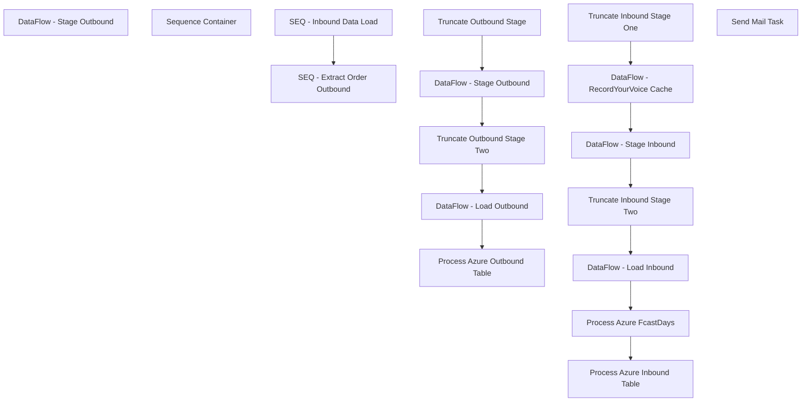

# SSIS Package: Web_OrderIntegrationDataMonitor

**Project:** Web_OrderIntegrationDataMonitor  
**Folder:** Azure  
**Server:** STL-SSIS-P-01  

## Connection Managers

| Name | Type | Server | Catalog | Connection (sanitized) |
|---|---|---|---|---|
| ApplicationResources | OLEDB | bearcluster01.sql.buildabear.com | ApplicationResources | Data Source=bearcluster01.sql.buildabear.com; Initial Catalog=ApplicationResources; Provider=SQLNCLI11.1; Integrated Security=SSPI; Auto Translate=False |
| Azure | MSOLAP100 | asazure://northcentralus.asazure.windows.net/azasp01 | BABW-DW | Data Source=asazure://northcentralus.asazure.windows.net/azasp01; Initial Catalog=BABW-DW; Provider=MSOLAP.7 |
| BABWPartyPlanner | OLEDB | bearcluster01.sql.buildabear.com | BABWPartyPlanner | Data Source=bearcluster01.sql.buildabear.com; Initial Catalog=BABWPartyPlanner; Provider=SQLNCLI11.1; Integrated Security=SSPI; Auto Translate=False |
| DW | OLEDB | papamart | dw | Data Source=papamart; Initial Catalog=dw; Provider=SQLNCLI11.1; Integrated Security=SSPI; Auto Translate=False |
| DWStaging | OLEDB | papamart | DWStaging | Data Source=papamart; Initial Catalog=DWStaging; Provider=SQLNCLI11.1; Integrated Security=SSPI; Auto Translate=False |
| Dynamics AX Connection Manager | DynamicsAX |  |  |  |
| Dynamics Sales Order Cache | CACHE |  |  |  |
| DynamicsAPILog Cache | CACHE |  |  |  |
| IntegrationStaging | OLEDB | stl-ssis-p-01 | IntegrationStaging | Data Source=stl-ssis-p-01; Initial Catalog=IntegrationStaging; Provider=SQLNCLI11.1; Integrated Security=SSPI; Auto Translate=False |
| RecordYourVoice | OLEDB | kodiak | RecordYourVoice | Data Source=kodiak; Initial Catalog=RecordYourVoice; Provider=SQLNCLI11.1; Integrated Security=SSPI; Auto Translate=False |
| RecordYourVoice Cache | CACHE |  |  |  |
| SMTP | SMTP |  |  |  |
| UK Created Cache | CACHE |  |  |  |
| UK FTP Cache | CACHE |  |  |  |
| WebOrderProcessing | OLEDB | bearcluster01.sql.buildabear.com | WebOrderProcessing | Data Source=bearcluster01.sql.buildabear.com; Initial Catalog=WebOrderProcessing; Provider=SQLNCLI11.1; Integrated Security=SSPI; Auto Translate=False |
| auditworks | OLEDB | bedrockdb01 | auditworks | Data Source=bedrockdb01; Initial Catalog=auditworks; Provider=SQLNCLI11.1; Integrated Security=SSPI; Auto Translate=False |

## Control Flow Tasks

| Task | Type |
|---|---|
| Web_OrderIntegrationDataMonitor | Package |
| DataFlow - Stage Outbound | Pipeline |
| Sequence Container | SEQUENCE |
| SEQ - Extract Order Outbound | SEQUENCE |
| DataFlow - Load Outbound | Pipeline |
| DataFlow - Stage Outbound | Pipeline |
| Process Azure Outbound Table | DTSProcessingTask |
| Truncate Outbound Stage | ExecuteSQLTask |
| Truncate Outbound Stage Two | ExecuteSQLTask |
| SEQ - Inbound Data Load | SEQUENCE |
| DataFlow - Load Inbound | Pipeline |
| DataFlow - RecordYourVoice Cache | Pipeline |
| DataFlow - Stage Inbound | Pipeline |
| Process Azure FcastDays | DTSProcessingTask |
| Process Azure Inbound Table | DTSProcessingTask |
| Truncate Inbound Stage One | ExecuteSQLTask |
| Truncate Inbound Stage Two | ExecuteSQLTask |
| Send Mail Task | SendMailTask |

## Control Flow Outline

```text
- Send Mail Task [SendMailTask]
- DataFlow - Stage Outbound [Pipeline]
- Sequence Container [SEQUENCE]
  - SEQ - Extract Order Outbound [SEQUENCE]
    - DataFlow - Load Outbound [Pipeline]
    - DataFlow - Stage Outbound [Pipeline]
    - Process Azure Outbound Table [DTSProcessingTask]
    - Truncate Outbound Stage [ExecuteSQLTask]
    - Truncate Outbound Stage Two [ExecuteSQLTask]
  - SEQ - Inbound Data Load [SEQUENCE]
    - DataFlow - Load Inbound [Pipeline]
    - DataFlow - RecordYourVoice Cache [Pipeline]
    - DataFlow - Stage Inbound [Pipeline]
    - Process Azure FcastDays [DTSProcessingTask]
    - Process Azure Inbound Table [DTSProcessingTask]
    - Truncate Inbound Stage One [ExecuteSQLTask]
    - Truncate Inbound Stage Two [ExecuteSQLTask]
```

## Architecture Diagram



## Variables

| Namespace | Name | Expression-bound |
|---|---|---|
| System | Propagate | No |
| User | DateTimeStamp | Yes |
| User | EndDate | Yes |
| User | EndDateAsDATE | Yes |
| User | GetDate | Yes |
| User | GetDateAsDATE | Yes |
| User | StartDate | Yes |
| User | StartDateAsDATE | Yes |

### Expression-bound variable values

#### User::DateTimeStamp

**Expression:**

```sql
(DT_WSTR,4)DATEPART("yyyy",GetDate()) 
+ (DT_WSTR,4)DATEPART("mm",GetDate()) 
+ (DT_WSTR,4)DATEPART("dd",GetDate()) 
+ (DT_WSTR,4)DATEPART("hh",GetDate()) 
+ (DT_WSTR,4)DATEPART("mi",GetDate()) 
+ (DT_WSTR,4)DATEPART("ss",GetDate()) 
+ (DT_WSTR,4)DATEPART("ms",GetDate())
```

**Evaluated value:**

```sql
20243189398537
```

#### User::EndDate

**Expression:**

```sql
dateadd("dd", @[$Package::DaysToInclude], @[User::StartDate])
```

**Evaluated value:**

```sql
3/18/2024
```

#### User::EndDateAsDATE

**Expression:**

```sql
(DT_WSTR, 4) datepart("year", @[User::EndDate])  + "-" +
right("0"+ (DT_WSTR, 2) datepart("mm", @[User::EndDate]),2)  + "-" +
right("0" +(DT_WSTR, 2) datepart("dd",  @[User::EndDate]),2)
```

**Evaluated value:**

```sql
2024-03-18
```

#### User::GetDate

**Expression:**

```sql
(DT_DATE)DATEDIFF("Day", (DT_DATE) 0, GETDATE())
```

**Evaluated value:**

```sql
3/18/2024
```

#### User::GetDateAsDATE

**Expression:**

```sql
(DT_WSTR, 4) datepart("year", @[User::GetDate])  + "-" +
right("0"+ (DT_WSTR, 2) datepart("mm", @[User::GetDate]),2)  + "-" +
right("0" +(DT_WSTR, 2) datepart("dd",  @[User::GetDate]),2)
```

**Evaluated value:**

```sql
2024-03-18
```

#### User::StartDate

**Expression:**

```sql
dateadd("dd", -@[$Package::DaysToGoBack] , @[User::GetDate] )
```

**Evaluated value:**

```sql
3/8/2024
```

#### User::StartDateAsDATE

**Expression:**

```sql
(DT_WSTR, 4) datepart("year", @[User::StartDate])  + "-" +
right("0"+ (DT_WSTR, 2) datepart("mm", @[User::StartDate]),2)  + "-" +
right("0" +(DT_WSTR, 2) datepart("dd",  @[User::StartDate]),2)
```

**Evaluated value:**

```sql
2024-03-08
```

## Execute SQL Tasks

### Truncate Outbound Stage

**Path:** `Package\Sequence Container\SEQ - Extract Order Outbound\Truncate Outbound Stage`  
**Connection:** DWStaging (papamart/DWStaging)  

```sql
TRUNCATE TABLE WebOrderIntegrationOutboundTrackingStage
```

### Truncate Outbound Stage Two

**Path:** `Package\Sequence Container\SEQ - Extract Order Outbound\Truncate Outbound Stage Two`  
**Connection:** DW (papamart/dw)  

```sql
update dwstaging..WebOrderIntegrationOutboundTrackingStage
set ESWebOrderNumber=NULL
where ESWebOrderNumber = 'NULL'

TRUNCATE TABLE WebOrderIntegrationOutboundTracking
```

### Truncate Inbound Stage One

**Path:** `Package\Sequence Container\SEQ - Inbound Data Load\Truncate Inbound Stage One`  
**Connection:** DWStaging (papamart/DWStaging)  

```sql
TRUNCATE TABLE WebOrderIntegrationInboundTrackingStage
```

### Truncate Inbound Stage Two

**Path:** `Package\Sequence Container\SEQ - Inbound Data Load\Truncate Inbound Stage Two`  
**Connection:** DW (papamart/dw)  

```sql
TRUNCATE TABLE WebOrderIntegrationInboundTracking 
TRUNCATE TABLE DWStaging.dbo.WebOrderIntegrationInboundTrackingSummaryStage
```

## Data Flow: Sources

| Component | Source Object | Type | Data Flow Task | Connection | SQL Kind |
|---|---|---|---|---|---|
| Deck Shipped |  | OLEDBSource | DataFlow - Stage Outbound | WebOrderProcessing | SqlCommand |
| Integration Shipped |  | OLEDBSource | DataFlow - Stage Outbound | IntegrationStaging | SqlCommand |
| Sales Audit |  | OLEDBSource | DataFlow - Stage Outbound | auditworks | SqlCommand |
| Sales Audit EnterpriseSelling |  | OLEDBSource | DataFlow - Stage Outbound | auditworks | SqlCommand |
| UK Shipped |  | OLEDBSource | DataFlow - Stage Outbound | ApplicationResources | SqlCommand |
| WebOrderProcessing Shipped |  | OLEDBSource | DataFlow - Stage Outbound | WebOrderProcessing | SqlCommand |
| WebOrderIntegrationOutboundTrackingStage |  | OLEDBSource | DataFlow - Load Outbound | DWStaging | SqlCommand |
| Deck Shipped |  | OLEDBSource | DataFlow - Stage Outbound | WebOrderProcessing | SqlCommand |
| Integration Shipped |  | OLEDBSource | DataFlow - Stage Outbound | IntegrationStaging | SqlCommand |
| Sales Audit |  | OLEDBSource | DataFlow - Stage Outbound | auditworks | SqlCommand |
| Sales Audit EnterpriseSelling |  | OLEDBSource | DataFlow - Stage Outbound | auditworks | SqlCommand |
| UK Shipped |  | OLEDBSource | DataFlow - Stage Outbound | ApplicationResources | SqlCommand |
| WebOrderProcessing Shipped |  | OLEDBSource | DataFlow - Stage Outbound | WebOrderProcessing | SqlCommand |
| WebOrderIntegrationInboundTrackingStage |  | OLEDBSource | DataFlow - Load Inbound | DWStaging |  |
| Web Orders |  | OLEDBSource | DataFlow - RecordYourVoice Cache | WebOrderProcessing | SqlCommand |
| Deck Order Nightly Report File |  | OLEDBSource | DataFlow - Stage Inbound | WebOrderProcessing | SqlCommand |
| DynamicsAPILog |  | OLEDBSource | DataFlow - Stage Inbound | IntegrationStaging | SqlCommand |
| Order Import Log |  | OLEDBSource | DataFlow - Stage Inbound | WebOrderProcessing | SqlCommand |
| Order Processing Status |  | OLEDBSource | DataFlow - Stage Inbound | WebOrderProcessing | SqlCommand |
| UK Created Log |  | OLEDBSource | DataFlow - Stage Inbound | ApplicationResources | SqlCommand |
| UK FTP Log |  | OLEDBSource | DataFlow - Stage Inbound | IntegrationStaging | SqlCommand |

#### Deck Shipped — SqlCommand

```sql
with 
StatusPivot as
	(
		select 
			OrderNumber as DeckOrderNumber,
			CurrentOrderStatus,
			CurrentItemStatus,
			New as DeckNewDate,
			isnull(PendingWave,StorePendingShip) as DeckPendingWaveDate,
			isnull(Waved,PickingForShipping) as DeckWaveDate,
			isnull(isnull(shipped,StoreShipped),GiftCardProcessed) as DeckShipDate,
			Cancelled as DeckCancelDate
		from wm.vwDeckOrderItemStatusPivot
		group by 
			OrderNumber,
			CurrentOrderStatus,
			CurrentItemStatus,
			New,
			isnull(PendingWave,StorePendingShip),
			isnull(Waved,PickingForShipping),
			isnull(isnull(shipped,StoreShipped),GiftCardProcessed),
			Cancelled
	),
DeckStatuses as
	(
		select 
			cast(DeckOrderNumber as varchar(10)) as DeckOrderNumber,
			case
				when CurrentItemStatus='Cancelled' or DeckCancelDate is not null
					then 'Cancelled'
				else CurrentItemStatus
			end as DeckCurrentStatus,
			cast(DeckShipDate as date) DeckShipDate,
			DeckCancelDate
		from StatusPivot
		where isnull(isnull(isnull(DeckNewDate,DeckPendingWaveDate), isnull(DeckWaveDate,DeckShipDate)), DeckCancelDate) >= dateadd(dd, -60, ?)
		group by 
			DeckOrderNumber,
			case
				when CurrentItemStatus='Cancelled' or DeckCancelDate is not null
					then 'Cancelled'
				else CurrentItemStatus
			end,
			DeckShipDate,
			DeckCancelDate
	)
select 
	cast(left(isnull(v.OrderNumber,d.DeckOrderNumber), 8) as varchar(8)) as DeckOrderNumber,
	cast(v.OrderNumber as varchar(10)) as SettledOrderNumber,
	cast(v.TransactionDate as date) as SettlementDate,
	cast(d.DeckShipDate as date) as DeckShipDate,
	isnull(cast(v.OrderNumber as varchar(10)), 'xxxxxxxxxx') as SALookup,
	cast(d.DeckCancelDate as date) DeckCancelDate,
	d.DeckCurrentStatus,
	case when v.TransactionDate is null then 0 else 1 end as isSettled
from DeckStatuses d 
full outer join wm.vwTransactionDetailAll v on d.DeckOrderNumber=v.TransactionNum and cast(v.TransactionDate as date) >= dateadd(dd, -60, ?)
group by 
	cast(left(isnull(v.OrderNumber,d.DeckOrderNumber), 8) as varchar(8)),
	cast(v.OrderNumber as varchar(10)),
	cast(v.TransactionDate as date),
	cast(d.DeckShipDate as date),
	isnull(cast(v.OrderNumber as varchar(10)), 'xxxxxxxxxx'),
	cast(d.DeckCancelDate as date),
	d.DeckCurrentStatus,
	case when v.TransactionDate is null then 0 else 1 end
```

#### Integration Shipped — SqlCommand

```sql
select 
	DeckSalesOrderReferenceNumber as IntegrationWebOrderNumber, 
	cast(dateadd(hh,-6,ShipConfirmDateTime) as date) as IntegrationShippedDate,
	OrderNum as IntegrationSalesOrderNumber
from [WMS].[SalesOrderStatusUpdateShipped] with (nolock)
where Warehouse = '1013'
and cast(dateadd(hh,-6,ShipConfirmDateTime) as date) >= dateadd(dd, -60, ?)
group by 
DeckSalesOrderReferenceNumber,
cast(dateadd(hh,-6,ShipConfirmDateTime) as date),
OrderNum
```

#### Sales Audit — SqlCommand

```sql
select  
	cast(substring (ln.line_note, 12,30) as varchar(10)) as SalesAuditWebOrderNumber,
	cast(substring (ln.line_note, 12,30) as varchar(8)) as SalesAuditOrderNumber,
	cast(th.transaction_date as date) as SalesAuditTransactionDate
from transaction_header th (nolock)
join line_note ln (nolock) on th.transaction_id = ln.transaction_id
and th.store_no in ('13', '2013')
and ln.line_note like 'Web Order%'
and cast(th.transaction_date as date) >=dateadd(dd, -60, ?)
group by 
	cast(substring (ln.line_note, 12,30) as varchar(10)),
	cast(substring (ln.line_note, 12,30) as varchar(8)),
	cast(th.transaction_date as date)
union 
select  
	cast(substring (ln.line_note, 12,30) as varchar(10)) as SalesAuditWebOrderNumber,
	cast(substring (ln.line_note, 12,30) as varchar(8)) as SalesAuditOrderNumber,
	cast(th.transaction_date as date) as SalesAuditTransactionDate
from av_transaction_header th (nolock)
join av_line_note ln (nolock) on th.av_transaction_id = ln.av_transaction_id
and th.store_no in ('13', '2013')
and ln.line_note like 'Web Order%'
and cast(th.transaction_date as date) >= dateadd(dd, -60, ?)
group by 
	cast(substring (ln.line_note, 12,30) as varchar(10)),
	cast(substring (ln.line_note, 12,30) as varchar(8)),
	cast(th.transaction_date as date)
```

#### Sales Audit EnterpriseSelling — SqlCommand

```sql
select 
	cast(left(tl.reference_no,19) as varchar) as ESinSAReferenceNo,
	cast(th.transaction_date as date) as ESinSATransactionDate
from transaction_line tl with (nolock)
join transaction_header th with (nolock) on tl.transaction_id=th.transaction_id
where tl.line_object = 106
and tl.line_action = 90
and cast(th.transaction_date as date) >= dateadd(dd, -60, ?)
group by 
	cast(left(tl.reference_no,19) as varchar),
	cast(th.transaction_date as date)
union
select
	cast(left(tl.reference_no,19) as varchar) as ESinSAReferenceNo,
	cast(th.transaction_date as date) as ESinSATransactionDate
from av_transaction_line tl with (nolock)
join av_transaction_header th with (nolock) on tl.av_transaction_id=th.av_transaction_id
where tl.line_object = 106
and tl.line_action = 90
and cast(th.transaction_date as date) >= dateadd(dd, -60, ?)
group by 
	cast(left(tl.reference_no,19) as varchar),
	cast(th.transaction_date as date)
```

#### UK Shipped — SqlCommand

```sql
select 
	v.OrderNumber as UKShippedOrder,
	cast(v.LogDateTime as date) as UKShippedDate
from vwUpdateShippedOMS_ErrorLog v
join WebOrderProcessing.wm.Orders o with (nolock) on v.OrderNumber=o.OrderNum
where cast(v.LogDateTime as date) >= ?
and o.SourceSite='BABW-UK' 
group by 
	v.OrderNumber,
cast(v.LogDateTime as date)
```

#### WebOrderProcessing Shipped — SqlCommand

```sql
select 
	o.OrderNum WebOrderProcessingShippedWebOrderNumber,
	cast(os.StatusDate as date) as WebOrderProcessingShippedStatusDate
from wm.Orders o with (nolock)
join wm.OrderStatus os with (nolock)
	on o.OrderID=os.OrderID
	and os.CurrentStatus=1
join wm.OrderStatus osS with (nolock) 
	on osS.Status in ('Shipped','Complete')
	and o.OrderID=osS.OrderID
where 1=1
and (
		(
			sourcesite = 'BABW-US'
			and 
			isnull(o.PickupStore,'') in ('', '0013')
		)
		or
		(
			sourcesite = 'BABW-UK'
			and 
			isnull(o.PickupStore,'') in ('', '2013')
		)
	)
and cast(os.StatusDate as date) >= dateadd(dd, -60, ?)
group by 
	o.OrderNum,
	cast(os.StatusDate as date)
```

#### WebOrderIntegrationOutboundTrackingStage — SqlCommand

```sql
select 
	ExposedShippedDate,	
	ShippedFromCountry,	
	ExposedShippedOrder,	
	DynamicsShippedInvoiceDate,	
	DynamicsShippedSalesOrderNumber,	
	DynamicsShippedWebOrderNumber,	
	IntegrationShippedDate,	
	IntegrationSalesOrderNumber,	
	IntegrationWebOrderNumber,	
	UKShippedDate,	
	UKShippedOrder,	
	WebOrderProcessingShippedStatusDate,	
	WebOrderProcessingShippedWebOrderNumber,	
	DeckShipDate,	
	DeckWebOrderNumber,	
	DeckCancelDate,
	DeckCurrentStatus,
	case
		when SalesAuditWebOrderNumber is NULL
		and ESWebOrderNumber is not NULL
		then ExposedShippedOrder
		else SalesAuditWebOrderNumber
	end as SalesAuditWebOrderNumber,
	case 
		when SalesAuditWebOrderNumber is NULL
		and ESWebOrderNumber is not NULL
		then ESinSATransactionDate
		else SalesAuditTransactionDate
	end as SalesAuditTransactionDate,
SettlementDate,
SettledOrderNumber,
isSettled
from WebOrderIntegrationOutboundTrackingStage
```

#### Deck Shipped — SqlCommand

```sql
with 
StatusPivot as
	(
		select 
			OrderNumber as DeckOrderNumber,
			CurrentOrderStatus,
			CurrentItemStatus,
			New as DeckNewDate,
			isnull(PendingWave,StorePendingShip) as DeckPendingWaveDate,
			isnull(Waved,PickingForShipping) as DeckWaveDate,
			isnull(isnull(shipped,StoreShipped),GiftCardProcessed) as DeckShipDate,
			Cancelled as DeckCancelDate
		from wm.vwDeckOrderItemStatusPivot
		group by 
			OrderNumber,
			CurrentOrderStatus,
			CurrentItemStatus,
			New,
			isnull(PendingWave,StorePendingShip),
			isnull(Waved,PickingForShipping),
			isnull(isnull(shipped,StoreShipped),GiftCardProcessed),
			Cancelled
	),
DeckStatuses as
	(
		select 
			cast(DeckOrderNumber as varchar(10)) as DeckOrderNumber,
			case
				when CurrentItemStatus='Cancelled' or DeckCancelDate is not null
					then 'Cancelled'
				else CurrentItemStatus
			end as DeckCurrentStatus,
			cast(DeckShipDate as date) DeckShipDate,
			DeckCancelDate
		from StatusPivot
		where 1=1
		and isnull(DeckShipDate, isnull(DeckWaveDate,DeckPendingWaveDate)) >= dateadd(dd, -60, ?)
		group by 
			DeckOrderNumber,
			case
				when CurrentItemStatus='Cancelled' or DeckCancelDate is not null
					then 'Cancelled'
				else CurrentItemStatus
			end,
			DeckShipDate,
			DeckCancelDate
	),
DeckSettlements as
	(
		select 
			t.sBatchID,
			t.sStore,
			t.sOrderNumber SettledOrderNumber,
			t.iAWTransID,
			t.dTimeStamp as TransactionDate
		from BABWeCommerce.dbo.NSBTranslate_logTrans t
		  join BABWeCommerce.dbo.NSBTranslate_batch b on t.sBatchID=b.sBatchID
		where b.bSentToAW = 1 
			and t.sStore in (13,2013)
			and cast(t.dTimeStamp as date) >= dateadd(dd, -60, ?)
		group by 
			t.sBatchID,
			t.sStore,
			t.sOrderNumber,
			t.iAWTransID,
			t.dTimeStamp
	)
select 
	cast(left(isnull(v.SettledOrderNumber,d.DeckOrderNumber), 8) as varchar(8)) as DeckOrderNumber,
	cast(v.SettledOrderNumber as varchar(10)) as SettledOrderNumber,
	cast(v.TransactionDate as date) as SettlementDate,
	cast(d.DeckShipDate as date) as DeckShipDate,
	isnull(cast(v.SettledOrderNumber as varchar(10)), 'xxxxxxxxxx') as SALookup,
	cast(d.DeckCancelDate as date) DeckCancelDate,
	d.DeckCurrentStatus,
	case when v.TransactionDate is null then 0 else 1 end as isSettled
from DeckStatuses d 
full outer join DeckSettlements v on d.DeckOrderNumber=left(v.SettledOrderNumber,8)
group by 
	cast(left(isnull(v.SettledOrderNumber,d.DeckOrderNumber), 8) as varchar(8)),
	cast(v.SettledOrderNumber as varchar(10)),
	cast(v.TransactionDate as date),
	cast(d.DeckShipDate as date),
	isnull(cast(v.SettledOrderNumber as varchar(10)), 'xxxxxxxxxx'),
	cast(d.DeckCancelDate as date),
	d.DeckCurrentStatus,
	case when v.TransactionDate is null then 0 else 1 end
```

#### Web Orders — SqlCommand

```sql
select 
		o.OrderNumber as OrderNumber,
		i.RecordYourVoiceOrder
from wm.OrderItems i with (nolock) 
join wm.Orders o with (nolock) on i.OrderId=o.OrderId
where 1=1
and cast(o.OrderDate as date) >= ?
group by 
	o.OrderNumber,
	i.RecordYourVoiceOrder
```

#### Deck Order Nightly Report File — SqlCommand

```sql
select 
	e.OrderNumber as DeckOrderNumber,
	max(cast(e.OrderItemStatusChangeDateUTC as date)) as DeckOrderDate, 
	max(e.OrderNetTotal) as DeckOrderNetTotal,
	e.SiteCode as DeckCountry
from wm.OMSCustomOrderExport e with (nolock)
where 1=1
and e.ItemStatus in ('Pending Wave','Store Pending Ship','Pending Sound') 
and isnull(e.OrderItemTypeName,'x') <> 'eGift' 
and isnull(e.OrderItemCustom1,'x') <> 'Build-A-Bear Donation'
and cast(e.OrderItemStatusChangeDateUTC as date) >= dateadd(dd, -60, ?) -- goes 60 days back for the deck data, in case for some reason we have it later in the WOP, etc... 
GROUP BY 
	e.OrderNumber,
	e.SiteCode
UNION
select ---orders that jumped to waved without bing pending..
	e.OrderNumber as DeckOrderNumber,
	max(cast(e.OrderItemStatusChangeDateUTC as date)) as DeckOrderDate, 
	max(e.OrderNetTotal) as DeckOrderNetTotal,
	e.SiteCode as DeckCountry
from wm.OMSCustomOrderExport e with (nolock)
where 1=1
and e.ItemStatus in ('Waved','Picking for Shipping') 
and isnull(e.OrderItemTypeName,'x') <> 'eGift' 
and isnull(e.OrderItemCustom1,'x') <> 'Build-A-Bear Donation'
and not exists (
					select p.OrderNumber 
					from wm.OMSCustomOrderExport p with (nolock)
					where 1=1
					and p.ItemStatus in ('Pending Wave','Store Pending Ship','Pending Sound') 
					and isnull(p.OrderItemTypeName,'x') <> 'eGift' 
					and isnull(p.OrderItemCustom1,'x') <> 'Build-A-Bear Donation'
					and p.OrderNumber=e.OrderNumber
				)
and cast(e.OrderItemStatusChangeDateUTC as date) >= dateadd(dd, -60, ?) -- goes 60 days back for the deck data, in case for some reason we have it later in the WOP, etc... 
GROUP BY 
	e.OrderNumber,
	e.SiteCode
UNION
select ---orders that jumped to shipped without bing pending or waved
	e.OrderNumber as DeckOrderNumber,
	max(cast(e.OrderItemStatusChangeDateUTC as date)) as DeckOrderDate, 
	max(e.OrderNetTotal) as DeckOrderNetTotal,
	e.SiteCode as DeckCountry
from wm.OMSCustomOrderExport e with (nolock)
where 1=1
and e.ItemStatus in ('Shipped','Store Shipped','Gift Card Processed') 
and isnull(e.OrderItemTypeName,'x') <> 'eGift' 
and isnull(e.OrderItemCustom1,'x') <> 'Build-A-Bear Donation'
and not exists (
					select p.OrderNumber 
					from wm.OMSCustomOrderExport p with (nolock)
					where 1=1
					and p.ItemStatus in ('Pending Wave','Store Pending Ship','Pending Sound','Waved','Picking for Shipping') 
					and isnull(p.OrderItemTypeName,'x') <> 'eGift' 
					and isnull(p.OrderItemCustom1,'x') <> 'Build-A-Bear Donation'
					and p.OrderNumber=e.OrderNumber
				)
and cast(e.OrderItemStatusChangeDateUTC as date) >= dateadd(dd, -60, ?) -- goes 60 days back for the deck data, in case for some reason we have it later in the WOP, etc... 
GROUP BY 
	e.OrderNumber,
	e.SiteCode
```

#### DynamicsAPILog — SqlCommand

```sql
with
MaxWebOrder as
	(
		select 
			cast(left(WebOrderNumber,8) as varchar(8)) as DynamicsAPIOrderNumber,
			cast (max(WebOrderNumber) as varchar(10)) as DynamicsAPIWebOrderNumber,
			min(cast(api.InsertDate as date)) as DynamicsAPIDate
		from wms.DynamicsAPILog  api with (nolock)
		where IntegrationName = 'WM Import OMS'
		and ResponseBody like '%hasErrors":false%'
		and cast(api.InsertDate as date) >= ?
		group by 
			cast(left(WebOrderNumber,8) as varchar(8))
	)
select
	m.DynamicsAPIOrderNumber,
	m.DynamicsAPIWebOrderNumber,
	min(cast(SUBSTRING(api.ResponseBody, charindex('Sales order ',api.ResponseBody,1)+12,12) as varchar(20))) as DynamicsAPISalesOrderNumber,
	m.DynamicsAPIDate
from wms.DynamicsAPILog api with (nolock)
join MaxWebOrder m 
	on cast(left(WebOrderNumber,10) as varchar(10))=m.DynamicsAPIWebOrderNumber
	and cast(api.InsertDate as date)=m.DynamicsAPIDate
group by 
	m.DynamicsAPIOrderNumber,
	m.DynamicsAPIWebOrderNumber,
	m.DynamicsAPIDate
```

#### Order Import Log — SqlCommand

```sql
select 
	max(cast(l.LogCreatedDate as date)) ImportedDate,
	cast(l.OrderNumber as varchar(8)) as ImportedOrderNumber,
	max(l.OrderNumber) as ImportedWebOrderNumber
from ApplicationResources.dbo.vwImportOMSOrderFileLog l with (nolock)
where 1=1
and cast(l.LogCreatedDate as date) >= dateadd(dd, -60, ?)
and l.OrderNumber like '%[_]%'
group by 
	cast(l.OrderNumber as varchar(8))
```

#### Order Processing Status — SqlCommand

```sql
with
preStage as
	(
		select 
			o.OrderNumber as WOPOrderNumber,
			max(o.OrderNum) as WOPWebOrderNumber,
			right(o.SourceSite,2) as WOPCountry
		from wm.Orders o with (nolock)
		join wm.vwOrderStatusPivot p on o.OrderNum=p.OrderNum
		where 1=1
		and o.OrderNum like '%[_]%' 
		and cast(isnull(isnull(p.PendingStatusDate,p.WavedStatusDate),p.ShippedCompletedStatusDate) as date) >= ?
		group by 
			o.OrderNumber,
			right(o.SourceSite,2)
	)
select 
	pp.WOPOrderNumber,
	pp.WOPWebOrderNumber,
	pp.WOPCountry,
	case 
		when isnull(o.PickupStore,'') = ''
			then case 
				when o.SourceSite = 'BABW-US' then '0013'
				when o.SourceSite = 'BABW-UK' then '2013'
			end
		else o.PickupStore
	end as WOPFulfillmentLocation,
	cast(isnull(isnull(p.PendingStatusDate,p.WavedStatusDate),p.ShippedCompletedStatusDate) as date) as WOPNewOrderStatusDate
from preStage pp
join wm.Orders o with (nolock) 
	on pp.WOPOrderNumber=o.OrderNumber
	and pp.WOPWebOrderNumber=o.OrderNum
join wm.vwOrderStatusPivot p on o.OrderNum=p.OrderNum
where 1=1
and cast(isnull(isnull(p.PendingStatusDate,p.WavedStatusDate),p.ShippedCompletedStatusDate) as date) >= ?
group by 
	pp.WOPOrderNumber,
	pp.WOPWebOrderNumber,
	pp.WOPCountry,
	case 
		when isnull(o.PickupStore,'') = ''
			then case 
				when o.SourceSite = 'BABW-US' then '0013'
				when o.SourceSite = 'BABW-UK' then '2013'
			end
		else o.PickupStore
	end,
	cast(isnull(isnull(p.PendingStatusDate,p.WavedStatusDate),p.ShippedCompletedStatusDate) as date)
```

#### UK Created Log — SqlCommand

```sql
select 
	left(OrderNumber,8) as UKCreatedOrderNumber,
	min(OrderNumber) as UKCreatedWebOrderNumber,
	min(LogDateTime) as UKCreatedLogDate
from vwUpdateWavedOMS_ErrorLog 
where cast(LogDateTime as date) >= ?
group by 
	left(OrderNumber,8)
```

#### UK FTP Log — SqlCommand

```sql
select 
	substring(ftpLog,64,8) as UKFTPOrderNumber,
	max(substring(ftpLog,64,10)) as UKFTPWebOrderNumber,
	max(cast(LogDateTime as date)) as UKFTPLogDate
from WEB.UKFTPTransmissionLogDump 
where ftplog like '%OMSInBoundOrder%'
and right(ftpLog,4) = '100%'
and cast(LogDateTime as date) >= ?
group by substring(ftpLog,64,8)
```

## Data Flow: Destinations

| Component | Target Table | Type | Data Flow Task | Connection | SQL Kind |
|---|---|---|---|---|---|
| WebOrderIntegrationOutboundTrackingStage |  | OLEDBDestination | DataFlow - Stage Outbound | DWStaging |  |
| WebOrderIntegrationOutboundTracking |  | OLEDBDestination | DataFlow - Load Outbound | DW |  |
| WebOrderIntegrationOutboundTrackingStage |  | OLEDBDestination | DataFlow - Stage Outbound | DWStaging |  |
| WebOrderIntegrationInboundTracking |  | OLEDBDestination | DataFlow - Load Inbound | DW |  |
| WebOrderIntegrationInboundTrackingStage |  | OLEDBDestination | DataFlow - Stage Inbound | DWStaging |  |
