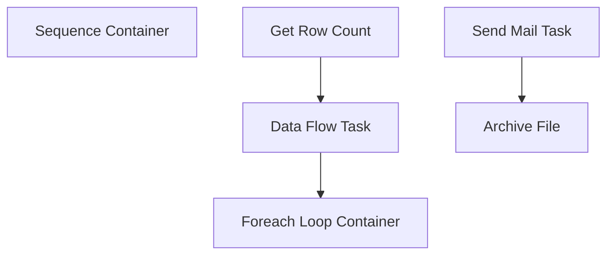

# SSIS Package: BrickDataNotification

**Project:** BrickDataNotification  
**Folder:** Brick project  
**Server:** STL-SSIS-P-01  

## Connection Managers

| Name | Type | Server | Catalog | Connection (sanitized) |
|---|---|---|---|---|
| BrickEngravingCSV | FLATFILE |  |  |  |
| SMTP | SMTP |  |  |  |
| WebOrderProcessing | OLEDB | bearcluster01.sql.buildabear.com | WebOrderProcessing | Data Source=bearcluster01.sql.buildabear.com; Initial Catalog=WebOrderProcessing; Provider=SQLNCLI11.1; Integrated Security=SSPI; Auto Translate=False |

## Control Flow Tasks

| Task | Type |
|---|---|
| BrickDataNotification | Package |
| Sequence Container | SEQUENCE |
| Data Flow Task | Pipeline |
| Foreach Loop Container | FOREACHLOOP |
| Archive File | FileSystemTask |
| Send Mail Task | SendMailTask |
| Get Row Count | ExecuteSQLTask |

## Control Flow Outline

```text
- Sequence Container [SEQUENCE]
  - Data Flow Task [Pipeline]
  - Foreach Loop Container [FOREACHLOOP]
    - Archive File [FileSystemTask]
    - Send Mail Task [SendMailTask]
  - Get Row Count [ExecuteSQLTask]
```

## Architecture Diagram



## Variables

| Namespace | Name | Expression-bound |
|---|---|---|
| User | BrickEngravingArchiveFileName | Yes |
| User | BrickEngravingCSV_ForLoop | No |
| User | BrickRowCount | No |
| User | DateTimeStamp | Yes |
| User | GetDate | Yes |

### Expression-bound variable values

#### User::BrickEngravingArchiveFileName

**Expression:**

```sql
@[$Package::BrickEngravingFilePath] + "Archive\\BrickEngraving." +  @[User::DateTimeStamp] + ".CSV"
```

**Evaluated value:**

```sql
\\stl-ssis-p-01\IntegrationStaging\BrickEngraving\Archive\BrickEngraving.2022111174535197.CSV
```

#### User::DateTimeStamp

**Expression:**

```sql
(DT_WSTR,4)DATEPART("yyyy",GetDate()) 
+ (DT_WSTR,4)DATEPART("mm",GetDate()) 
+ (DT_WSTR,4)DATEPART("dd",GetDate()) 
+ (DT_WSTR,4)DATEPART("hh",GetDate()) 
+ (DT_WSTR,4)DATEPART("mi",GetDate()) 
+ (DT_WSTR,4)DATEPART("ss",GetDate()) 
+ (DT_WSTR,4)DATEPART("ms",GetDate())
```

**Evaluated value:**

```sql
2022111174535197
```

#### User::GetDate

**Expression:**

```sql
(DT_DATE)DATEDIFF("Day", (DT_DATE) 0, GETDATE())
```

**Evaluated value:**

```sql
11/11/2022
```

## Execute SQL Tasks

### Get Row Count

**Path:** `Package\Sequence Container\Get Row Count`  
**Connection:** WebOrderProcessing (bearcluster01.sql.buildabear.com/WebOrderProcessing)  

```sql
with 
CancelledOrders as
	(
		select o.OrderNumber
		from wm.orderstatus os with (nolock)
		join wm.Orders o with (nolock) on os.OrderID=o.OrderID
		where o.SourceSite = 'BABW-US'
		and os.CurrentStatus = 1
		and os.Status='Cancelled'
	)
select count(*) as Rowz
from [BQ].[BrickEngraving] b with  (nolock)
join wm.Orders o with (nolock) on b.OrderNumber=o.OrderNumber
where 1=1
--and datediff(hh, InsertDate, getdate()) >= 24
and b.ExportDate is null
and not exists (select co.OrderNumber from CancelledOrders co where co.OrderNumber=b.OrderNumber)

```

## Data Flow: Sources

| Component | Source Object | Type | Data Flow Task | Connection | SQL Kind |
|---|---|---|---|---|---|
| BrickEngraving |  | OLEDBSource | Data Flow Task | WebOrderProcessing | SqlCommand |

#### BrickEngraving — SqlCommand

```sql
with 
CancelledOrders as
	(
		select o.OrderNumber
		from wm.orderstatus os with (nolock)
		join wm.Orders o with (nolock) on os.OrderID=o.OrderID
		where o.SourceSite = 'BABW-US'
		and os.CurrentStatus = 1
		and os.Status='Cancelled'
	)
select  DISTINCT
		b.BQBrickID,
		b.OrderNumber,
		replace(b.EngraveLine1,',','') as EngraveLine1,
		replace(b.EngraveLine2,',','') as EngraveLine2,
		replace(b.EngraveLine3,',','') as EngraveLine3,
		replace(b.EngraveName, ',', '') as EngraveName,
		cast(b.InsertDate as date) as OrderDate,
		replace(o.ShipToFName, ',', '') as ShipToFName,
		replace(o.ShipToLName, ',', '') as ShipToLName,
		replace(o.ShipToAddress1, ',', '') as ShipToAddress1,	
		replace(o.ShipToAddress2, ',', '') as ShipToAddress2,	
		replace(o.ShipToCity, ',', '') as ShipToCity,
		replace(o.ShipToState, ',', '') as ShipToState,
		replace(o.ShipToPostalCode,	',', '') as ShipToPostalCode,
		replace(o.ShipToCountry, ',', '') as ShipToCountry,
		replace(o.ShipToPhone, ',', '') as ShipToPhone,
		replace(o.ShipToEmail, ',', '') as ShipToEmail,
oi.sku,
		oi.price
from [BQ].[BrickEngraving] b with  (nolock)
join wm.Orders o with (nolock) on b.OrderNumber=o.OrderNumber
join wm.OrderItems oi with (nolock) on o.OrderID=oi.OrderID and oi.sku in ('080088','080299')
where 1=1
--and datediff(hh, InsertDate, getdate()) >= 24
--and b.ExportDate is null
and not exists (select co.OrderNumber from CancelledOrders co where co.OrderNumber=b.OrderNumber)
```

## Data Flow: Destinations

| Component | Target Table | Type | Data Flow Task | Connection | SQL Kind |
|---|---|---|---|---|---|
| Flat File Destination |  | FlatFileDestination | Data Flow Task | BrickEngravingCSV |  |
