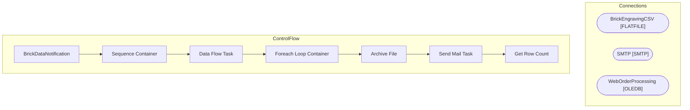

# SSIS Package: BrickDataNotification

**Project:** BrickDataNotification  
**Folder:** Brick project  
**Server:** STL-SSIS-P-01  

## Architecture Diagram

## Connection Managers

| Name | Type |
|---|---|
| BrickEngravingCSV | FLATFILE |
| SMTP | SMTP |
| WebOrderProcessing | OLEDB |

## Control Flow Tasks

| Task | Type |
|---|---|
| BrickDataNotification | Microsoft.Package |
| Sequence Container | STOCK:SEQUENCE |
| Data Flow Task | Microsoft.Pipeline |
| Foreach Loop Container | STOCK:FOREACHLOOP |
| Archive File | Microsoft.FileSystemTask |
| Send Mail Task | Microsoft.SendMailTask |
| Get Row Count | Microsoft.ExecuteSQLTask |

## Data Flow: Sources

| Component | SQL Preview |
|---|---|
|  | with  CancelledOrders as 	( 		select o.OrderNumber 		from wm.orderstatus os with (nolock) 		join wm.Orders o with (nolock) on os.OrderID=o.OrderID 		where o.SourceSite = 'BABW-US' 		and os.CurrentStatus = 1 		and os.Status='Cancelled' 	) select  DISTINCT 		b.BQBrickID, 		b.OrderNumber, 		replace(b.EngraveLine1,',','') as EngraveLine1, 		replace(b.EngraveLine2,',','') as EngraveLine2, 		replace(b.E |
|  | Update BQ.BrickEngraving Set ExportDate=GetDate() where BQBrickID = ? |

## Data Flow: Destinations

_None detected._

