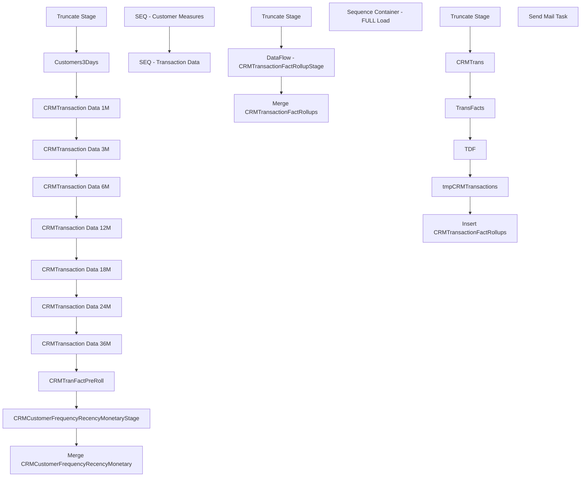

# SSIS Package: CRMCustomerTransactionMetrics___

**Project:** CRMCustomerTransactionMetrics___  
**Folder:** CRM  
**Server:** STL-SSIS-P-01  

## Connection Managers

| Name | Type | Server | Catalog | Connection (sanitized) |
|---|---|---|---|---|
| CRM | OLEDB | stl-crmdb-p-01 | crm | Data Source=stl-crmdb-p-01; Initial Catalog=crm; Provider=SQLNCLI11.1; Integrated Security=SSPI; Auto Translate=False |
| DW | OLEDB | papamart | dw | Data Source=papamart; Initial Catalog=dw; Provider=SQLNCLI11.1; Integrated Security=SSPI; Auto Translate=False |
| DWStaging | OLEDB | papamart | DWStaging | Data Source=papamart; Initial Catalog=DWStaging; Provider=SQLNCLI11.1; Integrated Security=SSPI; Auto Translate=False |
| SMTP | SMTP |  |  |  |
| cDim | CACHE |  |  |  |
| loyaltyAttrCache | CACHE |  |  |  |
| transRollupCache | CACHE |  |  |  |

## Control Flow Tasks

| Task | Type |
|---|---|
| CRMCustomerTransactionMetrics___ | Package |
| SEQ - Customer Measures | SEQUENCE |
| CRMCustomerFrequencyRecencyMonetaryStage | Pipeline |
| CRMTranFactPreRoll | ExecuteSQLTask |
| CRMTransaction Data 12M | Pipeline |
| CRMTransaction Data 18M | Pipeline |
| CRMTransaction Data 1M | Pipeline |
| CRMTransaction Data 24M | Pipeline |
| CRMTransaction Data 36M | Pipeline |
| CRMTransaction Data 3M | Pipeline |
| CRMTransaction Data 6M | Pipeline |
| Customers3Days | Pipeline |
| Merge CRMCustomerFrequencyRecencyMonetary | ExecuteSQLTask |
| Truncate Stage | ExecuteSQLTask |
| SEQ - Transaction Data | SEQUENCE |
| DataFlow - CRMTransactionFactRollupStage | Pipeline |
| Merge CRMTransactionFactRollups | ExecuteSQLTask |
| Truncate Stage | ExecuteSQLTask |
| Sequence Container - FULL Load | SEQUENCE |
| CRMTrans | Pipeline |
| Insert CRMTransactionFactRollups | Pipeline |
| TDF | Pipeline |
| tmpCRMTransactions | Pipeline |
| TransFacts | Pipeline |
| Truncate Stage | ExecuteSQLTask |
| Send Mail Task | SendMailTask |

## Control Flow Outline

```text
- Send Mail Task [SendMailTask]
- SEQ - Customer Measures [SEQUENCE]
  - CRMCustomerFrequencyRecencyMonetaryStage [Pipeline]
  - CRMTranFactPreRoll [ExecuteSQLTask]
  - CRMTransaction Data 12M [Pipeline]
  - CRMTransaction Data 18M [Pipeline]
  - CRMTransaction Data 1M [Pipeline]
  - CRMTransaction Data 24M [Pipeline]
  - CRMTransaction Data 36M [Pipeline]
  - CRMTransaction Data 3M [Pipeline]
  - CRMTransaction Data 6M [Pipeline]
  - Customers3Days [Pipeline]
  - Merge CRMCustomerFrequencyRecencyMonetary [ExecuteSQLTask]
  - Truncate Stage [ExecuteSQLTask]
- SEQ - Transaction Data [SEQUENCE]
  - DataFlow - CRMTransactionFactRollupStage [Pipeline]
  - Merge CRMTransactionFactRollups [ExecuteSQLTask]
  - Truncate Stage [ExecuteSQLTask]
- Sequence Container - FULL Load [SEQUENCE]
  - CRMTrans [Pipeline]
  - Insert CRMTransactionFactRollups [Pipeline]
  - TDF [Pipeline]
  - TransFacts [Pipeline]
  - Truncate Stage [ExecuteSQLTask]
  - tmpCRMTransactions [Pipeline]
```

## Architecture Diagram



## Variables

| Namespace | Name | Expression-bound |
|---|---|---|
| System | Propagate | No |

## Execute SQL Tasks

### CRMTranFactPreRoll

**Path:** `Package\SEQ - Customer Measures\CRMTranFactPreRoll`  
**Connection:** DW (papamart/dw)  

```sql
exec spCRMPreStageTranFactPreRoll
```

### Merge CRMCustomerFrequencyRecencyMonetary

**Path:** `Package\SEQ - Customer Measures\Merge CRMCustomerFrequencyRecencyMonetary`  
**Connection:** DW (papamart/dw)  

```sql
exec spMergeCRMCustomerFrequencyRecencyMonetary
```

### Truncate Stage

**Path:** `Package\SEQ - Customer Measures\Truncate Stage`  
**Connection:** DWStaging (papamart/DWStaging)  

```sql
TRUNCATE TABLE CRMCustomers3DaysStage
TRUNCATE TABLE CRMTranFact1MStage
TRUNCATE TABLE CRMTranFact3MStage
TRUNCATE TABLE CRMTranFact6MStage
TRUNCATE TABLE CRMTranFact12MStage
TRUNCATE TABLE CRMTranFact18MStage
TRUNCATE TABLE CRMTranFact24MStage
TRUNCATE TABLE CRMTranFact36MStage
TRUNCATE TABLE CRMTranFactPreRollStage

TRUNCATE TABLE CRMCustomerFrequencyRecencyMonetaryStage

```

### Merge CRMTransactionFactRollups

**Path:** `Package\SEQ - Transaction Data\Merge CRMTransactionFactRollups`  
**Connection:** DW (papamart/dw)  

```sql
exec spMergeCRMTransactionFactRollups

```

### Truncate Stage

**Path:** `Package\SEQ - Transaction Data\Truncate Stage`  
**Connection:** DWStaging (papamart/DWStaging)  

```sql
TRUNCATE TABLE tmpCRMTransactions
TRUNCATE TABLE tmpCRMTrans
TRUNCATE TABLE tmpTransFacts
TRUNCATE TABLE tmpTDFStage
```

### Truncate Stage

**Path:** `Package\Sequence Container - FULL Load\Truncate Stage`  
**Connection:** DWStaging (papamart/DWStaging)  

```sql
TRUNCATE TABLE tmpCRMTransactions
TRUNCATE TABLE tmpCRMTrans
TRUNCATE TABLE tmpTransFacts
TRUNCATE TABLE tmpTDFStage
truncate table dw.dbo.CRMTransactionFactRollups -- if doing full load and want to do insert at end 

```

## Data Flow: Sources

| Component | Source Object | Type | Data Flow Task | Connection | SQL Kind |
|---|---|---|---|---|---|
| CRMTranFactPreRollStage |  | OLEDBSource | CRMCustomerFrequencyRecencyMonetaryStage | DWStaging | SqlCommand |
| CRMTransactionFact 12M |  | OLEDBSource | CRMTransaction Data 12M | DW | SqlCommand |
| CRMTransactionFact 18M |  | OLEDBSource | CRMTransaction Data 18M | DW | SqlCommand |
| CRMTransactionFact 1M |  | OLEDBSource | CRMTransaction Data 1M | DW | SqlCommand |
| CRMTransactionFact 24M |  | OLEDBSource | CRMTransaction Data 24M | DW | SqlCommand |
| CRMTransactionFact 36M |  | OLEDBSource | CRMTransaction Data 36M | DW | SqlCommand |
| CRMTransactionFact 3M |  | OLEDBSource | CRMTransaction Data 3M | DW | SqlCommand |
| CRMTransactionFact 6M |  | OLEDBSource | CRMTransaction Data 6M | DW | SqlCommand |
| CRMTransactionFact |  | OLEDBSource | Customers3Days | DW | SqlCommand |
| DW |  | OLEDBSource | DataFlow - CRMTransactionFactRollupStage | DW | SqlCommand |
| CRMTrans |  | OLEDBSource | CRMTrans | DW | SqlCommand |
| tmpCRMTransactions |  | OLEDBSource | Insert CRMTransactionFactRollups | DWStaging |  |
| TDF |  | OLEDBSource | TDF | DW | SqlCommand |
| CRMTransactionFact |  | OLEDBSource | tmpCRMTransactions | DWStaging | SqlCommand |
| TransactionDetailFacts |  | OLEDBSource | tmpCRMTransactions | DWStaging | SqlCommand |
| TransactionFacts |  | OLEDBSource | tmpCRMTransactions | DWStaging | SqlCommand |
| TransFacts |  | OLEDBSource | TransFacts | DW | SqlCommand |

#### CRMTranFactPreRollStage — SqlCommand

```sql
select 
	pr.CustomerNumber,	
	pr.LifetimeTransactionCount,	
	pr.LifetimeRecencyCount,	
	pr.LifetimeSalesTotal,	
	pr.FirstTransactionDate,	
	pr.FirstStoreConcept,	
	pr.LastTransDate,
	cast(pr.LastTransStore as nvarchar(4)) as LastTransStore,
	isnull(m1.TransactionCount,0) Frequency1M,	
	isnull(m1.RecencyCount,0) Recency1M,	
	isnull(m1.SalesTotal,0) Sales1M,	
	isnull(m1.minDaysBetween,0) minDaysBetween1M,	
	isnull(m1.maxDaysBetween,0) maxDaysBetween1M,	
	isnull(m1.DaysBetween,0) DaysBetween1M,
	isnull(m3.TransactionCount,0) Frequency3M,	
	isnull(m3.RecencyCount,0) Recency3M,	
	isnull(m3.SalesTotal,0) Sales3M,	
	isnull(m3.minDaysBetween,0) minDaysBetween3M,	
	isnull(m3.maxDaysBetween,0) maxDaysBetween3M,	
	isnull(m3.DaysBetween,0) DaysBetween3M,
	isnull(m6.TransactionCount,0) Frequency6M,	
	isnull(m6.RecencyCount,0) Recency6M,	
	isnull(m6.SalesTotal,0) Sales6M,	
	isnull(m6.minDaysBetween,0) minDaysBetween6M,	
	isnull(m6.maxDaysBetween,0) maxDaysBetween6M,	
	isnull(m6.DaysBetween,0) DaysBetween6M,
	isnull(m12.TransactionCount,0) Frequency12M,	
	isnull(m12.RecencyCount,0) Recency12M,	
	isnull(m12.SalesTotal,0) Sales12M,	
	isnull(m12.minDaysBetween,0) minDaysBetween12M,	
	isnull(m12.maxDaysBetween,0) maxDaysBetween12M,	
	isnull(m12.DaysBetween,0) DaysBetween12M,
	isnull(m18.TransactionCount,0) Frequency18M,	
	isnull(m18.RecencyCount,0) Recency18M,	
	isnull(m18.SalesTotal,0) Sales18M,	
	isnull(m18.minDaysBetween,0) minDaysBetween18M,	
	isnull(m18.maxDaysBetween,0) maxDaysBetween18M,	
	isnull(m18.DaysBetween,0) DaysBetween18M,
	isnull(m24.TransactionCount,0) Frequency24M,	
	isnull(m24.RecencyCount,0) Recency24M,	
	isnull(m24.SalesTotal,0) Sales24M,	
	isnull(m24.minDaysBetween,0) minDaysBetween24M,	
	isnull(m24.maxDaysBetween,0) maxDaysBetween24M,	
	isnull(m24.DaysBetween,0) DaysBetween24M,
	isnull(m36.TransactionCount,0) Frequency36M,	
	isnull(m36.RecencyCount,0) Recency36M,	
	isnull(m36.SalesTotal,0) Sales36M,	
	isnull(m36.minDaysBetween,0) minDaysBetween36M,	
	isnull(m36.maxDaysBetween,0) maxDaysBetween36M,	
	isnull(m36.DaysBetween,0) DaysBetween36M
from CRMTranFactPreRollStage pr
left join CRMTranFact1MStage m1 on pr.CustomerNumber=m1.CustomerNumber
left join CRMTranFact3MStage m3 on pr.CustomerNumber=m3.CustomerNumber
left join CRMTranFact6MStage m6 on pr.CustomerNumber=m6.CustomerNumber
left join CRMTranFact12MStage m12 on pr.CustomerNumber=m12.CustomerNumber
left join CRMTranFact18MStage m18 on pr.CustomerNumber=m18.CustomerNumber
left join CRMTranFact24MStage m24 on pr.CustomerNumber=m24.CustomerNumber
left join CRMTranFact36MStage m36 on pr.CustomerNumber=m36.CustomerNumber
```

#### CRMTransactionFact 12M — SqlCommand

```sql
select
    x.CustomerNumber,
    case
        --when datediff(mm, dd.actual_date, getdate()) <= 12 --and datediff(mm, dd.actual_date, getdate()) >= 12
          when cast(dd.actual_date as date) >= cast(dateadd(d,-365,getdate()) as date)         
         then 'TwelveMonth'
        end as MonthRange,
    count(*) TransactionCount,
    datediff(dd, max(t.TransactionDate), getdate()) RecencyCount,
    sum(t.GaapSales) SalesTotal,
    min(t.daysSinceLastVisit) minDaysBetween,
    max(t.daysSinceLastVisit) maxDaysBetween,
    ( max(t.daysSinceLastVisit) - min(t.daysSinceLastVisit) ) DaysBetween
from dwstaging.dbo.CRMCustomers3DaysStage x
join CRMTransactionFact t with (nolock) on x.CustomerNumber=t.CustomerNumber
join date_dim dd with (nolock) on t.TransactionDate=cast(dd.actual_date as date)
where 1=1
--and datediff(mm, dd.actual_date, getdate()) <= 12
and cast(dd.actual_date as date) >= cast(dateadd(d,-365,getdate()) as date)         
group by
    x.CustomerNumber,
    case
        --when datediff(mm, dd.actual_date, getdate()) <= 12
      when cast(dd.actual_date as date) >= cast(dateadd(d,-365,getdate()) as date)             
       then 'TwelveMonth'
    end
```

#### CRMTransactionFact 18M — SqlCommand

```sql
select
    x.CustomerNumber,
    case
        --when datediff(mm, dd.actual_date, getdate()) <= 18 --and datediff(mm, dd.actual_date, getdate()) >= 12
       when cast(dd.actual_date as date) >= cast(dateadd(d,-547,getdate()) as date)            
then 'EighteenMonth'
        end as MonthRange,
    count(*) TransactionCount,
    datediff(dd, max(t.TransactionDate), getdate()) RecencyCount,
    sum(t.GaapSales) SalesTotal,
    min(t.daysSinceLastVisit) minDaysBetween,
    max(t.daysSinceLastVisit) maxDaysBetween,
    ( max(t.daysSinceLastVisit) - min(t.daysSinceLastVisit) ) DaysBetween
from dwstaging.dbo.CRMCustomers3DaysStage x
join CRMTransactionFact t with (nolock) on x.CustomerNumber=t.CustomerNumber
join date_dim dd with (nolock) on t.TransactionDate=cast(dd.actual_date as date)
where 1=1
--and datediff(mm, dd.actual_date, getdate()) <= 18
and cast(dd.actual_date as date) >= cast(dateadd(d,-547,getdate()) as date)          
group by
    x.CustomerNumber,
    case
        --when datediff(mm, dd.actual_date, getdate()) <= 18 
          when cast(dd.actual_date as date) >= cast(dateadd(d,-547,getdate()) as date)  
        then 'EighteenMonth'
    end
```

#### CRMTransactionFact 1M — SqlCommand

```sql
select
    x.CustomerNumber,
    case
        --when datediff(mm, dd.actual_date, getdate()) <= 1 --and datediff(mm, dd.actual_date, getdate()) >= 12
           when cast(dd.actual_date as date) >= cast(dateadd(d,-30,getdate()) as date)
            then 'OneMonth'
        end as MonthRange,
    count(*) TransactionCount,
    datediff(dd, max(t.TransactionDate), getdate()) RecencyCount,
    sum(t.GaapSales) SalesTotal,
    min(t.daysSinceLastVisit) minDaysBetween,
    max(t.daysSinceLastVisit) maxDaysBetween,
    ( max(t.daysSinceLastVisit) - min(t.daysSinceLastVisit) ) DaysBetween
from dwstaging.dbo.CRMCustomers3DaysStage x
join CRMTransactionFact t with (nolock) on x.CustomerNumber=t.CustomerNumber
join date_dim dd with (nolock) on t.TransactionDate=cast(dd.actual_date as date)
where 1=1
--and datediff(mm, dd.actual_date, getdate()) <= 1
and cast(dd.actual_date as date) >= cast(dateadd(d,-30,getdate()) as date)
group by
    x.CustomerNumber,
    case
        --when datediff(mm, dd.actual_date, getdate()) <= 1
         when cast(dd.actual_date as date) >= cast(dateadd(d,-30,getdate()) as date)
        then 'OneMonth'
    end
```

#### CRMTransactionFact 24M — SqlCommand

```sql
select
    x.CustomerNumber,
    case
        --when datediff(mm, dd.actual_date, getdate()) <= 24 --and datediff(mm, dd.actual_date, getdate()) >= 12
           when cast(dd.actual_date as date) >= cast(dateadd(d,-729,getdate()) as date)
            then 'TwentyFourMonth'
        end as MonthRange,
    count(*) TransactionCount,
    datediff(dd, max(t.TransactionDate), getdate()) RecencyCount,
    sum(t.GaapSales) SalesTotal,
    min(t.daysSinceLastVisit) minDaysBetween,
    max(t.daysSinceLastVisit) maxDaysBetween,
    ( max(t.daysSinceLastVisit) - min(t.daysSinceLastVisit) ) DaysBetween
from dwstaging.dbo.CRMCustomers3DaysStage x
join CRMTransactionFact t with (nolock) on x.CustomerNumber=t.CustomerNumber
join date_dim dd with (nolock) on t.TransactionDate=cast(dd.actual_date as date)
where 1=1
--and datediff(mm, dd.actual_date, getdate()) <= 24
and cast(dd.actual_date as date) >= cast(dateadd(d,-729,getdate()) as date)
group by
    x.CustomerNumber,
    case
        --when datediff(mm, dd.actual_date, getdate()) <= 24
        when cast(dd.actual_date as date) >= cast(dateadd(d,-729,getdate()) as date)        
         then 'TwentyFourMonth'
    end
```

#### CRMTransactionFact 36M — SqlCommand

```sql
select
    x.CustomerNumber,
    case
        --when datediff(mm, dd.actual_date, getdate()) <= 36 --and datediff(mm, dd.actual_date, getdate()) >= 12
         when cast(dd.actual_date as date) >= cast(dateadd(d,-1094,getdate()) as date)          
          then 'ThirtySixMonth'
        end as MonthRange,
    count(*) TransactionCount,
    datediff(dd, max(t.TransactionDate), getdate()) RecencyCount,
    sum(t.GaapSales) SalesTotal,
    min(t.daysSinceLastVisit) minDaysBetween,
    max(t.daysSinceLastVisit) maxDaysBetween,
    ( max(t.daysSinceLastVisit) - min(t.daysSinceLastVisit) ) DaysBetween
from dwstaging.dbo.CRMCustomers3DaysStage x
join CRMTransactionFact t with (nolock) on x.CustomerNumber=t.CustomerNumber
join date_dim dd with (nolock) on t.TransactionDate=cast(dd.actual_date as date)
where 1=1
--and datediff(mm, dd.actual_date, getdate()) <= 36
and cast(dd.actual_date as date) >= cast(dateadd(d,-1094,getdate()) as date)        
group by
    x.CustomerNumber,
    case
        --when datediff(mm, dd.actual_date, getdate()) <= 36
          when cast(dd.actual_date as date) >= cast(dateadd(d,-1094,getdate()) as date)              
           then 'ThirtySixMonth'
    end
```

#### CRMTransactionFact 3M — SqlCommand

```sql
select
   x.CustomerNumber,
    case
        --when datediff(mm, dd.actual_date, getdate()) <= 3 
        when cast(dd.actual_date as date) >= cast(dateadd(d,-90,getdate()) as date)
            then 'ThreeMonth'
        end as MonthRange,
    count(*) TransactionCount,
    datediff(dd, max(t.TransactionDate), getdate()) RecencyCount,
    sum(t.GaapSales) SalesTotal,
    min(t.daysSinceLastVisit) minDaysBetween,
    max(t.daysSinceLastVisit) maxDaysBetween,
    ( max(t.daysSinceLastVisit) - min(t.daysSinceLastVisit) ) DaysBetween
from dwstaging.dbo.CRMCustomers3DaysStage x
join CRMTransactionFact t with (nolock) on x.CustomerNumber=t.CustomerNumber
join date_dim dd with (nolock) on t.TransactionDate=cast(dd.actual_date as date)
where 1=1
--and datediff(mm, dd.actual_date, getdate()) <= 3
and cast(dd.actual_date as date) >= cast(dateadd(d,-90,getdate()) as date)
group by
    x.CustomerNumber,
    case
        --when datediff(mm, dd.actual_date, getdate()) <= 3
        when cast(dd.actual_date as date) >= cast(dateadd(d,-90,getdate()) as date)
        then 'ThreeMonth'
    end
```

#### CRMTransactionFact 6M — SqlCommand

```sql
select
    x.CustomerNumber,
    case
        --when datediff(mm, dd.actual_date, getdate()) <= 6 --and datediff(mm, dd.actual_date, getdate()) >= 12
           when cast(dd.actual_date as date) >= cast(dateadd(d,-180,getdate()) as date)
            then 'SixMonth'
        end as MonthRange,
    count(*) TransactionCount,
    datediff(dd, max(t.TransactionDate), getdate()) RecencyCount,
    sum(t.GaapSales) SalesTotal,
    min(t.daysSinceLastVisit) minDaysBetween,
    max(t.daysSinceLastVisit) maxDaysBetween,
    ( max(t.daysSinceLastVisit) - min(t.daysSinceLastVisit) ) DaysBetween
from dwstaging.dbo.CRMCustomers3DaysStage x
join CRMTransactionFact t with (nolock) on x.CustomerNumber=t.CustomerNumber
join date_dim dd with (nolock) on t.TransactionDate=cast(dd.actual_date as date)
where 1=1
--and datediff(mm, dd.actual_date, getdate()) <= 6
and cast(dd.actual_date as date) >= cast(dateadd(d,-180,getdate()) as date)
group by
    x.CustomerNumber,
    case
        --when datediff(mm, dd.actual_date, getdate()) <= 6
    when cast(dd.actual_date as date) >= cast(dateadd(d,-180,getdate()) as date)        
    then 'SixMonth'
    end
```

#### CRMTransactionFact — SqlCommand

```sql
with 
Cust3Days as
	(
		select CustomerNumber 
		from CRMTransactionFact with (nolock) 
		where TransactionDate >= getdate()-1094
		group by CustomerNumber
	)
select
	x.CustomerNumber,
	min(t1.TransactionID) firstTransaction,
	max(t1.TransactionID) lastTransaction
from Cust3Days x
join CRMTransactionFact t1 with (nolock) 
	on x.CustomerNumber=t1.CustomerNumber
group by x.CustomerNumber
```

#### DW — SqlCommand

```sql
with
Stores as
	(
		SELECT	 
			right(('0000' + CAST(sd.STR_NUM AS VARCHAR)), 4) AS StoreNumber,
			CAST(dsd.Store_Key AS VARCHAR) AS StoreKey,
			cd.NM_FULL AS CountryNameFull,
			sa.StoreConcept
		 
		FROM KODIAK.BABWMstrData.dbo.STR_DIM sd
		INNER JOIN Store_Dim dsd ON dsd.store_id=sd.STR_NUM
		left join KODIAK.BABWMstrData.dbo.CNTRY_DIM cd ON cd.CNTRY_ID=sd.CNTRY_ID
		left join [Azure].[vwStoreAttributes] sa on right(('0000' + CAST(sd.STR_NUM AS VARCHAR)), 4) = sa.storenumber
		WHERE sd.CMPNY_ID=1 AND sd.STR_ID > 0
		--AND (dsd.closing_date>=DATEADD(day, -7, DATEADD(year, -2, DATEADD(yy, DATEDIFF(yy, 0, GETDATE()), 0)))
			--OR dsd.closing_date IS NULL)
		AND sd.STR_NUM not between 501 and 505  -- Labs
		AND sd.STR_NUM NOT BETWEEN 9001 AND 9100 -- Test Stores
	),
Products as
	(
		select ProductKey,Style,KeyStory,Chain,Department,LicenseCode
		from azure.vwProducts
		UNION
		select ProductKey,isnull(Style,('N/A' + cast(ProductKey as varchar))) as Style, KeyStory,isnull(Chain,'N/A') as Chain,isnull(Department,'N/A') as Department, LicenseCode
		from azure.vwProductsNoStyle
	)
select	
	ctf.CustomerNumber,
	datepart(yyyy, ctf.TransactionDate) TransactionYear,
	datepart(mm, ctf.TransactionDate) TransacionMonth,
	ctf.TransactionDate,
	sd.StoreConcept,
    sd.StoreNumber,
    sd.CountryNameFull,
	ctf.TransactionID,
	ctf.LifetimeVisitNumber,
	sum(case when  
				(
					lod.Line_Object IN (100, 102, 103, 104, 200, 202, 203, 204, 206, 210, 250, 290, 291, 293, 295, 296, 623, 640, 690, 691, 1630, 1631, 1199, 115, 215, 1660) 
					OR 
					(lod.line_object = 106 and lad.line_action in (90,142,99) )
				)
			then tdf.Units else 0 end) 
		as GaapUnits,
	sum(case when  
				(
					lod.Line_Object IN (100, 102, 103, 104, 200, 202, 203, 204, 206, 210, 250, 290, 291, 293, 295, 296, 623, 640, 690, 691, 1630, 1631, 1199, 115, 215, 1660) 
					OR 
					(lod.line_object = 106 and lad.line_action in (90,142,99) )
				)
			then (tdf.unit_gross_amount-tdf.unit_disc_amount) else 0 end)
		as GaapSales,
	pd.ProductKey,
	pd.Style,
	pd.KeyStory,
	pd.Chain as ConsumerGroup,	
	pd.Department,
	case 
		when len(LicenseCode) > 1  
			then 1 
		else 0 
	end as LicensedOrNot
from CRMTransactionFact ctf with (nolock)
join Stores sd with (nolock) on ctf.StoreKey=sd.StoreKey
join TransactionDetailFact tdf with (nolock) on ctf.TransactionID=tdf.Transaction_ID
join line_object_dim lod 
	on tdf.line_object_key=lod.line_object_key 
join line_action_dim lad on tdf.line_action_key=lad.line_action_key
join Products pd with (nolock) on tdf.product_key=pd.ProductKey
where 1=1
and isnull(ctf.UpdatedDate,ctf.InsertedDate) >= getdate()-3 --between '2019-10-01' and '2020-01-02'
--and exists (select TransactionID from tmpRoll c where c.TransactionID=ctf.TransactionID) --used for reloads/missed
group by
	ctf.CustomerNumber,
	datepart(yyyy, ctf.TransactionDate),
	datepart(mm, ctf.TransactionDate),
	ctf.TransactionDate,
	sd.StoreConcept,
    sd.StoreNumber,
    sd.CountryNameFull,
	ctf.TransactionID,
	ctf.LifetimeVisitNumber,
	pd.ProductKey,
	pd.Style ,
	pd.KeyStory,
	pd.Chain,	
	pd.Department,
	case 
		when len(LicenseCode) > 1  
			then 1 
		else 0 
	end
```

#### CRMTrans — SqlCommand

```sql
with
Stores as
	(
		SELECT	 
			right(('0000' + CAST(sd.STR_NUM AS VARCHAR)), 4) AS StoreNumber,
			CAST(dsd.Store_Key AS VARCHAR) AS StoreKey,
			cd.NM_FULL AS CountryNameFull,
			sa.StoreConcept
		 
		FROM KODIAK.BABWMstrData.dbo.STR_DIM sd
		INNER JOIN Store_Dim dsd ON dsd.store_id=sd.STR_NUM
		left join KODIAK.BABWMstrData.dbo.CNTRY_DIM cd ON cd.CNTRY_ID=sd.CNTRY_ID
		left join [Azure].[vwStoreAttributes] sa on right(('0000' + CAST(sd.STR_NUM AS VARCHAR)), 4) = sa.storenumber
		WHERE sd.CMPNY_ID=1 AND sd.STR_ID > 0
		AND (dsd.closing_date>=DATEADD(day, -7, DATEADD(year, -2, DATEADD(yy, DATEDIFF(yy, 0, GETDATE()), 0)))
			OR dsd.closing_date IS NULL)
		AND sd.STR_NUM not between 501 and 505  -- Labs
		AND sd.STR_NUM NOT BETWEEN 9001 AND 9100 -- Test Stores
	)
select	
	ctf.CustomerNumber,
	datepart(yyyy, ctf.TransactionDate) TransactionYear,
	datepart(mm, ctf.TransactionDate) TransacionMonth,
	ctf.TransactionDate,
	sd.StoreConcept,
    sd.StoreNumber,
    sd.CountryNameFull,
	ctf.TransactionID,
	ctf.LifetimeVisitNumber,
	ctf.GaapSales,
	ctf.GaapUnits
from CRMTransactionFact ctf with (nolock)
join Stores sd with (nolock) on ctf.StoreKey=sd.StoreKey
where ctf.TransactionDate >= '2018-1-1'
```

#### TDF — SqlCommand

```sql
select 
	cast(tdf.transaction_id as int) as transaction_id,
	tdf.product_key,
	sum(tdf.Units) Units,
	sum(tdf.unit_gross_amount) Sales
from TransactionDetailFact tdf with (nolock) 
join date_dim dd with (nolock) on tdf.date_key=dd.date_key
--where datediff(yy, dd.actual_date, getdate()) <= 3
where datepart(yyyy, dd.actual_date) >= datepart(yyyy, dateadd(yyyy, -3, getdate()))
group by 
	tdf.transaction_id, tdf.product_key
```

#### CRMTransactionFact — SqlCommand

```sql
select *
from tmpCRMTrans
order by TransactionID
```

#### TransactionDetailFacts — SqlCommand

```sql
select *
from tmpTDFstage 
order by transaction_id
```

#### TransactionFacts — SqlCommand

```sql
select *
from tmpTransFacts
order by transaction_id
```

#### TransFacts — SqlCommand

```sql
select	
	tf.transaction_id,
	sum(gaap_sales_amount) as GaapSales,
	sum(gaap_units) as GaapUnits
from TransactionFact tf with (nolock)
join date_dim dd with (nolock) on tf.date_key=dd.date_key
where datediff(yy, dd.actual_date, getdate()) <=3
group by tf.transaction_id
```

## Data Flow: Destinations

| Component | Target Table | Type | Data Flow Task | Connection | SQL Kind |
|---|---|---|---|---|---|
| CRMCustomerFrequencyRecencyMonetaryStage |  | OLEDBDestination | CRMCustomerFrequencyRecencyMonetaryStage | DWStaging |  |
| CRMTranFact12MStage |  | OLEDBDestination | CRMTransaction Data 12M | DWStaging |  |
| CRMTranFact18MStage |  | OLEDBDestination | CRMTransaction Data 18M | DWStaging |  |
| CRMTranFact1MStage |  | OLEDBDestination | CRMTransaction Data 1M | DWStaging |  |
| CRMTranFact24MStage |  | OLEDBDestination | CRMTransaction Data 24M | DWStaging |  |
| CRMTranFact36MStage |  | OLEDBDestination | CRMTransaction Data 36M | DWStaging |  |
| CRMTranFact3MStage |  | OLEDBDestination | CRMTransaction Data 3M | DWStaging |  |
| CRMTranFact6MStage |  | OLEDBDestination | CRMTransaction Data 6M | DWStaging |  |
| CRMCustomers3DaysStage |  | OLEDBDestination | Customers3Days | DWStaging |  |
| tmpCRMTransactions |  | OLEDBDestination | DataFlow - CRMTransactionFactRollupStage | DWStaging |  |
| tmpCRMTrans |  | OLEDBDestination | CRMTrans | DWStaging |  |
| CRMTransactionFactRollups |  | OLEDBDestination | Insert CRMTransactionFactRollups | DW |  |
| tmpTDFStage |  | OLEDBDestination | TDF | DWStaging |  |
| tmpCRMTransactions |  | OLEDBDestination | tmpCRMTransactions | DWStaging |  |
| tmpTransFacts |  | OLEDBDestination | TransFacts | DWStaging |  |
