# SSIS Package: CRMSalesForceDataExtensionFileCreate

**Project:** CRMSalesForceDataExtensionFileCreate  
**Folder:** CRM  
**Server:** STL-SSIS-P-01  

## Connection Managers

| Name | Type | Server | Catalog | Connection (sanitized) |
|---|---|---|---|---|
| 12M | CACHE |  |  |  |
| 18M | CACHE |  |  |  |
| 1M | CACHE |  |  |  |
| 24M | CACHE |  |  |  |
| 3M | CACHE |  |  |  |
| 6M | CACHE |  |  |  |
| CRM | OLEDB | stl-crmdb-p-01 | crm | Data Source=stl-crmdb-p-01; Initial Catalog=crm; Provider=SQLNCLI11.1; Integrated Security=SSPI; Auto Translate=False |
| DW | OLEDB | papamart | dw | Data Source=papamart; Initial Catalog=dw; Provider=SQLNCLI11.1; Integrated Security=SSPI; Auto Translate=False |
| DWStaging | OLEDB | papamart | DWStaging | Data Source=papamart; Initial Catalog=DWStaging; Provider=SQLNCLI11.1; Integrated Security=SSPI; Auto Translate=False |
| Flat File Connection Manager | FLATFILE |  |  |  |
| SMTP | SMTP |  |  |  |
| STL-SSIS-P-01.IntegrationStaging | OLEDB | STL-SSIS-P-01 | IntegrationStaging | Data Source=STL-SSIS-P-01; Initial Catalog=IntegrationStaging; Provider=SQLNCLI11.1; Integrated Security=SSPI; Auto Translate=False |
| archive | FILE |  |  |  |
| birthday_export.csv | FILE |  |  |  |
| cDim | CACHE |  |  |  |
| delta | EXCEL | \\stl-ssis-p-01\IntegrationStaging\CRM\test\delta.xlsx |  | Provider=Microsoft.ACE.OLEDB.12.0; Data Source=\\stl-ssis-p-01\IntegrationStaging\CRM\test\delta.xlsx; Extended Properties="EXCEL 12.0 XML; HDR=YES" |

## Control Flow Tasks

| Task | Type |
|---|---|
| CRMSalesForceDataExtensionFileCreate | Package |
| file output- Service Cloud | ExecuteSQLTask |
| SEQ - data extension 1 | SEQUENCE |
| check for dupes | ExecuteSQLTask |
| check for dupes 2 | ExecuteSQLTask |
| file output- Marketing Cloud | ExecuteSQLTask |
| final customer flow | Pipeline |
| spMergeCRMde1_V3 | ExecuteSQLTask |
| truncate tmpCrmDe1 | ExecuteSQLTask |
| SEQ - data extension 2 | SEQUENCE |
| file output | ExecuteSQLTask |
| final bday flow | Pipeline |
| spMergeCRMde2_V2 | ExecuteSQLTask |
| truncate tmpCrmDe2 | ExecuteSQLTask |
| SEQ - data extension 3 | SEQUENCE |
| DataFlow - CRMDE3 | Pipeline |
| file output | ExecuteSQLTask |
| spMergeCRMde3 | ExecuteSQLTask |
| truncate tmpCrmDe3 | ExecuteSQLTask |
| SEQ - data extension prep | SEQUENCE |
| bdayFacts | Pipeline |
| load cDim status <> DE1 status to cFRM | Pipeline |
| load GDPR opt-out from Salesforce file to cFRM | Pipeline |
| Non-trans, recenlty updated in CRMcustomerDim | Pipeline |
| Non-trans, recenlty updated in CRMcustomerDim test | Pipeline |
| Non-Transactional Bday | Pipeline |
| Non-Transactional cell | Pipeline |
| truncate tmpCRMbdayFacts | ExecuteSQLTask |
| SEQ - data extesnion 4 | SEQUENCE |
| file output | ExecuteSQLTask |
| final coupon flow | Pipeline |
| final coupon flow BK | Pipeline |
| spMergeCRMde4_V2 | ExecuteSQLTask |
| truncate tmpCrmDe4 | ExecuteSQLTask |
| Sequence Container | SEQUENCE |
| archive | FileSystemTask |
| bday_stage | Pipeline |
| delete | FileSystemTask |
| truncate tmpCrmDe2_SC | ExecuteSQLTask |
| upload files | SEQUENCE |
| Foreach Loop - Move to Archive | FOREACHLOOP |
| Archive File | FileSystemTask |
| FTP script | ExecuteSQLTask |
| Send Mail Task | SendMailTask |

## Control Flow Outline

```text
- Send Mail Task [SendMailTask]
- SEQ - data extension 1 [SEQUENCE]
  - check for dupes [ExecuteSQLTask]
  - check for dupes 2 [ExecuteSQLTask]
  - file output- Marketing Cloud [ExecuteSQLTask]
  - final customer flow [Pipeline]
  - spMergeCRMde1_V3 [ExecuteSQLTask]
  - truncate tmpCrmDe1 [ExecuteSQLTask]
- SEQ - data extension 2 [SEQUENCE]
  - file output [ExecuteSQLTask]
  - final bday flow [Pipeline]
  - spMergeCRMde2_V2 [ExecuteSQLTask]
  - truncate tmpCrmDe2 [ExecuteSQLTask]
- SEQ - data extension 3 [SEQUENCE]
  - DataFlow - CRMDE3 [Pipeline]
  - file output [ExecuteSQLTask]
  - spMergeCRMde3 [ExecuteSQLTask]
  - truncate tmpCrmDe3 [ExecuteSQLTask]
- SEQ - data extension prep [SEQUENCE]
  - Non-Transactional Bday [Pipeline]
  - Non-Transactional cell [Pipeline]
  - Non-trans, recenlty updated in CRMcustomerDim [Pipeline]
  - Non-trans, recenlty updated in CRMcustomerDim test [Pipeline]
  - bdayFacts [Pipeline]
  - load GDPR opt-out from Salesforce file to cFRM [Pipeline]
  - load cDim status <> DE1 status to cFRM [Pipeline]
  - truncate tmpCRMbdayFacts [ExecuteSQLTask]
- SEQ - data extesnion 4 [SEQUENCE]
  - file output [ExecuteSQLTask]
  - final coupon flow [Pipeline]
  - final coupon flow BK [Pipeline]
  - spMergeCRMde4_V2 [ExecuteSQLTask]
  - truncate tmpCrmDe4 [ExecuteSQLTask]
- Sequence Container [SEQUENCE]
  - archive [FileSystemTask]
  - bday_stage [Pipeline]
  - delete [FileSystemTask]
  - truncate tmpCrmDe2_SC [ExecuteSQLTask]
- file output- Service Cloud [ExecuteSQLTask]
- upload files [SEQUENCE]
  - FTP script [ExecuteSQLTask]
  - Foreach Loop - Move to Archive [FOREACHLOOP]
    - Archive File [FileSystemTask]
```

## Architecture Diagram

```mermaid
flowchart TD
    n_Package_file_output__Service_Cloud["file output- Service Cloud"]
    n_Package_SEQ___data_extension_1["SEQ - data extension 1"]
    n_Package_SEQ___data_extension_1_check_for_dupes["check for dupes"]
    n_Package_SEQ___data_extension_1_check_for_dupes_2["check for dupes 2"]
    n_Package_SEQ___data_extension_1_file_output__Marketing_Cloud["file output- Marketing Cloud"]
    n_Package_SEQ___data_extension_1_final_customer_flow["final customer flow"]
    n_Package_SEQ___data_extension_1_spMergeCRMde1_V3["spMergeCRMde1_V3"]
    n_Package_SEQ___data_extension_1_truncate_tmpCrmDe1["truncate tmpCrmDe1"]
    n_Package_SEQ___data_extension_2["SEQ - data extension 2"]
    n_Package_SEQ___data_extension_2_file_output["file output"]
    n_Package_SEQ___data_extension_2_final_bday_flow["final bday flow"]
    n_Package_SEQ___data_extension_2_spMergeCRMde2_V2["spMergeCRMde2_V2"]
    n_Package_SEQ___data_extension_2_truncate_tmpCrmDe2["truncate tmpCrmDe2"]
    n_Package_SEQ___data_extension_3["SEQ - data extension 3"]
    n_Package_SEQ___data_extension_3_DataFlow___CRMDE3["DataFlow - CRMDE3"]
    n_Package_SEQ___data_extension_3_file_output["file output"]
    n_Package_SEQ___data_extension_3_spMergeCRMde3["spMergeCRMde3"]
    n_Package_SEQ___data_extension_3_truncate_tmpCrmDe3["truncate tmpCrmDe3"]
    n_Package_SEQ___data_extension_prep["SEQ - data extension prep"]
    n_Package_SEQ___data_extension_prep_bdayFacts["bdayFacts"]
    n_Package_SEQ___data_extension_prep_load_cDim_status____DE1_status_to_cFRM["load cDim status <> DE1 status to cFRM"]
    n_Package_SEQ___data_extension_prep_load_GDPR_opt_out_from_Salesforce_file_to_cFRM["load GDPR opt-out from Salesforce file to cFRM"]
    n_Package_SEQ___data_extension_prep_Non_trans__recenlty_updated_in_CRMcustomerDim["Non-trans, recenlty updated in CRMcustomerDim"]
    n_Package_SEQ___data_extension_prep_Non_trans__recenlty_updated_in_CRMcustomerDim_test["Non-trans, recenlty updated in CRMcustomerDim test"]
    n_Package_SEQ___data_extension_prep_Non_Transactional_Bday["Non-Transactional Bday"]
    n_Package_SEQ___data_extension_prep_Non_Transactional_cell["Non-Transactional cell"]
    n_Package_SEQ___data_extension_prep_truncate_tmpCRMbdayFacts["truncate tmpCRMbdayFacts"]
    n_Package_SEQ___data_extesnion_4["SEQ - data extesnion 4"]
    n_Package_SEQ___data_extesnion_4_file_output["file output"]
    n_Package_SEQ___data_extesnion_4_final_coupon_flow["final coupon flow"]
    n_Package_SEQ___data_extesnion_4_final_coupon_flow_BK["final coupon flow BK"]
    n_Package_SEQ___data_extesnion_4_spMergeCRMde4_V2["spMergeCRMde4_V2"]
    n_Package_SEQ___data_extesnion_4_truncate_tmpCrmDe4["truncate tmpCrmDe4"]
    n_Package_Sequence_Container["Sequence Container"]
    n_Package_Sequence_Container_archive["archive"]
    n_Package_Sequence_Container_bday_stage["bday_stage"]
    n_Package_Sequence_Container_delete["delete"]
    n_Package_Sequence_Container_truncate_tmpCrmDe2_SC["truncate tmpCrmDe2_SC"]
    n_Package_upload_files["upload files"]
    n_Package_upload_files_Foreach_Loop___Move_to_Archive["Foreach Loop - Move to Archive"]
    n_Package_upload_files_Foreach_Loop___Move_to_Archive_Archive_File["Archive File"]
    n_Package_upload_files_FTP_script["FTP script"]
    n_Package_EventHandlers_OnError__Send_Mail_Task["Send Mail Task"]
    n_Package_SEQ___data_extension_1_final_customer_flow --> n_Package_SEQ___data_extension_1_check_for_dupes
    n_Package_SEQ___data_extension_1_truncate_tmpCrmDe1 --> n_Package_SEQ___data_extension_1_final_customer_flow
    n_Package_SEQ___data_extension_1_spMergeCRMde1_V3 --> n_Package_SEQ___data_extension_1_check_for_dupes_2
    n_Package_SEQ___data_extension_1_check_for_dupes --> n_Package_SEQ___data_extension_1_spMergeCRMde1_V3
    n_Package_SEQ___data_extension_2_truncate_tmpCrmDe2 --> n_Package_SEQ___data_extension_2_final_bday_flow
    n_Package_SEQ___data_extension_2_final_bday_flow --> n_Package_SEQ___data_extension_2_spMergeCRMde2_V2
    n_Package_SEQ___data_extension_2_spMergeCRMde2_V2 --> n_Package_SEQ___data_extension_2_file_output
    n_Package_SEQ___data_extension_3_truncate_tmpCrmDe3 --> n_Package_SEQ___data_extension_3_DataFlow___CRMDE3
    n_Package_SEQ___data_extension_3_DataFlow___CRMDE3 --> n_Package_SEQ___data_extension_3_spMergeCRMde3
    n_Package_SEQ___data_extension_3_spMergeCRMde3 --> n_Package_SEQ___data_extension_3_file_output
    n_Package_SEQ___data_extension_prep_truncate_tmpCRMbdayFacts --> n_Package_SEQ___data_extension_prep_bdayFacts
    n_Package_SEQ___data_extension_prep_bdayFacts --> n_Package_SEQ___data_extension_prep_Non_Transactional_Bday
    n_Package_SEQ___data_extension_prep_Non_Transactional_Bday --> n_Package_SEQ___data_extension_prep_Non_Transactional_cell
    n_Package_SEQ___data_extension_prep_Non_Transactional_cell --> n_Package_SEQ___data_extension_prep_Non_trans__recenlty_updated_in_CRMcustomerDim
    n_Package_SEQ___data_extesnion_4_truncate_tmpCrmDe4 --> n_Package_SEQ___data_extesnion_4_final_coupon_flow
    n_Package_SEQ___data_extesnion_4_final_coupon_flow --> n_Package_SEQ___data_extesnion_4_spMergeCRMde4_V2
    n_Package_SEQ___data_extesnion_4_spMergeCRMde4_V2 --> n_Package_SEQ___data_extesnion_4_file_output
    n_Package_Sequence_Container_truncate_tmpCrmDe2_SC --> n_Package_Sequence_Container_bday_stage
    n_Package_Sequence_Container_bday_stage --> n_Package_Sequence_Container_archive
    n_Package_Sequence_Container_archive --> n_Package_Sequence_Container_delete
    n_Package_upload_files_FTP_script --> n_Package_upload_files_Foreach_Loop___Move_to_Archive
    n_Package_SEQ___data_extension_prep --> n_Package_SEQ___data_extension_1
    n_Package_SEQ___data_extesnion_4 --> n_Package_upload_files
    n_Package_SEQ___data_extension_1 --> n_Package_SEQ___data_extension_2
    n_Package_SEQ___data_extension_2 --> n_Package_SEQ___data_extension_3
    n_Package_SEQ___data_extension_3 --> n_Package_SEQ___data_extesnion_4
```



## Variables

| Namespace | Name | Expression-bound |
|---|---|---|
| System | Propagate | No |
| User | DateTimeStamp | Yes |
| User | allRecords | No |
| User | varDEarchivePath | Yes |
| User | varFileToArchive | No |
| User | varStageFolder | No |

### Expression-bound variable values

#### User::DateTimeStamp

**Expression:**

```sql
(DT_WSTR,4)DATEPART("yyyy",GetDate()) 
+ (DT_WSTR,4)DATEPART("mm",GetDate()) 
+ (DT_WSTR,4)DATEPART("dd",GetDate()) 
+ (DT_WSTR,4)DATEPART("hh",GetDate()) 
+ (DT_WSTR,4)DATEPART("mi",GetDate()) 
+ (DT_WSTR,4)DATEPART("ss",GetDate()) 
+ (DT_WSTR,4)DATEPART("ms",GetDate())
```

**Evaluated value:**

```sql
202522515102723
```

#### User::varDEarchivePath

**Expression:**

```sql
"\\\\stl-ssis-p-01\\IntegrationStaging\\CRM\\DataExtension\\archive\\birthday_export" +  @[User::DateTimeStamp] + ".csv"
```

**Evaluated value:**

```sql
\\stl-ssis-p-01\IntegrationStaging\CRM\DataExtension\archive\birthday_export202522515102723.csv
```

## Execute SQL Tasks

### check for dupes

**Path:** `Package\SEQ - data extension 1\check for dupes`  
**Connection:** DWStaging (papamart/DWStaging)  

```sql

with
DupeCustomer as
	(
		select CustomerNumber 
		from tmpCrmDe1 
		group by CustomerNumber 
		having count(*) > 1
	),

DupeEmail as
	(
		select
			EmailAddress
		from tmpCrmDe1
		group by EmailAddress
		having count(*) > 1
	)
	,
dupeUnion as
(
		select c.*
		from tmpCrmDe1 c
		join DupeCustomer dc on c.CustomerNumber=dc.CustomerNumber

		union 

		select c.*
		from tmpCrmDe1 c
		join DupeEmail de on c.EmailAddress=de.EmailAddress
 )

 delete c
 from tmpCrmDe1 c
 join dupeUnion u on c.CustomerNumber = u.CustomerNumber

```

### check for dupes 2

**Path:** `Package\SEQ - data extension 1\check for dupes 2`  
**Connection:** DW (papamart/dw)  

```sql

with
DupeCustomer as
	(
		select CustomerNumber 
		from CRMde1 
		group by CustomerNumber 
		having count(*) > 1
	),

DupeEmail as
	(
		select
			EmailAddress
		from CRMde1 
		group by EmailAddress
		having count(*) > 1
	)
	,
	DupeSubscriber as
	(
		select subscriberKey 
		from CRMde1 
		group by subscriberKey 
		having count(*) > 1
	),

dupeUnion as
(
		select c.*
		from CRMde1  c
		join DupeCustomer dc on c.CustomerNumber=dc.CustomerNumber

		union 

		select c.*
		from CRMde1  c
		join DupeEmail de on c.EmailAddress=de.EmailAddress

		union 

		select c.*
		from CRMde1  c
		join DupeSubscriber de on c.subscriberKey=de.subscriberKey

 )

 delete c
 --select c.*
 from CRMde1 c
 join dupeUnion u on c.CustomerNumber = u.CustomerNumber


```

### file output- Marketing Cloud

**Path:** `Package\SEQ - data extension 1\file output- Marketing Cloud`  
**Connection:** DW (papamart/dw)  

```sql
exec spCRMdataExtension1FileOutput @path = '\\stl-ssis-p-01\IntegrationStaging\CRM\DataExtension\', @filepart = 'MasterDE_',@tablename = 'CRMde1',@compress = 1,@allRecords=?
```

### spMergeCRMde1_V3

**Path:** `Package\SEQ - data extension 1\spMergeCRMde1_V3`  
**Connection:** DW (papamart/dw)  

```sql
exec spMergeCRMde1_V3
```

### truncate tmpCrmDe1

**Path:** `Package\SEQ - data extension 1\truncate tmpCrmDe1`  
**Connection:** DWStaging (papamart/DWStaging)  

```sql
truncate table [dbo].[tmpCrmDe1]
```

### file output

**Path:** `Package\SEQ - data extension 2\file output`  
**Connection:** DW (papamart/dw)  

```sql
exec spCRMdataExtension2FileOutput @path = '\\stl-ssis-p-01\IntegrationStaging\CRM\DataExtension\', @filepart = 'MasterDE_CRMAccount_',@tablename = 'CRMde2',@compress = 1
```

### spMergeCRMde2_V2

**Path:** `Package\SEQ - data extension 2\spMergeCRMde2_V2`  
**Connection:** DW (papamart/dw)  

```sql
exec spMergeCRMde2
```

### truncate tmpCrmDe2

**Path:** `Package\SEQ - data extension 2\truncate tmpCrmDe2`  
**Connection:** DWStaging (papamart/DWStaging)  

```sql
truncate table [dbo].[tmpCrmDe2]
```

### file output

**Path:** `Package\SEQ - data extension 3\file output`  
**Connection:** DW (papamart/dw)  

```sql
exec spCRMdataExtension3FileOutput @path = '\\stl-ssis-p-01\IntegrationStaging\CRM\DataExtension\', @filepart = 'MasterDE_Transaction_',@tablename = 'CRMde3',@compress = 1,@allRecords=?
```

### spMergeCRMde3

**Path:** `Package\SEQ - data extension 3\spMergeCRMde3`  
**Connection:** DW (papamart/dw)  

```sql
exec spMergeCRMde3
```

### truncate tmpCrmDe3

**Path:** `Package\SEQ - data extension 3\truncate tmpCrmDe3`  
**Connection:** DWStaging (papamart/DWStaging)  

```sql
truncate table [dbo].[tmpCrmDe3]
```

### truncate tmpCRMbdayFacts

**Path:** `Package\SEQ - data extension prep\truncate tmpCRMbdayFacts`  
**Connection:** DWStaging (papamart/DWStaging)  

```sql
TRUNCATE TABLE tmpCRMbdayFacts
```

### file output

**Path:** `Package\SEQ - data extesnion 4\file output`  
**Connection:** DW (papamart/dw)  

```sql
exec spCRMdataExtension4FileOutput @path = '\\stl-ssis-p-01\IntegrationStaging\CRM\DataExtension\', @filepart = 'MasterDE_coupon_',@tablename = 'CRMde4',@compress = 1,@allRecords=?
```

### spMergeCRMde4_V2

**Path:** `Package\SEQ - data extesnion 4\spMergeCRMde4_V2`  
**Connection:** DW (papamart/dw)  

```sql
exec spMergeCRMde4_V2
```

### truncate tmpCrmDe4

**Path:** `Package\SEQ - data extesnion 4\truncate tmpCrmDe4`  
**Connection:** DWStaging (papamart/DWStaging)  

```sql
truncate table [dbo].[tmpCrmDe4]
```

### truncate tmpCrmDe2_SC

**Path:** `Package\Sequence Container\truncate tmpCrmDe2_SC`  
**Connection:** DWStaging (papamart/DWStaging)  

```sql
truncate table [dbo].[tmpCrmDe2_SC]
```

### file output- Service Cloud

**Path:** `Package\file output- Service Cloud`  
**Connection:** DW (papamart/dw)  

```sql
exec spCRMdataExtension1FileOutputCSV @path = '\\stl-sftp-p-01\ecommerce\to-sfsc\crm\prod\', @filepart = 'MasterDE_',@tablename = 'CRMde1',@compress = 0,@allRecords=0
```

### FTP script

**Path:** `Package\upload files\FTP script`  
**Connection:** STL-SSIS-P-01.IntegrationStaging (STL-SSIS-P-01/IntegrationStaging)  

```sql
declare 
 @winSCP varchar(1000),
 @script varchar(1000),
 @log varchar(1000),
 @FTP varchar(4000),
 @Log_query varchar(1000),
 @Log_filename varchar(100),
 @Log_file_location varchar(100),
 @Log_bcp varchar(1000),
 @body varchar(4000)
select
 @winSCP = '"\\stl-ssis-p-01\C$\Program Files (x86)\WinSCP\WinSCP.exe"',
 @script = ' /script=\\stl-ssis-p-01\IntegrationStaging\CRM\FTP\sFTPuploadScript2.txt',
 @log = ' /log=\\stl-ssis-p-01\IntegrationStaging\CRM\FTP\upload.log',
 @FTP = (@winSCP + @script + @log)
   
   
exec master..xp_cmdshell @FTP
```

## Data Flow: Sources

| Component | Source Object | Type | Data Flow Task | Connection | SQL Kind |
|---|---|---|---|---|---|
| cFRM & cDim |  | OLEDBSource | final customer flow | DW | SqlCommand |
| tmpCRMbdayFacts |  | OLEDBSource | final bday flow | DWStaging | SqlCommand |
| DW |  | OLEDBSource | DataFlow - CRMDE3 | DW | SqlCommand |
| vwDW_CustomerBDAYattributes |  | OLEDBSource | bdayFacts | CRM | SqlCommand |
| CRMcustomerDim |  | OLEDBSource | load cDim status <> DE1 status to cFRM | DW | SqlCommand |
| CRMcustomerDim |  | OLEDBSource | load GDPR opt-out from Salesforce file to cFRM | DW | SqlCommand |
| CRMcustomerDim |  | OLEDBSource | Non-trans, recenlty updated in CRMcustomerDim | DW | SqlCommand |
| CRMcustomerDim |  | OLEDBSource | Non-trans, recenlty updated in CRMcustomerDim test | DW | SqlCommand |
| tmpCRMbdayFacts |  | OLEDBSource | Non-Transactional Bday | DWStaging | SqlCommand |
| cell phone customer |  | OLEDBSource | Non-Transactional cell | CRM | SqlCommand |
| DW |  | OLEDBSource | final coupon flow | DWStaging | SqlCommand |
| DW |  | OLEDBSource | final coupon flow BK | DWStaging | SqlCommand |
| Flat File Source |  | FlatFileSource | bday_stage | Flat File Connection Manager |  |

#### cFRM & cDim — SqlCommand

```sql
select 
	cDim.CustomerNumber as 'custNum',
	cFRM.LifetimeTransactionCount,
	cFRM.LifetimeRecencyCount,
	cFRM.LifetimeSalesTotal,
	cFRM.FirstStoreConcept,
	cFRM.FirstTransactionDate,
	cFRM.Frequency1M,
	cFRM.Recency1M,
	cFRM.Sales1M,
	cFRM.minDaysBetween1M,
	cFRM.maxDaysBetween1M,
	cFRM.DaysBetween1M,
	cFRM.Frequency3M,
	cFRM.Recency3M,
	cFRM.Sales3M,
	cFRM.minDaysBetween3M,
	cFRM.maxDaysBetween3M,
	cFRM.DaysBetween3M,
	cFRM.Frequency6M,
	cFRM.Recency6M,
	cFRM.Sales6M,
	cFRM.minDaysBetween6M,
	cFRM.maxDaysBetween6M,
	cFRM.DaysBetween6M,
	cFRM.Frequency12M,
	cFRM.Recency12M,
	cFRM.Sales12M,
	cFRM.minDaysBetween12M,
	cFRM.maxDaysBetween12M,
	cFRM.DaysBetween12M,
	cFRM.Frequency18M,
	cFRM.Recency18M,
	cFRM.Sales18M,
	cFRM.minDaysBetween18M,
	cFRM.maxDaysBetween18M,
	cFRM.DaysBetween18M,
	cFRM.Frequency24M,
	cFRM.Recency24M,
	cFRM.Sales24M,
	cFRM.minDaysBetween24M,
	cFRM.maxDaysBetween24M,
	cFRM.DaysBetween24M,
	cFRM.Frequency36M,
	cFRM.Recency36M,
	cFRM.Sales36M,
	cFRM.minDaysBetween36M,
	cFRM.maxDaysBetween36M,
	cFRM.DaysBetween36M,
	cFRM.InsertDate,
	cFRM.UpdateDate,
	cFRM.lastTransactionDate,
	cFRM.lastTransactionStore,
	cDim.Emailable,
	cDim.CountryCode,
	e.LastSendDate as lastSend, 
	e.LastClickDate as lastClick,
	e.LastOpenDate as lastOpen, 
	cDim.EmailAddress,
	cDim.isBonusClubMember,
	cDim.MembershipType,
                   cDim.MembershipPlan,
	cDim.EmailOptInDate,
	cDim.ClubStatus,
	cDim.CurrentRewardPoints,
	cDim.LifetimeTotalPointsEarned as LifetimePoints,
	cDim.SignUpSource,
	cDim.address_1,
	cDim.address_2,
	cDim.address_3,
	cDim.address_4,
	cDim.PostalCode,
	cDim.hasOnlineAccount,
	cDim.PhoneNumber,
	cDim.Locale,
	cDim.TextOptIn,
	cDim.FirstName,
	cDim.LastName
	from CRMCustomerDim cDim
	join CRMCustomerFrequencyRecencyMonetary cFRM on  cFRM.CustomerNumber = cDim.CustomerNumber
left join EmailFactRollup e on cDim.EmailAddress = e.EmailAddress
```

#### tmpCRMbdayFacts — SqlCommand

```sql
select 
	tCBF.CustomerNumber, 
	tCBF.attribute_code, 
	tCBF.attribute_comment, 
	tCBF.attribute_value
from tmpCRMbdayFacts tCBF
join dw.dbo.CRMCustomerDim cDim on tCBF.CustomerNumber = cDim.CustomerNumber
```

#### DW — SqlCommand

```sql
SELECT 
	cTFR.[CustomerNumber],
	isnull(cTFR.[TransactionID],'') as TransactionID,
    isnull(cTFR.[TransactionDate],'') as TransactionDate,
    isnull(cTFR.[StoreConcept],'') as StoreConcept,
	cast(isnull(cTFR.[StoreNumber],'') as nvarchar(4)) as StoreNumber,
	isnull(cTFR.[Sales],0) as Sales,
	isnull(cTFR.[Units],0) as Units,
	'stuffed' = case when  cTFR.Department = 'Stuffed' then 1 else 0 end,
	'unstuffed' = case when  cTFR.Department = 'Unstuffed' then 1 else 0 end,
	isnull(cTFR.[LicensedOrNot],'') as LicensedOrNot,
	isnull(cTFR.[ConsumerGroup],'') as ConsumerGroup,
	isnull(cTFR.[KeyStory],'') as KeyStory,
	isnull(cTFR.[Department],'') as Department,
	isnull(cTFR.[Country],'') as Country,
	isnull(cTFR.sku,'') as sku
FROM CRMTransactionFactRollups cTFR
left join CRMCustomerDim cDim on cTFR.CustomerNumber = cDim.CustomerNumber  --and cDim.Emailable = 1
left join CRMCustomerFrequencyRecencyMonetary cFRM on cFRM.CustomerNumber = cTFR.CustomerNumber
where cTFR.InsertDate > getdate()-7 or cTFR.UpdateDate > getdate()-7
```

#### vwDW_CustomerBDAYattributes — SqlCommand

```sql
select * from [dbo].[vwDW_CustomerBDAYattributes]
```

#### CRMcustomerDim — SqlCommand

```sql
select c.customerNumber as CustomerNumber,
           0 as LifetimeTransactionCount,
           0 as LifetimeRecencyCount,
           0 as LifetimeSalesTotal,
           null as FirstStoreConcept,
           null as FirstTransactionDate, 
           0 as Frequency1M,
           0 as Recency1M,
           0 as Sales1M,
           0 as minDaysBetween1M,
           0 as maxDaysBetween1M,
           0 as Frequency3M,
           0 as Recency3M,
           0 as Sales3M,
           0 as minDaysBetween3M,
           0 as maxDaysBetween3M,
           0 as DaysBetween3M,
           0 as Frequency6M,
           0 as Recency6M,
           0 as Sales6M,
           0 as minDaysBetween6M,
           0 as maxDaysBetween6M,
           0 as DaysBetween6M,
           0 as Frequency12M,
           0 as Recency12M,
           0 as Sales12M,
           0 as minDaysBetween12M,
           0 as maxDaysBetween12M, 
           0 as DaysBetween12M,
           0 as Frequency18M, 
           0 as Recency18M, 
           0 as Sales18M, 
           0 as minDaysBetween18M,
           0 as maxDaysBetween18M, 
           0 as DaysBetween18M, 
           0 as Frequency24M, 
           0 as Recency24M, 
           0 as Sales24M, 
           0 as minDaysBetween24M, 
           0 as maxDaysBetween24M, 
           0 as DaysBetween24M, 
           0 as Frequency36M,
           0 as Recency36M,
           0 as Sales36M,
           0 as minDaysBetween36M,
           0 as maxDaysBetween36M,
           0 as DaysBetween36M,
           getdate() as InsertDate
from CRMcustomerDim c 
where CustomerNumber in
(
select d.customerNumber
from CRMDE1 d
join CRMcustomerDim c on d.customerNumber = c.CustomerNumber
where d.status <> c.ClubStatus
--and d.CustomerNumber = '926403146'
)
```

#### CRMcustomerDim — SqlCommand

```sql
select c.customerNumber as CustomerNumber,
           0 as LifetimeTransactionCount,
           0 as LifetimeRecencyCount,
           0 as LifetimeSalesTotal,
           null as FirstStoreConcept,
           null as FirstTransactionDate, 
           0 as Frequency1M,
           0 as Recency1M,
           0 as Sales1M,
           0 as minDaysBetween1M,
           0 as maxDaysBetween1M,
           0 as Frequency3M,
           0 as Recency3M,
           0 as Sales3M,
           0 as minDaysBetween3M,
           0 as maxDaysBetween3M,
           0 as DaysBetween3M,
           0 as Frequency6M,
           0 as Recency6M,
           0 as Sales6M,
           0 as minDaysBetween6M,
           0 as maxDaysBetween6M,
           0 as DaysBetween6M,
           0 as Frequency12M,
           0 as Recency12M,
           0 as Sales12M,
           0 as minDaysBetween12M,
           0 as maxDaysBetween12M, 
           0 as DaysBetween12M,
           0 as Frequency18M, 
           0 as Recency18M, 
           0 as Sales18M, 
           0 as minDaysBetween18M,
           0 as maxDaysBetween18M, 
           0 as DaysBetween18M, 
           0 as Frequency24M, 
           0 as Recency24M, 
           0 as Sales24M, 
           0 as minDaysBetween24M, 
           0 as maxDaysBetween24M, 
           0 as DaysBetween24M, 
           0 as Frequency36M,
           0 as Recency36M,
           0 as Sales36M,
           0 as minDaysBetween36M,
           0 as maxDaysBetween36M,
           0 as DaysBetween36M,
           getdate() as InsertDate
from CRMcustomerDim c 
where CustomerNumber in
(
select customer_no from [papamart].[DWStaging].[dbo].[tmpCRM_UKcompareValidationResults] where email_opt_in_flag = 2 
)
```

#### CRMcustomerDim — SqlCommand

```sql
select c.customerNumber as CustomerNumber,
           0 as LifetimeTransactionCount,
           0 as LifetimeRecencyCount,
           0 as LifetimeSalesTotal,
           null as FirstStoreConcept,
           null as FirstTransactionDate, 
           0 as Frequency1M,
           0 as Recency1M,
           0 as Sales1M,
           0 as minDaysBetween1M,
           0 as maxDaysBetween1M,
           0 as Frequency3M,
           0 as Recency3M,
           0 as Sales3M,
           0 as minDaysBetween3M,
           0 as maxDaysBetween3M,
           0 as DaysBetween3M,
           0 as Frequency6M,
           0 as Recency6M,
           0 as Sales6M,
           0 as minDaysBetween6M,
           0 as maxDaysBetween6M,
           0 as DaysBetween6M,
           0 as Frequency12M,
           0 as Recency12M,
           0 as Sales12M,
           0 as minDaysBetween12M,
           0 as maxDaysBetween12M, 
           0 as DaysBetween12M,
           0 as Frequency18M, 
           0 as Recency18M, 
           0 as Sales18M, 
           0 as minDaysBetween18M,
           0 as maxDaysBetween18M, 
           0 as DaysBetween18M, 
           0 as Frequency24M, 
           0 as Recency24M, 
           0 as Sales24M, 
           0 as minDaysBetween24M, 
           0 as maxDaysBetween24M, 
           0 as DaysBetween24M, 
           0 as Frequency36M,
           0 as Recency36M,
           0 as Sales36M,
           0 as minDaysBetween36M,
           0 as maxDaysBetween36M,
           0 as DaysBetween36M,
           getdate() as InsertDate
from CRMcustomerDim c 
where CRMUpdateDate >= getdate()-7
```

#### tmpCRMbdayFacts — SqlCommand

```sql
select distinct
	cast(CustomerNumber as varchar) as CustomerNumber,
    0 as LifetimeTransactionCount,
    0 as LifetimeRecencyCount,
    0 as LifetimeSalesTotal,
    null as FirstStoreConcept,
    null as FirstTransactionDate, 
    0 as Frequency1M,
    0 as Recency1M,
    0 as Sales1M,
    0 as minDaysBetween1M,
    0 as maxDaysBetween1M,
    0 as Frequency3M,
    0 as Recency3M,
    0 as Sales3M,
    0 as minDaysBetween3M,
    0 as maxDaysBetween3M,
    0 as DaysBetween3M,
    0 as Frequency6M,
    0 as Recency6M,
    0 as Sales6M,
    0 as minDaysBetween6M,
    0 as maxDaysBetween6M,
    0 as DaysBetween6M,
    0 as Frequency12M,
    0 as Recency12M,
    0 as Sales12M,
    0 as minDaysBetween12M,
    0 as maxDaysBetween12M, 
    0 as DaysBetween12M,
    0 as Frequency18M, 
    0 as Recency18M, 
    0 as Sales18M, 
    0 as minDaysBetween18M,
    0 as maxDaysBetween18M, 
    0 as DaysBetween18M, 
    0 as Frequency24M, 
    0 as Recency24M, 
    0 as Sales24M, 
    0 as minDaysBetween24M, 
    0 as maxDaysBetween24M, 
    0 as DaysBetween24M, 
    0 as Frequency36M,
    0 as Recency36M,
    0 as Sales36M,
    0 as minDaysBetween36M,
    0 as maxDaysBetween36M,
    0 as DaysBetween36M,
    getdate() as InsertDate
from tmpCRMbdayFacts
```

#### cell phone customer — SqlCommand

```sql
with 
LastCell as
	(
		select 
			customer_id, 
			max(phone_id) as 'maxPhoneId' 
			from phone
		where phone_type_code = 'MOBI'
		group by customer_id
	)
select c.customer_no as CustomerNumber,
           0 as LifetimeTransactionCount,
           0 as LifetimeRecencyCount,
           0 as LifetimeSalesTotal,
           null as FirstStoreConcept,
           null as FirstTransactionDate, 
           0 as Frequency1M,
           0 as Recency1M,
           0 as Sales1M,
           0 as minDaysBetween1M,
           0 as maxDaysBetween1M,
           0 as Frequency3M,
           0 as Recency3M,
           0 as Sales3M,
           0 as minDaysBetween3M,
           0 as maxDaysBetween3M,
           0 as DaysBetween3M,
           0 as Frequency6M,
           0 as Recency6M,
           0 as Sales6M,
           0 as minDaysBetween6M,
           0 as maxDaysBetween6M,
           0 as DaysBetween6M,
           0 as Frequency12M,
           0 as Recency12M,
           0 as Sales12M,
           0 as minDaysBetween12M,
           0 as maxDaysBetween12M, 
           0 as DaysBetween12M,
           0 as Frequency18M, 
           0 as Recency18M, 
           0 as Sales18M, 
           0 as minDaysBetween18M,
           0 as maxDaysBetween18M, 
           0 as DaysBetween18M, 
           0 as Frequency24M, 
           0 as Recency24M, 
           0 as Sales24M, 
           0 as minDaysBetween24M, 
           0 as maxDaysBetween24M, 
           0 as DaysBetween24M, 
           0 as Frequency36M,
           0 as Recency36M,
           0 as Sales36M,
           0 as minDaysBetween36M,
           0 as maxDaysBetween36M,
           0 as DaysBetween36M,
           getdate() as InsertDate
from customer c 
join LastCell lc on c.customer_id = lc.customer_id
join phone p with (nolock) 
	on c.customer_id = p.customer_id  
	and p.phone_id = lc.maxPhoneId 
join phone_division pd with (nolock) 
	on c.customer_id = pd.customer_id 
	and pd.phone_id = lc.maxPhoneId
```

#### DW — SqlCommand

```sql
select distinct cDE3.transactionID,  cd.coupon_desc, cd.event_name, cd.category, df.unit_gross_amount, df.units
,cast(cd.Retail_Pro as varchar) as 'couponNumber', df.reference_no as 'certificateNumber'
--from dw.[dbo].[CRMde3] cDE3
from tmpCrmDe3 cDE3
join dw.dbo.discount_facts df on cDE3.transactionID = df.transaction_id
join dw.dbo.coupon_dim cd on df.coupon_key = cd.coupon_key
where df.coupon_key <> 0 and df.coupon_key  is not null
and  cast(cDE3.purchaseDate as date) > '03/29/2024' 

union

select distinct cDE3.transactionID,  cdps.coupon_desc, cdps.event_name, cdps.category, dfp.unit_gross_amount, dfp.units
,cdps.Retail_Pro as 'couponNumber', dfp.reference_no as 'certificateNumber'
--from dw.[dbo].[CRMde3] cDE3
from tmpCrmDe3 cDE3
join dw.dbo.discount_facts df on cDE3.transactionID = df.transaction_id
join dw.dbo.DiscountFactsPromotionStudio dfp (nolock) on cDE3.transactionID = dfp.transaction_id and df.unit_gross_amount = dfp.unit_gross_amount and left (replace (dfp.reference_no,'PRM',''),17) =  df.reference_no	
join dw.dbo.[CouponDimPromotionStudio] cdps (nolock) on cdps.coupon_key = dfp.coupon_key
where dfp.coupon_key <> 0 and dfp.coupon_key  is not null
and  cast(cDE3.purchaseDate as date) > '03/29/2024'
```

#### DW — SqlCommand

```sql
select distinct cDE3.transactionID,  cd.coupon_desc, cd.event_name, cd.category, df.unit_gross_amount, df.units
,cd.Retail_Pro as 'couponNumber', df.reference_no as 'certificateNumber'
from tmpCrmDe3 cDE3
join dw.dbo.discount_facts df on cDE3.transactionID = df.transaction_id
join dw.dbo.coupon_dim cd on df.coupon_key = cd.coupon_key
where df.coupon_key <> 0 and df.coupon_key  is not null
```

## Data Flow: Destinations

| Component | Target Table | Type | Data Flow Task | Connection | SQL Kind |
|---|---|---|---|---|---|
| tmpCrmDe1 |  | OLEDBDestination | final customer flow | DWStaging |  |
| tmpCrmDe2 |  | OLEDBDestination | final bday flow | DWStaging |  |
| tmpCrmDe3 |  | OLEDBDestination | DataFlow - CRMDE3 | DWStaging |  |
| tmpCRMbdayFacts |  | OLEDBDestination | bdayFacts | DWStaging |  |
| CRMCustomerFrequencyRecencyMonetary |  | OLEDBDestination | load cDim status <> DE1 status to cFRM | DW |  |
| CRMCustomerFrequencyRecencyMonetary |  | OLEDBDestination | load GDPR opt-out from Salesforce file to cFRM | DW |  |
| CRMCustomerFrequencyRecencyMonetary |  | OLEDBDestination | Non-trans, recenlty updated in CRMcustomerDim | DW |  |
| Excel Destination |  | ExcelDestination | Non-trans, recenlty updated in CRMcustomerDim test | delta |  |
| CRMCustomerFrequencyRecencyMonetary |  | OLEDBDestination | Non-Transactional Bday | DW |  |
| CRMCustomerFrequencyRecencyMonetary |  | OLEDBDestination | Non-Transactional cell | DW |  |
| tmpCRMDE4 |  | OLEDBDestination | final coupon flow | DWStaging |  |
| tmpCRMDE4 |  | OLEDBDestination | final coupon flow BK | DWStaging |  |
| OLE DB Destination |  | OLEDBDestination | bday_stage | DWStaging |  |
