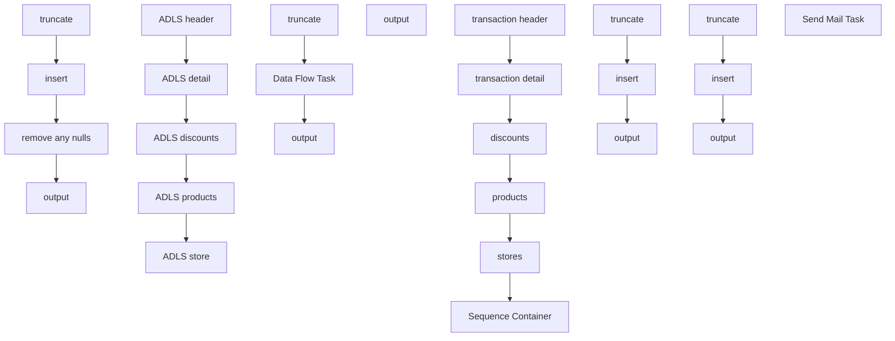

# SSIS Package: CRMSalesForceDataExtensionFileCreateA360

**Project:** CRMSalesForceDataExtensionFileCreateA360  
**Folder:** CRM  
**Server:** STL-SSIS-P-01  

## Connection Managers

| Name | Type | Server | Catalog | Connection (sanitized) |
|---|---|---|---|---|
| 12M | CACHE |  |  |  |
| 18M | CACHE |  |  |  |
| 1M | CACHE |  |  |  |
| 24M | CACHE |  |  |  |
| 3M | CACHE |  |  |  |
| 6M | CACHE |  |  |  |
| ADLS raw | Azure Data Lake Storage (KingswaySoft) |  |  |  |
| CRM | OLEDB | stl-crmdb-p-01 | crm | Data Source=stl-crmdb-p-01; Initial Catalog=crm; Provider=SQLNCLI11.1; Integrated Security=SSPI; Auto Translate=False |
| DW | OLEDB | papamart | dw | Data Source=papamart; Initial Catalog=dw; Provider=SQLNCLI11.1; Integrated Security=SSPI; Auto Translate=False |
| DWStaging | OLEDB | papamart | DWStaging | Data Source=papamart; Initial Catalog=DWStaging; Provider=SQLNCLI11.1; Integrated Security=SSPI; Auto Translate=False |
| Flat File Connection Manager | FLATFILE |  |  |  |
| SMTP | SMTP |  |  |  |
| STL-SSIS-P-01.IntegrationStaging | OLEDB | STL-SSIS-P-01 | IntegrationStaging | Data Source=STL-SSIS-P-01; Initial Catalog=IntegrationStaging; Provider=SQLNCLI11.1; Integrated Security=SSPI; Auto Translate=False |
| archive | FILE |  |  |  |
| birthday_export.csv | FILE |  |  |  |
| cDim | CACHE |  |  |  |
| delta | EXCEL | \\stl-ssis-p-01\IntegrationStaging\CRM\test\delta.xlsx |  | Provider=Microsoft.ACE.OLEDB.12.0; Data Source=\\stl-ssis-p-01\IntegrationStaging\CRM\test\delta.xlsx; Extended Properties="EXCEL 12.0 XML; HDR=YES" |

## Control Flow Tasks

| Task | Type |
|---|---|
| CRMSalesForceDataExtensionFileCreateA360 | Package |
| discounts | SEQUENCE |
| insert | ExecuteSQLTask |
| output | ExecuteSQLTask |
| remove any nulls | ExecuteSQLTask |
| truncate | ExecuteSQLTask |
| products | SEQUENCE |
| Data Flow Task | Pipeline |
| output | ExecuteSQLTask |
| truncate | ExecuteSQLTask |
| Sequence Container | SEQUENCE |
| ADLS detail | Pipeline |
| ADLS discounts | Pipeline |
| ADLS header | Pipeline |
| ADLS products | Pipeline |
| ADLS store | Pipeline |
| stores | SEQUENCE |
| output | ExecuteSQLTask |
| transaction detail | SEQUENCE |
| insert | ExecuteSQLTask |
| output | ExecuteSQLTask |
| truncate | ExecuteSQLTask |
| transaction header | SEQUENCE |
| insert | ExecuteSQLTask |
| output | ExecuteSQLTask |
| truncate | ExecuteSQLTask |
| Send Mail Task | SendMailTask |

## Control Flow Outline

```text
- Send Mail Task [SendMailTask]
- Sequence Container [SEQUENCE]
  - ADLS detail [Pipeline]
  - ADLS discounts [Pipeline]
  - ADLS header [Pipeline]
  - ADLS products [Pipeline]
  - ADLS store [Pipeline]
- discounts [SEQUENCE]
  - insert [ExecuteSQLTask]
  - output [ExecuteSQLTask]
  - remove any nulls [ExecuteSQLTask]
  - truncate [ExecuteSQLTask]
- products [SEQUENCE]
  - Data Flow Task [Pipeline]
  - output [ExecuteSQLTask]
  - truncate [ExecuteSQLTask]
- stores [SEQUENCE]
  - output [ExecuteSQLTask]
- transaction detail [SEQUENCE]
  - insert [ExecuteSQLTask]
  - output [ExecuteSQLTask]
  - truncate [ExecuteSQLTask]
- transaction header [SEQUENCE]
  - insert [ExecuteSQLTask]
  - output [ExecuteSQLTask]
  - truncate [ExecuteSQLTask]
```

## Architecture Diagram



## Variables

| Namespace | Name | Expression-bound |
|---|---|---|
| System | Propagate | No |
| User | DateTimeStamp | Yes |
| User | allRecords | No |
| User | varDEarchivePath | Yes |
| User | varFilePath | No |
| User | varFileToArchive | No |
| User | varStageFolder | No |

### Expression-bound variable values

#### User::DateTimeStamp

**Expression:**

```sql
(DT_WSTR,4)DATEPART("yyyy",GetDate()) 
+ (DT_WSTR,4)DATEPART("mm",GetDate()) 
+ (DT_WSTR,4)DATEPART("dd",GetDate()) 
+ (DT_WSTR,4)DATEPART("hh",GetDate()) 
+ (DT_WSTR,4)DATEPART("mi",GetDate()) 
+ (DT_WSTR,4)DATEPART("ss",GetDate()) 
+ (DT_WSTR,4)DATEPART("ms",GetDate())
```

**Evaluated value:**

```sql
2024123195510800
```

#### User::varDEarchivePath

**Expression:**

```sql
"\\\\stl-ssis-p-01\\IntegrationStaging\\CRM\\DataExtension\\archive\\birthday_export" +  @[User::DateTimeStamp] + ".csv"
```

**Evaluated value:**

```sql
\\stl-ssis-p-01\IntegrationStaging\CRM\DataExtension\archive\birthday_export2024123195510803.csv
```

## Execute SQL Tasks

### insert

**Path:** `Package\discounts\insert`  
**Connection:** DW (papamart/dw)  

```sql
INSERT INTO [dbo].[A360_discounts] ([ID],[units],[unit_gross_amount],[transaction_id],[customerNumber],[certificate_no],[couponNumber],[coupon_desc],[category],[event_name])
  select distinct
df.uid as ID
,df.units
,df.unit_gross_amount
,df.transaction_id
,c.customerNumber
,case when df.coupon_key = 0  and dfp.coupon_key is not null then dfp.reference_no else df.reference_no end as certificate_no
,case when df.coupon_key = 0  and dfp.coupon_key is not null then cdps.Retail_Pro else cast (cd.Retail_Pro as varchar (128)) end as couponNumber
,case when df.coupon_key = 0  and dfp.coupon_key is not null then cdps.coupon_desc else cd.coupon_desc end as coupon_desc
,case when df.coupon_key = 0  and dfp.coupon_key is not null then cdps.category else cast (cd.category as varchar (128)) end as category
,case when df.coupon_key = 0  and dfp.coupon_key is not null then cdps.event_name else cast (cd.category as varchar (128)) end as event_name
from discount_facts df (nolock)
join date_dim dd (nolock) on dd.date_key = df.date_key
join store_dim sd (nolock) on sd.store_key = df.store_key
join CRMtransactionFact c on df.transaction_id = c.transactionID
join coupon_dim cd (nolock) on cd.coupon_key = df.coupon_key
left join DiscountFactsPromotionStudio dfp (nolock) on df.transaction_id = dfp.transaction_id and df.unit_gross_amount = dfp.unit_gross_amount and left (replace (dfp.reference_no,'PRM',''),17) =  df.reference_no	
left join [CouponDimPromotionStudio] cdps (nolock) on cdps.coupon_key = dfp.coupon_key
where 1=1
and cast(dd.actual_date as date) >= cast(getdate()-2 as date)
```

### output

**Path:** `Package\discounts\output`  
**Connection:** DW (papamart/dw)  

```sql
exec spA360_discounts_FileOutput @path = '\\stl-ssis-p-01\IntegrationStaging\CRM\DataExtension\a360\', @filepart = 'discount',@tablename = 'A360_discounts',@compress = 0,@allRecords=0
```

### remove any nulls

**Path:** `Package\discounts\remove any nulls`  
**Connection:** DW (papamart/dw)  

```sql
update DW.dbo.A360_discounts set coupon_desc = '' where coupon_desc is null
update DW.dbo.A360_discounts set category = '' where category is null 
update DW.dbo.A360_discounts set event_name = '' where event_name is null 
```

### truncate

**Path:** `Package\discounts\truncate`  
**Connection:** DW (papamart/dw)  

```sql
truncate table [dbo].[A360_discounts]
```

### output

**Path:** `Package\products\output`  
**Connection:** DW (papamart/dw)  

```sql
exec spA360_product_dim_FileOutput @path = '\\stl-ssis-p-01\IntegrationStaging\CRM\DataExtension\a360\', @filepart = 'product_dim',@tablename = 'A360_product_dim',@compress = 0,@allRecords=1
```

### truncate

**Path:** `Package\products\truncate`  
**Connection:** DW (papamart/dw)  

```sql
truncate table [dbo].[A360_product_dim]
```

### output

**Path:** `Package\stores\output`  
**Connection:** DW (papamart/dw)  

```sql
exec spA360_store_dim_FileOutput @path = '\\stl-ssis-p-01\IntegrationStaging\CRM\DataExtension\a360\', @filepart = 'store_dim',@tablename = 'vwStores',@compress = 0,@allRecords=1
```

### insert

**Path:** `Package\transaction detail\insert`  
**Connection:** DW (papamart/dw)  

```sql
INSERT INTO [dbo].[A360_trans_detail] ([TransactionLineItemID],[purchaseDate],[style_code],[purchaseRevene],[unit_disc_amount],[units],[transaction_id],[perUnitRevenue])
     select cast(tdf.transaction_id as varchar) + '-' + cast(tdf.transaction_line_seq as varchar) as TransactionLineItemID, 
 dd.actual_date as purchaseDate,
case when pd.style_code is null then 'NA' else pd.style_code end as style_code
,tdf.unit_gross_amount as purchaseRevenue
, tdf.unit_disc_amount, tdf.units, tdf.transaction_id
,case when tdf.units = 0 then tdf.unit_gross_amount else CAST(tdf.unit_gross_amount/tdf.units AS DECIMAL(10,2)) end as perUnitRevenue
from transaction_detail_facts tdf 
join product_dim pd on tdf.product_key = pd.product_key
join date_dim dd on tdf.date_key = dd.date_key
where 1=1 
and cast(dd.actual_date as date) >= cast(getdate()-2 as date)  
```

### output

**Path:** `Package\transaction detail\output`  
**Connection:** DW (papamart/dw)  

```sql
exec spA360_trans_detail_FileOutput @path = '\\stl-ssis-p-01\IntegrationStaging\CRM\DataExtension\a360\', @filepart = 'transaction_detail',@tablename = 'A360_trans_detail',@compress = 0,@allRecords=0
```

### truncate

**Path:** `Package\transaction detail\truncate`  
**Connection:** DW (papamart/dw)  

```sql
truncate table [dbo].[A360_trans_detail]
```

### insert

**Path:** `Package\transaction header\insert`  
**Connection:** DW (papamart/dw)  

```sql
INSERT INTO [dbo].[A360_trans_header] ([country],[customerNumber],[purchaseChannel],[purchaseDate],[purchaseStoreNumber],[purchaseRevenue],[purchaseUnitCount],[transaction_id])
select sd.country,  c.customerNumber, vS.StoreConcept as purchaseChannel, dd.actual_date as purchaseDate, sd.store_id as purchaseStoreNumber
, tf.GAAP_sales_amount as purchaseRevenue, total_units as purchaseUnitCount,tf.transaction_id--,tf.*  
from transaction_facts tf 
join CRMtransactionFact c on tf.transaction_id = c.transactionID
join date_dim dd on tf.date_key = dd.date_key
join store_dim sd on tf.store_key = sd.store_key
join [Azure].[vwStores] vS on tf.store_key = vS.StoreKey 
where 1=1 
and cast(dd.actual_date as date) >= cast(getdate()-2 as date)  
```

### output

**Path:** `Package\transaction header\output`  
**Connection:** DW (papamart/dw)  

```sql
exec spA360_trans_header_FileOutput @path = '\\stl-ssis-p-01\IntegrationStaging\CRM\DataExtension\a360\', @filepart = 'transaction_header',@tablename = 'A360_trans_header',@compress = 0,@allRecords=0
```

### truncate

**Path:** `Package\transaction header\truncate`  
**Connection:** DW (papamart/dw)  

```sql
truncate table [dbo].[A360_trans_header]
```

## Data Flow: Sources

| Component | Source Object | Type | Data Flow Task | Connection | SQL Kind |
|---|---|---|---|---|---|
| OLE DB Source |  | OLEDBSource | Data Flow Task | DW | SqlCommand |

#### OLE DB Source — SqlCommand

```sql
with 
products as
(
select p.* from [Azure].[vwPOSOutbound_Products] p
),
chain as
(
select style, max(Chain) as consumerGroup from  [Azure].[vwProducts] 
group by style 
)
select products.*, chain.consumerGroup
from products join chain on products.ProductNumber = chain.style
```

## Data Flow: Destinations

| Component | Target Table | Type | Data Flow Task | Connection | SQL Kind |
|---|---|---|---|---|---|
| OLE DB Destination |  | OLEDBDestination | Data Flow Task | DW |  |
