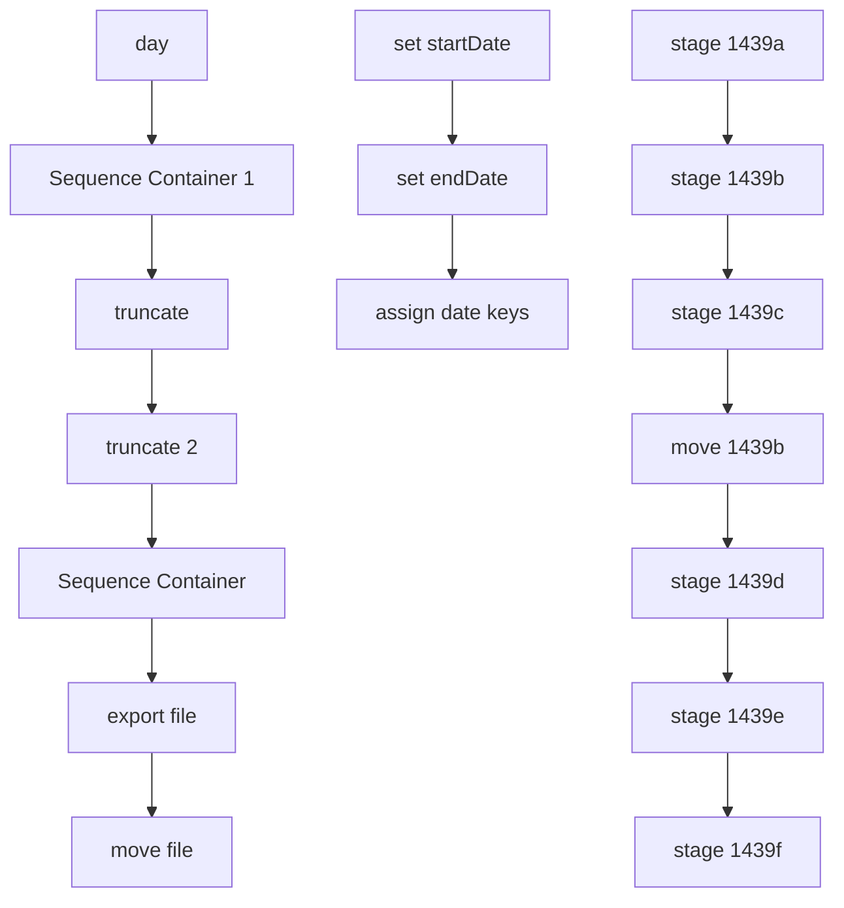

# SSIS Package: Package

**Project:** CRM_1439_file_create  
**Folder:** CRM  
**Server:** STL-SSIS-P-01  

## Connection Managers

| Name | Type | Server | Catalog | Connection (sanitized) |
|---|---|---|---|---|
| Flat File Connection Manager | FLATFILE |  |  |  |
| IntegrationStaging | OLEDB | stl-ssis-p-01 | IntegrationStaging | Data Source=stl-ssis-p-01; Initial Catalog=IntegrationStaging; Provider=SQLNCLI11.1; Integrated Security=SSPI; Auto Translate=False |
| clb-crmdb-t-01.crm | OLEDB | clb-crmdb-t-01 | crm | Data Source=clb-crmdb-t-01; Initial Catalog=crm; Provider=SQLNCLI11.1; Integrated Security=SSPI; Auto Translate=False |
| papamart.dw | OLEDB | papamart | dw | Data Source=papamart; Initial Catalog=dw; Provider=SQLNCLI11.1; Integrated Security=SSPI; Auto Translate=False |
| stl-crmdb-p-01.crm | OLEDB | stl-crmdb-p-01 | crm | Data Source=stl-crmdb-p-01; Initial Catalog=crm; Provider=SQLNCLI11.1; Integrated Security=SSPI; Auto Translate=False |

## Control Flow Tasks

| Task | Type |
|---|---|
| Package | Package |
| day | ExecuteSQLTask |
| export file | Pipeline |
| move file | FileSystemTask |
| Sequence Container | SEQUENCE |
| move 1439b | Pipeline |
| stage 1439a | Pipeline |
| stage 1439b | Pipeline |
| stage 1439c | Pipeline |
| stage 1439d | Pipeline |
| stage 1439e | Pipeline |
| stage 1439f | Pipeline |
| Sequence Container 1 | SEQUENCE |
| assign date keys | ExecuteSQLTask |
| set endDate | ExecuteSQLTask |
| set startDate | ExecuteSQLTask |
| truncate | ExecuteSQLTask |
| truncate 2 | ExecuteSQLTask |

## Control Flow Outline

```text
- Sequence Container [SEQUENCE]
- Sequence Container 1 [SEQUENCE]
  - assign date keys [ExecuteSQLTask]
  - set endDate [ExecuteSQLTask]
  - set startDate [ExecuteSQLTask]
  - move 1439b [Pipeline]
  - stage 1439a [Pipeline]
  - stage 1439b [Pipeline]
  - stage 1439c [Pipeline]
  - stage 1439d [Pipeline]
  - stage 1439e [Pipeline]
  - stage 1439f [Pipeline]
- day [ExecuteSQLTask]
- export file [Pipeline]
- move file [FileSystemTask]
- truncate [ExecuteSQLTask]
- truncate 2 [ExecuteSQLTask]
```

## Architecture Diagram



## Variables

| Namespace | Name | Expression-bound |
|---|---|---|
| User | dateTimeStamp | Yes |
| User | executionUser | Yes |
| User | varDayCount | No |
| User | varDestDirectory | No |
| User | varDestDirectoryPath | Yes |
| User | varEndDate | No |
| User | varEndKey | No |
| User | varSourceDirectory | No |
| User | varSourceDirectoryPath | Yes |
| User | varStartDate | No |
| User | varStartKey | No |

### Expression-bound variable values

#### User::dateTimeStamp

**Expression:**

```sql
(DT_WSTR,4)DATEPART("yyyy",GetDate()) 
+ (DT_WSTR,4)DATEPART("mm",GetDate()) 
+ (DT_WSTR,4)DATEPART("dd",GetDate()) 
+ (DT_WSTR,4)DATEPART("hh",GetDate()) 
+ (DT_WSTR,4)DATEPART("mi",GetDate()) 
+ (DT_WSTR,4)DATEPART("ss",GetDate()) 
+ (DT_WSTR,4)DATEPART("ms",GetDate())
```

**Evaluated value:**

```sql
202171103812783
```

#### User::executionUser

**Expression:**

```sql
@[System::UserName]
```

**Evaluated value:**

```sql
BAB\ianw
```

#### User::varDestDirectoryPath

**Expression:**

```sql
@[User::varDestDirectory] + "cyc_attribute_import.txt"
```

**Evaluated value:**

```sql
\\stl-crmapp-p-01\DM\Import\cyc_attribute_import.txt
```

#### User::varSourceDirectoryPath

**Expression:**

```sql
@[User::varSourceDirectory] + "cyc_attribute_import.txt"
```

**Evaluated value:**

```sql
\\stl-ssis-p-01\IntegrationStaging\CRM\templates\cyc_attribute_import.txt
```

## Execute SQL Tasks

### assign date keys

**Path:** `Package\Sequence Container 1\assign date keys`  
**Connection:** papamart.dw (papamart/dw)  

```sql
select min(dd.date_key) as 'startKey',max(dd.date_key) as 'endKey'
from date_dim dd with(nolock)
where actual_date between ? and ?

```

### set endDate

**Path:** `Package\Sequence Container 1\set endDate`  
**Connection:** papamart.dw (papamart/dw)  

```sql
/*
SELECT  convert(varchar(10), EOMONTH(GETDATE(),-1), 101)  AS 'endDate'
*/

/*   go back one month further example */

SELECT  convert(varchar(10), EOMONTH(GETDATE(),-2), 101)  AS 'endDate'


```

### set startDate

**Path:** `Package\Sequence Container 1\set startDate`  
**Connection:** papamart.dw (papamart/dw)  

```sql
/*
SELECT convert(varchar(10), DATEADD(DAY,1,EOMONTH(GETDATE(),-2)), 101) AS 'startDate'
*/


/* go back one month further example */

SELECT convert(varchar(10), DATEADD(DAY,1,EOMONTH(GETDATE(),-3)), 101) AS 'startDate'


```

### day

**Path:** `Package\day`  
**Connection:** IntegrationStaging (stl-ssis-p-01/IntegrationStaging)  

```sql
select day(getdate()) as 'dayOfMonth'
```

### truncate

**Path:** `Package\truncate`  
**Connection:** IntegrationStaging (stl-ssis-p-01/IntegrationStaging)  

```sql
truncate table CRM_stage_1439b
truncate table CRM_stage_1439c
truncate table CRM_stage_1439d
truncate table CRM_stage_1439e
truncate table CRM_stage_1439f
```

### truncate 2

**Path:** `Package\truncate 2`  
**Connection:** stl-crmdb-p-01.crm (stl-crmdb-p-01/crm)  

```sql
truncate table bab_1439
truncate table bab_1439b
```

## Data Flow: Sources

| Component | Source Object | Type | Data Flow Task | Connection | SQL Kind |
|---|---|---|---|---|---|
| OLE DB Source |  | OLEDBSource | export file | IntegrationStaging |  |
| OLE DB Source |  | OLEDBSource | move 1439b | stl-crmdb-p-01.crm |  |
| OLE DB Source |  | OLEDBSource | stage 1439a | papamart.dw | SqlCommand |
| OLE DB Source |  | OLEDBSource | stage 1439b | stl-crmdb-p-01.crm | SqlCommand |
| OLE DB Source 1 |  | OLEDBSource | stage 1439b | stl-crmdb-p-01.crm | SqlCommand |
| OLE DB Source |  | OLEDBSource | stage 1439c | stl-crmdb-p-01.crm | SqlCommand |
| OLE DB Source |  | OLEDBSource | stage 1439d | IntegrationStaging | SqlCommand |
| OLE DB Source |  | OLEDBSource | stage 1439e | IntegrationStaging | SqlCommand |
| OLE DB Source |  | OLEDBSource | stage 1439f | IntegrationStaging | SqlCommand |

#### OLE DB Source — SqlCommand

```sql
select
	ctf.customernumber,
	ctf.crmtransactionid,
	dd.actual_date as transaction_date,
	--tdf.transaction_id,
	--sd.store_id,
	--tdf.transaction_no,
	--sd.country,
	--right(sku,2)*1 as age,
	(year(dd.actual_date)-(right(sku,2)*1))*100+month(dd.actual_date) as bdayYYYYMM	
from transaction_detail_facts tdf with(nolock)
	JOIN CRMTransactionFact ctf with (nolock) on tdf.transaction_id=ctf.transactionid
	join date_dim dd with(nolock) on tdf.date_key=dd.date_key
	join store_dim sd with(nolock) on tdf.store_key=sd.store_key
	join product_dim pd with(nolock) on tdf.product_key=pd.product_key
where 
	dd.date_key between ? and ?
	and sd.store_id not in (0,991,990,470,13,2013)
	and sd.country in ('US','CA','UK')
	and pd.sku in 
	(89001,89002,89003,89004,89005,89006,89007,89008,89009,89010,89011,89012,89013, --US trigger codes SKUs (last two digits = age)
	189001,189002,189003,189004,189005,189006,189007,189008,189009,189010,189011,189012,189013, --CA codes
	489001,489002,489003,489004,489005,489006,489007,489008,489009,489010,489011,489012,489013) --UK codes
	and tdf.units<>0
```

#### OLE DB Source — SqlCommand

```sql
select
	c.customer_no,
	s.bdayYYYYMM,
	min(s.transactionDate) as transactionDate
from customer c with (nolock)
	join bab_1439 s on c.customer_no=s.CustomerNumber
group by 
	c.customer_no, 
	s.bdayYYYYMM
```

#### OLE DB Source 1 — SqlCommand

```sql
select distinct
	c.customer_no, 
	s.bdayYYYYMM,
	min(s.transactionDate) as transactionDate
from customer c with (nolock)
	join transaction_header th with (nolock) on c.customer_id=th.customer_id
	join bab_1439 s on th.transaction_id=s.CRMTransactionID  and cast(th.transaction_date as date)=s.transactionDate
group by 
	c.customer_no, 
	s.bdayYYYYMM
```

#### OLE DB Source — SqlCommand

```sql
select
	c.customer_no,
	ca.attribute_code,
	case when ca.attribute_code like 'CYC%' then right(ca.attribute_code,1)*1 else -1 end as cyc_max,
	ca.attribute_value as bdayYYYYMM
from customer c with (nolock)
	join customer_attribute ca with (nolock) on c.customer_id=ca.customer_id and ca.attribute_grouping_code='BDAY'
	join (select distinct customerNumber from bab_1439b) s on c.customer_no=s.customerNumber
```

#### OLE DB Source — SqlCommand

```sql
select
b.*
from CRM_stage_1439b b
	full outer join CRM_stage_1439c  c on b.customerNumber=c.customerNumber and b.bdayYYYYMM=c.bdayYYYYMM
where c.customerNumber is null
```

#### OLE DB Source — SqlCommand

```sql
select
	customerNumber,
	max(isnull(cyc_max,-1)) as cyc_max

from CRM_stage_1439c
group by customerNumber
```

#### OLE DB Source — SqlCommand

```sql
select distinct
	cast(customerNumber as varchar) as customerNumber,
	cast(bdayYYYYMM as varchar) as bdayYYYYMM,
	'BDAY' as attribute_grouping_code,
	attribute_code,
	cast(cast(transactionDate as date)as varchar) as attribute_date,
	'I' as action_code
from 
(select
s5.customerNumber,
s5.bdayYYYYMM,
s5.transactionDate,
rank() over (partition by s5.customerNumber order by bdayYYYYMM) as rank_order,
concat('CYC',rank() over (partition by s5.customerNumber order by bdayYYYYMM)+isnull(s6.cyc_max,-1)) as attribute_code
from CRM_stage_1439d s5
left join  CRM_stage_1439e s6 on s5.customerNumber=s6.customerNumber) sub
where len(attribute_code)=4--can only store 10 variables in CYC.
```

## Data Flow: Destinations

| Component | Target Table | Type | Data Flow Task | Connection | SQL Kind |
|---|---|---|---|---|---|
| Flat File Destination |  | FlatFileDestination | export file | Flat File Connection Manager |  |
| OLE DB Destination |  | OLEDBDestination | move 1439b | IntegrationStaging |  |
| OLE DB Destination |  | OLEDBDestination | stage 1439a | stl-crmdb-p-01.crm |  |
| OLE DB Destination |  | OLEDBDestination | stage 1439b | stl-crmdb-p-01.crm |  |
| OLE DB Destination |  | OLEDBDestination | stage 1439c | IntegrationStaging |  |
| OLE DB Destination |  | OLEDBDestination | stage 1439d | IntegrationStaging |  |
| OLE DB Destination |  | OLEDBDestination | stage 1439e | IntegrationStaging |  |
| OLE DB Destination |  | OLEDBDestination | stage 1439f | IntegrationStaging |  |
